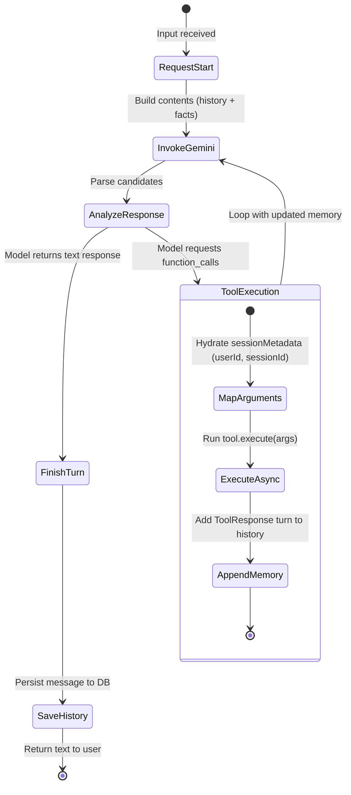
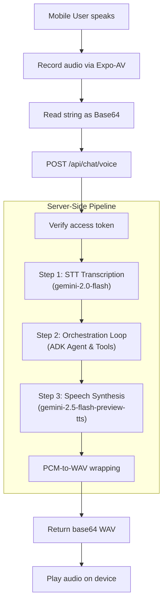

# 04 Orchestration Flow Walkthrough

This guide details the conversational AI orchestration runtime. It covers the ADK (Agent Development Kit), prompts, summarization, and the audio voice processing pipeline.

---

## 1. The ADK (Agent Development Kit) Execution Model

The ADK is a lightweight orchestration framework designed to handle multi-turn conversations and function calling.



### The Run Loop
At the center of ADK is the run loop located in [Agent.ts](file:///d:/DigitalKaam/backend/src/adk/Agent.ts#L40). When a user sends a message:
1.  **Hydrate Memory**: System prompts, summaries, and conversation turns are loaded.
2.  **Generate Content**: The agent executes a request to `gemini-2.5-flash` using `@google/genai`.
3.  **Function Calling Loop**:
    *   If the model responds with `functionCalls` (asking to execute a tool), the agent parses each call.
    *   It retrieves the registered tool by name (e.g., `find_available_providers`).
    *   It merges the model's parameters with the server-side `sessionMetadata` (locking down `userId` and `sessionId`).
    *   It awaits the tool's `execute()` method.
    *   The tool result is formatted as a `tool-response` part and appended to the model's turns.
    *   The agent loops back, sending the updated turns to Gemini until the model stops calling tools and provides a text response.

```typescript
// Traced from Agent.ts
let keepRunning = true
let iterations = 0
const maxIterations = 5

while (keepRunning && iterations < maxIterations) {
  iterations++
  const response = await this.ai.models.generateContent({
    model: this.config.model || 'gemini-2.5-flash',
    contents: this.memory.getContents(),
    config: {
      systemInstruction: this.buildSystemInstruction(),
      tools: [{ functionDeclarations: this.getToolDeclarations() }]
    }
  })

  // Append assistant message (including function calls requested by model)
  const candidate = response.candidates?.[0]
  if (candidate?.content) {
    this.memory.addTurn(candidate.content)
  }

  const calls = response.functionCalls
  if (calls && calls.length > 0) {
    const toolResponses: any[] = []
    for (const call of calls) {
      const tool = this.tools.get(call.name)
      // Inject server-locked session details into args
      const mergedArgs = { ...call.args, ...this.sessionMetadata }
      const result = await tool.execute(mergedArgs)
      
      toolResponses.push({
        name: call.name,
        response: result
      })
    }
    // Append tool responses so Gemini knows the outcome of the action
    this.memory.addToolResponse(toolResponses)
  } else {
    // No more tools requested. Break the loop and return text.
    keepRunning = false
  }
}
```

---

## 2. Orchestrator Prompts & Security Guards

### Prompt Hydration & Personality
The system prompt is configured in [OrchestratorAgent.ts](file:///d:/DigitalKaam/backend/src/adk/agents/OrchestratorAgent.ts#L10).
*   **Persona**: Expert customer support agent for DigitalKaam in Karachi, Pakistan. Polite, helpful, and empathetic.
*   **Multilingual Scripting**: Uses a mixture of English, Urdu, and Roman Urdu. It detects the client's language and replies in the exact same script and tone.
*   **Workflow Guidelines**:
    1.  *Requirement Gathering*: Asks for service type, location, date, time, and issue severity.
    2.  *Lookup/Matching*: Invokes `find_available_providers` when requirements are clear.
    3.  *Price Estimation*: Runs `calculate_dynamic_pricing` and presents the quote breakdown to the user.
    4.  *Confirmation*: Explicitly asks if the user wants to book before calling `confirm_service_booking`.

### Anti-Hallucination Fact Injection
Because session state is stateless between HTTP requests, the router injects fresh DB information at the end of the system instructions at every turn.
*   **Implementation**: In [chat.routes.ts](file:///d:/DigitalKaam/backend/src/routes/chat.routes.ts#L201), the router queries confirmed bookings in the database for the active `sessionId`.
*   **Facts Prompt**:
    ```typescript
    const freshDbFacts = `
    CURRENT DATE/TIME: ${new Date().toISOString()}
    CONFIRMED BOOKINGS IN DATABASE FOR THIS SESSION:
    ${JSON.stringify(enrichedBookings)}
    `
    // Appended to system instructions:
    const systemPrompt = baseInstruction + "\n\n" + freshDbFacts
    ```
This guarantees the model knows if a booking has been confirmed, preventing double-bookings.

---

## 3. Summarization & Context Limits

To keep API calls cost-effective and prevent memory overflow, the platform manages context length using a rolling summary.

*   **Verbatim Window**: The system stores all turns in `chat_messages` but loads only the last 6 turns as verbatim context.
*   **Rolling Summary**: Older turns are compressed into a single summary string stored in `chat_sessions.summary`.
*   **Traced Code**: In [chat.routes.ts:L148](file:///d:/DigitalKaam/backend/src/routes/chat.routes.ts#L148), when `turnCount % 8 === 0`:
    ```typescript
    // Sync summary computation
    const summary = await summarizeConversation(olderMessages)
    await supabase.from('chat_sessions').update({ summary }).eq('session_id', sessionId)
    ```

The [SummarizerAgent.ts](file:///d:/DigitalKaam/backend/src/adk/agents/SummarizerAgent.ts#L24) enforces strict constraints:
1.  **Language Matching**: Summarizes in the language script used by the user (English, Urdu script, or Roman Urdu).
2.  **Verbatim Extraction**: Must output confirmed bookings in a standard format:
    `BOOKING CONFIRMED: Booking ID [booking_id] | Provider: [provider_name] | Date: [date] | Time: [time] | Price: [price] PKR`
3.  **UUID Preservation**: Verbatim UUID preservation for all active bookings.

---

## 4. Voice Processing Pipeline

The voice chat endpoint (/api/chat/voice) provides a server-side audio processing workflow:



### Step 1: Speech-to-Text (STT)
The server sends the base64 audio data directly to `gemini-2.0-flash` with transcription-specific prompts ([gemini.ts:L24](file:///d:/DigitalKaam/backend/src/lib/gemini.ts#L24)).
*   **Model**: `gemini-2.0-flash`
*   **Prompt**: *"Transcribe this audio exactly as spoken. Return ONLY the transcription — no labels, no explanation."*
*   **MIME support**: `audio/m4a`, `audio/mp4`, `audio/wav`, `audio/webm`, `audio/ogg`, `audio/mpeg`.

### Step 2: Orchestration Loop
The transcribed text is processed through `runChatAndReturnResponse()` which triggers the ADK agent, executing tools if required, and returns the response text.

### Step 3: Text-to-Speech (TTS)
The text reply is passed to `generateSpeech(responseText, voiceName)` ([gemini.ts:L57](file:///d:/DigitalKaam/backend/src/lib/gemini.ts#L57)).
*   **Model**: `gemini-2.5-flash-preview-tts`
*   **Config**: `{ responseModalities: ['AUDIO'], speechConfig: { voiceConfig: { prebuiltVoiceConfig: { voiceName } } } }`
*   **Audio Packing (PCM to WAV)**: Gemini returns raw 16-bit PCM at 24000 Hz. The server wraps this in a standard WAV header so that common audio players can decode it:
    ```typescript
    // Traced from gemini.ts:pcmToWav
    const dataSize = pcm.length
    const wav = Buffer.alloc(44 + dataSize)
    wav.write('RIFF', 0, 'ascii')
    wav.writeUInt32LE(36 + dataSize, 4) // overall file size - 8
    wav.write('WAVE', 8, 'ascii')
    wav.write('fmt ', 12, 'ascii')
    wav.writeUInt32LE(16, 16) // PCM fmt chunk size
    wav.writeUInt16LE(1, 20) // format: PCM
    wav.writeUInt16LE(channels, 22)
    wav.writeUInt32LE(sampleRate, 24)
    pcm.copy(wav, 44) // Copy raw bytes after 44-byte header
    ```
The resulting WAV buffer is sent to the client as base64 in the response body.
