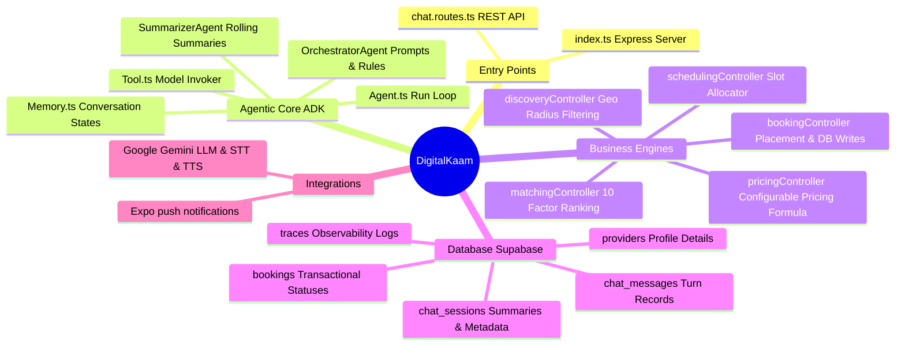

# 05 Developer Guide

This onboarding guide is designed to help new and senior engineers understand the architecture, debugging pathways, and extension points of the DigitalKaam platform.

---

## 1. Developer Mind Map



---

## 2. Recommended Code Exploration Order

To build a strong mental model of the codebase, explore the directories and files in the following order:

1.  **System Entry & Configs**:
    *   [index.ts](file:///d:/DigitalKaam/backend/src/index.ts) — Analyzes the middleware chain, CORS rules, and rate limits.
    *   [supabase_schema.sql](file:///d:/DigitalKaam/supabase_schema.sql) — Explores table relationships, constraints, indexes, and RLS tables.
2.  **Conversational Gateway**:
    *   [chat.routes.ts](file:///d:/DigitalKaam/backend/src/routes/chat.routes.ts) — Understands session checks, summarization schedules, and prompts injection.
3.  **Agent Orchestration Model**:
    *   [Agent.ts](file:///d:/DigitalKaam/backend/src/adk/Agent.ts) — Traces the run loop and arguments mapping.
    *   [OrchestratorAgent.ts](file:///d:/DigitalKaam/backend/src/adk/agents/OrchestratorAgent.ts) — Examines instructions, guards, and registered tools.
4.  **Business Logic Layer**:
    *   [matchingController.ts](file:///d:/DigitalKaam/backend/src/controllers/matchingController.ts) — Traces normalization and weight values.
    *   [pricingController.ts](file:///d:/DigitalKaam/backend/src/controllers/pricingController.ts) — Traces config resolution and formulas.
5.  **External Integrations**:
    *   [gemini.ts](file:///d:/DigitalKaam/backend/src/lib/gemini.ts) — Focuses on PCM audio conversion and transcription.
    *   [auth.ts](file:///d:/DigitalKaam/backend/src/middleware/auth.ts) — Studies the auto-refresh mechanism.

---

## 3. Debugging Pathways & Observability

When troubleshooting a bug (e.g. matching fails, incorrect quotes, or agent crashes), follow this hierarchy:

```
[Console Logs] ──> [Supabase traces Table] ──> [Gemini API Logs]
```

### Trace Logging (The traces Table)
For every tool execution or lifecycle change, the system inserts an audit record in the `traces` table in Supabase.
*   **Fields**: `session_id`, `agent` (e.g. `MatchingAgent`), `input` (JSON), `output` (JSON), `reasoning` (Text), `tool_calls` (JSON), `confidence_score` (Numeric).
*   **Endpoint Lookup**: Use `GET /api/traces?sessionId=<session-id>` to fetch all logs for a chat session.
*   **Verification**: Check if the agent's confidence score was low, or if a tool returned a `success: false` flag with an error message.

### Core Console Log Prefixes
Search the console output for these tags to identify issues:
*   `[CHAT]` — Chat routing, session management, and summarization.
*   `[Auth]` — Profile sync, signups, logins, and token refreshes.
*   `[Agent]` — Model run loops, tool mappings, and prompts.
*   `[DiscoveryAgent]` / `[MatchingAgent]` — Distance checks and ranking computations.
*   `[PricingAgent]` — platform_config key evaluations.

---

## 4. How to Add a New Tool & Register It

To add a capability to the conversational AI (for example, allowing the agent to cancel a booking), follow this code template:

### Step 1: Create the Tool File
Create `backend/src/adk/tools/CancelBookingTool.ts`:

```typescript
import { Tool } from '../Tool'
import { supabase } from '../../lib/supabase'
import { Type } from '@google/genai'

export const CancelBookingTool = new Tool({
  name: 'cancel_booking',
  description: 'Cancels an existing service booking. Use when the user requests a cancellation.',
  parameters: {
    type: Type.OBJECT,
    properties: {
      bookingId: {
        type: Type.STRING,
        description: 'The UUID of the booking to cancel'
      },
      reason: {
        type: Type.STRING,
        description: 'The reason for cancellation provided by the user'
      },
      sessionId: {
        type: Type.STRING,
        description: 'Injected automatically by server metadata'
      }
    },
    required: ['bookingId', 'reason']
  },
  execute: async (args: any) => {
    try {
      const { data, error } = await supabase
        .from('bookings')
        .update({ status: 'cancelled' })
        .eq('id', args.bookingId)
        .select()
        .single()

      if (error) throw error

      // In production, trigger push notifications here
      return { success: true, bookingId: args.bookingId, status: 'cancelled' }
    } catch (err: any) {
      return { success: false, error: err.message }
    }
  }
})
```

### Step 2: Register the Tool in Orchestrator
Open [OrchestratorAgent.ts](file:///d:/DigitalKaam/backend/src/adk/agents/OrchestratorAgent.ts) and add the new tool to the config:

```typescript
// Import the tool
import { CancelBookingTool } from '../tools/CancelBookingTool'

export const MainOrchestrator = new AgentConfig({
  name: 'MainOrchestrator',
  model: 'gemini-2.5-flash',
  tools: [
    FindProvidersTool,
    CalculateQuoteTool,
    CheckAvailabilityTool,
    ConfirmBookingTool,
    GetBookingsTool,
    CreateTicketTool,
    CancelBookingTool // <-- Register here
  ],
  systemInstruction: baseInstructions
})
```

---

## 5. Critical Development Pitfalls


