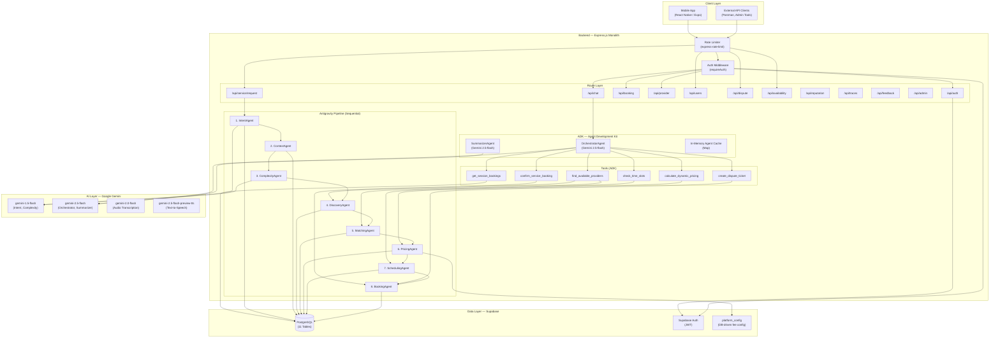
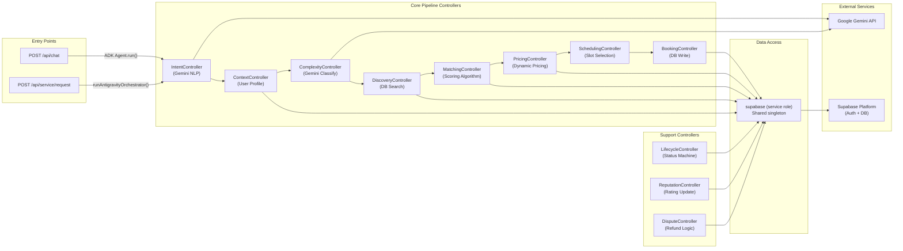
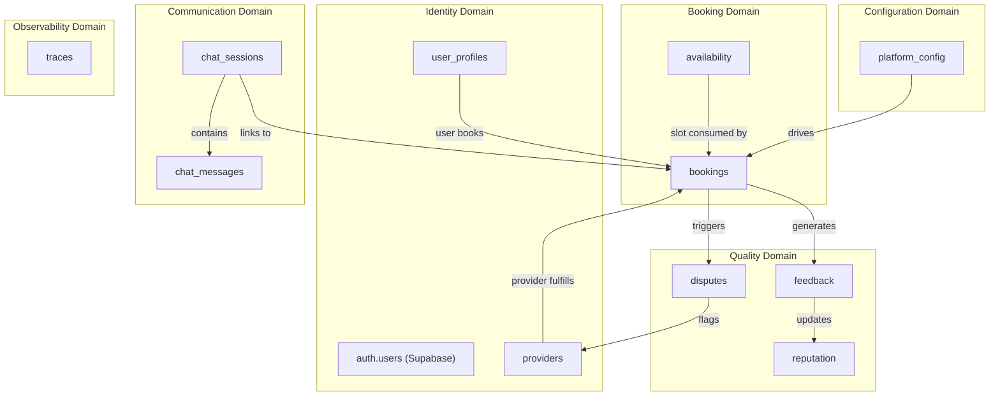
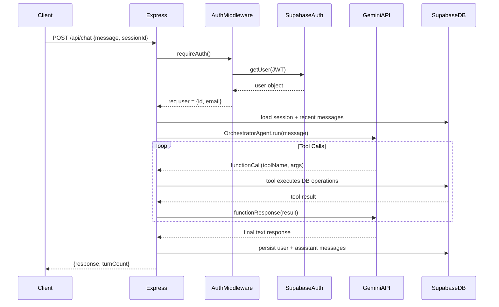

# Document 01 — System Architecture
## DigitalKaam Antigravity AI Service Platform

**Document Type**: Architecture Reference  
**Audience**: All Engineers, Architects, Executives  
**Related Documents**: [02_Repository_Structure](02_Repository_Structure.md) | [03_Database_Architecture](03_Database_Architecture.md) | [09_Agent_Flow_Documentation](09_Agent_Flow_Documentation.md)

---

## 1. Executive Architecture Summary

DigitalKaam is an **AI-first home services marketplace** built for Pakistan's informal economy. Its core innovation is replacing traditional search-and-select UIs with a **conversational AI booking agent** that understands English, Urdu, and Roman Urdu, automatically identifies the user's needs, finds the best available provider, calculates a transparent price, and confirms the booking — all within a single chat conversation.

The system is a **TypeScript/Node.js monolith** deployed as a single Express.js server. It integrates with Supabase (PostgreSQL) as the data store and Google Gemini as the AI engine. The architecture is intentionally simple for the current stage: one process, one database, no message queues, no microservices.

### Architecture Philosophy

> "Make it work correctly before making it scale." — the codebase is optimized for **correctness of AI behavior** and **development velocity**, not for horizontal scalability. The architecture is appropriate for an early-stage product with Pakistan-level initial traffic.

---

## 2. High-Level Architecture Diagram

---

## 3. Component Diagram

---

## 4. Service Map

| Service | Type | Description | Entry Point |
|---------|------|-------------|-------------|
| **Antigravity Orchestrator** | Sync Pipeline | Runs 8 agents sequentially | `POST /api/service/request` |
| **ADK Chat** | Conversational AI | Gemini orchestrator with tools | `POST /api/chat` |
| **Intent Service** | AI (Gemini) | Parse user language → structured intent | `processIntent()` |
| **Context Service** | DB Read | Load user profile, loyalty, preferences | `processContext()` |
| **Complexity Classifier** | AI (Gemini) | Estimate job difficulty and duration | `processComplexity()` |
| **Discovery Service** | DB Search | Find providers by service type + area | `processDiscovery()` |
| **Matching Engine** | Scoring Algorithm | Multi-factor provider ranking | `processMatching()` |
| **Pricing Engine** | Calculation | Dynamic price from DB config | `processPricing()` |
| **Scheduling Service** | DB Read/Write | Slot matching and conflict detection | `processScheduling()` |
| **Booking Service** | DB Write | Create booking record + receipt | `processBooking()` |
| **Lifecycle Service** | DB Write | Status state machine | `updateLifecycleStatus()` |
| **Reputation Service** | DB Write | Update ratings + reputation | `updateReputation()` |
| **Dispute Service** | DB Write | Create ticket, compute refund | `createDisputeTicket()` |
| **Summarizer** | AI (Gemini) | Compress conversation history | `summarizeConversation()` |
| **Transcription** | AI (Gemini) | Audio → text (multilingual) | `transcribeAudio()` |
| **TTS** | AI (Gemini) | Text → WAV audio | `generateSpeech()` |

---

## 5. Domain Boundaries

---

## 6. Design Patterns

### 6.1 Sequential Agent Pipeline (Antigravity)

The `runAntigravityOrchestrator()` function executes agents in a fixed, deterministic order. Each agent receives the output of all previous agents as input. This is a **Chain of Responsibility** pattern where each agent enriches the context.

**Why**: Deterministic pipelines are easier to debug, test, and audit than fully autonomous multi-agent systems. Each step has a clear input contract and output interface.

### 6.2 Tool-Calling Orchestrator (ADK)

The ADK chat interface uses a single Gemini LLM that invokes "tools" (functions) to drive the same pipeline. The LLM decides which tools to call and in what order based on the conversation state. This is a **ReAct (Reason + Act)** agent pattern.

**Why**: Gives conversational flexibility. The LLM can ask follow-up questions, handle multi-turn negotiation, and adapt to user edge cases without hardcoded logic.

### 6.3 DB-Driven Configuration

All pricing parameters live in the `platform_config` Supabase table. The `loadPlatformConfig()` function fetches them at runtime on every pricing call, with hardcoded defaults as fallback.

**Why**: Allows operators to change fees, urgency surcharges, and loyalty caps without code deploys. Supports operational agility.

### 6.4 Server-Enforced Session Metadata

The `agent.sessionMetadata` object is merged into every tool call's arguments server-side, regardless of what the LLM passes. This prevents the LLM from accidentally omitting `sessionId` or `userId` from tool calls.

**Why**: LLMs are probabilistic. Critical identifiers must be injected deterministically to prevent data integrity issues (bookings stored under wrong user, wrong session).

### 6.5 Isolated Auth Client Pattern

The `requireAuth` middleware creates a **disposable Supabase client** for token verification, separate from the shared `service-role` client used for all DB operations.

**Why**: If token refresh were called on the shared client, the client's internal auth state would be downgraded from `service_role` to user JWT, breaking all subsequent DB operations until server restart.

### 6.6 Booking Facts Injection (Anti-Hallucination)

Before every AI turn, the server queries confirmed bookings for the session from the DB and injects them as a verbatim block in the system instructions.

**Why**: Prevents the LLM from hallucinating "no booking found" when the conversation history has scrolled out of context, or after a server restart clears the in-memory agent cache.

---

## 7. Architectural Decisions

### ADR-001: Monolith over Microservices
**Decision**: Single Express process containing all routes, controllers, and AI agents.  
**Rationale**: Early-stage product. Team size small. Simpler deployment, simpler debugging, zero network latency between components.  
**Tradeoff**: Harder to scale individual agents independently. A spike in chat traffic also slows admin routes.

### ADR-002: Supabase over Custom PostgreSQL
**Decision**: Use Supabase hosted PostgreSQL with built-in auth.  
**Rationale**: Eliminates auth infrastructure. Supabase Auth provides JWT, OAuth, session management out of the box.  
**Tradeoff**: Locked into Supabase's JWT structure. Service role key must be kept secret — exposure gives full DB access.

### ADR-003: Google Gemini over OpenAI
**Decision**: All AI capabilities use Google Gemini.  
**Rationale**: Native multimodal (audio transcription + TTS + text in single API). Supports Urdu/Roman Urdu well. Cost competitive.  
**Tradeoff**: Less community tooling than OpenAI ecosystem.

### ADR-004: Two Interaction Modes
**Decision**: Support both a single-call REST pipeline (`/api/service/request`) and a conversational chat interface (`/api/chat`).  
**Rationale**: REST pipeline is simpler for testing and batch use. Chat is the production user interface.  
**Considerations**: Two codepaths for the same business logic, each optimized for its interaction pattern.

### ADR-005: Service-Role Database Access
**Decision**: The backend uses the Supabase `service_role` key for all database operations.
**Rationale**: The server-side backend requires full administrative access to manage bookings, providers, and user data across all operations. The `service_role` client provides this access cleanly without per-operation auth overhead.

---

## 8. Architecture Design Choices

| Concern | Approach | Characteristics |
|---------|----------|------------------|
| **State Management** | In-memory `agentCache` Map | Fast O(1) access, rebuilt from DB on server restart |
| **Session Persistence** | DB-backed `chat_messages` + `chat_sessions` | Reliable across restarts, full conversation replay |
| **Pricing Config** | DB-stored `platform_config` | Hot-configurable without code deployment |
| **AI Context** | Sliding 6-message window + rolling summary | Consistent memory footprint with full context preservation via summaries |
| **Push Notifications** | Event-driven lifecycle notifications | Instrumented at all 6 lifecycle events |
| **Geocoding** | Karachi area coordinates | No external API dependency, optimized for target market |

---

## 9. Monolith Architecture

**Architecture**: Single-process monolith — one Express server with all functionality co-located.

---

## 10. Integration Architecture

---

*See [09_Agent_Flow_Documentation.md](09_Agent_Flow_Documentation.md) for deep analysis of each agent.*  
*See [03_Database_Architecture.md](03_Database_Architecture.md) for database design.*
