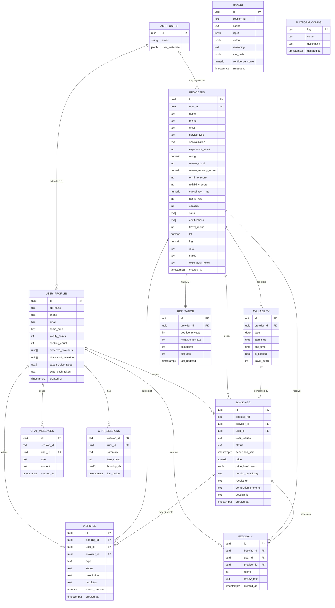
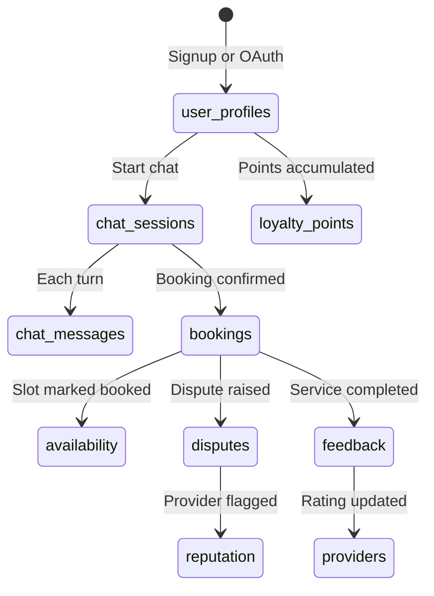

# Document 03 — Database Architecture
## DigitalKaam AI Service Platform

**Document Type**: Database Reference  
**Audience**: Backend Developers, DBAs, Architects  
**Related Documents**: [01_System_Architecture](01_System_Architecture.md) | [06_Pricing_Engine](06_Pricing_Engine.md) | [08_Business_Workflows](08_Business_Workflows.md)

---

## 1. Database Overview

| Property | Value |
|----------|-------|
| **Engine** | PostgreSQL (via Supabase) |
| **Host** | Supabase managed cloud instance |
| **Schema** | `public` (all application tables) + `auth` (Supabase auth tables, not directly managed) |
| **Total Tables** | 11 application tables |
| **Auth Layer** | `auth.users` — managed entirely by Supabase Auth |
| **RLS Status** | Service-role access model — server-side only |
| **Access Method** | Server-side only via `service_role` key (administrative access) |
| **Schema Source** | `supabase_schema.sql` (root of repository) |

---

## 2. Entity Relationship Diagram



---

## 3. Table Documentation

### 3.1 `user_profiles`

**Purpose**: Extends Supabase's `auth.users` with application-specific profile data. One row per registered user.

| Column | Type | Nullable | Default | Description |
|--------|------|----------|---------|-------------|
| `id` | UUID | No | — | FK to `auth.users(id)`, CASCADE delete |
| `full_name` | TEXT | No | — | Display name |
| `phone` | TEXT | Yes | — | Contact number |
| `email` | TEXT | Yes | — | Denormalized from auth (convenience) |
| `home_area` | TEXT | Yes | — | User's home Karachi area (e.g., "Gulshan") |
| `loyalty_points` | INTEGER | No | 0 | Accumulated loyalty points (not auto-decremented on use) |
| `booking_count` | INTEGER | No | 0 | Total confirmed bookings (used to detect returning users) |
| `preferred_providers` | UUID[] | No | `{}` | Provider IDs the user explicitly prefers |
| `blacklisted_providers` | UUID[] | No | `{}` | Provider IDs the user blocks |
| `past_service_types` | TEXT[] | No | `{}` | Service types the user has booked before |
| `expo_push_token` | TEXT | Yes | — | Expo push notification token |
| `created_at` | TIMESTAMPTZ | No | NOW() | Account creation timestamp |

**Business Rules**:
- `booking_count` is incremented by `bookingController` as a **fire-and-forget** async operation (non-blocking, non-fatal)
- `loyalty_points` is read by `contextController` — the loyalty discount is calculated from this balance and applied as a deduction from the booking price, recorded in `price_breakdown`
- `preferred_providers` and `blacklisted_providers` directly influence the provider matching score (+5% boost or instant 0 score)

**Lifecycle**: Created on signup or OAuth profile sync. Deleted on auth user delete (CASCADE).

---

### 3.2 `providers`

**Purpose**: All registered service providers. A user can convert their account to a provider via the onboarding endpoint.

| Column | Type | Nullable | Default | Description |
|--------|------|----------|---------|-------------|
| `id` | UUID | No | `gen_random_uuid()` | Primary key |
| `user_id` | UUID | Yes | — | FK to `auth.users(id)`, CASCADE delete. Null for seed data providers. |
| `name` | TEXT | No | — | Provider display name |
| `phone` | TEXT | Yes | — | Contact phone |
| `email` | TEXT | Yes | — | Contact email |
| `service_type` | TEXT | No | — | One of: AC Technician, Electrician, Plumber, Mechanic, Tutor, Beautician, Driver |
| `specialization` | TEXT | Yes | — | Free-text specialty (e.g., "Inverter AC Repair") |
| `experience_years` | INTEGER | Yes | — | Years of professional experience |
| `rating` | NUMERIC(3,1) | No | 0.0 | Weighted moving average rating (0.0–5.0) |
| `review_count` | INTEGER | No | 0 | Total reviews received |
| `review_recency_score` | NUMERIC(3,2) | No | 0.5 | Recency of reviews (0–1). Resets to 0.95 on each new review. |
| `on_time_score` | INTEGER | No | 100 | Punctuality score (0–100). Currently read but not written by app logic. |
| `reliability_score` | INTEGER | No | 100 | Overall reliability (0–100). Influences matching weight 15%. |
| `cancellation_rate` | NUMERIC(3,2) | No | 0.0 | Fraction of bookings cancelled (0.0–1.0) |
| `hourly_rate` | INTEGER | No | — | PKR per hour. Validated: 100–50,000. Used in pricing. |
| `capacity` | INTEGER | No | 4 | Max concurrent jobs. Seed data sets 3. Influences matching weight 5%. |
| `skills` | TEXT[] | No | `{}` | Array of skill strings |
| `certifications` | TEXT[] | No | `{}` | Array of certification strings |
| `travel_radius` | INTEGER | No | 10 | Max km provider will travel. Default 10km. |
| `lat` | NUMERIC | Yes | — | Provider's base latitude |
| `lng` | NUMERIC | Yes | — | Provider's base longitude |
| `area` | TEXT | Yes | — | Karachi area name (e.g., "Gulshan") |
| `status` | TEXT | No | 'active' | Discovery filter: only `status = 'active'` providers are returned |
| `expo_push_token` | TEXT | Yes | — | Expo push notification token |
| `created_at` | TIMESTAMPTZ | No | NOW() | Registration timestamp |

**Business Rules**:
- Discovery query filters `status = 'active'`
- A user can only have ONE provider profile (enforced by `provider.routes.ts` 409 check)
- Onboarding initializes `reliability_score=100`, `on_time_score=100`, `rating=0`, `capacity=3`
- Rating is updated by `reputationController` using weighted moving average: `(prevRating × reviewCount + newRating) / (reviewCount + 1)`

---

### 3.3 `availability`

**Purpose**: Provider availability slots. Each row represents one bookable time window for a provider on a specific date.

| Column | Type | Nullable | Default | Description |
|--------|------|----------|---------|-------------|
| `id` | UUID | No | `gen_random_uuid()` | Primary key |
| `provider_id` | UUID | No | — | FK to `providers(id)`, CASCADE delete |
| `date` | DATE | No | — | Calendar date of the slot |
| `start_time` | TIME | No | — | Slot start time (24h) |
| `end_time` | TIME | No | — | Slot end time (24h) |
| `is_booked` | BOOLEAN | No | false | Whether the slot is consumed |
| `travel_buffer` | INTEGER | No | 30 | Minutes reserved for travel after this slot |

**Business Rules**:
- `matchingController` queries `is_booked = false` for the requested date to determine `availScore` (20% of match score)
- `schedulingController` finds the closest matching slot to the requested time (within 1-hour tolerance: `|slotStart - reqStart| <= 100` in HHMM integer comparison)
- `bookingController` sets `is_booked = true` on the chosen slot after booking creation
- If `is_booked = true` already exists for a slot, it will not appear in availability queries

**Data Lifecycle**: Seeded by `seed.ts` for next 14 days. In production, providers would manage their own slots via the `POST /api/availability` endpoint.

---

### 3.4 `bookings`

**Purpose**: Central booking record. Created on confirmed booking. Status evolves through the lifecycle state machine.

| Column | Type | Nullable | Default | Description |
|--------|------|----------|---------|-------------|
| `id` | UUID | No | `gen_random_uuid()` | Primary key |
| `booking_ref` | TEXT | Unique | — | Human-readable reference (e.g., `DK-260518-K7M2`) |
| `provider_id` | UUID | No | — | FK to `providers(id)` |
| `user_id` | UUID | No | — | FK to `user_profiles(id)` |
| `user_request` | TEXT | Yes | — | Original natural language request from the user |
| `status` | TEXT | No | 'confirmed' | Lifecycle status (see below) |
| `scheduled_time` | TIMESTAMPTZ | Yes | — | Booked service time |
| `price` | NUMERIC | Yes | — | Total final price in PKR |
| `price_breakdown` | JSONB | Yes | — | Full breakdown: visitFee, laborFee, urgencySurcharge, loyaltyDiscount, platformFee, total |
| `service_complexity` | TEXT | Yes | — | basic / intermediate / complex |
| `receipt_url` | TEXT | Yes | — | URL to receipt (not currently generated) |
| `completion_photo_url` | TEXT | Yes | — | Photo URL uploaded by provider on job completion |
| `session_id` | TEXT | Yes | — | Chat session ID that created this booking |
| `created_at` | TIMESTAMPTZ | No | NOW() | Creation timestamp |

**Booking Status Values**:
```
confirmed → en_route → arrived → in_progress → completed → [feedback_pending]
         ↘ cancelled
         ↘ disputed
```

**`price_breakdown` JSONB Structure**:
```json
{
  "visitFee": 500,
  "estimatedHours": 2,
  "hourlyRate": 800,
  "laborFee": 1600,
  "urgencySurcharge": 250,
  "loyaltyDiscount": 100,
  "platformFee": 113,
  "total": 2363,
  "partsDisclaimer": "Parts/materials not included..."
}
```

**`booking_ref` Format**: `DK-YYMMDD-XXXX` where XXXX is 4 random chars from `ABCDEFGHJKLMNPQRSTUVWXYZ23456789` (ambiguous chars O, 0, 1, I excluded).

---

### 3.5 `reputation`

**Purpose**: Aggregated reputation counters for each provider, separate from the `providers.rating` field for separation of concerns.

| Column | Type | Nullable | Default | Description |
|--------|------|----------|---------|-------------|
| `id` | UUID | No | `gen_random_uuid()` | Primary key |
| `provider_id` | UUID | No | — | FK to `providers(id)`, CASCADE delete. 1:1 with providers. |
| `positive_reviews` | INTEGER | No | 0 | Count of reviews with rating ≥ 4 |
| `negative_reviews` | INTEGER | No | 0 | Count of reviews with rating ≤ 2 |
| `complaints` | INTEGER | No | 0 | Count of disputes raised against provider |
| `disputes` | INTEGER | No | 0 | Count of active/past disputes |
| `last_updated` | TIMESTAMPTZ | No | NOW() | Last time any reputation field changed |

**Business Rules**:
- Reputation row created at provider onboarding with all zeros
- `complaints` and `disputes` incremented on dispute creation (if `providerFlagged = true`)
- `positive_reviews` / `negative_reviews` incremented on feedback submission
- Reputation data is currently **read-joined** on provider profile but not used in matching score directly (the matching score uses `providers.rating` and `providers.reliability_score`)

---

### 3.6 `traces`

**Purpose**: Full AI decision audit log. Every agent (Intent, Context, Complexity, Discovery, Matching, Pricing, Scheduling, Booking, Reputation, Lifecycle, Dispute) writes one trace row per invocation.

| Column | Type | Nullable | Default | Description |
|--------|------|----------|---------|-------------|
| `id` | UUID | No | `gen_random_uuid()` | Primary key |
| `session_id` | TEXT | No | — | Session identifier (links traces to a conversation) |
| `agent` | TEXT | No | — | Agent name (e.g., "IntentAgent", "PricingAgent") |
| `input` | JSONB | Yes | — | What the agent received |
| `output` | JSONB | Yes | — | What the agent produced |
| `reasoning` | TEXT | Yes | — | Human-readable explanation of the decision |
| `tool_calls` | JSONB | Yes | — | Which tools/APIs were used |
| `confidence_score` | NUMERIC(3,2) | Yes | — | 0.0–1.0 confidence of the agent's decision |
| `timestamp` | TIMESTAMPTZ | No | NOW() | When the trace was written |

**Usage**: `GET /api/traces?sessionId=xxx` retrieves all traces for a session, enabling full replay of the AI decision chain.

---

### 3.7 `disputes`

**Purpose**: Formal dispute records created when a user reports a problem with a completed service.

| Column | Type | Nullable | Default | Description |
|--------|------|----------|---------|-------------|
| `id` | UUID | No | `gen_random_uuid()` | Primary key |
| `booking_id` | UUID | No | — | FK to `bookings(id)` |
| `user_id` | UUID | No | — | FK to `user_profiles(id)` |
| `provider_id` | UUID | No | — | FK to `providers(id)` |
| `type` | TEXT | No | — | One of: no_show, quality, price, cancellation, overrun |
| `status` | TEXT | No | 'open' | Current status: open, under_review, resolved, closed |
| `description` | TEXT | Yes | — | User's description of the issue |
| `resolution` | TEXT | Yes | — | AI-generated resolution recommendation |
| `refund_amount` | NUMERIC | No | 0 | Calculated refund amount in PKR |
| `created_at` | TIMESTAMPTZ | No | NOW() | Creation timestamp |

**Refund Calculation** (see [06_Pricing_Engine.md](06_Pricing_Engine.md) for context):
| Dispute Type | Refund % | Provider Flagged |
|-------------|----------|-----------------|
| `no_show` | 100% of booking price | Yes |
| `price` | 20% of booking price | Yes |
| `quality` | 30% of booking price | Yes |
| `cancellation` | 100% of booking price | No |
| `overrun` | 15% of booking price | Yes |

---

### 3.8 `feedback`

**Purpose**: Post-service ratings and reviews from users about providers.

| Column | Type | Nullable | Default | Description |
|--------|------|----------|---------|-------------|
| `id` | UUID | No | `gen_random_uuid()` | Primary key |
| `booking_id` | UUID | No | — | FK to `bookings(id)` |
| `user_id` | UUID | No | — | FK to `user_profiles(id)` |
| `provider_id` | UUID | No | — | FK to `providers(id)` |
| `rating` | INTEGER | No | — | 1–5 (enforced by CHECK constraint) |
| `review_text` | TEXT | Yes | — | Optional written review |
| `created_at` | TIMESTAMPTZ | No | NOW() | Submission timestamp |

**Downstream Effects**: Submission triggers `reputationController.updateReputation()` which:
1. Inserts the feedback row
2. Updates `bookings.status` to 'completed'
3. Recalculates `providers.rating` (weighted moving average)
4. Resets `providers.review_recency_score` to 0.95
5. Increments `reputation.positive_reviews` or `reputation.negative_reviews`

---

### 3.9 `chat_messages`

**Purpose**: Persistent conversation history for each chat session. All messages persisted to DB so conversation can survive server restarts.

| Column | Type | Nullable | Default | Description |
|--------|------|----------|---------|-------------|
| `id` | UUID | No | `gen_random_uuid()` | Primary key |
| `session_id` | TEXT | No | — | Chat session identifier |
| `user_id` | UUID | No | — | FK to `user_profiles(id)`, CASCADE delete |
| `role` | TEXT | No | — | 'user' or 'assistant' (enforced by CHECK) |
| `content` | TEXT | No | — | Message text content |
| `created_at` | TIMESTAMPTZ | No | NOW() | Message timestamp |

**Index**: `idx_chat_messages_session ON (session_id, created_at)` — optimizes the sliding window query used on every chat turn.

**Usage Pattern**: On each chat request, the last 6 messages (WINDOW_SIZE) are loaded by querying descending by `created_at` then reversing for chronological order.

---

### 3.10 `chat_sessions`

**Purpose**: Session-level metadata including rolling summary, turn count, and linked bookings.

| Column | Type | Nullable | Default | Description |
|--------|------|----------|---------|-------------|
| `session_id` | TEXT | No | — | Primary key (user-supplied UUID from client) |
| `user_id` | UUID | No | — | FK to `user_profiles(id)`, CASCADE delete |
| `summary` | TEXT | No | '' | Rolling AI-generated summary (≤200 words) |
| `turn_count` | INTEGER | No | 0 | Total message turns in this session |
| `booking_ids` | UUID[] | No | `{}` | Booking IDs created in this session |
| `last_active` | TIMESTAMPTZ | No | NOW() | Last message timestamp |

**Summarization Trigger**: Every `SUMMARIZE_EVERY = 8` turns, the `SummarizerAgent` compresses older messages into `summary`. This keeps context flat regardless of conversation length.

---

### 3.11 `platform_config`

**Purpose**: Database-driven configuration for all platform fees and limits. Operators can change values without code deploys.

| Key | Default Value | Description |
|-----|--------------|-------------|
| `platform_fee_fixed` | 50 | Flat PKR fee per booking |
| `platform_fee_percent` | 5 | % of service subtotal |
| `visit_fee` | 500 | Provider callout/diagnostic fee |
| `urgency_fee_high` | 250 | High severity surcharge |
| `urgency_fee_medium` | 100 | Medium severity surcharge |
| `loyalty_discount_cap` | 200 | Max loyalty discount per booking |

**Update API**: `PUT /api/admin/platform-config/:key` with `{ value: "new_value" }`.

Hardcoded fallback values in `pricingController.ts` match these defaults and activate automatically if the table is inaccessible.

---

## 4. Indexes

| Table | Index | Columns | Purpose |
|-------|-------|---------|---------|
| `chat_messages` | `idx_chat_messages_session` | `session_id, created_at` | Sliding window message query |


---

## 5. Normalization & Denormalization Notes

### Intentional Denormalization
- `providers.email` and `user_profiles.email` — email stored in both (denormalized from `auth.users`)
- `bookings.price_breakdown` — JSONB stores the full pricing detail at booking time (snapshot, prevents retroactive changes from affecting historical records)
- `bookings.user_request` — raw natural language stored (useful for support and AI retraining)

### Transactional Guarantees
- Booking creation sequentially updates `bookings`, marks `availability.is_booked = true`, and increments `user_profiles.booking_count`
- The `price_breakdown` JSONB snapshot in `bookings` preserves historical pricing data at the time of booking

---

## 6. Data Lifecycle



---

## 7. Database Access Architecture

All database operations are performed server-side using the `service_role` key, which provides full administrative access to all tables. This model ensures consistent, controlled data access through the Express API layer.

All data reads and writes flow through the shared Supabase client singleton in `lib/supabase.ts`.

---

*See [06_Pricing_Engine.md](06_Pricing_Engine.md) for `platform_config` usage.*  
*See [08_Business_Workflows.md](08_Business_Workflows.md) for booking lifecycle state transitions.*
