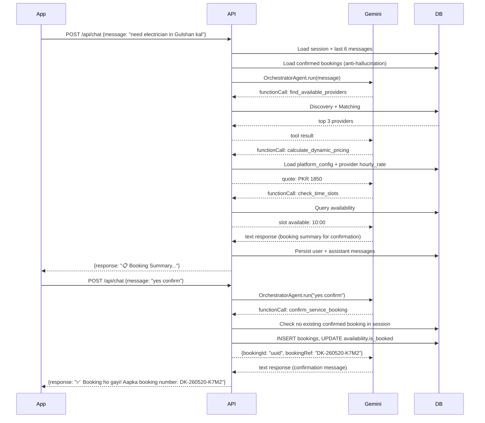

# Document 04 — API Documentation
## DigitalKaam Antigravity AI Service Platform

**Document Type**: API Reference  
**Audience**: Frontend Developers, Mobile Developers, QA Engineers, API Integrators  
**Related Documents**: [05_Authentication_Authorization](05_Authentication_Authorization.md) | [03_Database_Architecture](03_Database_Architecture.md) | [08_Business_Workflows](08_Business_Workflows.md)

---

## 1. Global Configuration

### Base URL
```
http://localhost:3000   (development)
https://your-domain.com (production)
```

### Authentication
Most endpoints require a Bearer JWT token in the `Authorization` header:
```
Authorization: Bearer <access_token>
```
Token is obtained from `/api/auth/login` or `/api/auth/signup`.

### Rate Limits

| Route Group | Window | Max Requests | Header |
|-------------|--------|-------------|--------|
| `/api/*` (all) | 60 seconds | 100 | Standard |
| `/api/chat` | 60 seconds | 20 | Override |
| `/api/auth` | 15 minutes | 10 | Override |

Rate limit errors return HTTP 429 with:
```json
{ "error": "Too many requests. Please slow down." }
```

### Content Type
All requests must use `Content-Type: application/json`.

### Auto Token Refresh
When a token expires mid-request, include:
```
X-Refresh-Token: <refresh_token>
```
On successful refresh, the response includes updated tokens:
```
X-New-Access-Token: <new_token>
X-New-Refresh-Token: <new_refresh>
X-New-Expires-In: <seconds>
```
**Clients must update their local token storage** when these headers are present.

---

## 2. Health Check

### `GET /health`
No auth required. Returns server status.

**Response** `200`:
```json
{
  "status": "ok",
  "service": "DigitalKaam Antigravity API",
  "timestamp": "2026-05-19T10:00:00.000Z"
}
```

---

## 3. Auth Routes — `/api/auth`

**Rate limit**: 10 requests per 15 minutes per IP.

---

### `POST /api/auth/signup`
Register a new user account with email and password.

**Auth**: Not required.

**Request Body**:
```json
{
  "email": "user@example.com",       // required
  "password": "SecurePass123",       // required, min 8 chars
  "full_name": "Ahmed Khan",         // required
  "phone": "+923001234567",          // optional
  "home_area": "Gulshan"             // optional
}
```

**Success Response** `201`:
```json
{
  "access_token": "eyJhbGci...",
  "refresh_token": "abc123...",
  "expires_in": 3600,
  "token_type": "Bearer",
  "userId": "uuid",
  "email": "user@example.com",
  "full_name": "Ahmed Khan",
  "isProvider": false,
  "providerId": null,
  "providerStatus": null
}
```

**Error Responses**:
- `400` — Missing required fields, password < 8 chars, email already exists
- `500` — Profile creation failed (auth user rolled back automatically)

**Side Effects**:
1. Creates row in `auth.users` (Supabase Auth)
2. Creates row in `user_profiles`
3. Returns signed-in session immediately (no email verification required)

**Rollback**: If `user_profiles` insert fails, the `auth.users` row is deleted via `supabase.auth.admin.deleteUser()`.

---

### `POST /api/auth/login`
Authenticate with email and password.

**Auth**: Not required.

**Request Body**:
```json
{
  "email": "user@example.com",
  "password": "SecurePass123"
}
```

**Success Response** `200`:
```json
{
  "access_token": "eyJhbGci...",
  "refresh_token": "abc123...",
  "expires_in": 3600,
  "token_type": "Bearer",
  "userId": "uuid",
  "email": "user@example.com",
  "full_name": "Ahmed Khan",
  "isProvider": true,
  "providerId": "uuid",
  "providerStatus": "active"
}
```

**Error Responses**:
- `400` — Email and password required
- `401` — Invalid credentials

**Side Effects**: None (read-only operation).

---

### `POST /api/auth/profile/sync`
**Required** after Google OAuth or any OAuth sign-in. Creates/upserts the `user_profiles` row that OAuth does not create automatically.

**Auth**: Required (Bearer token from OAuth session).

**Request Body**:
```json
{
  "full_name": "Ahmed Khan",  // optional, falls back to Google metadata
  "phone": "+923001234567",   // optional
  "home_area": "DHA"          // optional
}
```

**Success Response** `200`:
```json
{
  "userId": "uuid",
  "email": "user@example.com",
  "full_name": "Ahmed Khan",
  "isNewUser": true,
  "isProvider": false,
  "providerId": null,
  "providerStatus": null
}
```

**Side Effect**: Upserts `user_profiles` row (safe to call multiple times — idempotent).

---

## 4. Chat Routes — `/api/chat`

**Auth**: All routes require JWT. Applied via `router.use(requireAuth)`.  
**Rate limit**: 20 requests per minute.

---

### `POST /api/chat`
Main conversational AI endpoint. Sends a message to the OrchestratorAgent and receives a response.

**Auth**: Required.

**Request Body**:
```json
{
  "message": "Mujhe electrician chahiye Gulshan mein kal subah",
  "sessionId": "550e8400-e29b-41d4-a716-446655440000"
}
```

**Success Response** `200`:
```json
{
  "response": "Sure! I found 3 electricians in Gulshan for tomorrow morning...",
  "userId": "uuid",
  "turnCount": 3,
  "summarizedAt": null
}
```
- `summarizedAt` — non-null if summarization was triggered this turn (every 8 turns)

**Error Responses**:
- `400` — `message` or `sessionId` missing
- `500` — Session creation failed, FK violation (user profile missing), unhandled error

**Internal Flow**:
```
1. Load/create chat_session record
2. Load last 6 messages from chat_messages (DESC then reverse)
3. Maybe trigger summarization (if turnCount % 8 === 0)
4. Get or create Agent for this sessionId (agentCache)
5. Inject sessionId + userId into agent.sessionMetadata
6. Refresh booking facts block in system instructions
7. Persist user message to chat_messages
8. agent.run(message) → Gemini loop with tools
9. Persist assistant response to chat_messages
10. Increment turn_count, update last_active
11. Return response
```

**Critical Behaviors**:
- Each `sessionId` gets its own Agent instance cached in memory
- Agent is rebuilt from DB history on cache miss (server restart)
- Booking confirmation requires explicit user consent words ("yes", "confirm", "theek hai")
- Double-booking is blocked at DB level (`ConfirmBookingTool` checks for existing confirmed bookings per session)

---

### `GET /api/chat/history?sessionId=xxx`
Retrieve conversation history.

**Auth**: Required.

**Query Params**:
- `sessionId` (optional) — if provided, returns messages for that session; otherwise returns all sessions for the user

**Response with sessionId** `200`:
```json
{
  "sessionId": "uuid",
  "messages": [
    { "id": "uuid", "role": "user", "content": "...", "created_at": "..." },
    { "id": "uuid", "role": "assistant", "content": "...", "created_at": "..." }
  ],
  "summary": "User asked for electrician in Gulshan...",
  "turnCount": 6,
  "bookingIds": ["uuid1"]
}
```

**Response without sessionId** `200`:
```json
{
  "sessions": [
    { "session_id": "...", "summary": "...", "turn_count": 6, "last_active": "..." }
  ]
}
```

**Error Responses**:
- `403` — Session belongs to a different user
- `404` — Session not found
- `500` — Database error

**Security**: Ownership check is performed in application code (not DB query): `session.user_id !== userId` → 403.

---

### `POST /api/chat/transcribe`
Convert voice audio to text. Used before sending to `/api/chat`.

**Auth**: Required.

**Request Body**:
```json
{
  "audio": "<base64-encoded audio data>",
  "mimeType": "audio/m4a"
}
```

**Supported mimeTypes**: `audio/m4a`, `audio/mp4`, `audio/wav`, `audio/webm`, `audio/ogg`

**Success Response** `200`:
```json
{
  "transcription": "mujhe electrician chahiye"
}
```

**Error Responses**:
- `400` — Missing audio or mimeType
- `500` — Gemini transcription failed

**Size Limit**: 20MB (Gemini inline data cap). Typical voice message is < 1MB.  
**Model**: `gemini-2.0-flash` (multimodal)

---

### `POST /api/chat/speak`
Convert text to speech audio (WAV). Used to play back AI responses as voice.

**Auth**: Required.

**Request Body**:
```json
{
  "text": "Aapka booking confirm ho gaya!",
  "voice": "Kore"
}
```

**Available voices**: `Kore` (default), `Puck`, `Charon`, `Fenrir`, `Aoede`

**Success Response** `200`:
```json
{
  "audio": "<base64-encoded WAV>",
  "mimeType": "audio/wav"
}
```

**Error Responses**:
- `400` — Missing text
- `500` — Gemini TTS failed

**Audio Specs**: 24000 Hz, mono, 16-bit PCM, WAV container.

---

## 5. Service Routes — `/api/service`

**Auth**: Not required (no `requireAuth` middleware).

---

### `POST /api/service/request`
Run the full 8-agent Antigravity pipeline in a single call. Returns complete booking result.

**Auth**: Not required (development/testing endpoint).

**Request Body**:
```json
{
  "userInput": "Need an AC technician, my AC is not cooling at all",
  "userId": "uuid",
  "requestedDate": "2026-05-20",     // optional, defaults to tomorrow
  "requestedTime": "10:00",          // optional, defaults to 10:00
  "location": "Gulshan"              // optional
}
```

**Success Response** `200`:
```json
{
  "sessionId": "uuid",
  "intent": { "service": "AC Technician", "severity": "high", "location": "Gulshan", ... },
  "context": { "loyaltyPoints": 150, "isReturningUser": true, ... },
  "complexity": { "complexity": "intermediate", "estimatedDurationHours": 2, ... },
  "discovery": { "totalFound": 5, "searchArea": "Gulshan", ... },
  "matching": { "topProvider": { "name": "...", "matchScore": 0.78, ... }, ... },
  "pricing": { "total": 2363, "breakdown": {...}, "currency": "PKR", ... },
  "scheduling": { "slot": "2026-05-20 10:00", "conflictDetected": false, ... },
  "booking": {
    "bookingId": "uuid",
    "bookingRef": "DK-260520-K7M2",
    "status": "confirmed",
    "receipt": { ... }
  },
  "success": true,
  "clarificationNeeded": false
}
```

**Clarification Response** (when AI needs more info):
```json
{
  "success": false,
  "clarificationNeeded": true,
  "clarificationQuestion": "Could you please tell me the specific issue and your preferred time?"
}
```

**Error Response** (no providers found):
```json
{
  "success": false,
  "errorMessage": "No providers available in your area for the requested time.",
  "clarificationNeeded": false
}
```

---

## 6. Booking Routes — `/api/booking`

**Auth**: Required on all routes.

---

### `GET /api/booking/user/me`
Retrieve all bookings for the authenticated user.

**Auth**: Required.

**Response** `200`: Array of booking objects with provider details.
```json
[
  {
    "id": "uuid",
    "booking_ref": "DK-260520-K7M2",
    "status": "confirmed",
    "scheduled_time": "2026-05-20T10:00:00Z",
    "price": 2363,
    "providers": { "name": "Ahmed", "service_type": "AC Technician", "rating": 4.2 }
  }
]
```

---

### `GET /api/booking/:bookingId`
Retrieve a specific booking by ID.

**Auth**: Required.

**Response** `200`: Booking with provider details.  
**Error** `404`: Booking not found.

---

### `POST /api/booking`
Create a booking directly (without AI pipeline). Admin/testing use.

**Auth**: Required.

**Request Body**: Booking object fields (see `bookings` table schema).

**Response** `201`: Created booking object.

---

### `PATCH /api/booking/:bookingId`
Update a booking's fields.

**Auth**: Required.

**Request Body**: Partial booking fields to update.

**Response** `200`: Updated booking.

---

### `DELETE /api/booking/:bookingId`
Delete a booking.

**Auth**: Required.

**Response** `204`: No content.

---

### `PATCH /api/booking/:bookingId/status`
Update booking lifecycle status. Typically called by the provider app.

**Auth**: Required.

**Request Body**:
```json
{
  "status": "en_route",
  "completionPhotoUrl": null,  // Required when status = 'completed'
  "sessionId": "uuid"          // Optional for tracing
}
```

**Valid Status Values**: `confirmed`, `en_route`, `arrived`, `in_progress`, `completed`, `feedback_pending`, `cancelled`, `disputed`

**Response** `200`:
```json
{
  "bookingId": "uuid",
  "previousStatus": "confirmed",
  "newStatus": "en_route",
  "message": "Your provider is on the way to you!",
  "pushSentToUser": true,
  "pushSentToProvider": true
}
```

**Note**: Push notification events are logged at each lifecycle transition.

---

### `POST /api/booking/:bookingId/feedback`
Submit post-service rating and review.

**Auth**: Required.

**Request Body**:
```json
{
  "userId": "uuid",
  "providerId": "uuid",
  "rating": 4,              // 1–5
  "reviewText": "Great job!",
  "sessionId": "uuid"
}
```

**Response** `200`:
```json
{
  "providerId": "uuid",
  "previousRating": 4.1,
  "newRating": 4.2,
  "newReviewRecencyScore": 0.95,
  "matchingImpact": "Positive: this provider will rank higher in future matches"
}
```

**Side Effects**:
1. Inserts `feedback` row
2. Updates `bookings.status` to 'completed'
3. Updates `providers.rating` (weighted moving average)
4. Resets `providers.review_recency_score` to 0.95
5. Updates `reputation.positive_reviews` or `reputation.negative_reviews`

---

## 7. Provider Routes — `/api/provider`

---

### `GET /api/provider/me`
Get the authenticated user's own provider profile.

**Auth**: Required.

**Response** `200`: Provider profile with reputation data.  
**Error** `404`: User has not registered as a provider.

---

### `POST /api/provider/onboard`
Convert an existing user account to a provider ("Become a Provider").

**Auth**: Required.

**Request Body**:
```json
{
  "service_type": "Electrician",     // required — one of 7 valid types
  "specialization": "3-Phase Wiring", // required
  "experience_years": 5,              // required
  "hourly_rate": 800,                 // required, 100–50000 PKR
  "area": "Gulshan",                  // required
  "phone": "+923001234567",           // optional, falls back to profile
  "skills": ["Wiring", "Solar"],      // optional
  "certifications": ["Elec License"], // optional
  "travel_radius": 15                 // optional, default 10km
}
```

**Response** `201`:
```json
{
  "message": "Provider profile created successfully.",
  "providerId": "uuid",
  "provider": { ... }
}
```

**Error Responses**:
- `400` — Missing required fields, invalid service_type, hourly_rate out of range
- `409` — User already has a provider profile

**Side Effects**:
1. Creates `providers` row with `status: 'active'`
2. Creates `reputation` row with all zeros

---

### `PATCH /api/provider/me`
Update the authenticated user's provider profile.

**Auth**: Required.

**Request Body**: Any updatable provider fields. `user_id` and `id` are stripped if included.

**Response** `200`: Updated provider.  
**Error** `404`: No provider profile found.

---

### `GET /api/provider`
List all active providers with optional filters.

**Auth**: Not required.

**Query Params**:
- `serviceType` — filter by service type
- `area` — filter by area

**Response** `200`: Array of provider objects, ordered by rating descending.

---

### `GET /api/provider/:providerId`
Get a single provider with reputation data.

**Auth**: Not required.

**Response** `200`: Provider with joined reputation.  
**Error** `404`: Provider not found.

---

## 8. Dispute Routes — `/api/dispute`

**Auth**: Not required (unauthenticated endpoint).

---

### `POST /api/dispute`
Open a new dispute for a booking.

**Request Body**:
```json
{
  "bookingId": "uuid",
  "userId": "uuid",
  "providerId": "uuid",
  "disputeType": "no_show",    // no_show | quality | price | cancellation | overrun
  "description": "Provider never arrived",
  "sessionId": "uuid"           // optional
}
```

**Response** `200`:
```json
{
  "disputeId": "uuid",
  "status": "under_review",
  "recommendation": "Full refund recommended. Provider marked for no-show.",
  "refundAmount": 2363,
  "escalated": false,
  "providerFlagged": true,
  "message": "..."
}
```

**Side Effects**:
1. Creates `disputes` row with `status: 'under_review'`
2. Updates `bookings.status` to 'disputed'
3. If `providerFlagged`: increments `reputation.complaints` and `reputation.disputes`

---

### `GET /api/dispute/:disputeId`
Get dispute by ID.

**Response** `200`: Dispute object.  
**Error** `404`: Not found.

---

### `GET /api/dispute/user/:userId`
Get all disputes for a user.

**Response** `200`: Array of disputes, newest first.

---

## 9. Availability Routes — `/api/availability`

**Auth**: Not required.

### `GET /api/availability`
Query availability slots.

**Query Params**:
- `providerId` — filter by provider
- `date` — filter by date (YYYY-MM-DD)

**Response** `200`: Array of availability slots.

### `POST /api/availability`
Create a new availability slot for a provider.

**Request Body**: `{ provider_id, date, start_time, end_time, is_booked?, travel_buffer? }`

**Response** `201`: Created slot.

### `PATCH /api/availability/:id`
Update a slot (e.g., mark as booked).

### `DELETE /api/availability/:id`
Delete a slot.

---

## 10. Users Routes — `/api/users`

**Auth**: Not required (unauthenticated endpoint).

### `GET /api/users` — List all user profiles
### `GET /api/users/:id` — Get user by ID
### `POST /api/users` — Create user (creates Supabase auth user + profile)
### `PATCH /api/users/:id` — Update user profile
### `DELETE /api/users/:id` — Delete user profile

---

## 11. Reputation Routes — `/api/reputation`

**Auth**: Not required.

### `GET /api/reputation?providerId=xxx` — Get reputation for provider
### `POST /api/reputation` — Create reputation record
### `PATCH /api/reputation/:id` — Update reputation
### `DELETE /api/reputation/:id` — Delete reputation record

---

## 12. Traces Routes — `/api/traces`

**Auth**: Not required.

### `GET /api/traces?sessionId=xxx` — Get all traces for a session
### `GET /api/traces/:id` — Get a single trace
### `POST /api/traces` — Create a trace (admin use)
### `DELETE /api/traces/:id` — Delete a trace

---

## 13. Feedback Routes — `/api/feedback`

**Auth**: Not required.

> **Note**: Feedback submission is handled by `POST /api/booking/:bookingId/feedback`. The `/api/feedback` routes appear to be additional CRUD endpoints.

---

## 14. Admin Routes — `/api/admin`

**Auth**: Required (JWT required).

---

### `GET /api/admin/platform-config`
Read all platform fee configuration values.

**Response** `200`:
```json
{
  "config": [
    { "key": "platform_fee_fixed", "value": "50", "description": "Flat platform fee...", "updated_at": "..." },
    { "key": "platform_fee_percent", "value": "5", "description": "...", "updated_at": "..." }
  ]
}
```

---

### `PUT /api/admin/platform-config/:key`
Update a single config value. Hot reload — pricing engine uses this value on the next booking.

**Valid keys**: `platform_fee_fixed`, `platform_fee_percent`, `visit_fee`, `urgency_fee_high`, `urgency_fee_medium`, `loyalty_discount_cap`

**Request Body**:
```json
{ "value": "75" }
```

**Response** `200`:
```json
{
  "message": "Config 'platform_fee_fixed' updated to '75'",
  "config": { ... }
}
```

**Validation**: Value must be numeric. Non-numeric values return `400`.

---

## 15. API Sequence Diagrams

### Chat Booking Flow



---

*See [09_Agent_Flow_Documentation.md](09_Agent_Flow_Documentation.md) for detailed agent behavior.*  
*See [06_Pricing_Engine.md](06_Pricing_Engine.md) for pricing calculations.*
