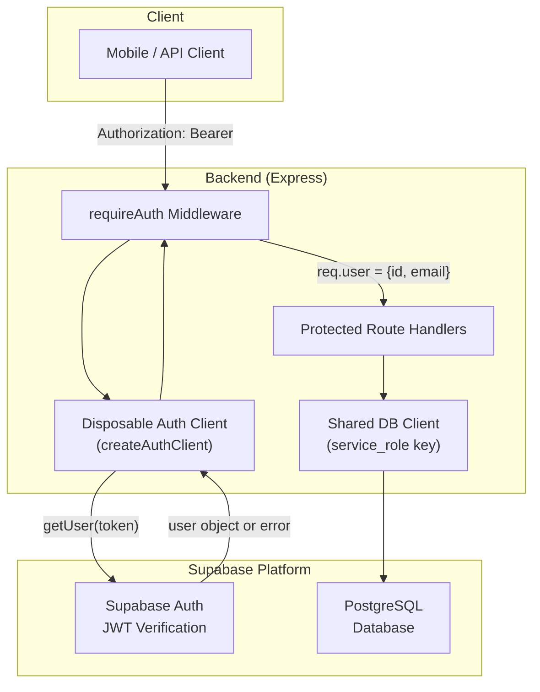
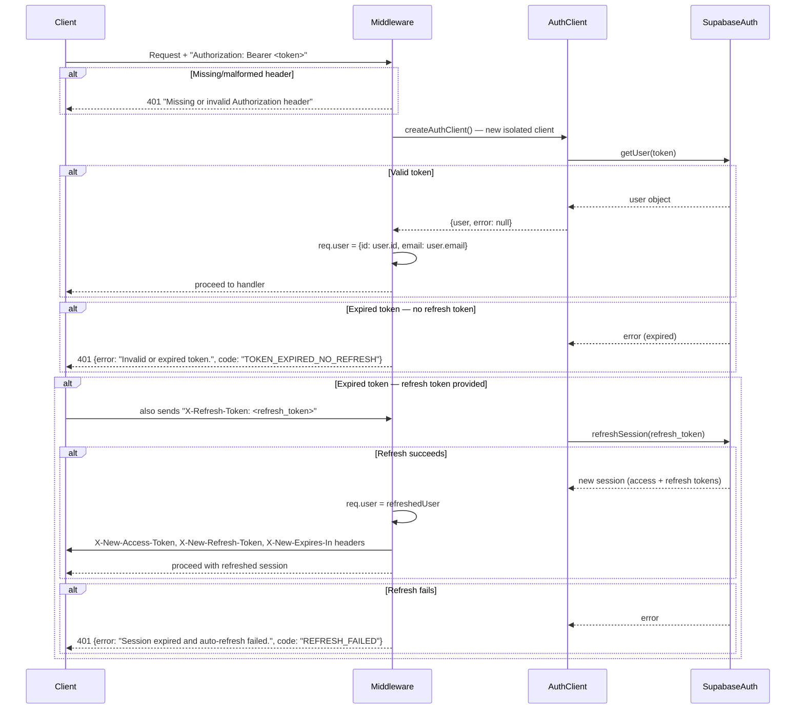
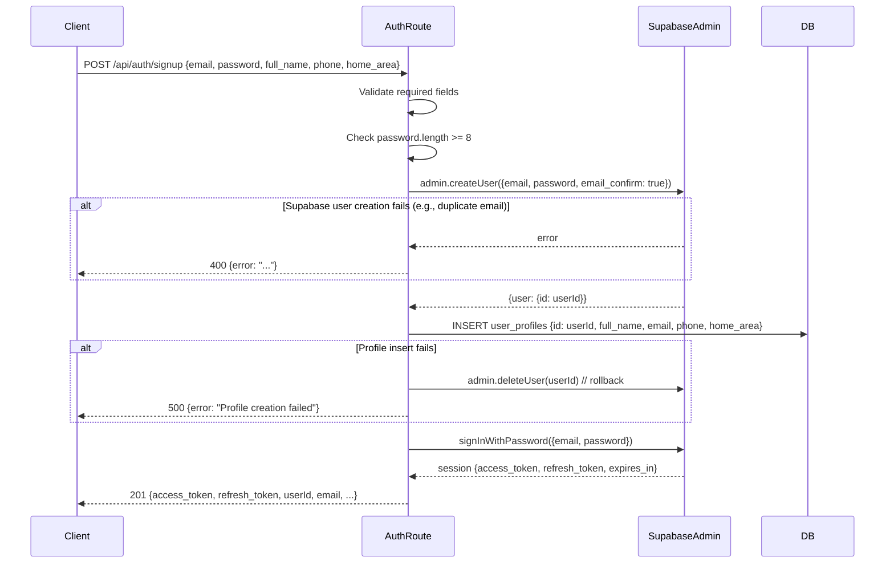

# Document 05 — Authentication & Authorization
## DigitalKaam AI Service Platform

**Document Type**: Security Reference  
**Audience**: Backend Developers, Security Engineers  
**Related Documents**: [04_API_Documentation](04_API_Documentation.md) | [11_Security_Review](11_Security_Review.md) | [03_Database_Architecture](03_Database_Architecture.md)

---

## 1. Overview

DigitalKaam uses **Supabase Auth** as its identity layer. Supabase provides:
- Email + Password authentication
- Google OAuth (and other OAuth providers)
- JWT generation and validation
- Session management
- Admin user management APIs

The backend acts as a **trusted server** using the `service_role` key, which grants full database access and bypasses all Row Level Security (RLS) policies.

---

## 2. Authentication Architecture



---

## 3. JWT Structure

Supabase issues standard HS256 JWTs. The payload contains:

```json
{
  "aud": "authenticated",
  "exp": 1748000000,           // Unix timestamp expiry
  "iat": 1747996400,           // Issued at
  "iss": "https://PROJECT.supabase.co/auth/v1",
  "sub": "user-uuid",          // User ID (used as req.user.id)
  "email": "user@example.com",
  "role": "authenticated",
  "session_id": "session-uuid"
}
```

The `sub` field becomes `req.user.id` throughout the application.

**Token Lifetime**: Configurable in Supabase (default: 1 hour access token, 60 days refresh token).

---

## 4. Token Verification Flow



---

## 5. Isolated Auth Client Pattern

```typescript
// middleware/auth.ts
function createAuthClient() {
  return createClient(
    process.env.SUPABASE_URL!,
    process.env.SUPABASE_SERVICE_KEY!,
    { auth: { autoRefreshToken: false, persistSession: false } }
  )
}
```

**Why separate from the shared DB client?**

The shared DB client (`lib/supabase.ts`) uses the `service_role` key. If `refreshSession()` were called on this client, the client's internal auth state would update to the user's JWT. By using an isolated client for authentication checks, the service-role permissions of the DB client remain unchanged, ensuring consistent administrative database access throughout request processing.

The isolated client is created fresh for each authentication check and discarded after verification.

---

## 6. Signup Flow



**Key Behavior**: `email_confirm: true` is hardcoded — newly created accounts are immediately verified without email confirmation. This is a deliberate choice for mobile-first UX in Pakistan where email deliverability is unreliable.

---

## 7. Google OAuth Flow

Supabase handles the OAuth callback. The backend's role:

1. Frontend initiates Google OAuth via Supabase client SDK
2. Supabase handles redirect and returns session to client
3. Client **must immediately** call `POST /api/auth/profile/sync` with the OAuth token
4. `profile/sync` creates the `user_profiles` row if it doesn't exist (upsert)

**Why `profile/sync` is required**: Google OAuth creates the `auth.users` row but NOT the `user_profiles` row. Without calling `profile/sync`, the user cannot create chat sessions (FK violation on `chat_sessions.user_id → user_profiles.id`).

---

## 8. Authorization Model

### Current Model: Authentication-Only

The system has **no role-based access control (RBAC)**. Once a user has a valid JWT, they can call any authenticated endpoint. There is no concept of admin role, provider role, or user role at the API middleware level.

**Implicit role differentiation** (in code, not enforced at middleware level):
- Provider-specific actions (updating provider profile) check `providers.user_id = req.user.id`
- Booking ownership is not validated on most GET endpoints
- Admin endpoints (`/api/admin`) require auth but accept any authenticated user

### What Should Be Added

| Endpoint Category | Current | Required |
|------------------|---------|---------|
| Admin config changes | Any auth user | Admin role |
| Provider profile update | Auth + app-level check | Provider role |
| User data access | No auth on `/api/users` | Auth + ownership |
| Dispute resolution | No auth | Auth + role |
| Traces access | No auth | Admin only |

---

## 9. Protected Endpoints Summary

| Endpoint | Auth Required | Auth Level |
|----------|--------------|-----------|
| `POST /api/chat` | ✅ JWT | Any user |
| `GET /api/chat/history` | ✅ JWT | Owner |
| `POST /api/chat/transcribe` | ✅ JWT | Any user |
| `POST /api/chat/speak` | ✅ JWT | Any user |
| `POST /api/auth/profile/sync` | ✅ JWT | Any user |
| `GET /api/booking/user/me` | ✅ JWT | Owner |
| `GET /api/booking/:id` | ✅ JWT | Any user (no ownership check) |
| `POST /api/booking` | ✅ JWT | Any user |
| `PATCH /api/booking/:id/status` | ✅ JWT | Any user (no ownership check) |
| `POST /api/booking/:id/feedback` | ✅ JWT | Any user |
| `GET /api/provider/me` | ✅ JWT | Owner |
| `POST /api/provider/onboard` | ✅ JWT | Any user |
| `PATCH /api/provider/me` | ✅ JWT | Owner |
| `GET /api/admin/platform-config` | ✅ JWT | Any user (should be admin) |
| `PUT /api/admin/platform-config/:key` | ✅ JWT | Any user (should be admin) |
| `POST /api/auth/signup` | ❌ None | N/A |
| `POST /api/auth/login` | ❌ None | N/A |
| `GET /api/provider` | ❌ None | N/A |
| `GET /api/provider/:id` | ❌ None | N/A |
| `/api/users/*` | ❌ None | N/A |
| `/api/dispute/*` | ❌ None | N/A |
| `/api/availability/*` | ❌ None | N/A |
| `/api/reputation/*` | ❌ None | N/A |
| `/api/traces/*` | ❌ None | N/A |

---

## 10. Token Refresh Strategy

The auto-refresh strategy is **header-based**: clients must pass `X-Refresh-Token` alongside expired access tokens.

### Client Implementation Guide

```typescript
// Pseudo-code for mobile client
async function apiRequest(url: string, options: RequestInit) {
  const tokens = await getStoredTokens()
  
  const response = await fetch(url, {
    ...options,
    headers: {
      ...options.headers,
      'Authorization': `Bearer ${tokens.accessToken}`,
      'X-Refresh-Token': tokens.refreshToken  // always include
    }
  })

  // Check for rotated tokens
  const newAccessToken = response.headers.get('X-New-Access-Token')
  const newRefreshToken = response.headers.get('X-New-Refresh-Token')
  
  if (newAccessToken && newRefreshToken) {
    await updateStoredTokens(newAccessToken, newRefreshToken)
  }
  
  if (response.status === 401) {
    const body = await response.json()
    if (body.code === 'REFRESH_FAILED') {
      // Force logout
      await logout()
    }
  }
  
  return response
}
```

---

## 11. Service Role Key Security

The `SUPABASE_SERVICE_KEY` (service_role key) must be treated as a root credential:
- Never expose in client-side code
- Never commit to version control
- Store in secure environment variable management (e.g., Railway secrets, Render env vars)
- Rotate immediately if compromised

The service role key bypasses all PostgreSQL RLS policies and can read/write/delete any row in any table.

---

*See [11_Security_Review.md](11_Security_Review.md) for the full security architecture and controls.*
