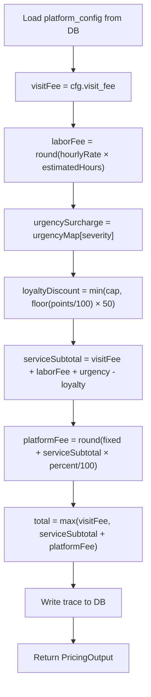

# Document 06 — Pricing Engine
## DigitalKaam Antigravity AI Service Platform

**Document Type**: Business Logic Reference  
**Audience**: Developers, Product Managers, Finance, Auditors  
**Related Documents**: [07_Loyalty_Point_System](07_Loyalty_Point_System.md) | [03_Database_Architecture](03_Database_Architecture.md) | [09_Agent_Flow_Documentation](09_Agent_Flow_Documentation.md)

---

## 1. Overview

The DigitalKaam Pricing Engine calculates dynamic service quotes based on provider rates, job complexity, urgency, user loyalty, and platform fees. All configurable parameters are stored in the `platform_config` database table, enabling hot-reload configuration changes without code deployments.

**Source file**: `backend/src/controllers/pricingController.ts`

---

## 2. Pricing Formula — Complete Specification

### Step-by-Step Calculation

```
STEP 1: visitFee = cfg.visit_fee

STEP 2: laborFee = ROUND(provider.hourly_rate × complexity.estimatedDurationHours)

STEP 3: urgencySurcharge = urgencyMap[intent.severity]
        where urgencyMap = {
          low:    0,
          medium: cfg.urgency_fee_medium,
          high:   cfg.urgency_fee_high
        }

STEP 4: loyaltyDiscount = MIN(cfg.loyalty_discount_cap, FLOOR(loyaltyPoints / 100) × 50)

STEP 5: serviceSubtotal = visitFee + laborFee + urgencySurcharge - loyaltyDiscount

STEP 6: platformFee = ROUND(cfg.platform_fee_fixed + (serviceSubtotal × cfg.platform_fee_percent / 100))

STEP 7: total = MAX(visitFee, serviceSubtotal + platformFee)
```

### Mathematical Notation

$$\text{laborFee} = \text{round}(\text{hourlyRate} \times \text{estimatedHours})$$

$$\text{urgencySurcharge} = \begin{cases} 0 & \text{if severity} = \text{low} \\ \text{urgency\_fee\_medium} & \text{if severity} = \text{medium} \\ \text{urgency\_fee\_high} & \text{if severity} = \text{high} \end{cases}$$

$$\text{loyaltyDiscount} = \min\left(\text{loyalty\_discount\_cap},\ \left\lfloor \frac{\text{loyaltyPoints}}{100} \right\rfloor \times 50\right)$$

$$\text{serviceSubtotal} = \text{visitFee} + \text{laborFee} + \text{urgencySurcharge} - \text{loyaltyDiscount}$$

$$\text{platformFee} = \text{round}\left(\text{platform\_fee\_fixed} + \frac{\text{serviceSubtotal} \times \text{platform\_fee\_percent}}{100}\right)$$

$$\text{total} = \max(\text{visitFee},\ \text{serviceSubtotal} + \text{platformFee})$$

---

## 3. Configuration Parameters

All values stored in `platform_config` table. Fallback defaults are hardcoded in `pricingController.ts`:

| Config Key | Default | Type | Description |
|-----------|---------|------|-------------|
| `visit_fee` | 500 | PKR (flat) | Provider callout / diagnostic fee. Paid to provider. |
| `platform_fee_fixed` | 50 | PKR (flat) | Flat platform commission per booking. |
| `platform_fee_percent` | 5 | % | Percentage of `serviceSubtotal` taken by platform. |
| `urgency_fee_high` | 250 | PKR (flat) | Surcharge for high-severity requests (same-day, emergency). |
| `urgency_fee_medium` | 100 | PKR (flat) | Surcharge for medium-severity requests. |
| `loyalty_discount_cap` | 200 | PKR (max) | Maximum loyalty discount per booking. |

**Config Loading**: `loadPlatformConfig()` fetches all rows from `platform_config` at the start of every pricing call. Falls back silently to hardcoded defaults if the table is unreachable. No alerting is triggered on fallback.

---

## 4. Input Factors

| Factor | Source | Type | Used In |
|--------|--------|------|---------|
| `hourly_rate` | `providers.hourly_rate` | Integer (PKR/hr) | Labor fee calculation |
| `estimatedDurationHours` | `ComplexityOutput.estimatedDurationHours` | Float | Labor fee calculation |
| `intent.severity` | `IntentOutput.severity` (Gemini NLP) | low/medium/high | Urgency surcharge |
| `context.loyaltyPoints` | `user_profiles.loyalty_points` | Integer | Loyalty discount |
| `intent.budgetSensitivity` | `IntentOutput.budgetSensitivity` | low/medium/high | Budget note flag |

---

## 5. Worked Examples

### Example 1: Basic AC Cleaning (Low Severity, No Loyalty)
```
Provider hourly_rate: 600 PKR/hr
Estimated duration:   1 hour (basic)
Severity:             low
Loyalty points:       0

visitFee         = 500
laborFee         = ROUND(600 × 1) = 600
urgencySurcharge = 0 (low)
loyaltyDiscount  = MIN(200, FLOOR(0/100) × 50) = 0
serviceSubtotal  = 500 + 600 + 0 - 0 = 1100
platformFee      = ROUND(50 + (1100 × 5/100)) = ROUND(50 + 55) = 105
total            = MAX(500, 1100 + 105) = 1205 PKR
```

**Price Breakdown**:
| Component | Amount |
|-----------|--------|
| Visit Fee | PKR 500 |
| Labour (1 hr × 600/hr) | PKR 600 |
| Urgency Surcharge | PKR 0 |
| Loyalty Discount | -PKR 0 |
| Platform Fee | PKR 105 |
| **Total** | **PKR 1,205** |

---

### Example 2: Emergency AC Compressor Repair (High Severity, With Loyalty)
```
Provider hourly_rate: 1200 PKR/hr
Estimated duration:   3 hours (complex)
Severity:             high
Loyalty points:       350

visitFee         = 500
laborFee         = ROUND(1200 × 3) = 3600
urgencySurcharge = 250 (high)
loyaltyDiscount  = MIN(200, FLOOR(350/100) × 50)
                 = MIN(200, 3 × 50)
                 = MIN(200, 150) = 150
serviceSubtotal  = 500 + 3600 + 250 - 150 = 4200
platformFee      = ROUND(50 + (4200 × 5/100)) = ROUND(50 + 210) = 260
total            = MAX(500, 4200 + 260) = 4460 PKR
```

**Price Breakdown**:
| Component | Amount |
|-----------|--------|
| Visit Fee | PKR 500 |
| Labour (3 hrs × 1200/hr) | PKR 3,600 |
| Urgency Surcharge | PKR 250 |
| Loyalty Discount | -PKR 150 |
| Platform Fee | PKR 260 |
| **Total** | **PKR 4,460** |

---

### Example 3: Minimum Price Guarantee (Edge Case)
```
Provider hourly_rate: 400 PKR/hr
Estimated duration:   0.5 hours
Severity:             low
Loyalty points:       500

visitFee         = 500
laborFee         = ROUND(400 × 0.5) = 200
urgencySurcharge = 0
loyaltyDiscount  = MIN(200, FLOOR(500/100) × 50)
                 = MIN(200, 5 × 50)
                 = MIN(200, 250) = 200
serviceSubtotal  = 500 + 200 + 0 - 200 = 500
platformFee      = ROUND(50 + (500 × 5/100)) = ROUND(50 + 25) = 75
subtotal_plus_fee = 500 + 75 = 575
total            = MAX(500, 575) = 575 PKR
```

The `MAX(visitFee, ...)` floor ensures the total never drops below the visit fee (PKR 500), preventing negative-margin bookings where loyalty discounts would otherwise eliminate platform revenue.

---

### Example 4: Loyalty Cap Applied
```
Provider hourly_rate: 800 PKR/hr
Estimated duration:   2 hours
Severity:             medium
Loyalty points:       10,000 (very high)

loyaltyDiscount = MIN(200, FLOOR(10000/100) × 50)
               = MIN(200, 100 × 50)
               = MIN(200, 5000) = 200   ← CAPPED at 200

visitFee         = 500
laborFee         = 1600
urgencySurcharge = 100
serviceSubtotal  = 500 + 1600 + 100 - 200 = 2000
platformFee      = ROUND(50 + (2000 × 0.05)) = 150
total            = MAX(500, 2000 + 150) = 2150 PKR
```

Regardless of how many loyalty points a user has, the discount is capped at `loyalty_discount_cap` (default PKR 200).

---

## 6. Budget Sensitivity Flag

The `isBudgetFriendly` flag is set in the output:

```typescript
const isBudgetFriendly = intent.budgetSensitivity === 'high' && total > 1500
```

When `isBudgetFriendly = true` (user is budget-sensitive AND price is high):
- `alternativeBudgetNote` is set: `"Budget tip: Scheduling for a non-urgent slot could save PKR 100–250."`
- This is exposed to the AI orchestrator which may present it to the user

**Note**: The field name is counter-intuitive. `isBudgetFriendly = false` when the total exceeds 1500 AND the user indicated budget sensitivity. The variable is best read as "is this quote friendly to the user's budget?" — not "is the user budget-friendly?"

---

## 7. Parts Disclaimer

Every price breakdown includes a standard disclaimer:

> "Parts/materials not included. Final price may vary after technician inspects the job."

This is hardcoded in `bookingController.ts` and appears in the `priceBreakdown.partsDisclaimer` field of the receipt. This is critical for liability — the quoted price covers labor only.

---

## 8. Platform Fee Distribution Model (Inferred)

From the code, the platform revenue model appears to be:

| Fee Component | Goes To | Notes |
|--------------|---------|-------|
| `visitFee` | Provider | Diagnostic / callout fee |
| `laborFee` | Provider | Core service payment |
| `urgencySurcharge` | Provider (implied) | Premium for urgent availability |
| `loyaltyDiscount` | Platform absorbs | Subsidized from platform revenue |
| `platformFee` | Platform | Revenue = fixed + percentage |

**Total user pays** = visitFee + laborFee + urgencySurcharge - loyaltyDiscount + platformFee

**Platform earns** = platformFee − loyaltyDiscount subsidy

---

## 9. Rounding Rules

- `laborFee = Math.round(hourlyRate × estimatedHours)` — rounds to nearest PKR
- `platformFee = Math.round(fixed + percent)` — rounds to nearest PKR
- `loyaltyDiscount = Math.min(cap, Math.floor(points/100) × 50)` — floors (never rounds up a discount)
- `total = Math.max(visitFee, ...)` — no additional rounding (already rounded above)
- Rating: `Math.round(((prevRating × count + newRating) / (count + 1)) × 10) / 10` — 1 decimal place

---

## 10. Execution Order



---

## 11. Admin Configuration Management

Fee parameters are fully manageable without deployment:

```bash
# Update platform fee to 75 PKR flat
PUT /api/admin/platform-config/platform_fee_fixed
Body: { "value": "75" }

# Reduce urgency fee for medium
PUT /api/admin/platform-config/urgency_fee_medium
Body: { "value": "75" }

# Increase loyalty discount cap for promotional period
PUT /api/admin/platform-config/loyalty_discount_cap
Body: { "value": "400" }
```

Changes take effect on the **next pricing calculation** (no restart required). The pricing engine loads config fresh on every call.

---

## 12. Trace Record

Every pricing calculation writes a trace to the `traces` table:

```json
{
  "session_id": "...",
  "agent": "PricingAgent",
  "input": {
    "provider": "Ahmed Khan",
    "hourlyRate": 800,
    "estimatedHours": 2,
    "severity": "medium",
    "complexity": "intermediate",
    "loyaltyPoints": 150
  },
  "output": {
    "visitFee": 500,
    "laborFee": 1600,
    "urgencySurcharge": 100,
    "loyaltyDiscount": 50,
    "platformFee": 108,
    "total": 2258
  },
  "reasoning": "Visit: PKR 500 + Labor: 800/hr × 2hr = PKR 1600 + Urgency: PKR 100 - Loyalty: PKR 50 + PlatformFee: PKR 108 = PKR 2258",
  "confidence_score": 0.9
}
```

---

*See [07_Loyalty_Point_System.md](07_Loyalty_Point_System.md) for loyalty discount details.*  
*See [03_Database_Architecture.md](03_Database_Architecture.md) for `platform_config` table.*
