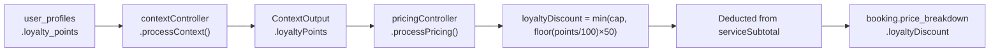

# Document 07 — Loyalty Point System
## DigitalKaam Antigravity AI Service Platform

**Document Type**: Business Logic Reference  
**Audience**: Product Managers, Developers, Finance  
**Related Documents**: [06_Pricing_Engine](06_Pricing_Engine.md) | [03_Database_Architecture](03_Database_Architecture.md) | [08_Business_Workflows](08_Business_Workflows.md)

---

## 1. Overview

The DigitalKaam loyalty system rewards repeat customers by applying a discount to their service bookings. Points are stored in `user_profiles.loyalty_points`. Discounts are applied at pricing time using a step function with a configurable cap.

---

## 2. System Parameters

| Parameter | Value | Configurable |
|-----------|-------|-------------|
| **Redemption Rate** | 100 points = PKR 50 discount | No (hardcoded) |
| **Max Discount Per Booking** | PKR 200 (default) | Yes — `loyalty_discount_cap` |
| **Point Display to User** | Via `contextController` output | — |

---

## 3. Discount Formula

```
loyaltyDiscount = MIN(loyalty_discount_cap, FLOOR(loyaltyPoints / 100) × 50)
```

### Discount Table

| Loyalty Points | FLOOR(points/100) | Discount (×50) | With Default Cap (200) |
|---------------|-------------------|----------------|----------------------|
| 0–99 | 0 | PKR 0 | PKR 0 |
| 100–199 | 1 | PKR 50 | PKR 50 |
| 200–299 | 2 | PKR 100 | PKR 100 |
| 300–399 | 3 | PKR 150 | PKR 150 |
| 400–499 | 4 | PKR 200 | PKR 200 ← cap reached |
| 500+ | 5+ | PKR 250+ | PKR 200 (capped) |

The cap ensures consistent, predictable discount economics regardless of accumulated point totals.

---

## 4. Loyalty Points Management

Loyalty points are stored in `user_profiles.loyalty_points` (default: 0). Points are updated via:
1. `PATCH /api/users/:id` with `{ loyalty_points: N }`
2. Direct database update for admin/seeding operations

The system is architected to handle large point balances, with the discount cap ensuring economic predictability.

---

## 5. Discount Application Model

The loyalty discount is applied as a **virtual deduction from the booking price** at calculation time. The discount value is calculated from the user's current point balance and reflected in the full price breakdown stored with the booking.

The discount flows through the system as follows:
1. User's current point balance is loaded by `contextController`
2. `pricingController` computes the discount using the formula
3. The discount is deducted from the booking subtotal
4. The full `price_breakdown` JSONB with the discount amount is persisted to the booking record

---

## 6. Integration With Pricing Engine



The discount appears in:
- `PricingOutput.breakdown.loyaltyDiscount` 
- `Receipt.priceBreakdown.loyaltyDiscount`
- `bookings.price_breakdown.loyaltyDiscount` (JSONB, persisted)
- The AI-generated booking summary presented to the user

---

## 7. Context Loading

`contextController.processContext()` loads loyalty points from the DB before pricing:

```typescript
const { data: profile } = await supabase
  .from('user_profiles')
  .select('*')
  .eq('id', userId)
  .single()

const output: ContextOutput = {
  loyaltyPoints: profile?.loyalty_points ?? 0,
  ...
}
```

If the user profile is not found, `loyaltyPoints` defaults to 0 (no discount applied).

---

## 8. Configurability

The maximum discount per booking is configurable via the admin API:

```bash
# Adjust the maximum loyalty discount
PUT /api/admin/platform-config/loyalty_discount_cap
Body: { "value": "400" }
```

The redemption rate (100 pts = PKR 50) is defined in `pricingController.ts`.

---

## 9. Display to User

The AI orchestrator surfaces loyalty information to users in the booking summary (before confirmation):

```
• Loyalty discount:  -PKR [loyaltyDiscount]
```

---

## 10. Test Data Setup

To test loyalty discounts in development, set a user's point balance:
```sql
UPDATE user_profiles SET loyalty_points = 350 WHERE id = '<user-uuid>';
```
Or via API:
```bash
PATCH /api/users/<user-id>
Body: { "loyalty_points": 350 }
```

---

*See [06_Pricing_Engine](06_Pricing_Engine.md) for the full pricing formula.*  
*See [03_Database_Architecture](03_Database_Architecture.md) for `user_profiles.loyalty_points` field.*


