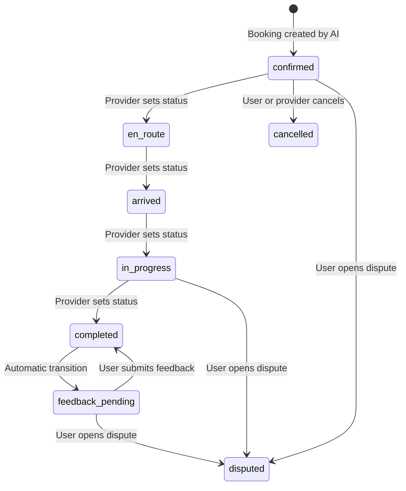
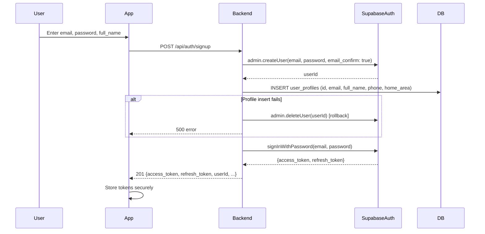
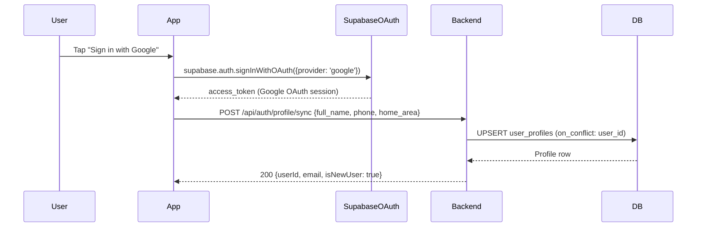
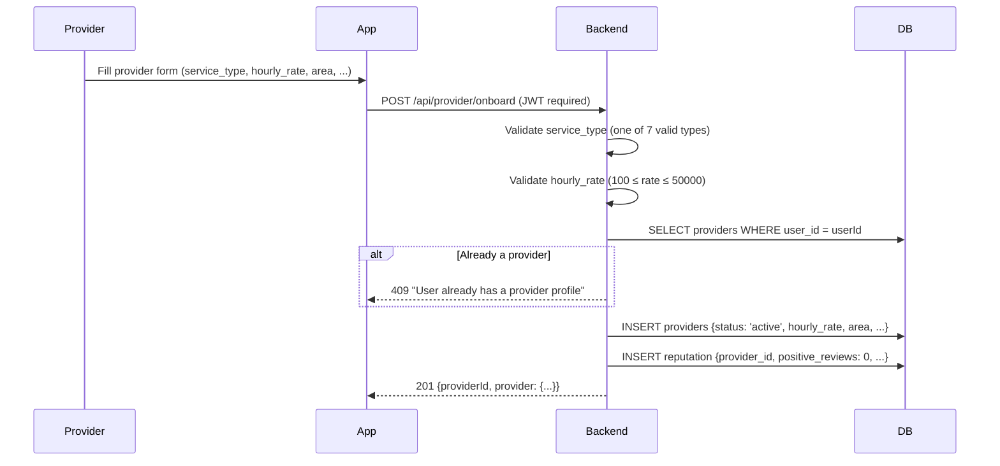
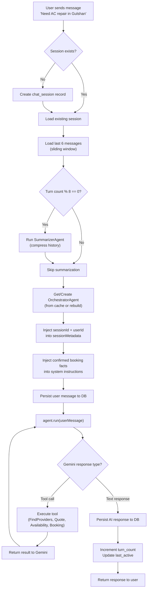
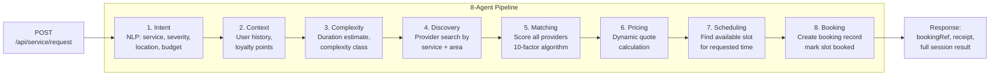
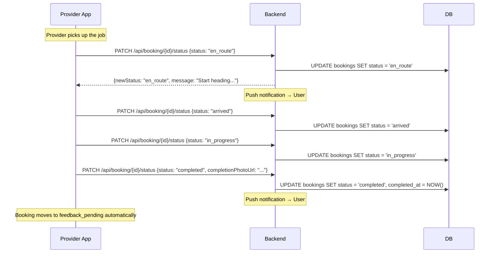
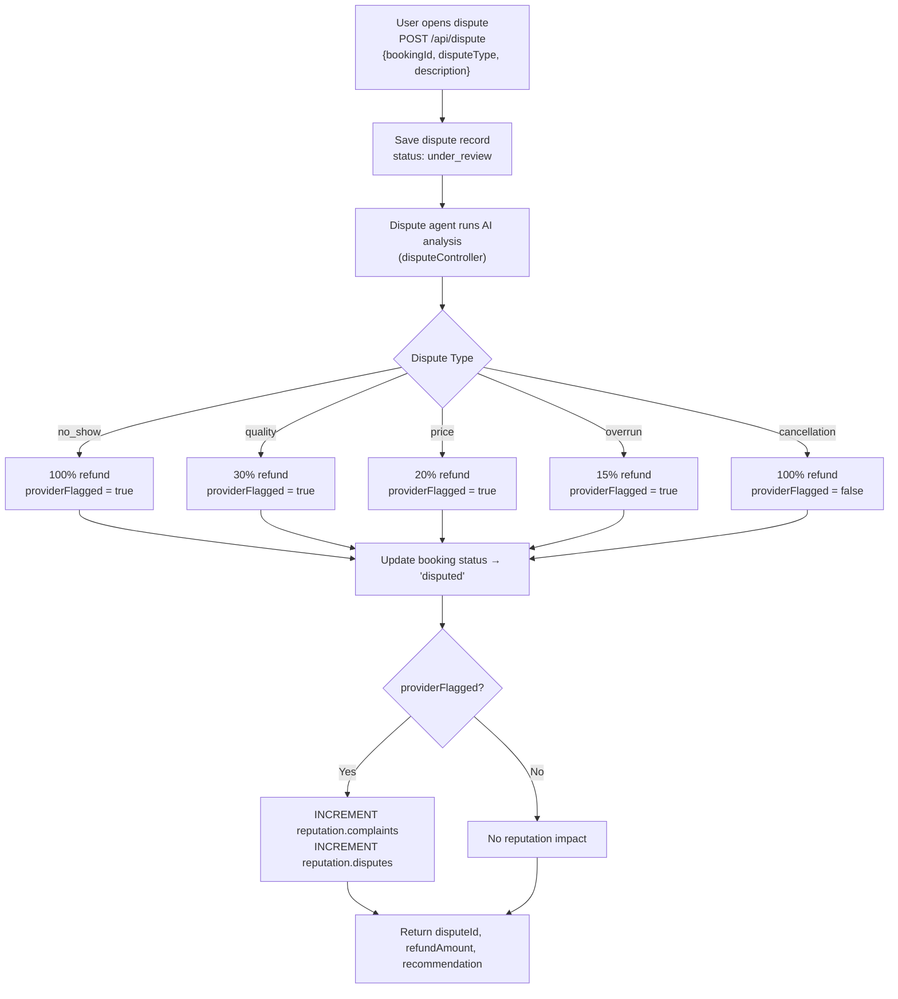
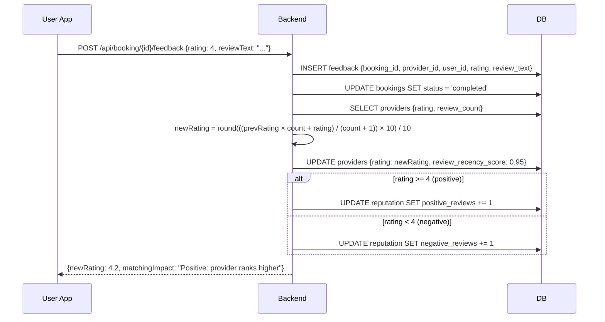

# Document 08 — Business Workflows
## DigitalKaam Antigravity AI Service Platform

**Document Type**: Process Reference  
**Audience**: Product Managers, QA Engineers, Operations, Developers  
**Related Documents**: [09_Agent_Flow_Documentation](09_Agent_Flow_Documentation.md) | [06_Pricing_Engine](06_Pricing_Engine.md) | [04_API_Documentation](04_API_Documentation.md)

---

## 1. Overview

This document describes the end-to-end business processes in DigitalKaam. There are five primary workflows:
1. User Registration
2. Provider Onboarding
3. Service Booking (AI Chat)
4. Service Booking (Direct Pipeline)
5. Dispute Resolution

---

## 2. Booking Lifecycle States



### Status Messages

When a booking status changes via `PATCH /api/booking/:id/status`, human-readable messages are generated from status maps in `lifecycleController.ts`:

**User-facing messages**:
| Status | Message |
|--------|---------|
| `en_route` | "Your provider is on the way to you!" |
| `arrived` | "Your provider has arrived at your location." |
| `in_progress` | "Your service is now in progress." |
| `completed` | "Your service has been completed successfully." |
| `cancelled` | "Your booking has been cancelled." |
| `disputed` | "Your dispute has been opened. We'll review and respond within 24 hours." |

**Provider-facing messages**:
| Status | Message |
|--------|---------|
| `en_route` | "Start heading to the customer's location." |
| `arrived` | "You've marked arrival. Begin the service." |
| `in_progress` | "Service is in progress. Document your work." |
| `completed` | "Job marked complete. Awaiting customer confirmation." |

---

## 3. Booking Reference Format

Every booking is assigned a human-readable reference: **`DK-YYMMDD-XXXX`**

- `DK` — DigitalKaam prefix
- `YYMMDD` — date of booking (e.g., `260520` = May 20, 2026)
- `XXXX` — 4 characters randomly selected from ambiguity-filtered alphabet

**Ambiguity-filtered alphabet** (removes characters that look similar):
```
ABCDEFGHJKLMNPQRSTUVWXYZ23456789
```
Excluded characters: `I`, `O`, `0`, `1` — to prevent customer misreading over the phone.

**Examples**: `DK-260520-K7M2`, `DK-260521-AXBR`

---

## 4. Workflow 1: User Registration



**Completion Criteria**:
- `auth.users` row created with `email_confirmed = true`
- `user_profiles` row created with `loyalty_points = 0`, `booking_count = 0`
- Active session returned immediately

---

## 5. Workflow 2: Google OAuth Registration



**Critical**: Without `profile/sync`, the user cannot open chat sessions (FK constraint on `chat_sessions.user_id`).

---

## 6. Workflow 3: Provider Onboarding



### Valid Service Types
The backend validates service_type against exactly these 7 values:
1. `Electrician`
2. `Plumber`
3. `AC Technician`
4. `Carpenter`
5. `Painter`
6. `Cleaner`
7. `Home Appliance Technician`

Any other value returns a 400 error.

Providers are onboarded with their service `area` as text. The `providers` table also supports `latitude` and `longitude` columns for coordinate-based distance calculations, which are populated for seeded providers.

---

## 7. Workflow 4: Service Booking via AI Chat

This is the primary user journey.



### 5-Step OrchestratorAgent Conversation Flow

The OrchestratorAgent follows a deterministic 5-step process:

| Step | Name | Actions |
|------|------|---------|
| 1 | Gather Information | Collect service type, problem description, location |
| 2 | Find Provider | Call `find_available_providers` tool |
| 3 | Quote and Availability | Call `calculate_dynamic_pricing` and `check_time_slots` |
| 4 | Confirm with User | Present summary, await explicit confirmation |
| 5 | Book | Call `confirm_service_booking` on user confirmation |

**Confirmation Triggers**: User must use confirmation language — "yes", "confirm", "book it", "theek hai" (Urdu: okay/agreed). The AI checks for these before proceeding to booking.

**One Session, One Booking Rule**: Once a booking is confirmed in a session, the `ConfirmBookingTool` blocks any further booking attempts for that session. This prevents duplicate bookings from repeated "yes" or message retries.

---

## 8. Workflow 5: Service Booking via Direct Pipeline

The Antigravity pipeline (`POST /api/service/request`) runs all 8 agents sequentially in a single API call.



**Early Exits**:
1. After Agent 1 (Intent): If Gemini returns `clarificationNeeded = true` → stop, return clarification question
2. After Agent 5 (Matching): If no providers found → stop, return `noProvidersAvailable`

---

## 9. Workflow 6: Booking Status Lifecycle



**Push Notifications**: The `lifecycleController.ts` sends push notifications at each lifecycle transition, covering all 6 status events.

---

## 10. Workflow 7: Dispute Resolution



### Refund Policy Table

| Dispute Type | Refund % | Provider Flagged | Notes |
|-------------|---------|-----------------|-------|
| `no_show` | 100% | Yes | Provider never arrived |
| `cancellation` | 100% | No | Mutual cancellation |
| `quality` | 30% | Yes | Poor workmanship |
| `price` | 20% | Yes | Unexpected charges |
| `overrun` | 15% | Yes | Job took too long |

**refundAmount calculation**:
```typescript
const refundAmount = Math.round(booking.price * refundPercent)
```

**Payment Gateway**: No actual refund is processed. The `refundAmount` is recorded in the `disputes` table but no payment API is called. Physical refund processing is a future capability.

---

## 11. Workflow 8: Post-Service Feedback



**Review Recency Score Reset**: On every new review, `review_recency_score` is reset to 0.95 regardless of previous value. This decays over time (mechanism: the score is compared against a time-based decay threshold in the matching algorithm).

---

## 12. Session Summary Trigger

After every 8 conversation turns, the chat route triggers automatic summarization:

```
turnCount % SUMMARIZE_EVERY === 0   (SUMMARIZE_EVERY = 8)
```

**SummarizerAgent** compresses the conversation into a single summary string stored in `chat_sessions.summary`. On the next session load, this summary is prepended to the context window instead of full message history.

This prevents the Gemini context window from overflowing on long conversations.

---

*See [09_Agent_Flow_Documentation.md](09_Agent_Flow_Documentation.md) for detailed agent behavior.*  
*See [06_Pricing_Engine.md](06_Pricing_Engine.md) for pricing formulas.*  
*See [11_Security_Review.md](11_Security_Review.md) for the security architecture of dispute and user endpoints.*
