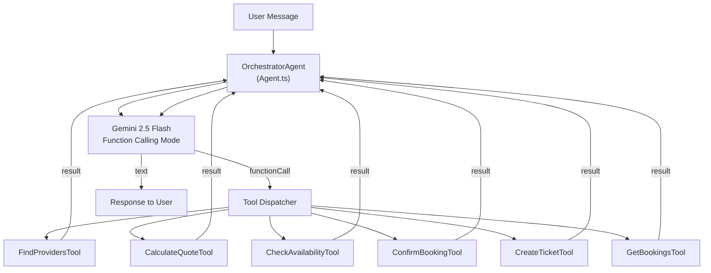

# Document 09 — Agent Flow Documentation
## DigitalKaam AI Service Platform

**Document Type**: AI/ML Technical Reference  
**Audience**: AI Engineers, Backend Developers, System Architects  
**Related Documents**: [08_Business_Workflows](08_Business_Workflows.md) | [01_System_Architecture](01_System_Architecture.md) | [04_API_Documentation](04_API_Documentation.md)

---

## 1. Overview

DigitalKaam uses the **ADK (Agent Development Kit)** conversational agent architecture. The `OrchestratorAgent` handles all service bookings through a multi-turn conversation with Gemini's native function-calling capability, dispatching to 6 specialist tools.

| Component | Entry Point | Architecture | Model |
|-----------|-------------|-------------|-------|
| **ADK Conversational Agent** | `POST /api/chat` | OrchestratorAgent + 6 tools | `gemini-2.5-flash` |
| **Summarizer** | Auto (every 8 turns) | Single-pass summarizer | `gemini-2.5-flash` |

All agents use `@google/genai` via the `Agent.run()` interface.

---

## 2. ADK Architecture — OrchestratorAgent

### Overview

The ADK (Agent Development Kit) provides a conversational multi-turn agent using Gemini's native function-calling capability.



---

### Agent Class (Agent.ts)

**Core Loop**:
```typescript
async run(message: string): Promise<string> {
  // Add to history
  this.history.push({ role: 'user', parts: [{text: message}] })

  while (true) {
    const response = await model.generateContent({
      contents: this.history,
      systemInstruction: this.systemInstruction,
      tools: this.tools
    })

    if (response has functionCalls) {
      for (const call of functionCalls) {
        const mergedArgs = { ...call.args, ...this.sessionMetadata }  // inject session context
        const result = await tool.execute(mergedArgs)
        // append function role result to history
      }
      // loop again
    } else {
      // text response — return it
      return response.text
    }
  }
}
```

**Key Design**: `sessionMetadata` (containing `sessionId` and `userId`) is merged into every tool call's arguments server-side. This prevents Gemini from forgetting to pass session context.

---

### Session Metadata Injection

```typescript
// In chat.routes.ts
agent.sessionMetadata = {
  sessionId: sessionId,
  userId: userId
}

// In Agent.ts
const mergedArgs = { ...call.args, ...this.sessionMetadata }
```

This ensures tools always receive `sessionId` and `userId` regardless of what Gemini decides to pass.

---

### OrchestratorAgent System Instructions

The OrchestratorAgent (`OrchestratorAgent.ts`) is initialized with a comprehensive system instruction covering:

1. **Language rules**: Respond in the exact same language as the user (English → English, Urdu → Urdu, Roman Urdu → Roman Urdu)
2. **5-step flow**: Gather info → Find provider → Quote and availability → Confirm → Book
3. **Booking state rules**:
   - Only one booking per session
   - Use `get_my_bookings` on session start to check for existing bookings
   - After confirmation, always show full receipt
4. **Anti-hallucination**: Never invent provider names, prices, or booking refs
5. **Booking facts injection** (runtime): Confirmed booking data appended to system instructions each turn

---

### Booking Facts Block

Every turn, the chat route injects confirmed booking data into the agent's system instructions:

```typescript
async function buildBookingFactsBlock(sessionId: string): Promise<string> {
  const { data: bookings } = await supabase
    .from('bookings')
    .select(`*, providers(name, service_type, phone)`)
    .eq('session_id', sessionId)
    .eq('status', 'confirmed')

  if (!bookings?.length) return ''
  
  return `\n\n[CONFIRMED BOOKINGS IN THIS SESSION]\n${JSON.stringify(bookings, null, 2)}`
}
```

This prevents Gemini from hallucinating booking details or re-attempting bookings when the user asks "what did I book?"

---

### Tool: FindProvidersTool

**Function name**: `find_available_providers`

**Input**:
```typescript
{ serviceType: string, location: string, requestedDate: string, sessionId: string, userId: string }
```

**DB Query**:
```sql
SELECT * FROM providers
WHERE service_type = serviceType
  AND status = 'active'
  AND area ILIKE '%location%'
ORDER BY rating DESC
LIMIT 5
```

**Output**: JSON array of provider objects (top 5 by rating).

---

### Tool: CalculateQuoteTool

**Function name**: `calculate_dynamic_pricing`

**Input**:
```typescript
{ serviceType: string, estimatedHours: number, urgency: string, sessionId: string, userId: string }
```

**Pricing Behavior**: Calls `processPricing()` with `loyaltyPoints: 0` — the chat tool applies standard pricing without loyalty adjustments.

**Output**: JSON quote object with breakdown.

---

### Tool: CheckAvailabilityTool

**Function name**: `check_time_slots`

**Input**:
```typescript
{ providerId: string, requestedDate: string, sessionId: string, userId: string }
```

**DB Query**:
```sql
SELECT * FROM availability
WHERE provider_id = providerId
  AND date = requestedDate
  AND is_booked = false
ORDER BY start_time ASC
```

**Output**: Available time slots array.

---

### Tool: ConfirmBookingTool

**Function name**: `confirm_service_booking`

**Double-Booking Guard**:
```typescript
// Check for existing confirmed booking in this session
const { data: existing } = await supabase.from('bookings')
  .select('*')
  .eq('session_id', sessionId)
  .eq('status', 'confirmed')

if (existing?.length > 0) {
  return { alreadyBooked: true, existingBookings: existing }
  // Returns WITHOUT creating a new booking
}
```

**DB Writes**:
1. `INSERT INTO bookings` (fetches real provider data from DB for receipt)
2. `UPDATE availability SET is_booked = true`

**Output**: Booking confirmation with full receipt.

---

### Tool: CreateTicketTool

**Function name**: `create_support_ticket`

**Purpose**: Open a dispute or support request from within the chat conversation.

**Input**: `{ bookingId, issueType, description, sessionId, userId }`

**DB Write**: `INSERT INTO disputes`

---

### Tool: GetBookingsTool

**Function name**: `get_my_bookings`

**Purpose**: Retrieve user's booking history within the current session.

**Input**: `{ sessionId, userId }`

**DB Query**:
```sql
SELECT bookings.*, providers.name, providers.service_type, providers.phone
FROM bookings
JOIN providers ON bookings.provider_id = providers.id
WHERE bookings.session_id = sessionId
   OR bookings.user_id = userId
ORDER BY created_at DESC
```

**Booking Scope**: Loads bookings by either `session_id` OR `user_id`, providing the agent with the user's complete booking history across all sessions.

---

## 3. SummarizerAgent

**Source**: `SummarizerAgent.ts`  
**Trigger**: Every 8 conversation turns (`SUMMARIZE_EVERY = 8`)  
**Model**: `gemini-2.5-flash`

**Purpose**: Compress conversation history to prevent context window overflow.

**Input**: Full conversation history array (all messages in session)

**System Instruction**: 
> "You are a conversation summarizer. Create a concise but comprehensive summary of this service booking conversation, preserving all important details about services requested, providers discussed, prices quoted, and any booking details."

**Output**: Single summary string → stored in `chat_sessions.summary`

**On Agent Rebuild** (cache miss): The summary is prepended to the rebuilt history as a `[CONVERSATION SUMMARY]` message block.

---

## 4. Agent Cache

**Location**: `chat.routes.ts`  
**Structure**: `agentCache = new Map<string, Agent>()`

| Key | Value |
|-----|-------|
| `sessionId` | `Agent` instance |

**Lifecycle**:
1. On first chat message for a session: `new OrchestratorAgent()` → stored in cache
2. On subsequent messages: retrieved from cache (preserves in-memory history)
3. On server restart: cache lost — agent is rebuilt from DB message history

**Rebuild from DB**:
```typescript
const { data: messages } = await supabase
  .from('chat_messages')
  .select('*')
  .eq('session_id', sessionId)
  .order('created_at', { ascending: true })
  .limit(WINDOW_SIZE)  // last 6 messages

// Prepend summary if exists
if (session.summary) {
  agentHistory.unshift({ role: 'assistant', text: `[CONVERSATION SUMMARY]: ${session.summary}` })
}
```

**Cache Design**: The in-memory cache is per-instance, providing fast access to active agent sessions within a server process.

---

## 5. Specialized ADK Agent Library

The following agent modules exist in `backend/src/adk/agents/`, each implementing a focused domain agent built on the base `Agent` class:

| File | Description |
|------|-------------|
| `BookingAgent.ts` | Standalone booking agent |
| `DiscoveryAgent.ts` | Provider discovery agent |
| `DisputeAgent.ts` | Dispute handling agent |
| `PricingAgent.ts` | Pricing calculation agent |
| `SchedulingAgent.ts` | Scheduling agent |

Each agent encapsulates domain-specific system instructions and model configuration, following the same `Agent` → `Memory` → `Tool` composition pattern as the `OrchestratorAgent`.

---

## 6. AI Trace Records

Every agent writes a trace to the `traces` table:

```typescript
await supabase.from('traces').insert({
  session_id: sessionId,
  agent: 'OrchestratorAgent',
  input: JSON.stringify(inputObject),
  output: JSON.stringify(outputObject),
  reasoning: 'Natural language explanation of the decision',
  confidence_score: 0.85   // 0.0–1.0
})
```

Full session traces are retrievable via `GET /api/traces?sessionId=xxx` for audit and debugging.

---

*See [08_Business_Workflows.md](08_Business_Workflows.md) for user-facing flow diagrams.*  
*See [12_Observability_Logging.md](12_Observability_Logging.md) for trace analysis.*
