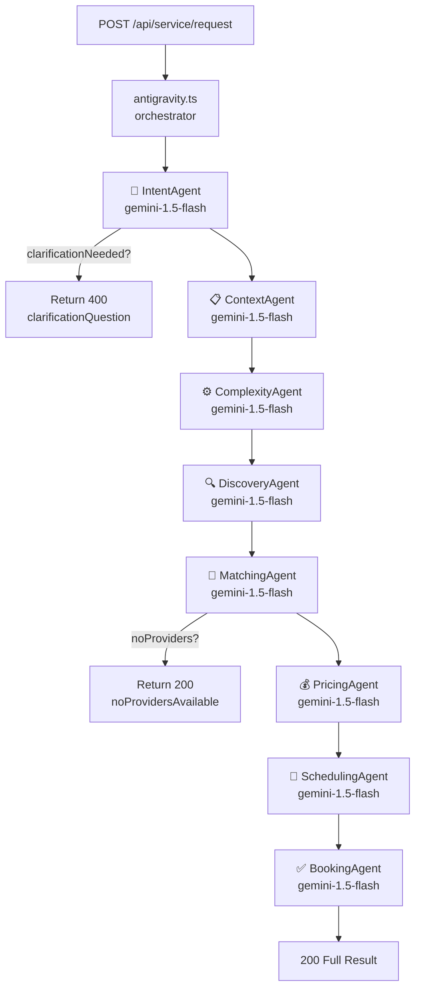
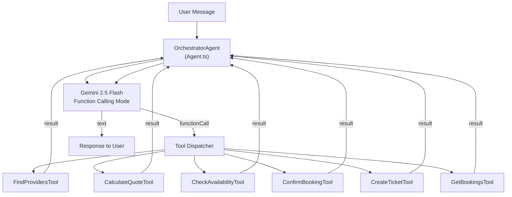

# Document 09 — Agent Flow Documentation
## DigitalKaam Antigravity AI Service Platform

**Document Type**: AI/ML Technical Reference  
**Audience**: AI Engineers, Backend Developers, System Architects  
**Related Documents**: [08_Business_Workflows](08_Business_Workflows.md) | [01_System_Architecture](01_System_Architecture.md) | [04_API_Documentation](04_API_Documentation.md)

---

## 1. Overview

DigitalKaam has two distinct AI subsystems:

| Subsystem | Entry Point | Architecture | Model |
|-----------|-------------|-------------|-------|
| **Antigravity Pipeline** | `POST /api/service/request` | 8 sequential deterministic agents | `gemini-1.5-flash` per agent |
| **ADK Conversational Agent** | `POST /api/chat` | Single orchestrator + 6 tools | `gemini-2.5-flash` |

Both use Google Gemini but via different SDK versions:
- Pipeline agents: `@google/generative-ai` (older) via `callGemini()`
- ADK agents: `@google/genai` (newer) via `Agent.run()`

---

## 2. Antigravity Pipeline — 8 Agents

### Architecture Overview



Each agent:
1. Receives a structured input object
2. Calls `callGemini(prompt)` to get AI response
3. Parses the JSON response
4. Writes a trace to the `traces` DB table
5. Returns a typed output to the orchestrator

---

### Agent 1: Intent Agent

**Source**: `intentController.ts`  
**Model**: `gemini-1.5-flash`

**Purpose**: Extract structured service intent from natural language user input.

**Input**:
```typescript
{
  userInput: string
}
```

**Output** (`IntentOutput`):
```typescript
{
  service: string,              // "AC Technician"
  category: string,             // "hvac"
  specificProblem: string,      // "AC not cooling"
  severity: 'low' | 'medium' | 'high',
  isEmergency: boolean,
  location: string,             // "Gulshan"
  preferredDate: string,        // ISO date or null
  preferredTime: string,        // "10:00" or null
  budgetSensitivity: 'low' | 'medium' | 'high',
  languageDetected: string,     // "english" | "urdu" | "roman_urdu"
  clarificationNeeded: boolean,
  clarificationQuestion: string | null
}
```

**Fallback**: On parse error, returns `{ service: "General", severity: "medium", clarificationNeeded: false, ... }`.

**Trace written**: Yes — agent=`IntentAgent`, confidence based on clarificationNeeded.

---

### Agent 2: Context Agent

**Source**: `contextController.ts`  
**Model**: `gemini-1.5-flash`

**Purpose**: Enrich the request with user history and preferences.

**Input**: `{ userId, intent }`

**DB Queries**:
- `user_profiles` WHERE `id = userId` → loyalty_points, booking_count, preferred_providers, blacklisted_providers
- `bookings` WHERE `user_id = userId` ORDER BY `created_at DESC LIMIT 5` → recent service history

**Output** (`ContextOutput`):
```typescript
{
  userId: string,
  isReturningUser: boolean,       // booking_count > 0
  bookingCount: number,
  loyaltyPoints: number,
  recentServices: string[],       // last 5 service types
  preferredProviders: string[],   // provider IDs
  blacklistedProviders: string[], // provider IDs
  userPreferences: { ... }        // preferred_area, preferred_time_of_day
}
```

---

### Agent 3: Complexity Agent

**Source**: `complexityController.ts`  
**Model**: `gemini-1.5-flash`

**Purpose**: Classify job complexity and estimate duration. Feeds into pricing.

**Input**: `{ intent, context }`

**Output** (`ComplexityOutput`):
```typescript
{
  complexity: 'basic' | 'intermediate' | 'complex',
  estimatedDurationHours: number,   // e.g., 1.5
  requiredSkills: string[],
  toolsRequired: string[],
  riskLevel: 'low' | 'medium' | 'high',
  requiresFollowUp: boolean,
  specialConsiderations: string
}
```

**AI Reasoning**: Prompt includes job description, problem type, and asks Gemini to assess complexity. Duration estimate drives `laborFee` in pricing.

---

### Agent 4: Discovery Agent

**Source**: `discoveryController.ts`  
**Model**: `gemini-1.5-flash`

**Purpose**: Find candidate providers in the user's area matching the service type.

**Input**: `{ intent, context }`

**DB Query**:
```sql
SELECT * FROM providers 
WHERE service_type = :serviceType 
  AND status = 'active'
  AND area = :location   -- text match
ORDER BY rating DESC
LIMIT 20
```

**Coordinate Lookup**: Maps area names to lat/lng using hardcoded `AREA_COORDS` object (11 Karachi areas). Only providers in this lookup have distance-based matching.

**Output** (`DiscoveryOutput`):
```typescript
{
  providers: Provider[],       // up to 20 candidates
  totalFound: number,
  searchArea: string,
  searchRadius: number         // km (informational)
}
```

---

### Agent 5: Matching Agent

**Source**: `matchingController.ts`  
**Model**: `gemini-1.5-flash`

**Purpose**: Score and rank all candidate providers using 10-factor weighted algorithm.

**Input**: `{ intent, context, complexity, discovery }`

**Scoring Formula** (all scores normalized 0–1):
```
matchScore = 
    distScore      × 0.10
  + availScore     × 0.20  ← highest weight
  + ratingScore    × 0.10
  + recencyScore   × 0.10
  + reliabilityScore × 0.15
  + specializationScore × 0.10
  + priceScore     × 0.10
  + capacityScore  × 0.05
  + cancelScore    × 0.05
  + prefScore      × 0.05
```

**Score Details**:

| Score | How Calculated |
|-------|---------------|
| `distScore` | Haversine distance to AREA_COORDS of user's area; 0 if no coordinates |
| `availScore` | 1.0 if provider has unbooked slot for requested date, 0.0 otherwise |
| `ratingScore` | Normalized: `(rating - minRating) / (maxRating - minRating)` |
| `recencyScore` | `providers.review_recency_score` (decays from 0.95) |
| `reliabilityScore` | `providers.reliability_score` |
| `specializationScore` | 1.0 if skills array includes problem keywords, else 0.5 |
| `priceScore` | Inverted hourly_rate normalization (lower price = higher score) |
| `capacityScore` | Based on upcoming booking count |
| `cancelScore` | Based on `reputation.complaints / total_interactions` (inverted) |
| `prefScore` | 1.0 if in `preferred_providers`, 0.0 if blacklisted, 0.5 otherwise |

**Output** (`MatchingOutput`):
```typescript
{
  topProvider: ScoredProvider,   // highest matchScore
  rankedProviders: ScoredProvider[],  // top 5
  matchingCriteria: string[],
  noProvidersAvailable: boolean
}
```

---

### Agent 6: Pricing Agent

**Source**: `pricingController.ts`  
**Model**: `gemini-1.5-flash`

**Purpose**: Calculate dynamic price quote for the top provider.

Detailed formula: see [06_Pricing_Engine.md](06_Pricing_Engine.md)

**Output** (`PricingOutput`):
```typescript
{
  total: number,
  currency: "PKR",
  breakdown: {
    visitFee: number,
    laborFee: number,
    urgencySurcharge: number,
    loyaltyDiscount: number,
    platformFee: number
  },
  isBudgetFriendly: boolean,
  alternativeBudgetNote: string | null,
  partsDisclaimer: string
}
```

---

### Agent 7: Scheduling Agent

**Source**: `schedulingController.ts`  
**Model**: `gemini-1.5-flash`

**Purpose**: Find the best available time slot for the top provider on the requested date.

**Input**: `{ intent, matching, pricing }`

**DB Query**:
```sql
SELECT * FROM availability
WHERE provider_id = :providerId
  AND date = :requestedDate
  AND is_booked = false
ORDER BY start_time ASC
```

**Output** (`SchedulingOutput`):
```typescript
{
  slot: string,               // "2026-05-20 10:00"
  availabilityId: string,     // used by BookingAgent to mark as booked
  conflictDetected: boolean,
  alternativeSlots: string[]  // up to 3 alternatives
}
```

---

### Agent 8: Booking Agent

**Source**: `bookingController.ts`  
**Model**: `gemini-1.5-flash`

**Purpose**: Create the booking record, mark availability as booked, generate receipt.

**Input**: `{ intent, context, matching, pricing, scheduling }`

**DB Writes** (not atomic — no transaction):
1. `INSERT INTO bookings { user_id, provider_id, service_type, status: 'confirmed', price, price_breakdown, booking_ref, scheduled_time, session_id }`
2. `UPDATE availability SET is_booked = true WHERE id = availabilityId`

**Booking Ref Generation**:
```typescript
const SAFE_CHARS = 'ABCDEFGHJKLMNPQRSTUVWXYZ23456789'
const suffix = Array.from({length: 4}, () => 
  SAFE_CHARS[Math.floor(Math.random() * SAFE_CHARS.length)]
).join('')
const bookingRef = `DK-${dateStr}-${suffix}`
```

**Post-Booking** (fire-and-forget):
```typescript
;(async () => {
  await supabase.from('user_profiles')
    .update({ booking_count: supabase.rpc('increment') })
    .eq('id', userId)
})()
// Does not await — non-blocking, failure not detected
```

**Output**:
```typescript
{
  bookingId: string,
  bookingRef: string,          // "DK-260520-K7M2"
  status: 'confirmed',
  receipt: { ... }             // full receipt with breakdown
}
```

---

## 3. ADK Architecture — OrchestratorAgent

### Overview

The ADK (Agent Development Kit) provides a conversational multi-turn agent using Gemini's native function-calling capability.



---

### Agent Class (Agent.ts)

**Core Loop**:
```typescript
async run(message: string): Promise<string> {
  // Add to history
  this.history.push({ role: 'user', parts: [{text: message}] })

  while (true) {
    const response = await model.generateContent({
      contents: this.history,
      systemInstruction: this.systemInstruction,
      tools: this.tools
    })

    if (response has functionCalls) {
      for (const call of functionCalls) {
        const mergedArgs = { ...call.args, ...this.sessionMetadata }  // inject session context
        const result = await tool.execute(mergedArgs)
        // append function role result to history
      }
      // loop again
    } else {
      // text response — return it
      return response.text
    }
  }
}
```

**Key Design**: `sessionMetadata` (containing `sessionId` and `userId`) is merged into every tool call's arguments server-side. This prevents Gemini from forgetting to pass session context.

---

### Session Metadata Injection

```typescript
// In chat.routes.ts
agent.sessionMetadata = {
  sessionId: sessionId,
  userId: userId
}

// In Agent.ts
const mergedArgs = { ...call.args, ...this.sessionMetadata }
```

This ensures tools always receive `sessionId` and `userId` regardless of what Gemini decides to pass.

---

### OrchestratorAgent System Instructions

The OrchestratorAgent (`OrchestratorAgent.ts`) is initialized with a comprehensive system instruction covering:

1. **Language rules**: Respond in the exact same language as the user (English → English, Urdu → Urdu, Roman Urdu → Roman Urdu)
2. **5-step flow**: Gather info → Find provider → Quote and availability → Confirm → Book
3. **Booking state rules**:
   - Only one booking per session
   - Use `get_my_bookings` on session start to check for existing bookings
   - After confirmation, always show full receipt
4. **Anti-hallucination**: Never invent provider names, prices, or booking refs
5. **Booking facts injection** (runtime): Confirmed booking data appended to system instructions each turn

---

### Booking Facts Block

Every turn, the chat route injects confirmed booking data into the agent's system instructions:

```typescript
async function buildBookingFactsBlock(sessionId: string): Promise<string> {
  const { data: bookings } = await supabase
    .from('bookings')
    .select(`*, providers(name, service_type, phone)`)
    .eq('session_id', sessionId)
    .eq('status', 'confirmed')

  if (!bookings?.length) return ''
  
  return `\n\n[CONFIRMED BOOKINGS IN THIS SESSION]\n${JSON.stringify(bookings, null, 2)}`
}
```

This prevents Gemini from hallucinating booking details or re-attempting bookings when the user asks "what did I book?"

---

### Tool: FindProvidersTool

**Function name**: `find_available_providers`

**Input**:
```typescript
{ serviceType: string, location: string, requestedDate: string, sessionId: string, userId: string }
```

**DB Query**:
```sql
SELECT * FROM providers
WHERE service_type = serviceType
  AND status = 'active'
  AND area ILIKE '%location%'
ORDER BY rating DESC
LIMIT 5
```

**Output**: JSON array of provider objects (top 5 by rating).

---

### Tool: CalculateQuoteTool

**Function name**: `calculate_dynamic_pricing`

**Input**:
```typescript
{ serviceType: string, estimatedHours: number, urgency: string, sessionId: string, userId: string }
```

**Pricing Behavior**: Calls `processPricing()` with `loyaltyPoints: 0` — the chat tool applies standard pricing without loyalty adjustments.

**Output**: JSON quote object with breakdown.

---

### Tool: CheckAvailabilityTool

**Function name**: `check_time_slots`

**Input**:
```typescript
{ providerId: string, requestedDate: string, sessionId: string, userId: string }
```

**DB Query**:
```sql
SELECT * FROM availability
WHERE provider_id = providerId
  AND date = requestedDate
  AND is_booked = false
ORDER BY start_time ASC
```

**Output**: Available time slots array.

---

### Tool: ConfirmBookingTool

**Function name**: `confirm_service_booking`

**Double-Booking Guard**:
```typescript
// Check for existing confirmed booking in this session
const { data: existing } = await supabase.from('bookings')
  .select('*')
  .eq('session_id', sessionId)
  .eq('status', 'confirmed')

if (existing?.length > 0) {
  return { alreadyBooked: true, existingBookings: existing }
  // Returns WITHOUT creating a new booking
}
```

**DB Writes**:
1. `INSERT INTO bookings` (fetches real provider data from DB for receipt)
2. `UPDATE availability SET is_booked = true`

**Output**: Booking confirmation with full receipt.

---

### Tool: CreateTicketTool

**Function name**: `create_support_ticket`

**Purpose**: Open a dispute or support request from within the chat conversation.

**Input**: `{ bookingId, issueType, description, sessionId, userId }`

**DB Write**: `INSERT INTO disputes`

---

### Tool: GetBookingsTool

**Function name**: `get_my_bookings`

**Purpose**: Retrieve user's booking history within the current session.

**Input**: `{ sessionId, userId }`

**DB Query**:
```sql
SELECT bookings.*, providers.name, providers.service_type, providers.phone
FROM bookings
JOIN providers ON bookings.provider_id = providers.id
WHERE bookings.session_id = sessionId
   OR bookings.user_id = userId
ORDER BY created_at DESC
```

**Booking Scope**: Loads bookings by either `session_id` OR `user_id`, providing the agent with the user's complete booking history across all sessions.

---

## 4. SummarizerAgent

**Source**: `SummarizerAgent.ts`  
**Trigger**: Every 8 conversation turns (`SUMMARIZE_EVERY = 8`)  
**Model**: `gemini-2.5-flash`

**Purpose**: Compress conversation history to prevent context window overflow.

**Input**: Full conversation history array (all messages in session)

**System Instruction**: 
> "You are a conversation summarizer. Create a concise but comprehensive summary of this service booking conversation, preserving all important details about services requested, providers discussed, prices quoted, and any booking details."

**Output**: Single summary string → stored in `chat_sessions.summary`

**On Agent Rebuild** (cache miss): The summary is prepended to the rebuilt history as a `[CONVERSATION SUMMARY]` message block.

---

## 5. Agent Cache

**Location**: `chat.routes.ts`  
**Structure**: `agentCache = new Map<string, Agent>()`

| Key | Value |
|-----|-------|
| `sessionId` | `Agent` instance |

**Lifecycle**:
1. On first chat message for a session: `new OrchestratorAgent()` → stored in cache
2. On subsequent messages: retrieved from cache (preserves in-memory history)
3. On server restart: cache lost — agent is rebuilt from DB message history

**Rebuild from DB**:
```typescript
const { data: messages } = await supabase
  .from('chat_messages')
  .select('*')
  .eq('session_id', sessionId)
  .order('created_at', { ascending: true })
  .limit(WINDOW_SIZE)  // last 6 messages

// Prepend summary if exists
if (session.summary) {
  agentHistory.unshift({ role: 'assistant', text: `[CONVERSATION SUMMARY]: ${session.summary}` })
}
```

**Cache Design**: The in-memory cache is per-instance, providing fast access to active agent sessions within a server process.

---

## 6. Specialized ADK Agent Library

The following agent modules exist in `backend/src/adk/agents/`, each implementing a focused domain agent built on the base `Agent` class:

| File | Description |
|------|-------------|
| `BookingAgent.ts` | Standalone booking agent |
| `DiscoveryAgent.ts` | Provider discovery agent |
| `DisputeAgent.ts` | Dispute handling agent |
| `PricingAgent.ts` | Pricing calculation agent |
| `SchedulingAgent.ts` | Scheduling agent |

Each agent encapsulates domain-specific system instructions and model configuration, following the same `Agent` → `Memory` → `Tool` composition pattern as the `OrchestratorAgent`.

---

## 7. AI Trace Records

Every agent writes a trace to the `traces` table:

```typescript
await supabase.from('traces').insert({
  session_id: sessionId,
  agent: 'IntentAgent',    // or MatchingAgent, PricingAgent, etc.
  input: JSON.stringify(inputObject),
  output: JSON.stringify(outputObject),
  reasoning: 'Natural language explanation of the decision',
  confidence_score: 0.85   // 0.0–1.0
})
```

Full session traces are retrievable via `GET /api/traces?sessionId=xxx` for audit and debugging.

---

*See [08_Business_Workflows.md](08_Business_Workflows.md) for user-facing flow diagrams.*  
*See [12_Observability_Logging.md](12_Observability_Logging.md) for trace analysis.*
