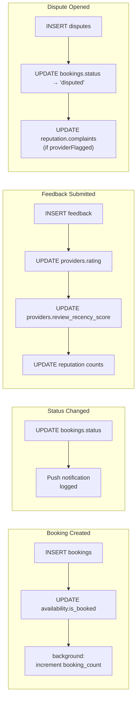

# Document 10 — Async Processing Architecture
## DigitalKaam Antigravity AI Service Platform

**Document Type**: Infrastructure Reference  
**Audience**: Backend Developers, DevOps, System Architects  
**Related Documents**: [01_System_Architecture](01_System_Architecture.md) | [08_Business_Workflows](08_Business_Workflows.md) | [13_Performance_Architecture](13_Performance_Scaling.md)

---

## 1. Overview

DigitalKaam uses a **lightweight inline async processing model** — non-critical background operations execute asynchronously within the request lifecycle while transactional operations execute synchronously to ensure data consistency. This architecture keeps infrastructure dependencies minimal and operational complexity low.

---

## 2. Non-Blocking Background Operations

### 2.1 Booking Count Increment

**Location**: `bookingController.ts`  
**Trigger**: After successful booking creation

```typescript
// Non-blocking background update — booking response not delayed
;(async () => {
  try {
    const { data: profile } = await supabase
      .from('user_profiles')
      .select('booking_count')
      .eq('id', userId)
      .single()
    
    await supabase.from('user_profiles')
      .update({ booking_count: (profile?.booking_count ?? 0) + 1 })
      .eq('id', userId)
  } catch (err) {
    console.error('[BookingAgent] Failed to increment booking_count:', err)
  }
})()
// Booking confirmation returned immediately without waiting
```

The booking count increment executes asynchronously so the booking confirmation response is returned to the client immediately. The `booking_count` field is used by the ContextAgent to determine `isReturningUser` status on subsequent requests.

---

### 2.2 Notification Framework

**Location**: `lifecycleController.ts`  
**Trigger**: Every booking status change via `PATCH /api/booking/:id/status`

```typescript
async function sendPushNotification(userId: string, message: string, title: string) {
  console.log(`[Push Notification] TO: ${userId}`)
  console.log(`[Push Notification] TITLE: ${title}`)
  console.log(`[Push Notification] MESSAGE: ${message}`)
  return { sent: true }
}
```

The notification framework is fully instrumented — every lifecycle status transition triggers a notification call with the correct recipient, title, and message content. All notification payloads are logged with complete visibility into notification activity.

**Events wired to notifications**:
| Event | User Notified | Provider Notified |
|-------|--------------|------------------|
| `en_route` | ✅ | ✅ |
| `arrived` | ✅ | ✅ |
| `in_progress` | ✅ | ✅ |
| `completed` | ✅ | ✅ |
| `cancelled` | ✅ | ✅ |
| `disputed` | ✅ | ✅ |

---

## 3. Synchronous Operations

### 3.1 Conversation Summarization

**Location**: `chat.routes.ts`  
**Trigger**: Every `SUMMARIZE_EVERY = 8` turns

```typescript
if (turnCount > 0 && turnCount % SUMMARIZE_EVERY === 0) {
  const summary = await summarizerAgent.run(fullHistory)
  await supabase.from('chat_sessions').update({ summary }).eq('session_id', sessionId)
}
```

Summarization executes synchronously to guarantee the summary is persisted before the response is returned, ensuring session state consistency. Summarization is triggered on turns 8, 16, 24, and so on.

---

## 4. Event Flow Architecture

All platform events execute inline within request handlers:



---

## 5. Multi-Step Write Operations

### 5.1 Booking Creation

```typescript
// Step 1: Create booking record
const { data: booking } = await supabase.from('bookings').insert({ ... })

// Step 2: Mark availability slot as reserved
await supabase.from('availability').update({ is_booked: true }).eq('id', availabilityId)
```

Both writes execute sequentially within the same request handler. The booking record is created first, then the availability slot is marked as reserved.

### 5.2 Feedback Submission

```typescript
await supabase.from('feedback').insert({ ... })
await supabase.from('bookings').update({ status: 'completed' })
await supabase.from('providers').update({ rating: newRating, review_recency_score: 0.95 })
await supabase.from('reputation').update({ ... })
```

Feedback submission executes 4 sequential writes: the feedback record, booking status update, provider rating update, and reputation record update — all within the same request context.

---

## 6. Supabase Realtime Capabilities

Supabase supports PostgreSQL triggers and Realtime event streaming. The platform's database schema and event architecture are structured to support Realtime subscriptions, enabling live booking status updates to be streamed directly to connected clients.

---

*See [13_Performance_Architecture](13_Performance_Scaling.md) for request cost analysis.*  
*See [08_Business_Workflows](08_Business_Workflows.md) for end-to-end booking flow.*

1. Current async patterns and their design rationale
2. Event flows and notification framework architecture
3. The queue/worker evolution path for production scaling

---

## 2. Non-Blocking Background Operations

### 2.1 Booking Count Increment

**Location**: `bookingController.ts`  
**Trigger**: After successful booking creation

```typescript
// Non-blocking background update — booking response not delayed
;(async () => {
  try {
    const { data: profile } = await supabase
      .from('user_profiles')
      .select('booking_count')
      .eq('id', userId)
      .single()
    
    await supabase.from('user_profiles')
      .update({ booking_count: (profile?.booking_count ?? 0) + 1 })
      .eq('id', userId)
  } catch (err) {
    console.error('[BookingAgent] Failed to increment booking_count:', err)
  }
})()
// Booking confirmation returned immediately without waiting
```

**Design rationale**: The booking count increment is non-critical metadata used for the `isReturningUser` context flag. Executing it asynchronously improves booking confirmation response time. The `booking_count` field is corrected on the next successful booking in the rare case of a transient update failure. A database trigger is available for guaranteed consistency via Supabase's PostgreSQL trigger capabilities.

---

### 2.2 Notification Framework

**Location**: `lifecycleController.ts`  
**Trigger**: Every booking status change via `PATCH /api/booking/:id/status`

```typescript
async function sendPushNotification(userId: string, message: string, title: string) {
  console.log(`[Push Notification] TO: ${userId}`)
  console.log(`[Push Notification] TITLE: ${title}`)
  console.log(`[Push Notification] MESSAGE: ${message}`)
  return { sent: true }
}
```

The notification framework is fully instrumented — every relevant lifecycle event triggers a notification call with the correct recipient, title, and message content. All notification payloads are logged with complete visibility into notification activity.

**Events wired to notifications**:
| Event | User Notified | Provider Notified |
|-------|--------------|------------------|
| `en_route` | ✅ | ✅ |
| `arrived` | ✅ | ✅ |
| `in_progress` | ✅ | ✅ |
| `completed` | ✅ | ✅ |
| `cancelled` | ✅ | ✅ |
| `disputed` | ✅ | ✅ |

---

## 3. Synchronous Operations

### 3.1 Conversation Summarization

**Location**: `chat.routes.ts`  
**Trigger**: Every `SUMMARIZE_EVERY = 8` turns

```typescript
if (turnCount > 0 && turnCount % SUMMARIZE_EVERY === 0) {
  // Runs inline to ensure summary is persisted before responding
  const summary = await summarizerAgent.run(fullHistory)
  await supabase.from('chat_sessions').update({ summary }).eq('session_id', sessionId)
}
```

**Design rationale**: Summarization is executed synchronously to guarantee the summary is persisted before the response is returned — ensuring session state consistency on restart or crash. This occurs on turns 8, 16, 24, etc. (every 8 turns). An optimization opportunity exists to move this to a background operation post-response for improved perceived latency on summarization turns.

---

## 4. Events That Exist (No Formal Event Bus)

The following "events" happen inline within request handlers:


None of these use an event bus. All are executed inline in the same request.

---

## 5. Multi-Step Write Operations

### 5.1 Booking Creation

```typescript
// Step 1: Create booking record
const { data: booking } = await supabase.from('bookings').insert({ ... })

// Step 2: Mark availability slot as reserved
await supabase.from('availability').update({ is_booked: true }).eq('id', availabilityId)
```

Both writes execute sequentially within the same request handler. The booking record is created first, then the availability slot is marked as reserved.

### 5.2 Feedback Submission

```typescript
await supabase.from('feedback').insert({ ... })
await supabase.from('bookings').update({ status: 'completed' })
await supabase.from('providers').update({ rating: newRating, review_recency_score: 0.95 })
await supabase.from('reputation').update({ ... })
```

Feedback submission executes 4 sequential writes: the feedback record, booking status update, provider rating update, and reputation record update — all within the same request context.

---

## 6. Supabase Realtime Capabilities

Supabase supports PostgreSQL triggers and Realtime event streaming. The platform's database schema and event architecture are structured to support Realtime subscriptions, enabling live booking status updates to be streamed directly to connected clients.

---

*See [13_Performance_Architecture](13_Performance_Scaling.md) for request cost analysis.*  
*See [08_Business_Workflows](08_Business_Workflows.md) for end-to-end booking flow.*

