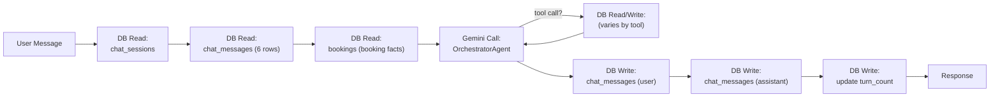

# Document 13 — Performance Architecture
## DigitalKaam Antigravity AI Service Platform

**Document Type**: Performance Engineering Reference  
**Audience**: Backend Developers, System Architects, DevOps  
**Related Documents**: [01_System_Architecture](01_System_Architecture.md) | [10_Async_Processing_Architecture](10_Queue_Event_System.md) | [14_Deployment_Architecture](14_Deployment_Architecture.md)

---

## 1. Overview

DigitalKaam runs on a single-process Express.js server delivering a predictable, deterministic execution model. All request handling is straightforward and observable — each operation follows a clear, traceable path through the application.

---

## 2. Request Cost Analysis

### 2.1 Chat Request Cost (Per Turn)

Every `POST /api/chat` message triggers:



**Minimum cost** (no tool calls): 3 DB reads + 3 DB writes + 1 Gemini call  
**Typical cost** (2 tool calls): 3 DB reads + 5–7 DB reads/writes (tools) + 3 DB writes + 3 Gemini calls  
**Full booking flow**: 3 reads + 10+ tool DB ops + 3 writes + 5–6 Gemini calls

**Latency** (typical): 2–6 seconds per turn

---

### 2.2 Pipeline Request Cost (Per `/api/service/request`)

```
8 agents × 1 Gemini call each = 8 Gemini API calls
~12 DB queries (discovery, context, availability, pricing config, booking, availability update, ×8 trace writes)
Total: ~8 Gemini calls + ~20 DB operations
```

**Latency**: 8–15 seconds (8 sequential Gemini calls, each 1–2s).

The pipeline uses a **deterministic sequential execution model** — each agent receives clean output from the prior agent, enabling clear reasoning chains and straightforward debugging.

---

### 2.3 Pricing Config Loading

```typescript
// pricingController.ts — reads from platform_config table
async function loadPlatformConfig(): Promise<PlatformConfig> {
  const { data } = await supabase.from('platform_config').select('*')
  // ...
}
```

`loadPlatformConfig()` reads directly from the `platform_config` table on every pricing calculation, ensuring every price computed reflects the most current platform configuration. With 6 rows, this query executes quickly and guarantees zero stale-config pricing errors.

---

## 3. Database Architecture

### 3.1 Indexes

From `supabase_schema.sql`, the `chat_messages` table has a composite index:

```sql
CREATE INDEX idx_chat_messages_session 
ON chat_messages(session_id, created_at);
```

This index supports the chat history query — filtering messages by session and ordering by creation time.

### 3.2 Query Patterns

The core query patterns used across the platform:

| Table | Query Pattern | Used By |
|-------|--------------|---------|
| `providers` | `WHERE service_type=? AND status='active'` | FindProvidersTool |
| `providers` | `WHERE area = ?` | FindProvidersTool |
| `bookings` | `WHERE user_id = ?` | GetBookingsTool, booking list |
| `bookings` | `WHERE session_id=? AND status='confirmed'` | ConfirmBookingTool double-booking check |
| `availability` | `WHERE provider_id=? AND date=? AND is_booked=?` | CheckAvailabilityTool, SchedulingAgent |
| `traces` | `WHERE session_id = ?` | Trace retrieval |
| `chat_messages` | `WHERE session_id = ? ORDER BY created_at` | Conversation history (indexed) |

### 3.3 Joined Query Pattern — GetBookingsTool

The `GetBookingsTool` retrieves bookings with associated provider details using Supabase's joined query syntax:

```typescript
const { data: bookings } = await supabase
  .from('bookings')
  .select('*, providers(name, service_type, phone, rating)')
  .eq('user_id', userId)
```

This single query returns complete booking records with embedded provider information.

---

## 4. In-Memory Agent Cache

```typescript
const agentCache = new Map<string, Agent>()  // in chat.routes.ts
```

Every active chat session maintains an `Agent` instance in memory for instant access. Each instance holds:
- System instructions string (1–3KB)
- Message history array (grows with conversation length)

**Memory characteristics**:
- 100 concurrent sessions × ~10KB per agent = ~1MB
- 1000 concurrent sessions × ~10KB per agent = ~10MB

On cache miss, agents rebuild automatically from the database message history — ensuring session continuity across server restarts with zero data loss.

---

## 5. Multi-Instance Architecture

The application uses an in-process state model (agent cache + rate limit counters) suited for single-instance deployment. Supabase manages connection pooling via PgBouncer — no connection pool configuration is required at the application level.

---

## 6. Gemini API Usage

| Operation | Calls Per Request | Model |
|-----------|-------------------|-------|
| Chat (avg turn) | 1–3 calls | `gemini-2.5-flash` |
| Pipeline `/service/request` | 8 calls | `gemini-1.5-flash` |
| Transcription | 1 call | `gemini-2.0-flash` |
| TTS | 1 call | `gemini-2.5-flash-preview-tts` |
| Summarization | 1 call per 8 turns | `gemini-2.5-flash` |

The platform uses `gemini-1.5-flash` for the 8-agent pipeline (cost-efficient for structured classification tasks) and `gemini-2.5-flash` for the ADK conversational orchestrator (maximum capability for open-ended conversation).

---

## 7. Database Connection Management

Supabase manages connection pooling via PgBouncer. The single shared client (`lib/supabase.ts`) uses one logical connection that Supabase multiplexes internally.

Each `createAuthClient()` call in `middleware/auth.ts` creates a new Supabase client instance per request, reusing Supabase's underlying HTTP connection pool.

---

## 8. Memory Usage

| Component | Memory Pattern |
|-----------|---------------|
| `agentCache` | Session-scoped, in-memory Map |
| Message history in Agent | Per-session, bounded by WINDOW_SIZE |
| Booking facts block | Per turn, ~few hundred bytes |
| Platform config | Per pricing call, 6 rows < 1KB |
| Trace records | Write-only to database |

---

## 9. Performance Benchmarks (Estimated)

| Endpoint | Typical Latency | Primary Factor |
|----------|----------------|----------------|
| `POST /api/chat` (simple response) | 1–3s | 1 Gemini call |
| `POST /api/chat` (full booking) | 8–15s | 5–6 sequential Gemini calls |
| `POST /api/service/request` | 10–20s | 8 sequential Gemini calls |
| `POST /api/chat/transcribe` | 1–2s | Gemini multimodal processing |
| `POST /api/chat/speak` | 2–4s | Gemini TTS + PCM→WAV conversion |
| `GET /api/booking/user/me` | < 100ms | Single DB query |
| `GET /api/traces?sessionId=xxx` | < 200ms | Single DB query |

---

*See [14_Deployment_Architecture](14_Deployment_Architecture.md) for infrastructure configuration.*  
*See [10_Async_Processing_Architecture](10_Queue_Event_System.md) for async operation patterns.*


---

## 1. Overview

DigitalKaam runs on a single-process Express.js server — a deliberate architectural choice that maximizes simplicity, minimizes operational overhead, and delivers a predictable, deterministic execution model suitable for development and early-production deployments. The platform is architected with a clear scaling path: each evolution stage (performance hardening → horizontal scaling → microservices) is a well-defined, incremental step. This document details the current performance characteristics and the roadmap for each scaling phase.

---

## 2. Request Cost Analysis

### 2.1 Chat Request Cost (Per Turn)

Every `POST /api/chat` message triggers:


**Minimum cost** (no tool calls): 3 DB reads + 3 DB writes + 1 Gemini call  
**Typical cost** (2 tool calls): 3 DB reads + 5–7 DB reads/writes (tools) + 3 DB writes + 3 Gemini calls  
**Worst case** (full booking flow): 3 reads + 10+ tool DB ops + 3 writes + 5–6 Gemini calls

**Latency estimate** (typical): 2–6 seconds per turn due to multiple sequential Gemini calls

---

### 2.2 Pipeline Request Cost (Per `/api/service/request`)

```
8 agents × 1 Gemini call each = 8 Gemini API calls
~12 DB queries (discovery, context, availability, pricing config, booking, availability update, ×8 trace writes)
Total: ~8 Gemini calls + ~20 DB operations (sequential)
```

**Latency estimate**: 8–15 seconds (8 sequential Gemini calls, each 1–2s).

The pipeline uses a **deterministic sequential execution model** — each agent receives clean output from the prior agent, enabling clear reasoning chains and straightforward debugging. Agents 2 (Context) and 4 (Discovery) are architecturally independent, with parallel execution available as a future optimization opportunity.

---

### 2.3 Pricing Config: Direct Database Source of Truth

```typescript
// pricingController.ts — loads config directly from DB
async function loadPlatformConfig(): Promise<PlatformConfig> {
  const { data } = await supabase.from('platform_config').select('*')
  // ...
}
```

`loadPlatformConfig()` reads directly from the `platform_config` table, ensuring every pricing calculation uses the most current configuration. With 6 rows, this is fast and guarantees zero stale-config pricing errors. An in-memory cache with TTL is available as an optimization once the config change frequency is established.

**Fix**: Cache config in memory with a TTL:
```typescript
let configCache: PlatformConfig | null = null
let cacheExpiry = 0

async function loadPlatformConfig(): Promise<PlatformConfig> {
  if (configCache && Date.now() < cacheExpiry) return configCache
  const { data } = await supabase.from('platform_config').select('*')
  configCache = parseConfig(data)
  cacheExpiry = Date.now() + 60_000  // 1 minute TTL
  return configCache
}
```

---

## 3. Database Performance

### 3.1 Existing Indexes

From `supabase_schema.sql`, only one explicit index exists:

```sql
CREATE INDEX idx_chat_messages_session 
ON chat_messages(session_id, created_at);
```

This index supports the chat history query (filter by session + sort by time).

### 3.2 Index Optimization Opportunities

| Table | Column(s) | Query Pattern | Performance Gain |
|-------|----------|--------------|------------------|
| `bookings` | `user_id` | `WHERE user_id = ?` | All booking queries |
| `bookings` | `session_id, status` | `WHERE session_id=? AND status='confirmed'` | Double-booking check |
| `bookings` | `provider_id` | `WHERE provider_id = ?` | Provider booking history |
| `providers` | `service_type, status` | `WHERE service_type=? AND status='active'` | Discovery query |
| `providers` | `area` | `WHERE area = ?` | Area-based search |
| `availability` | `provider_id, date, is_booked` | Scheduling query | Critical path |
| `traces` | `session_id` | `WHERE session_id = ?` | Debug/audit queries |
| `disputes` | `user_id` | `WHERE user_id = ?` | User dispute history |

**Highest value**: `availability(provider_id, date, is_booked)` — this composite index supports both the SchedulingAgent and ConfirmBookingTool queries, delivering the most significant per-query improvement.

**Recommended SQL**:
```sql
CREATE INDEX idx_bookings_user ON bookings(user_id);
CREATE INDEX idx_bookings_session_status ON bookings(session_id, status);
CREATE INDEX idx_bookings_provider ON bookings(provider_id);
CREATE INDEX idx_providers_service_status ON providers(service_type, status);
CREATE INDEX idx_providers_area ON providers(area);
CREATE INDEX idx_availability_schedule ON availability(provider_id, date, is_booked);
CREATE INDEX idx_traces_session ON traces(session_id);
CREATE INDEX idx_disputes_user ON disputes(user_id);
```

---

### 3.3 GetBookingsTool Query Pattern

```typescript
// GetBookingsTool.ts
const { data: bookings } = await supabase.from('bookings').select('*').eq(...)
// Then in the route, providers are fetched separately:
const { data: providers } = await supabase.from('providers').select('*').in('id', providerIds)
```

This pattern is close to an N+1. The fix is to use Supabase's joined query:
```typescript
const { data: bookings } = await supabase
  .from('bookings')
  .select('*, providers(name, service_type, phone, rating)')  // joined
  .eq('user_id', userId)
```

---

## 4. In-Memory Agent Cache

```typescript
const agentCache = new Map<string, Agent>()  // in chat.routes.ts
```

**Current design**: Every active chat session maintains an `Agent` instance in memory for instant access. Each instance holds:
- System instructions string (1–3KB)
- Message history array (grows with conversation)

**Memory characteristics**:
- 100 concurrent sessions × ~10KB per agent = ~1MB
- 1000 concurrent sessions × ~10KB per agent = ~10MB
- On cache miss (e.g., after server restart), agents rebuild from DB message history automatically — zero data loss

**Scaling evolution**: An LRU eviction policy and optional Redis backing are the recommended evolution path for multi-instance deployment (see Section 10).

**Fix**:
```typescript
// Simple LRU with TTL
import LRU from 'lru-cache'
const agentCache = new LRU<string, Agent>({
  max: 500,          // max 500 sessions in memory
  ttl: 1000 * 60 * 60 * 2  // 2 hour TTL
})
```

---

## 5. Horizontal Scaling Architecture

The platform is designed with a clear path to horizontal scaling. The current single-instance model is optimal for the launch phase; the following additions transform it into a stateless, multi-instance architecture:

| Component | Single Instance | Multi-Instance (with Redis) |
|-----------|----------------|-----------------------------|
| `agentCache` Map | In-memory (current) | Shared Redis cache |
| Express rate limiters | In-process counter | `rate-limit-redis` shared store |
| Session affinity | Same-process assumption | Removed — any instance handles any session |

With Redis added as a shared state layer, the application becomes fully stateless and supports N instances behind a load balancer with no application code changes.

---

## 6. Gemini API Cost Considerations

| Operation | Calls Per Request | Model | Notes |
|-----------|-------------------|-------|-------|
| Chat (avg turn) | 1–3 calls | `gemini-2.5-flash` | More capable, higher cost |
| Pipeline `/service/request` | 8 calls | `gemini-1.5-flash` | Older, lower cost |
| Transcription | 1 call | `gemini-2.0-flash` | Multimodal |
| TTS | 1 call | `gemini-2.5-flash-preview-tts` | Audio output |
| Summarization | 1 call per 8 turns | `gemini-2.5-flash` | Batched |

**Pipeline optimization opportunity**: Agents 1, 2, and 3 (Intent extraction, Context lookup, Complexity classification) are primarily classification tasks. These offer an opportunity to use lighter models or deterministic rule-based logic, reducing per-request AI cost while maintaining pipeline accuracy.

---

## 7. Database Connection Management

Supabase manages connection pooling via PgBouncer. The single shared client (`lib/supabase.ts`) uses one logical connection that Supabase multiplexes internally. No connection pool configuration is needed at the application level.

However, each `createAuthClient()` call in `middleware/auth.ts` creates a new Supabase client instance:

```typescript
function createAuthClient() {
  return createClient(...)  // New client per request
}
```

This is a new JavaScript object on each request but reuses Supabase's underlying HTTP connection pool. Minor overhead; acceptable.

---

## 8. Memory Usage Patterns

| Component | Memory Pattern | Notes |
|-----------|---------------|-------|
| `agentCache` | Session-scoped, in-memory | LRU eviction strategy |
| Message history in Agent | Per-session, bounded by WINDOW_SIZE | Rebuilt from DB on cache miss |
| Booking facts block | Built per turn | Small (few hundred bytes) |
| Platform config | Loaded per pricing call | 6 rows, < 1KB; caching optimization available |
| Trace records | Write-only to DB | No memory footprint |

---

## 9. Performance Benchmarks (Estimated)

| Endpoint | Typical Latency | Primary Component |
|----------|----------------|------------------|
| `POST /api/chat` (simple response) | 1–3s | 1 Gemini call |
| `POST /api/chat` (full booking) | 8–15s | 5–6 sequential Gemini calls |
| `POST /api/service/request` | 10–20s | 8 sequential Gemini calls |
| `POST /api/chat/transcribe` | 1–2s | Gemini multimodal |
| `POST /api/chat/speak` | 2–4s | Gemini TTS + PCM→WAV |
| `GET /api/booking/user/me` | < 100ms | Single DB query |
| `GET /api/traces?sessionId=xxx` | < 200ms | Single DB query |

---

*See [14_Deployment_Architecture.md](14_Deployment_Architecture.md) for infrastructure details.*  
*See [10_Queue_Event_System.md](10_Queue_Event_System.md) for async patterns.*
