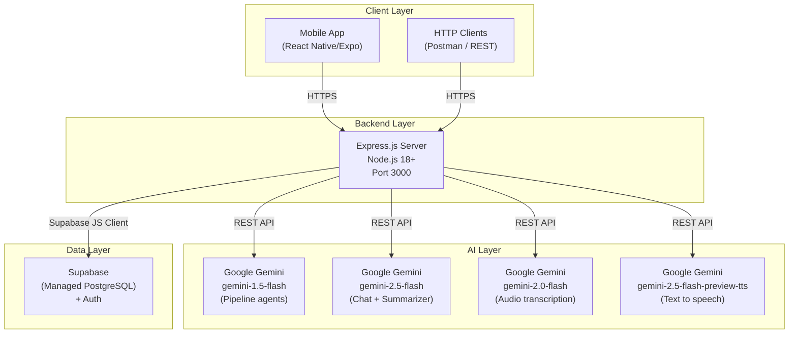

# Document 14 — Deployment Architecture
## DigitalKaam Antigravity AI Service Platform

**Document Type**: Operations Reference  
**Audience**: DevOps Engineers, System Administrators, Developers  
**Related Documents**: [01_System_Architecture](01_System_Architecture.md) | [13_Performance_Architecture](13_Performance_Scaling.md) | [03_Database_Architecture](03_Database_Architecture.md)

---

## 1. Overview

DigitalKaam is a standard Node.js/TypeScript backend application deployable to any platform supporting Node.js 18+. The backend follows a straightforward build-and-run model: TypeScript source is compiled to JavaScript and executed with Node.

---

## 2. Required Environment Variables

All environment variables must be set before running the application:

| Variable | Required | Description |
|----------|----------|-------------|
| `SUPABASE_URL` | ✅ Yes | Supabase project URL (e.g., `https://xxxx.supabase.co`) |
| `SUPABASE_SERVICE_KEY` | ✅ Yes | Service role key — server-side only |
| `GEMINI_API_KEY` | ✅ Yes | Google AI Studio API key |
| `PORT` | Optional | Server port (default: 3000) |

**Obtaining values**:
- `SUPABASE_URL` + `SUPABASE_SERVICE_KEY`: Supabase Dashboard → Project Settings → API
- `GEMINI_API_KEY`: Google AI Studio (aistudio.google.com) → Get API Key

**`.env` file format**:
```bash
SUPABASE_URL=https://your-project-ref.supabase.co
SUPABASE_SERVICE_KEY=eyJhbGciOiJIUzI1NiIsInR5cCI6IkpXVCJ9...
GEMINI_API_KEY=AIzaSy...
PORT=3000
```

---

## 3. NPM Scripts

Defined in `backend/package.json`:

| Script | Command | Purpose |
|--------|---------|---------|
| `npm run dev` | `nodemon --exec ts-node src/index.ts` | Development with hot reload |
| `npm run build` | `tsc` | Compile TypeScript → `dist/` |
| `npm start` | `node dist/index.js` | Run compiled production build |
| `npm run seed` | `ts-node src/data/seed.ts` | Seed database with test data |

---

## 4. Setup Procedure

### Step 1: Supabase Project Setup
```bash
# 1. Create a new Supabase project at supabase.com

# 2. Run the schema SQL in the Supabase SQL Editor:
#    Copy contents of supabase_schema.sql → Paste in SQL Editor → Run

# 3. Copy your project URL and service_role key to .env
```

### Step 2: Install Dependencies
```bash
cd backend
npm install
```

### Step 3: Configure Environment
```bash
# Create .env file in backend/ directory with required variables
```

### Step 4: Seed Database
```bash
npm run seed
# Creates ~245 providers for 7 service types × 7 Karachi areas
# Creates 3-5 availability slots per provider for next 14 days
# Takes ~30-60 seconds
```

### Step 5: Start Development Server
```bash
npm run dev
# Server starts on http://localhost:3000
# Health check: GET http://localhost:3000/health
```

---

## 5. Production Build

```bash
cd backend
npm run build    # Compiles TypeScript → dist/
npm start        # Runs node dist/index.js
```

**TypeScript config** (`tsconfig.json`):
- `outDir`: `./dist`
- `rootDir`: `./src`
- `strict`: true
- `esModuleInterop`: true

---

## 6. Deployment Options

### Option A: Railway

```
1. Create Railway project
2. Connect GitHub repository
3. Set environment variables in Railway dashboard:
   SUPABASE_URL, SUPABASE_SERVICE_KEY, GEMINI_API_KEY
4. Set start command: npm run build && npm start
5. Deploys automatically on git push
```

### Option B: Render

```
1. Create Web Service in Render
2. Connect repository, set root directory to backend/
3. Build command: npm install && npm run build
4. Start command: npm start
5. Set environment variables in Render dashboard
```

### Option C: Docker / Google Cloud Run

```dockerfile
FROM node:18-alpine
WORKDIR /app
COPY package*.json ./
RUN npm ci --only=production
COPY tsconfig.json ./
COPY src/ ./src/
RUN npm run build
EXPOSE 3000
CMD ["npm", "start"]
```

```bash
# Build and deploy to Cloud Run
gcloud builds submit --tag gcr.io/PROJECT_ID/digitalkaam-api
gcloud run deploy digitalkaam-api \
  --image gcr.io/PROJECT_ID/digitalkaam-api \
  --platform managed \
  --allow-unauthenticated \
  --set-env-vars SUPABASE_URL=...,SUPABASE_SERVICE_KEY=...,GEMINI_API_KEY=...
```

### Option D: VPS (Ubuntu/DigitalOcean)

```bash
# Install Node.js 18+
curl -fsSL https://deb.nodesource.com/setup_18.x | sudo -E bash -
sudo apt-get install -y nodejs

# Clone repo and install
git clone <repo-url>
cd digitalkaam/backend
npm install
npm run build

# Configure and start with PM2
echo "SUPABASE_URL=..." > .env
npm install -g pm2
pm2 start dist/index.js --name digitalkaam-api
pm2 startup
pm2 save
```

---

## 7. Architecture Diagram



---

## 8. Supabase Configuration

The Supabase project requires:

1. **Auth settings**:
   - Email auth: Enabled
   - Google OAuth: Configure in Auth → Providers → Google
   - Email confirmation: Disabled (signup uses `admin.createUser`)

2. **Database**: Run `supabase_schema.sql` to create all 11 tables

3. **API Keys**:
   - `service_role` key (for backend operations)
   - `anon` key (for mobile client direct Supabase calls)

---

*See [01_System_Architecture](01_System_Architecture.md) for system design overview.*  
*See [13_Performance_Architecture](13_Performance_Scaling.md) for performance characteristics.*


---

## 1. Overview

DigitalKaam is a standard Node.js/TypeScript backend application deployable to any platform that supports Node.js 18+. There is no Dockerfile, no CI/CD pipeline, and no cloud infrastructure configuration in the repository. Deployment is currently a manual process.

---

## 2. Required Environment Variables

All environment variables must be set before running the application:

| Variable | Required | Description |
|----------|----------|-------------|
| `SUPABASE_URL` | ✅ Yes | Supabase project URL (e.g., `https://xxxx.supabase.co`) |
| `SUPABASE_SERVICE_KEY` | ✅ Yes | Service role key — **never expose client-side** |
| `GEMINI_API_KEY` | ✅ Yes | Google AI Studio API key |
| `PORT` | Optional | Server port (default: 3000) |

**Obtaining values**:
- `SUPABASE_URL` + `SUPABASE_SERVICE_KEY`: Supabase Dashboard → Project Settings → API
- `GEMINI_API_KEY`: Google AI Studio (aistudio.google.com) → Get API Key

**`.env` file format**:
```bash
SUPABASE_URL=https://your-project-ref.supabase.co
SUPABASE_SERVICE_KEY=eyJhbGciOiJIUzI1NiIsInR5cCI6IkpXVCJ9...
GEMINI_API_KEY=AIzaSy...
PORT=3000
```

---

## 3. NPM Scripts

Defined in `backend/package.json`:

| Script | Command | Purpose |
|--------|---------|---------|
| `npm run dev` | `nodemon --exec ts-node src/index.ts` | Development with hot reload |
| `npm run build` | `tsc` | Compile TypeScript → `dist/` |
| `npm start` | `node dist/index.js` | Run compiled production build |
| `npm run seed` | `ts-node src/data/seed.ts` | Seed database with test data |

---

## 4. First-Time Setup Procedure

### Step 1: Supabase Project Setup
```bash
# 1. Create a new Supabase project at supabase.com

# 2. Run the schema SQL in the Supabase SQL Editor:
#    Copy contents of supabase_schema.sql → Paste in SQL Editor → Run

# 3. Copy your project URL and service_role key to .env
```

### Step 2: Install Dependencies
```bash
cd backend
npm install
```

### Step 3: Configure Environment
```bash
# Create .env file in backend/ directory
cp .env.example .env   # if example exists
# OR manually create with required variables
```

### Step 4: Seed Database (Optional)
```bash
npm run seed
# Creates ~245 providers for 7 service types × 7 Karachi areas
# Creates 3-5 availability slots per provider for next 14 days
# Takes ~30-60 seconds
```

### Step 5: Start Development Server
```bash
npm run dev
# Server starts on http://localhost:3000
# Health check: GET http://localhost:3000/health
```

---

## 5. Production Build Process

```bash
# 1. Build TypeScript
cd backend
npm run build
# Outputs compiled files to backend/dist/

# 2. Start production server
npm start
# Runs node dist/index.js
```

**TypeScript config** (`tsconfig.json`):
- `outDir`: `./dist`
- `rootDir`: `./src`
- `strict`: true
- `esModuleInterop`: true

---

## 6. Deployment Options

### Option A: Railway (Recommended for simplicity)

```
1. Create Railway project
2. Connect GitHub repository
3. Set environment variables in Railway dashboard:
   SUPABASE_URL, SUPABASE_SERVICE_KEY, GEMINI_API_KEY
4. Set start command: npm run build && npm start
5. Deploy automatically on git push
```

### Option B: Render

```
1. Create Web Service in Render
2. Connect repository, set root directory to backend/
3. Build command: npm install && npm run build
4. Start command: npm start
5. Set environment variables in Render dashboard
```

### Option C: Google Cloud Run (Container)

No Dockerfile exists in the repository. One must be created:

```dockerfile
FROM node:18-alpine

WORKDIR /app

COPY package*.json ./
RUN npm ci --only=production

COPY tsconfig.json ./
COPY src/ ./src/
RUN npm run build

EXPOSE 3000
CMD ["npm", "start"]
```

```bash
# Build and deploy to Cloud Run
gcloud builds submit --tag gcr.io/PROJECT_ID/digitalkaam-api
gcloud run deploy digitalkaam-api \
  --image gcr.io/PROJECT_ID/digitalkaam-api \
  --platform managed \
  --allow-unauthenticated \
  --set-env-vars SUPABASE_URL=...,SUPABASE_SERVICE_KEY=...,GEMINI_API_KEY=...
```

### Option D: VPS (Ubuntu/DigitalOcean)

```bash
# Install Node.js 18+
curl -fsSL https://deb.nodesource.com/setup_18.x | sudo -E bash -
sudo apt-get install -y nodejs

# Clone repo
git clone <repo-url>
cd digitalkaam/backend

# Install and build
npm install
npm run build

# Create .env
nano .env   # add variables

# Run with PM2
npm install -g pm2
pm2 start dist/index.js --name digitalkaam-api
pm2 startup  # auto-restart on reboot
pm2 save
```

---

## 7. Architecture Diagram


---

## 8. Supabase Configuration

The Supabase project requires:

1. **Auth settings**:
   - Email auth: Enabled
   - Google OAuth: Configure in Auth → Providers → Google
   - Email confirmation: Disabled (signup uses `admin.createUser`)

2. **Database**: Run `supabase_schema.sql` to create all 11 tables

3. **API Keys**:
   - `service_role` key (for backend operations)
   - `anon` key (for mobile client direct Supabase calls)

---

*See [01_System_Architecture](01_System_Architecture.md) for system design overview.*  
*See [13_Performance_Scaling.md](13_Performance_Scaling.md) for performance characteristics.*

