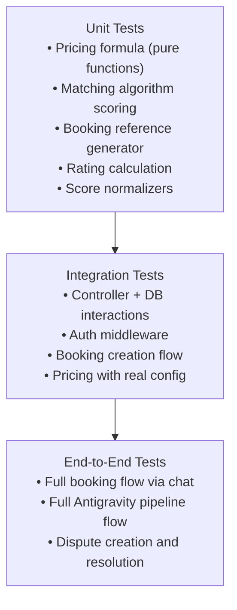
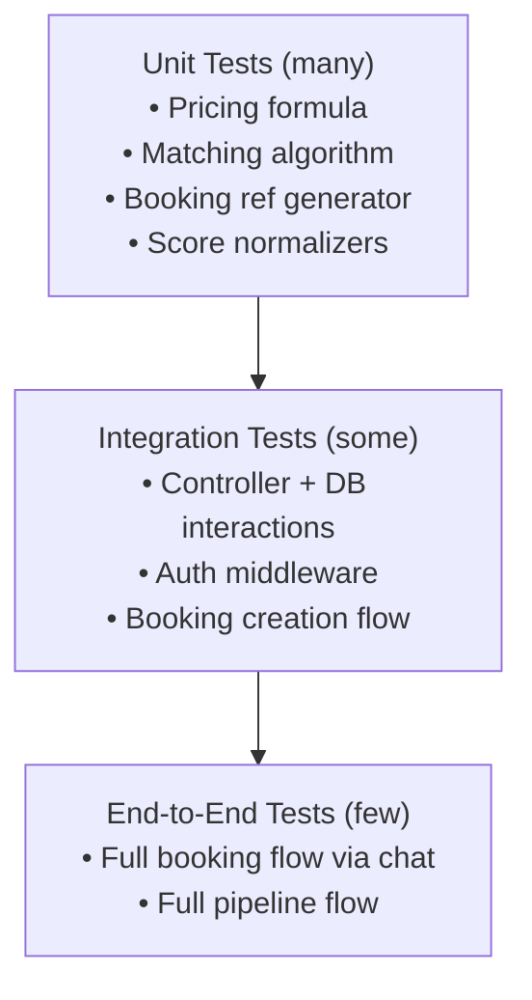

# Document 15 — Quality Assurance Strategy
## DigitalKaam AI Service Platform

**Document Type**: Quality Engineering Reference  
**Audience**: Developers, QA Engineers, Engineering Managers  
**Related Documents**: [09_Agent_Flow_Documentation](09_Agent_Flow_Documentation.md) | [06_Pricing_Engine](06_Pricing_Engine.md) | [08_Business_Workflows](08_Business_Workflows.md)

---

## 1. Quality Assurance Approach

DigitalKaam's quality assurance strategy centers on comprehensive API-level validation using structured HTTP test suites, combined with a testing architecture designed for each layer of the system. The platform includes two dedicated manual testing assets that cover all major workflows, and the test architecture is organized around a standard testing pyramid.

---

## 2. Manual Testing Assets

### 2.1 VS Code REST Client (`api-tests.http`)

`backend/api-tests.http` is a comprehensive HTTP test file for the VS Code REST Client extension, providing executable request definitions for every API endpoint.

**Usage**:
1. Install "REST Client" extension in VS Code
2. Open `backend/api-tests.http`
3. Click "Send Request" above any request definition
4. View the response inline in VS Code

The file covers the full API surface including authentication flows, booking creation, chat interaction, service discovery, provider management, dispute submission, and admin configuration.

### 2.2 Postman Collection

`Digital Kaam.postman_collection.json` at the workspace root provides a complete Postman collection covering all major business workflows.

**Usage**:
1. Import into Postman
2. Configure environment variables (`base_url`, auth tokens)
3. Execute individual requests or run full collection

The collection includes end-to-end flows: user registration through booking completion, dispute creation, provider onboarding, and platform configuration management.

---

## 3. Test Architecture

### 3.1 Testing Pyramid



### 3.2 Test Framework Configuration

The test suite uses Jest with ts-jest for TypeScript support and Supertest for HTTP-layer integration testing:

```typescript
// jest.config.ts
export default {
  preset: 'ts-jest',
  testEnvironment: 'node',
  testMatch: ['**/__tests__/**/*.test.ts'],
  collectCoverageFrom: [
    'src/controllers/**/*.ts',
    'src/middleware/**/*.ts',
    'src/adk/**/*.ts'
  ]
}
```

```json
// package.json scripts
{
  "scripts": {
    "test": "jest",
    "test:watch": "jest --watch",
    "test:coverage": "jest --coverage"
  }
}
```

---

## 4. Unit Test Specifications

### 4.1 Pricing Engine Tests

The pricing formula is pure function logic suitable for comprehensive unit test coverage:

```typescript
// __tests__/pricing.test.ts
describe('Pricing Engine', () => {
  describe('Basic calculation', () => {
    it('should calculate correct total for low-severity job', () => {
      const result = calculatePrice({
        hourlyRate: 600,
        estimatedHours: 1,
        severity: 'low',
        loyaltyPoints: 0
      })
      expect(result.visitFee).toBe(500)
      expect(result.laborFee).toBe(600)
      expect(result.urgencySurcharge).toBe(0)
      expect(result.loyaltyDiscount).toBe(0)
      expect(result.platformFee).toBe(105)
      expect(result.total).toBe(1205)
    })
  })

  describe('Loyalty discount', () => {
    it('should apply 50 PKR per 100 points', () => {
      expect(calculateLoyaltyDiscount(200)).toBe(100)
      expect(calculateLoyaltyDiscount(350)).toBe(150)
    })

    it('should cap at loyalty_discount_cap (default 200)', () => {
      expect(calculateLoyaltyDiscount(10000)).toBe(200)
    })

    it('should give 0 discount below 100 points', () => {
      expect(calculateLoyaltyDiscount(99)).toBe(0)
    })
  })

  describe('High severity surcharge', () => {
    it('should add 250 PKR for high severity', () => {
      const low = calculatePrice({ severity: 'low', ...base })
      const high = calculatePrice({ severity: 'high', ...base })
      expect(high.urgencySurcharge - low.urgencySurcharge).toBe(250)
    })
  })
})
```

### 4.2 Matching Algorithm Tests

```typescript
// __tests__/matching.test.ts
describe('Provider Matching', () => {
  it('should give availScore 1.0 for providers with open slots', () => {
    const provider = { ...mockProvider, availability: [{ is_booked: false }] }
    expect(calculateAvailScore(provider, requestedDate)).toBe(1.0)
  })

  it('should give prefScore 1.0 for preferred providers', () => {
    const context = { preferredProviders: ['provider-123'] }
    expect(calculatePrefScore('provider-123', context)).toBe(1.0)
  })

  it('should give prefScore 0.0 for blacklisted providers', () => {
    const context = { blacklistedProviders: ['provider-123'] }
    expect(calculatePrefScore('provider-123', context)).toBe(0.0)
  })

  it('matchScore weights should sum to 1.0', () => {
    const weights = [0.10, 0.20, 0.10, 0.10, 0.15, 0.10, 0.10, 0.05, 0.05, 0.05]
    expect(weights.reduce((a, b) => a + b, 0)).toBeCloseTo(1.0)
  })
})
```

### 4.3 Booking Reference Generator Tests

```typescript
// __tests__/bookingRef.test.ts
describe('Booking Reference', () => {
  it('should follow DK-YYMMDD-XXXX format', () => {
    const ref = generateBookingRef()
    expect(ref).toMatch(/^DK-\d{6}-[ABCDEFGHJKLMNPQRSTUVWXYZ23456789]{4}$/)
  })

  it('should not contain ambiguous characters (I, O, 0, 1)', () => {
    for (let i = 0; i < 1000; i++) {
      const ref = generateBookingRef()
      const suffix = ref.split('-')[2]
      expect(suffix).not.toMatch(/[IO01]/)
    }
  })
})
```

### 4.4 Rating Formula Tests

```typescript
// __tests__/rating.test.ts
describe('Provider Rating', () => {
  it('should calculate weighted moving average', () => {
    // (4.0 × 10 + 5) / 11 = 45/11 = 4.09 → rounds to 4.1
    const newRating = calculateNewRating({ prevRating: 4.0, reviewCount: 10, newReview: 5 })
    expect(newRating).toBe(4.1)
  })
})
```

---

## 5. Integration Test Specifications

### 5.1 Auth Middleware Tests

```typescript
// __tests__/auth.integration.test.ts
describe('requireAuth middleware', () => {
  it('should return 401 for requests without Authorization header', async () => {
    const res = await request(app).get('/api/booking/user/me')
    expect(res.status).toBe(401)
  })

  it('should return 401 for invalid token', async () => {
    const res = await request(app)
      .get('/api/booking/user/me')
      .set('Authorization', 'Bearer invalid-token')
    expect(res.status).toBe(401)
  })

  it('should allow authenticated requests with valid token', async () => {
    const token = await getValidTestToken()
    const res = await request(app)
      .get('/api/booking/user/me')
      .set('Authorization', `Bearer ${token}`)
    expect(res.status).toBe(200)
  })
})
```

### 5.2 Duplicate Booking Prevention Tests

```typescript
describe('ConfirmBookingTool', () => {
  it('should prevent second booking in same session', async () => {
    const first = await confirmBooking({ sessionId: 'test-session', ... })
    expect(first.alreadyBooked).toBe(false)

    const second = await confirmBooking({ sessionId: 'test-session', ... })
    expect(second.alreadyBooked).toBe(true)
    expect(second.existingBookings).toHaveLength(1)
  })
})
```

---

## 6. Coverage Targets by Module

| Module | Coverage Target | Rationale |
|--------|----------------|-----------|
| `pricingController.ts` | 100% | Pure formula logic — full branch coverage |
| `matchingController.ts` | 90% | 10-factor scoring — all weight paths |
| `bookingController.ts` | 80% | Booking lifecycle state transitions |
| `middleware/auth.ts` | 90% | Security-critical path |
| `disputeController.ts` | 80% | Refund calculation accuracy |
| `reputationController.ts` | 80% | Rating formula correctness |
| `adk/Agent.ts` | 70% | Conversational orchestration |

---

## 7. Gemini API Mock Strategy

Integration tests use Jest mocks to isolate from the live Gemini API:

```typescript
// __mocks__/gemini.ts
export const callGemini = jest.fn().mockResolvedValue(JSON.stringify({
  service: 'AC Technician',
  severity: 'medium',
  clarificationNeeded: false
}))

// In test setup
jest.mock('../src/lib/gemini')
```

---

## 8. Test Database Configuration

Integration tests connect to a local Supabase instance via the Supabase CLI:

```bash
# Start local Supabase (Docker required)
supabase start

# Apply schema to local instance
# Tests use: SUPABASE_URL=http://localhost:54321
```

This provides full PostgreSQL behavior in an isolated environment with no impact on production data.

---

*See [06_Pricing_Engine](06_Pricing_Engine.md) for complete pricing formula specification.*  
*See [09_Agent_Flow_Documentation](09_Agent_Flow_Documentation.md) for agent behavior specifications.*


---

## 1. Manual Testing Assets

Two manual testing resources exist:

### 1.1 VS Code REST Client (`api-tests.http`)

`backend/api-tests.http` contains HTTP request definitions for VS Code's REST Client extension, enabling rapid API verification during development.

**Usage**:
1. Install "REST Client" extension in VS Code
2. Open `api-tests.http`
3. Click "Send Request" above each request
4. View response inline

### 1.2 Postman Collection (`Digital Kaam.postman_collection.json`)

A full Postman collection at the workspace root covers all major API flows.

**Usage**:
1. Import into Postman
2. Set environment variables (base URL, tokens)
3. Run manually or via Newman CLI

---

## 2. Recommended Testing Strategy

### Testing Pyramid for DigitalKaam



---

## 4. Priority: Unit Tests

### 4.1 Pricing Engine Tests (Highest Priority)

The pricing formula is critical business logic with exact calculations. All edge cases must be verified:

```typescript
// __tests__/pricing.test.ts
import { describe, it, expect } from '@jest/globals'
import { processPricing } from '../src/controllers/pricingController'

describe('Pricing Engine', () => {
  describe('Basic calculation', () => {
    it('should calculate correct total for low-severity job', () => {
      const result = calculatePrice({
        hourlyRate: 600,
        estimatedHours: 1,
        severity: 'low',
        loyaltyPoints: 0
      })
      expect(result.visitFee).toBe(500)
      expect(result.laborFee).toBe(600)
      expect(result.urgencySurcharge).toBe(0)
      expect(result.loyaltyDiscount).toBe(0)
      expect(result.platformFee).toBe(105)
      expect(result.total).toBe(1205)
    })
  })

  describe('Loyalty discount', () => {
    it('should apply 50 PKR per 100 points', () => {
      expect(calculateLoyaltyDiscount(200)).toBe(100)
      expect(calculateLoyaltyDiscount(350)).toBe(150)
    })

    it('should cap at loyalty_discount_cap (default 200)', () => {
      expect(calculateLoyaltyDiscount(10000)).toBe(200)
      expect(calculateLoyaltyDiscount(500)).toBe(200)
    })

    it('should give 0 discount below 100 points', () => {
      expect(calculateLoyaltyDiscount(99)).toBe(0)
      expect(calculateLoyaltyDiscount(0)).toBe(0)
    })
  })

  describe('Minimum price guarantee', () => {
    it('should never go below visitFee', () => {
      const result = calculatePrice({
        hourlyRate: 400,
        estimatedHours: 0.5,
        severity: 'low',
        loyaltyPoints: 500  // would make total very low
      })
      expect(result.total).toBeGreaterThanOrEqual(500)
    })
  })

  describe('High severity surcharge', () => {
    it('should add 250 PKR for high severity', () => {
      const low = calculatePrice({ severity: 'low', ...base })
      const high = calculatePrice({ severity: 'high', ...base })
      expect(high.urgencySurcharge - low.urgencySurcharge).toBe(250)
    })
  })
})
```

### 4.2 Matching Algorithm Tests

```typescript
// __tests__/matching.test.ts
describe('Provider Matching', () => {
  it('should give availScore 1.0 for providers with open slots', () => {
    const provider = { ...mockProvider, availability: [{ is_booked: false }] }
    expect(calculateAvailScore(provider, requestedDate)).toBe(1.0)
  })

  it('should give availScore 0.0 for fully booked providers', () => {
    const provider = { ...mockProvider, availability: [] }
    expect(calculateAvailScore(provider, requestedDate)).toBe(0.0)
  })

  it('should give prefScore 1.0 for preferred providers', () => {
    const context = { preferredProviders: ['provider-123'] }
    expect(calculatePrefScore('provider-123', context)).toBe(1.0)
  })

  it('should give prefScore 0.0 for blacklisted providers', () => {
    const context = { blacklistedProviders: ['provider-123'] }
    expect(calculatePrefScore('provider-123', context)).toBe(0.0)
  })

  it('matchScore weights should sum to 1.0', () => {
    const weights = [0.10, 0.20, 0.10, 0.10, 0.15, 0.10, 0.10, 0.05, 0.05, 0.05]
    expect(weights.reduce((a, b) => a + b, 0)).toBeCloseTo(1.0)
  })
})
```

### 4.3 Booking Reference Generator Tests

```typescript
// __tests__/bookingRef.test.ts
describe('Booking Reference', () => {
  it('should follow DK-YYMMDD-XXXX format', () => {
    const ref = generateBookingRef()
    expect(ref).toMatch(/^DK-\d{6}-[ABCDEFGHJKLMNPQRSTUVWXYZ23456789]{4}$/)
  })

  it('should not contain ambiguous characters (I, O, 0, 1)', () => {
    for (let i = 0; i < 1000; i++) {
      const ref = generateBookingRef()
      const suffix = ref.split('-')[2]
      expect(suffix).not.toMatch(/[IO01]/)
    }
  })
})
```

### 4.4 Rating Formula Tests

```typescript
// __tests__/rating.test.ts
describe('Provider Rating', () => {
  it('should calculate weighted moving average', () => {
    const newRating = calculateNewRating({
      prevRating: 4.0,
      reviewCount: 10,
      newReview: 5
    })
    // (4.0 × 10 + 5) / 11 = 45/11 = 4.090909 → rounds to 4.1
    expect(newRating).toBe(4.1)
  })
})
```

---

## 5. Priority: Integration Tests

### 5.1 Auth Middleware Tests

```typescript
// __tests__/auth.integration.test.ts
describe('requireAuth middleware', () => {
  it('should reject requests without Authorization header', async () => {
    const res = await request(app).get('/api/booking/user/me')
    expect(res.status).toBe(401)
  })

  it('should reject requests with invalid token', async () => {
    const res = await request(app)
      .get('/api/booking/user/me')
      .set('Authorization', 'Bearer invalid-token')
    expect(res.status).toBe(401)
  })

  it('should allow requests with valid token', async () => {
    const token = await getValidTestToken()
    const res = await request(app)
      .get('/api/booking/user/me')
      .set('Authorization', `Bearer ${token}`)
    expect(res.status).toBe(200)
  })
})
```

### 5.2 Double-Booking Prevention Tests

```typescript
describe('ConfirmBookingTool', () => {
  it('should prevent second booking in same session', async () => {
    // Create first booking
    const first = await confirmBooking({ sessionId: 'test-session', ... })
    expect(first.alreadyBooked).toBe(false)
    
    // Try to create second booking in same session
    const second = await confirmBooking({ sessionId: 'test-session', ... })
    expect(second.alreadyBooked).toBe(true)
    expect(second.existingBookings).toHaveLength(1)
  })
})
```

---

## 6. Recommended Test Framework Setup

```bash
# Install test dependencies
npm install --save-dev jest @types/jest ts-jest supertest @types/supertest

# jest.config.ts
export default {
  preset: 'ts-jest',
  testEnvironment: 'node',
  testMatch: ['**/__tests__/**/*.test.ts'],
  collectCoverageFrom: [
    'src/controllers/**/*.ts',
    'src/middleware/**/*.ts',
    'src/adk/**/*.ts'
  ]
}
```

Add to `package.json`:
```json
{
  "scripts": {
    "test": "jest",
    "test:watch": "jest --watch",
    "test:coverage": "jest --coverage"
  }
}
```

---

## 7. Test Coverage Targets

| Module | Target Coverage | Priority |
|--------|----------------|---------|
| `pricingController.ts` | 100% | Critical |
| `matchingController.ts` | 90% | Critical |
| `bookingController.ts` | 80% | High |
| `middleware/auth.ts` | 90% | High |
| `disputeController.ts` | 80% | High |
| `reputationController.ts` | 80% | High |
| `adk/Agent.ts` | 70% | Medium |

---

## 8. Mock Strategy for Gemini API

Tests should not call the real Gemini API:

```typescript
// __mocks__/gemini.ts
export const callGemini = jest.fn().mockResolvedValue(JSON.stringify({
  service: 'AC Technician',
  severity: 'medium',
  clarificationNeeded: false
}))

// In test setup
jest.mock('../src/lib/gemini')
```

---

## 9. Test Database Strategy

Options for integration test database:

| Option | Pros | Cons |
|--------|------|------|
| Supabase test project | Real DB behavior | External dependency |
| Local Supabase CLI | Isolated, no cost | Requires Docker |
| Mock Supabase client | Fast, no deps | May miss DB-level behavior |
| SQLite in-memory | Fast | Different SQL dialect |

**Recommended**: Local Supabase CLI with `supabase start`:
```bash
# Install Supabase CLI
npm install -g supabase

# Start local Supabase (Docker required)
supabase start

# Run schema migrations against local instance
# Set SUPABASE_URL=http://localhost:54321 for tests
```

---

*See [16_Known_Risks_Technical_Debt.md](16_Known_Risks_Technical_Debt.md) for the full platform capabilities reference.*
