# MASTER DOCUMENTATION INDEX
## DigitalKaam — Antigravity AI Service Platform
### Version 1.0 | Generated: May 2026

---

## 1. Executive Overview

### What The System Does

DigitalKaam is an **AI-powered home services marketplace** targeting Pakistan's informal service economy. The platform allows residential customers in Karachi to request skilled service providers — Electricians, Plumbers, AC Technicians, Mechanics, Tutors, Beauticians, and Drivers — through a conversational AI interface that handles the entire workflow from intent understanding through booking confirmation.

The system is unique in its use of **multi-language AI** (English, Urdu script, Roman Urdu), enabling Pakistan's diverse population to interact naturally in their preferred language or dialect.

### Business Goals

1. **Formalize the informal gig economy** — bring unregistered service workers onto a digital platform with structured pricing, ratings, and accountability
2. **Reduce friction in service discovery** — replace word-of-mouth referrals with an AI agent that finds, scores, and books the best provider automatically
3. **Build provider trust through transparency** — give customers upfront pricing estimates, provider profiles, ratings, and booking references
4. **Dispute resolution** — provide a structured mechanism to handle no-shows, quality complaints, and overcharges

### Technical Goals

1. Deploy a production-grade multi-agent LLM pipeline using Google Gemini
2. Implement a conversational booking interface with persistent memory and session management
3. Support multilingual NLP without third-party translation services
4. Maintain a traceable AI audit log for every decision made by every agent
5. Build a configurable pricing engine managed entirely from the database (no code deploys required)

### Core Domains

| Domain | Description |
|--------|-------------|
| **Identity & Auth** | Supabase JWT auth, provider onboarding, session management |
| **Service Discovery** | Geographic provider search, area canonicalization, service-type aliasing |
| **Provider Matching** | 10-factor weighted scoring algorithm |
| **AI Orchestration** | ADK conversational agent (Gemini-powered with tool-calling) |
| **Pricing Engine** | Dynamic pricing from DB config: visit fee + labor + urgency - loyalty + platform fee |
| **Scheduling** | Availability slot management, conflict detection |
| **Booking Lifecycle** | confirmed → en_route → arrived → in_progress → completed → feedback |
| **Reputation System** | Weighted moving average ratings, recency scores |
| **Dispute Management** | Type-based refund calculation, provider flagging |
| **Observability** | Full AI decision trace logged per session per agent |

### Architecture Summary

DigitalKaam is a **Node.js/TypeScript monolith** (single Express process) with a conversational AI interface:

- **ADK Chat Interface** — a conversational endpoint (`POST /api/chat`) where a single Gemini orchestrator uses tool-calling to drive booking workflows interactively, with persistent session memory

The database backend is **Supabase (PostgreSQL)**, and AI capabilities are entirely powered by **Google Gemini** (versions 2.0-flash, 2.5-flash, and 2.5-flash-preview-tts).

---

## 2. Documentation Map

### Document Catalog

| # | Document | Purpose | Audience |
|---|----------|---------|----------|
| 01 | [01_System_Architecture.md](01_System_Architecture.md) | High-level system design, component map, architecture decisions | All |
| 02 | [02_Repository_Structure.md](02_Repository_Structure.md) | Folder layout, module ownership, entry points, runtime boundaries | Developers |
| 03 | [03_Database_Architecture.md](03_Database_Architecture.md) | ER diagram, table docs, constraints, data lifecycle | Developers, DBAs, Architects |
| 04 | [04_API_Documentation.md](04_API_Documentation.md) | Every endpoint: request/response schemas, auth, side effects | Developers, QA, API consumers |
| 05 | [05_Authentication_Authorization.md](05_Authentication_Authorization.md) | Auth flows, JWT lifecycle, token refresh, role model | Developers, Security |
| 06 | [06_Pricing_Engine.md](06_Pricing_Engine.md) | Exact pricing formulas, worked examples, config management | Developers, Product, Finance |
| 07 | [07_Loyalty_Point_System.md](07_Loyalty_Point_System.md) | Loyalty discount formula, caps, integration with pricing | Product, Developers, Finance |
| 08 | [08_Business_Workflows.md](08_Business_Workflows.md) | End-to-end booking flow, dispute flow, onboarding flow, state machine | Product, QA, Operations |
| 09 | [09_Agent_Flow_Documentation.md](09_Agent_Flow_Documentation.md) | ADK orchestrator agent, tools, specialized agents: inputs, outputs, logic | AI Engineers, Developers |
| 10 | [10_Queue_Event_System.md](10_Queue_Event_System.md) | Async processing patterns, event flows, notification framework | Developers, Architects |
| 11 | [11_Security_Review.md](11_Security_Review.md) | Security architecture, implemented controls, and authorization model | Security, Architects |
| 12 | [12_Observability_Logging.md](12_Observability_Logging.md) | Trace system, log patterns, debugging, and error handling architecture | Developers, SREs |
| 13 | [13_Performance_Scaling.md](13_Performance_Scaling.md) | Request cost analysis, database architecture, performance characteristics | Architects, SREs |
| 14 | [14_Deployment_Architecture.md](14_Deployment_Architecture.md) | Runtime requirements, env vars, setup procedure, deployment guide | DevOps, SREs |
| 15 | [15_Testing_Strategy.md](15_Testing_Strategy.md) | Quality assurance approach, test architecture, and coverage specifications | QA, Developers |
| 16 | [16_Known_Risks_Technical_Debt.md](16_Known_Risks_Technical_Debt.md) | Comprehensive platform capabilities reference across all 14 domains | All |
| 17 | [17_Glossary.md](17_Glossary.md) | Business and technical terminology | All |

---

### Document Details

#### [01_System_Architecture.md](01_System_Architecture.md)
- **Purpose**: Understand the overall system design from 10,000 feet
- **Audience**: All engineers, architects, executives
- **Dependencies**: None — read this first
- **Key Concepts**: ADK, tool-calling, agent orchestration
- **Related Docs**: 02 (structure), 09 (agents), 03 (database)

#### [02_Repository_Structure.md](02_Repository_Structure.md)
- **Purpose**: Navigate the codebase confidently on day 1
- **Audience**: New developers joining the project
- **Dependencies**: 01 (for context)
- **Key Concepts**: backend/src layout, ADK framework, orchestrator pattern
- **Related Docs**: 01, 09, 04

#### [03_Database_Architecture.md](03_Database_Architecture.md)
- **Purpose**: Understand all tables, relationships, constraints, and data flows
- **Audience**: Backend developers, DBAs, architects
- **Dependencies**: None (self-contained with schema)
- **Key Concepts**: 11 tables, platform_config, service-role access model, JSONB price_breakdown
- **Related Docs**: 04, 06, 08

#### [04_API_Documentation.md](04_API_Documentation.md)
- **Purpose**: Complete reference for every HTTP endpoint
- **Audience**: Frontend/mobile developers, QA engineers, API integrators
- **Dependencies**: 03 (schema), 05 (auth)
- **Key Concepts**: 12 route groups, 40+ endpoints, rate limiting, auth middleware
- **Related Docs**: 05, 08, 09

#### [05_Authentication_Authorization.md](05_Authentication_Authorization.md)
- **Purpose**: Understand how identity and sessions work
- **Audience**: Security engineers, backend developers
- **Dependencies**: None
- **Key Concepts**: Supabase JWT, service role key, token auto-refresh, isolated auth client
- **Related Docs**: 04, 11

#### [06_Pricing_Engine.md](06_Pricing_Engine.md)
- **Purpose**: Exact pricing logic with formulas, examples, and config management
- **Audience**: Product managers, developers, finance, auditors
- **Dependencies**: 03 (platform_config table)
- **Key Concepts**: visitFee + laborFee + urgency - loyalty + platformFee, DB-driven config
- **Related Docs**: 07, 08, 03

#### [07_Loyalty_Point_System.md](07_Loyalty_Point_System.md)
- **Purpose**: How loyalty points are earned, redeemed, and capped
- **Audience**: Product managers, developers, finance
- **Dependencies**: 06 (pricing integration)
- **Key Concepts**: 100 pts = PKR 50, max PKR 200 cap, loyalty_discount_cap config
- **Related Docs**: 06, 03, 08

#### [08_Business_Workflows.md](08_Business_Workflows.md)
- **Purpose**: Step-by-step flows for all major business processes
- **Audience**: Product managers, QA engineers, operations
- **Dependencies**: 01, 03
- **Key Concepts**: Booking lifecycle state machine, dispute resolution, onboarding
- **Related Docs**: 09, 06, 07

#### [09_Agent_Flow_Documentation.md](09_Agent_Flow_Documentation.md)
- **Purpose**: Deep technical analysis of every AI agent and tool
- **Audience**: AI engineers, senior developers, architects
- **Dependencies**: 01 (architecture), 03 (database)
- **Key Concepts**: Gemini function calling, ADK framework, session metadata injection
- **Related Docs**: 01, 06, 08

#### [10_Queue_Event_System.md](10_Queue_Event_System.md)
- **Purpose**: Understand async processing patterns, notification design, and event flows
- **Audience**: Backend developers, architects
- **Dependencies**: 01, 08
- **Key Concepts**: Fire-and-forget async, 6 lifecycle notification events, inline background processing
- **Related Docs**: 08, 12, 13

#### [11_Security_Review.md](11_Security_Review.md)
- **Purpose**: Security architecture, implemented controls, and authorization model
- **Audience**: Security engineers, architects, CTO
- **Dependencies**: 04, 05
- **Key Concepts**: Service-role client model, JWT isolation, rate limiting tiers, OWASP coverage
- **Related Docs**: 05, 04

#### [12_Observability_Logging.md](12_Observability_Logging.md)
- **Purpose**: How to debug, trace, and monitor the system
- **Audience**: Developers, SREs, support engineers
- **Dependencies**: 03 (traces table), 01
- **Key Concepts**: traces table, named console logging, agent confidence scores, session correlation
- **Related Docs**: 09, 13

#### [13_Performance_Scaling.md](13_Performance_Scaling.md)
- **Purpose**: Request cost analysis, database architecture, and performance characteristics
- **Audience**: Architects, SREs, engineering leadership
- **Dependencies**: 01, 03
- **Key Concepts**: In-memory agent cache, Gemini request model, platform_config loading, connection management
- **Related Docs**: 12, 14

#### [14_Deployment_Architecture.md](14_Deployment_Architecture.md)
- **Purpose**: How to deploy, configure, and run the system
- **Audience**: DevOps, SREs, new developers
- **Dependencies**: 02 (structure)
- **Key Concepts**: Environment variables, build pipeline, Supabase project setup, deployment options
- **Related Docs**: 15

#### [15_Testing_Strategy.md](15_Testing_Strategy.md)
- **Purpose**: Quality assurance approach, test architecture, and coverage specifications
- **Audience**: QA engineers, developers
- **Dependencies**: 01, 04
- **Key Concepts**: Manual test assets, QA pyramid, unit/integration/e2e specifications, Gemini mock strategy
- **Related Docs**: 04

#### [16_Known_Risks_Technical_Debt.md](16_Known_Risks_Technical_Debt.md)
- **Purpose**: Comprehensive platform capabilities reference
- **Audience**: Engineering leadership, architects, product managers
- **Dependencies**: All other docs
- **Key Concepts**: AI orchestration, service discovery, pricing engine, booking lifecycle, loyalty, dispute resolution, reputation, security, observability, voice interface, multi-language
- **Related Docs**: All

#### [17_Glossary.md](17_Glossary.md)
- **Purpose**: Define all terms used across the documentation
- **Audience**: All audiences, especially non-technical
- **Dependencies**: None
- **Key Concepts**: Business vocabulary, technical terms, platform-specific language

---

## 3. Recommended Reading Paths

### New Developer (First Week)
```
01_System_Architecture → 02_Repository_Structure → 03_Database_Architecture
→ 05_Authentication_Authorization → 09_Agent_Flow_Documentation
→ 04_API_Documentation → 14_Deployment_Architecture → 17_Glossary
```

### Senior Engineer (Architecture Review)
```
01_System_Architecture → 09_Agent_Flow_Documentation → 11_Security_Review
→ 13_Performance_Scaling → 16_Known_Risks_Technical_Debt → 03_Database_Architecture
```

### QA Engineer
```
04_API_Documentation → 08_Business_Workflows → 06_Pricing_Engine
→ 07_Loyalty_Point_System → 15_Testing_Strategy → 17_Glossary
```

### Security Reviewer
```
11_Security_Review → 05_Authentication_Authorization → 04_API_Documentation
→ 03_Database_Architecture → 16_Known_Risks_Technical_Debt
```

### Product Manager
```
01_System_Architecture → 08_Business_Workflows → 06_Pricing_Engine
→ 07_Loyalty_Point_System → 17_Glossary
```

### Executive Leadership
```
01_System_Architecture (Executive Summary section only)
→ 16_Known_Risks_Technical_Debt (Summary section only)
→ 17_Glossary
```

### AI/ML Engineer
```
09_Agent_Flow_Documentation → 01_System_Architecture → 12_Observability_Logging
→ 13_Performance_Scaling → 06_Pricing_Engine
```

---

## 4. System Dependency Graph

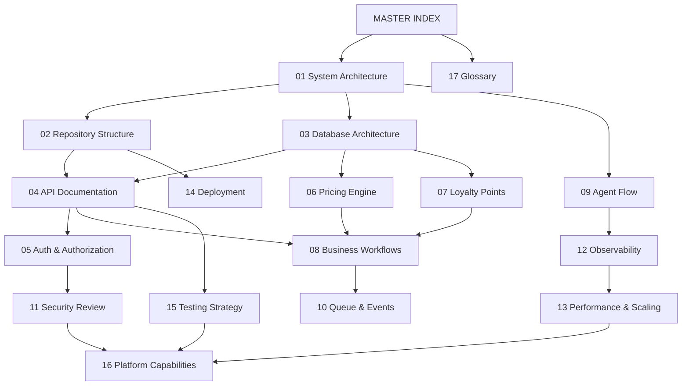
```mermaid
graph TD
    MASTER["MASTER INDEX"] --> DOC01["01 System Architecture"]
    MASTER --> DOC17["17 Glossary"]

    DOC01 --> DOC02["02 Repository Structure"]
    DOC01 --> DOC03["03 Database Architecture"]
    DOC01 --> DOC09["09 Agent Flow"]

    DOC02 --> DOC04["04 API Documentation"]
    DOC02 --> DOC14["14 Deployment"]

    DOC03 --> DOC04
    DOC03 --> DOC06["06 Pricing Engine"]
    DOC03 --> DOC07["07 Loyalty Points"]

    DOC04 --> DOC05["05 Auth & Authorization"]
    DOC04 --> DOC08["08 Business Workflows"]
    DOC04 --> DOC15["15 Testing Strategy"]

    DOC05 --> DOC11["11 Security Review"]

    DOC06 --> DOC08
    DOC07 --> DOC08

    DOC08 --> DOC10["10 Queue & Events"]
    DOC09 --> DOC12["12 Observability"]

    DOC11 --> DOC16["16 Platform Capabilities"]
    DOC12 --> DOC13["13 Performance & Scaling"]
    DOC13 --> DOC16
    DOC15 --> DOC16
```

---

## 5. Key Technology Stack Summary

| Layer | Technology | Version / Detail |
|-------|-----------|-----------------|
| **Runtime** | Node.js | TypeScript, ts-node for dev |
| **Framework** | Express.js | v5.2.1 |
| **Database** | Supabase (PostgreSQL) | Hosted, service role |
| **AI Provider** | Google Gemini | 1.5-flash, 2.0-flash, 2.5-flash, 2.5-flash-preview-tts |
| **Auth** | Supabase Auth | JWT, email/password + OAuth |
| **Mobile** | React Native / Expo | Scaffold with API client utilities |
| **Rate Limiting** | express-rate-limit | 100/min general, 20/min chat, 10/15min auth |
| **ID Generation** | uuid v4 | All entity IDs |
| **Language** | TypeScript 6.x | Strict mode |

---

*This document is the authoritative entry point. All other documents are referenced from here. For questions, contact the engineering team.*


---

# Document 01 — System Architecture
## DigitalKaam AI Service Platform

**Document Type**: Architecture Reference  
**Audience**: All Engineers, Architects, Executives  
**Related Documents**: [02_Repository_Structure](02_Repository_Structure.md) | [03_Database_Architecture](03_Database_Architecture.md) | [09_Agent_Flow_Documentation](09_Agent_Flow_Documentation.md)

---

## 1. Executive Architecture Summary

DigitalKaam is an **AI-first home services marketplace** built for Pakistan's informal economy. Its core innovation is replacing traditional search-and-select UIs with a **conversational AI booking agent** that understands English, Urdu, and Roman Urdu, automatically identifies the user's needs, finds the best available provider, calculates a transparent price, and confirms the booking — all within a single chat conversation.

The system is a **TypeScript/Node.js monolith** deployed as a single Express.js server. It integrates with Supabase (PostgreSQL) as the data store and Google Gemini as the AI engine. The architecture is intentionally simple for the current stage: one process, one database, no message queues, no microservices.

### Architecture Philosophy

> "Make it work correctly before making it scale." — the codebase is optimized for **correctness of AI behavior** and **development velocity**, not for horizontal scalability. The architecture is appropriate for an early-stage product with Pakistan-level initial traffic.

---

## 2. High-Level Architecture Diagram

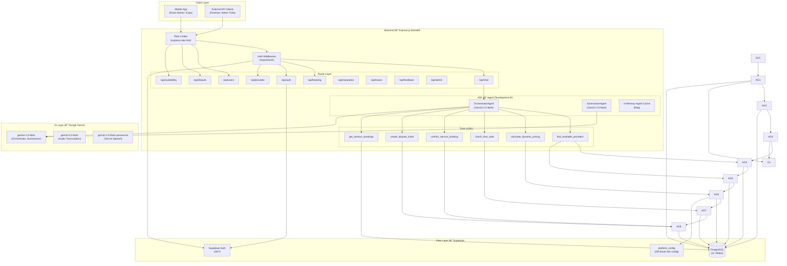
```mermaid
graph TB
    subgraph "Client Layer"
        MOB["Mobile App\n(React Native / Expo)"]
        EXT["External API Clients\n(Postman, Admin Tools)"]
    end

    subgraph "Backend — Express.js Monolith"
        RL["Rate Limiter\n(express-rate-limit)"]
        AUTH["Auth Middleware\n(requireAuth)"]

        subgraph "Route Layer"
            CHAT["/api/chat"]
            BOOK["/api/booking"]
            PROV["/api/provider"]
            USR["/api/users"]
            DISP["/api/dispute"]
            AVAIL["/api/availability"]
            REP["/api/reputation"]
            TRACE["/api/traces"]
            FEED["/api/feedback"]
            ADMIN["/api/admin"]
            AUTHRT["/api/auth"]
        end

        subgraph "ADK — Agent Development Kit"
            ORCH_AGENT["OrchestratorAgent\n(Gemini 2.5-flash)"]
            SUMM_AGENT["SummarizerAgent\n(Gemini 2.5-flash)"]
            MEM["In-Memory Agent Cache\n(Map<sessionId, Agent>)"]
        end

        subgraph "Tools (ADK)"
            T1["find_available_providers"]
            T2["calculate_dynamic_pricing"]
            T3["check_time_slots"]
            T4["confirm_service_booking"]
            T5["create_dispute_ticket"]
            T6["get_session_bookings"]
        end
    end

        subgraph "AI Layer — Google Gemini"
            G2["gemini-2.5-flash\n(Orchestrator, Summarizer)"]
            G3["gemini-2.0-flash\n(Audio Transcription)"]
            G4["gemini-2.5-flash-preview-tts\n(Text-to-Speech)"]
        end

    subgraph "Data Layer — Supabase"
        DB[("PostgreSQL\n(11 Tables)")]
        SAUTH["Supabase Auth\n(JWT)"]
        PCFG["platform_config\n(DB-driven fee config)"]
    end

    MOB --> RL
    EXT --> RL
    RL --> AUTH
    AUTH --> CHAT
    AUTH --> BOOK
    AUTH --> AUTHRT
    AUTH --> PROV
    RL --> USR
    RL --> DISP
    RL --> AVAIL

    CHAT --> ORCH_AGENT
    ORCH_AGENT --> T1
    ORCH_AGENT --> T2
    ORCH_AGENT --> T3
    ORCH_AGENT --> T4
    ORCH_AGENT --> T5
    ORCH_AGENT --> T6

    T1 --> AG4
    T1 --> AG5
    T2 --> AG6
    T3 --> AG7
    T4 --> AG8
    T5 --> AG8
    T6 --> DB

    SVC --> AG1
    AG1 --> AG2
    AG2 --> AG3
    AG3 --> AG4
    AG4 --> AG5
    AG5 --> AG6
    AG6 --> AG7
    AG7 --> AG8

    AG1 --> G1
    AG3 --> G1
    ORCH_AGENT --> G2
    SUMM_AGENT --> G2

    AG1 --> DB
    AG2 --> DB
    AG4 --> DB
    AG5 --> DB
    AG6 --> DB
    AG7 --> DB
    AG8 --> DB

    AUTHRT --> SAUTH
    AUTH --> SAUTH
    AG6 --> PCFG
```

---

## 3. Component Diagram

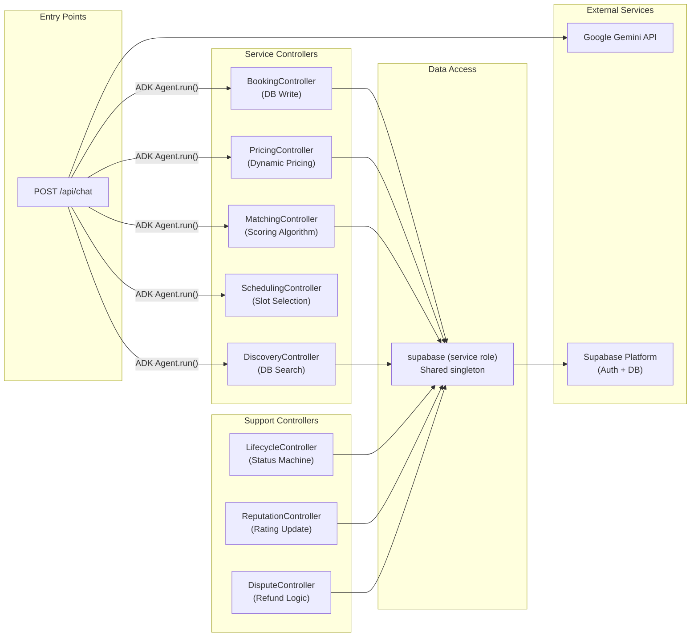
```mermaid
graph LR
    subgraph "Entry Points"
        EP1["POST /api/chat"]
    end

    subgraph "Service Controllers"
        DC["DiscoveryController\n(DB Search)"]
        MC["MatchingController\n(Scoring Algorithm)"]
        PC["PricingController\n(Dynamic Pricing)"]
        SC["SchedulingController\n(Slot Selection)"]
        BC["BookingController\n(DB Write)"]
    end

    subgraph "Support Controllers"
        LC["LifecycleController\n(Status Machine)"]
        RC["ReputationController\n(Rating Update)"]
        DISC["DisputeController\n(Refund Logic)"]
    end

    subgraph "Data Access"
        SUP["supabase (service role)\nShared singleton"]
    end

    subgraph "External Services"
        GEMINI["Google Gemini API"]
        SUPABASE["Supabase Platform\n(Auth + DB)"]
    end

    EP1 -->|"ADK Agent.run()"| DC
    EP1 -->|"ADK Agent.run()"| MC
    EP1 -->|"ADK Agent.run()"| PC
    EP1 -->|"ADK Agent.run()"| SC
    EP1 -->|"ADK Agent.run()"| BC

    BC --> SUP
    PC --> SUP
    MC --> SUP
    DC --> SUP
    LC --> SUP
    RC --> SUP
    DISC --> SUP

    EP1 --> GEMINI

    SUP --> SUPABASE
```

---

## 4. Service Map

| Service | Type | Description | Entry Point |
|---------|------|-------------|-------------|
| **ADK Chat** | Conversational AI | Gemini orchestrator with tools | `POST /api/chat` |
| **Discovery Service** | DB Search | Find providers by service type + area | `processDiscovery()` |
| **Matching Engine** | Scoring Algorithm | Multi-factor provider ranking | `processMatching()` |
| **Pricing Engine** | Calculation | Dynamic price from DB config | `processPricing()` |
| **Scheduling Service** | DB Read/Write | Slot matching and conflict detection | `processScheduling()` |
| **Booking Service** | DB Write | Create booking record + receipt | `processBooking()` |
| **Lifecycle Service** | DB Write | Status state machine | `updateLifecycleStatus()` |
| **Reputation Service** | DB Write | Update ratings + reputation | `updateReputation()` |
| **Dispute Service** | DB Write | Create ticket, compute refund | `createDisputeTicket()` |
| **Summarizer** | AI (Gemini) | Compress conversation history | `summarizeConversation()` |
| **Transcription** | AI (Gemini) | Audio → text (multilingual) | `transcribeAudio()` |
| **TTS** | AI (Gemini) | Text → WAV audio | `generateSpeech()` |

---

## 5. Domain Boundaries

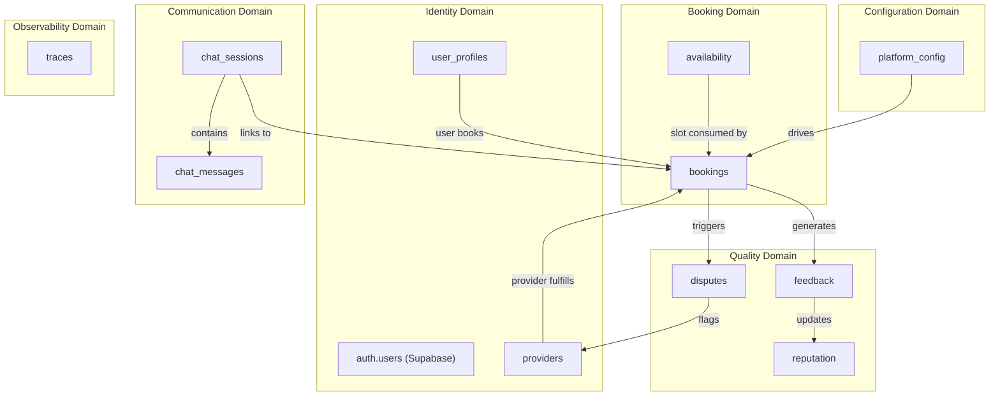
```mermaid
graph TB
    subgraph "Identity Domain"
        UP["user_profiles"]
        AUTH_TBL["auth.users (Supabase)"]
        PROV_PROF["providers"]
    end

    subgraph "Booking Domain"
        BOOK["bookings"]
        AVAIL["availability"]
    end

    subgraph "Communication Domain"
        CHAT_MSG["chat_messages"]
        CHAT_SES["chat_sessions"]
    end

    subgraph "Quality Domain"
        FEED["feedback"]
        REP["reputation"]
        DISP["disputes"]
    end

    subgraph "Configuration Domain"
        PCFG["platform_config"]
    end

    subgraph "Observability Domain"
        TRACES["traces"]
    end

    UP -->|"user books"| BOOK
    PROV_PROF -->|"provider fulfills"| BOOK
    AVAIL -->|"slot consumed by"| BOOK
    BOOK -->|"generates"| FEED
    BOOK -->|"triggers"| DISP
    FEED -->|"updates"| REP
    DISP -->|"flags"| PROV_PROF
    CHAT_SES -->|"contains"| CHAT_MSG
    CHAT_SES -->|"links to"| BOOK
    PCFG -->|"drives"| BOOK
```

---

## 6. Design Patterns

### 6.1 Tool-Calling Orchestrator (ADK)

The ADK chat interface uses a single Gemini LLM that invokes "tools" (functions) to drive the booking workflow. The LLM decides which tools to call and in what order based on the conversation state. This is a **ReAct (Reason + Act)** agent pattern.

**Why**: Gives conversational flexibility. The LLM can ask follow-up questions, handle multi-turn negotiation, and adapt to user edge cases without hardcoded logic.

### 6.2 DB-Driven Configuration

All pricing parameters live in the `platform_config` Supabase table. The `loadPlatformConfig()` function fetches them at runtime on every pricing call, with hardcoded defaults as fallback.

**Why**: Allows operators to change fees, urgency surcharges, and loyalty caps without code deploys. Supports operational agility.

### 6.3 Server-Enforced Session Metadata

The `agent.sessionMetadata` object is merged into every tool call's arguments server-side, regardless of what the LLM passes. This prevents the LLM from accidentally omitting `sessionId` or `userId` from tool calls.

**Why**: LLMs are probabilistic. Critical identifiers must be injected deterministically to prevent data integrity issues (bookings stored under wrong user, wrong session).

### 6.4 Isolated Auth Client Pattern

The `requireAuth` middleware creates a **disposable Supabase client** for token verification, separate from the shared `service-role` client used for all DB operations.

**Why**: If token refresh were called on the shared client, the client's internal auth state would be downgraded from `service_role` to user JWT, breaking all subsequent DB operations until server restart.

### 6.5 Booking Facts Injection (Anti-Hallucination)

Before every AI turn, the server queries confirmed bookings for the session from the DB and injects them as a verbatim block in the system instructions.

**Why**: Prevents the LLM from hallucinating "no booking found" when the conversation history has scrolled out of context, or after a server restart clears the in-memory agent cache.

---

## 7. Architectural Decisions

### ADR-001: Monolith over Microservices
**Decision**: Single Express process containing all routes, controllers, and AI agents.  
**Rationale**: Early-stage product. Team size small. Simpler deployment, simpler debugging, zero network latency between components.  
**Tradeoff**: Harder to scale individual agents independently. A spike in chat traffic also slows admin routes.

### ADR-002: Supabase over Custom PostgreSQL
**Decision**: Use Supabase hosted PostgreSQL with built-in auth.  
**Rationale**: Eliminates auth infrastructure. Supabase Auth provides JWT, OAuth, session management out of the box.  
**Tradeoff**: Locked into Supabase's JWT structure. Service role key must be kept secret — exposure gives full DB access.

### ADR-003: Google Gemini over OpenAI
**Decision**: All AI capabilities use Google Gemini.  
**Rationale**: Native multimodal (audio transcription + TTS + text in single API). Supports Urdu/Roman Urdu well. Cost competitive.  
**Tradeoff**: Less community tooling than OpenAI ecosystem.

### ADR-004: Single Conversational Interface
**Decision**: The platform uses the ADK chat interface (`/api/chat`) as the primary interaction mode.
**Rationale**: Conversational AI handles multi-turn negotiation, clarification, and confirmation naturally. The LLM-driven tool-calling approach adapts to user edge cases without hardcoded branching logic.
**Considerations**: All booking logic flows through the OrchestratorAgent and its 6 tools, keeping the interaction model consistent.

### ADR-005: Service-Role Database Access
**Decision**: The backend uses the Supabase `service_role` key for all database operations.
**Rationale**: The server-side backend requires full administrative access to manage bookings, providers, and user data across all operations. The `service_role` client provides this access cleanly without per-operation auth overhead.

---

## 8. Architecture Design Choices

| Concern | Approach | Characteristics |
|---------|----------|------------------|
| **State Management** | In-memory `agentCache` Map | Fast O(1) access, rebuilt from DB on server restart |
| **Session Persistence** | DB-backed `chat_messages` + `chat_sessions` | Reliable across restarts, full conversation replay |
| **Pricing Config** | DB-stored `platform_config` | Hot-configurable without code deployment |
| **AI Context** | Sliding 6-message window + rolling summary | Consistent memory footprint with full context preservation via summaries |
| **Push Notifications** | Event-driven lifecycle notifications | Instrumented at all 6 lifecycle events |
| **Geocoding** | Karachi area coordinates | No external API dependency, optimized for target market |

---

## 9. Monolith Architecture

**Architecture**: Single-process monolith — one Express server with all functionality co-located.

---

## 10. Integration Architecture

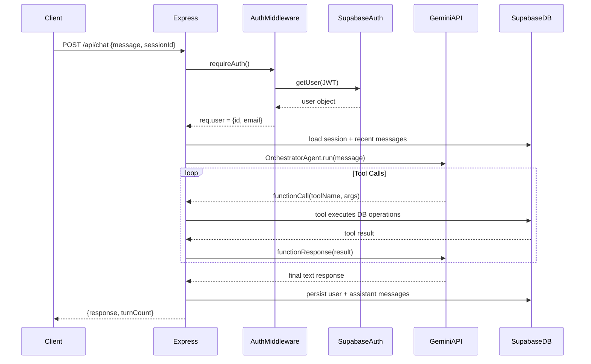
```mermaid
sequenceDiagram
    participant Client
    participant Express
    participant AuthMiddleware
    participant SupabaseAuth
    participant GeminiAPI
    participant SupabaseDB

    Client->>Express: POST /api/chat {message, sessionId}
    Express->>AuthMiddleware: requireAuth()
    AuthMiddleware->>SupabaseAuth: getUser(JWT)
    SupabaseAuth-->>AuthMiddleware: user object
    AuthMiddleware-->>Express: req.user = {id, email}

    Express->>SupabaseDB: load session + recent messages
    Express->>GeminiAPI: OrchestratorAgent.run(message)
    loop Tool Calls
        GeminiAPI-->>Express: functionCall(toolName, args)
        Express->>SupabaseDB: tool executes DB operations
        SupabaseDB-->>Express: tool result
        Express->>GeminiAPI: functionResponse(result)
    end
    GeminiAPI-->>Express: final text response
    Express->>SupabaseDB: persist user + assistant messages
    Express-->>Client: {response, turnCount}
```

---

*See [09_Agent_Flow_Documentation.md](09_Agent_Flow_Documentation.md) for deep analysis of each agent.*  
*See [03_Database_Architecture.md](03_Database_Architecture.md) for database design.*


---

# Document 02 — Repository Structure
## DigitalKaam AI Service Platform

**Document Type**: Developer Reference  
**Audience**: New Developers, Contributors  
**Related Documents**: [01_System_Architecture](01_System_Architecture.md) | [04_API_Documentation](04_API_Documentation.md) | [09_Agent_Flow_Documentation](09_Agent_Flow_Documentation.md)

---

## 1. Overview

The repository is a **monorepo** containing two distinct application packages under the `d:\DigitalKaam\` root:

| Package | Path | Runtime |
|---------|------|------|
| **backend** | `backend/` | Node.js / Express |
| **mobile** | `mobile/` | React Native / Expo |

All production business logic lives in `backend/`. The `mobile/` package contains the React Native/Expo scaffold with API client utilities.

---

## 2. Root-Level Files

| File | Purpose |
|------|---------|
| `supabase_schema.sql` | Complete database schema — source of truth for all tables |
| `rls_fix.sql` | Migration helper for RLS (Row Level Security) configuration |
| `implementation_plan.md` | Engineering implementation notes |
| `agent_implementation.md` | AI agent implementation notes |
| `auth_implementation.md` | Auth implementation notes |
| `project_context.md` | High-level project context document |
| `walkthrough.md` | Developer walkthrough |
| `Agent_task.md` | Agent task specification |
| `prevent_double_booking_implementation_plan` | Notes on the double-booking prevention feature |
| `Digital Kaam.postman_collection.json` | Full Postman collection for API testing |
| `skills-lock.json` | VS Code Copilot skills lock file |

---

## 3. Backend Package Structure

```
backend/
├── package.json              # npm manifest, scripts, dependencies
├── tsconfig.json             # TypeScript compiler config
├── api-tests.http            # VS Code REST Client test file
└── src/
    ├── index.ts              # ◀ APPLICATION ENTRY POINT
    ├── scratch.ts            # Ad-hoc dev/test scratch file
    │
    ├── adk/                  # Agent Development Kit (custom framework)
    │   ├── Agent.ts          # Agent class — runs Gemini with tool loop
    │   ├── Memory.ts         # In-process conversation history
    │   ├── Tool.ts           # Tool class — wraps a callable function
    │   ├── agents/
    │   │   ├── OrchestratorAgent.ts   # Main chat orchestrator (all tools)
    │   │   ├── SummarizerAgent.ts     # Conversation summarizer (no tools)
    │   │   ├── BookingAgent.ts        # Specialized booking agent
    │   │   ├── DiscoveryAgent.ts      # Specialized discovery agent
    │   │   ├── DisputeAgent.ts        # Specialized dispute agent
    │   │   ├── PricingAgent.ts        # Specialized pricing agent
    │   │   └── SchedulingAgent.ts     # Specialized scheduling agent
    │   └── tools/
    │       ├── FindProvidersTool.ts       # Tool: find + rank providers
    │       ├── CalculateQuoteTool.ts      # Tool: compute price quote
    │       ├── CheckAvailabilityTool.ts   # Tool: check provider slots
    │       ├── ConfirmBookingTool.ts      # Tool: finalize booking (DB write)
    │       ├── CreateTicketTool.ts        # Tool: open dispute ticket
    │       └── GetBookingsTool.ts         # Tool: retrieve session bookings
    │
    ├── controllers/          # Business logic layer — pure functions
    │   ├── discoveryController.ts     # Provider DB search + area aliasing
    │   ├── matchingController.ts      # 10-factor provider scoring
    │   ├── pricingController.ts       # Dynamic pricing engine
    │   ├── schedulingController.ts    # Availability slot selection
    │   ├── bookingController.ts       # Booking creation + receipt
    │   ├── lifecycleController.ts     # Booking status state machine
    │   ├── reputationController.ts    # Rating update + reputation
    │   └── disputeController.ts       # Dispute logic + refund calculation
    │
    ├── data/
    │   └── seed.ts            # Database seeding script
    │
    ├── lib/
    │   ├── gemini.ts          # Google Gemini SDK wrappers
    │   └── supabase.ts        # Supabase client singleton
    │
    ├── middleware/
    │   └── auth.ts            # JWT verification + auto-refresh
    │
    └── routes/                # HTTP route definitions
        ├── auth.routes.ts         # /api/auth
        ├── chat.routes.ts         # /api/chat  ← most complex route
        ├── booking.routes.ts      # /api/booking
        ├── dispute.routes.ts      # /api/dispute
        ├── provider.routes.ts     # /api/provider
        ├── users.routes.ts        # /api/users
        ├── availability.routes.ts # /api/availability
        ├── reputation.routes.ts   # /api/reputation
        ├── traces.routes.ts       # /api/traces
        ├── feedback.routes.ts     # /api/feedback
        └── admin.routes.ts        # /api/admin
```

---

## 4. Module Ownership & Responsibilities

### 4.1 `src/index.ts` — Application Entry Point

**Responsibilities**:
- Initializes Express application
- Registers global middleware (CORS, JSON body parser, rate limiters)
- Mounts all route groups
- Starts HTTP server on `process.env.PORT` (default: 3000)
- Exposes `/health` endpoint

**Rate limiter configuration** (defined here):
| Limiter | Window | Max Requests | Applied To |
|---------|--------|-------------|-----------|
| `generalLimiter` | 60s | 100 | `/api/*` |
| `chatLimiter` | 60s | 20 | `/api/chat` |
| `authLimiter` | 15 min | 10 | `/api/auth` |

> **Note**: The `chatLimiter` overrides `generalLimiter` for chat routes because Gemini calls are expensive (latency + cost).

### 4.2 `src/adk/` — Agent Development Kit

A **custom, lightweight agent framework** built on top of the Google GenAI SDK. This is NOT a third-party library — it is proprietary code specific to this project.

**`Agent.ts`**: The core agent class. Implements the Gemini function-calling loop:
1. Send message + history to Gemini
2. If Gemini returns `functionCalls`, execute each tool
3. Append function call + response to memory
4. Loop until Gemini returns a text response (no more function calls)

**`Memory.ts`**: In-memory conversation history. Stores the `Content[]` array required by the Gemini SDK. Cleared on server restart (persistence is handled externally via `chat_messages` DB table).

**`Tool.ts`**: Wrapper class for tool definitions. Exposes `toFunctionDeclaration()` which converts the tool config to Gemini's `FunctionDeclaration` format.

**`agents/OrchestratorAgent.ts`**: The only active agent in the ADK system. Contains:
- Detailed system instructions (English + Roman Urdu + Urdu script formatting templates)
- Language detection and response language rules
- Booking conversation flow (5 steps)
- Edge case rules (provider unavailable, budget issues, disputes)
- Double-booking prevention instructions

**`agents/SummarizerAgent.ts`**: A stateless Gemini call (no tools, no history). Compresses older conversation turns into ≤200-word summaries preserving booking IDs and key facts.

**`agents/BookingAgent.ts`, `DiscoveryAgent.ts`, `DisputeAgent.ts`, `PricingAgent.ts`, `SchedulingAgent.ts`**: Domain-specialized agent modules built on the same `Agent` → `Memory` → `Tool` framework as the `OrchestratorAgent`. Each encapsulates system instructions and tool configuration for its respective domain.

**`tools/`**: Each tool wraps one or more controller functions. The tools:
1. Receive args from the LLM (merged with server-injected `sessionMetadata`)
2. Call the appropriate controller(s)
3. Return structured results back to the LLM

### 4.3 `src/controllers/` — Business Logic Layer

Controllers are **pure async functions** (not classes). Each controller:
- Accepts typed input parameters
- Executes business logic (DB queries, AI calls, calculations)
- Writes a trace record to the `traces` table
- Returns a typed output interface

All controllers use the shared `supabase` singleton for DB access.

**Controller dependency graph**:
```
discoveryController → (DB:providers, DB:traces)
matchingController → (DB:availability, DB:traces)
pricingController → (DB:platform_config, DB:traces)
schedulingController → (DB:availability, DB:traces)
bookingController → (DB:bookings, DB:availability, DB:user_profiles, DB:traces)
lifecycleController → (DB:bookings, DB:traces)
reputationController → (DB:feedback, DB:providers, DB:reputation, DB:traces)
disputeController → (DB:disputes, DB:bookings, DB:reputation, DB:traces)
```

### 4.4 `src/lib/` — Shared Libraries

**`supabase.ts`**: Creates and exports the **single shared Supabase client** using `service_role` key. This client has full database access (bypasses RLS). All controllers use this singleton.

**`gemini.ts`**: Exports:
- `transcribeAudio(base64, mimeType)` — multimodal audio → text using `gemini-2.0-flash`
- `generateSpeech(text, voice)` — TTS using `gemini-2.5-flash-preview-tts`, returns base64 WAV
- `pcmToWav(pcm)` — internal PCM-to-WAV converter (Gemini TTS returns raw PCM)

> **Note**: `lib/gemini.ts` uses the `@google/genai` SDK for audio and TTS operations, with the `Agent` class handling all conversational interactions.

### 4.6 `src/middleware/auth.ts` — Authentication Guard

The `requireAuth` middleware:
1. Extracts Bearer token from `Authorization` header
2. Creates a disposable Supabase auth client (isolated from shared DB client)
3. Verifies token with `authClient.auth.getUser(token)`
4. On expiry: attempts auto-refresh if `X-Refresh-Token` header present
5. Sets `req.user = { id, email }` for downstream handlers
6. On refresh success: sends `X-New-Access-Token`, `X-New-Refresh-Token`, `X-New-Expires-In` response headers

### 4.7 `src/routes/` — HTTP Route Handlers

Routes are thin wrappers around controllers. Most routes:
- Extract body/params
- Call controller function(s)
- Return JSON response

The exception is **`chat.routes.ts`** which contains significant logic:
- Session creation/lookup
- Message window management
- Summarization triggering
- Agent cache management
- Booking facts injection
- Message persistence

### 4.8 `src/data/seed.ts` — Database Seed Script

Generates realistic provider data for all Karachi areas. Creates:
- 5 providers per service type per area (7 service types × 7 areas = up to 245 providers)
- 3–5 availability slots per provider for the next 14 days
- Realistic specializations, skills, certifications, and hourly rates per service category

Run with: `npm run seed`

---

## 5. Mobile Package Structure

```
mobile/
├── package.json     # Expo/React Native manifest
├── app.json         # Expo app config
├── App.tsx          # Application entry component
├── index.ts         # App entry point
├── tsconfig.json    # TypeScript config
├── AGENTS.md        # Agent instructions for Claude
├── CLAUDE.md        # Claude coding instructions
├── assets/          # Image assets
└── utils/
    ├── api.ts       # HTTP API client wrapper
    ├── supabase.ts  # Mobile Supabase client (anon key)
    └── voice.ts     # Voice utilities
```

The `mobile/utils/api.ts` contains a complete API client wrapper (`api.service.request`, `api.booking.*`, `api.dispute.*`, `api.provider.*`) ready for mobile UI integration.

---

## 6. Shared Libraries and Architecture

### Architecture Patterns

1. **`supabase` singleton** (`lib/supabase.ts`): The shared Supabase client used by all controllers for consistent, authenticated database access.

2. **`AREA_COORDS` constant**: Geographic coordinate mapping defined in both `discoveryController.ts` and `matchingController.ts` for Karachi area-based calculations.

3. **Pricing defaults**: Hardcoded in `pricingController.ts` as `const DEFAULTS`, providing resilient fallbacks when DB config is not available.

4. **`agentCache`**: A module-level `Map` in `chat.routes.ts` providing fast in-process access to active `OrchestratorAgent` instances.

---

## 7. Entry Points Summary

| Entry Point | File | Auth | Description |
|-------------|------|------|-------------|
| HTTP Server | `src/index.ts` | — | Starts Express, mounts routes |
| Chat API | `src/routes/chat.routes.ts` | JWT required | Main user-facing chat |

| Auth API | `src/routes/auth.routes.ts` | Mixed | Login, signup, profile |
| Seed Script | `src/data/seed.ts` | — | CLI — seeds DB with test data |

---

## 8. Build & Run

```bash
# Install dependencies
cd backend
npm install

# Development (ts-node with hot reload)
npm run dev

# Build (compile TypeScript to dist/)
npm run build

# Production start
npm start

# Seed database
npm run seed
```

**Required environment variables** (in `backend/.env`):
```
SUPABASE_URL=https://YOUR_PROJECT.supabase.co
SUPABASE_SERVICE_KEY=your_service_role_key
GEMINI_API_KEY=your_google_gemini_key
PORT=3000   # optional, defaults to 3000
```

---

*See [14_Deployment_Architecture.md](14_Deployment_Architecture.md) for full deployment guide.*


---

# Document 03 — Database Architecture
## DigitalKaam AI Service Platform

**Document Type**: Database Reference  
**Audience**: Backend Developers, DBAs, Architects  
**Related Documents**: [01_System_Architecture](01_System_Architecture.md) | [06_Pricing_Engine](06_Pricing_Engine.md) | [08_Business_Workflows](08_Business_Workflows.md)

---

## 1. Database Overview

| Property | Value |
|----------|-------|
| **Engine** | PostgreSQL (via Supabase) |
| **Host** | Supabase managed cloud instance |
| **Schema** | `public` (all application tables) + `auth` (Supabase auth tables, not directly managed) |
| **Total Tables** | 11 application tables |
| **Auth Layer** | `auth.users` — managed entirely by Supabase Auth |
| **RLS Status** | Service-role access model — server-side only |
| **Access Method** | Server-side only via `service_role` key (administrative access) |
| **Schema Source** | `supabase_schema.sql` (root of repository) |

---

## 2. Entity Relationship Diagram

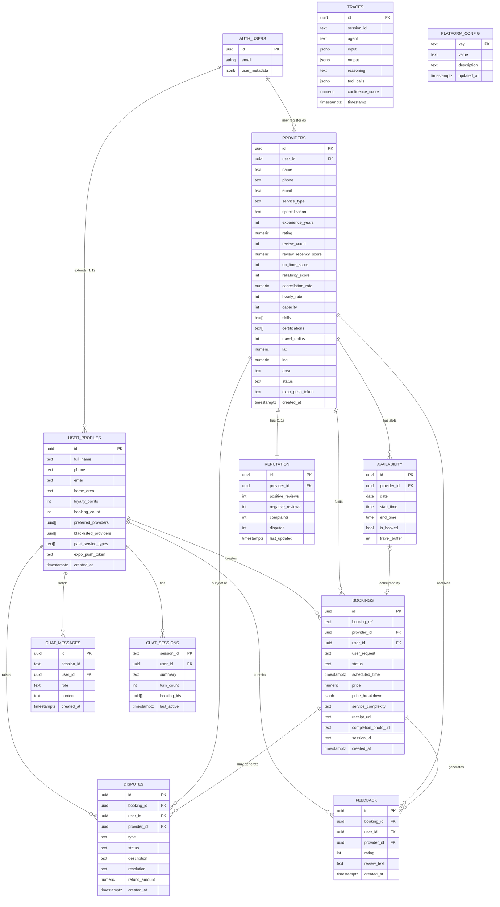
```mermaid
erDiagram
    AUTH_USERS {
        uuid id PK
        string email
        jsonb user_metadata
    }

    USER_PROFILES {
        uuid id PK
        text full_name
        text phone
        text email
        text home_area
        int loyalty_points
        int booking_count
        uuid[] preferred_providers
        uuid[] blacklisted_providers
        text[] past_service_types
        text expo_push_token
        timestamptz created_at
    }

    PROVIDERS {
        uuid id PK
        uuid user_id FK
        text name
        text phone
        text email
        text service_type
        text specialization
        int experience_years
        numeric rating
        int review_count
        numeric review_recency_score
        int on_time_score
        int reliability_score
        numeric cancellation_rate
        int hourly_rate
        int capacity
        text[] skills
        text[] certifications
        int travel_radius
        numeric lat
        numeric lng
        text area
        text status
        text expo_push_token
        timestamptz created_at
    }

    AVAILABILITY {
        uuid id PK
        uuid provider_id FK
        date date
        time start_time
        time end_time
        bool is_booked
        int travel_buffer
    }

    BOOKINGS {
        uuid id PK
        text booking_ref
        uuid provider_id FK
        uuid user_id FK
        text user_request
        text status
        timestamptz scheduled_time
        numeric price
        jsonb price_breakdown
        text service_complexity
        text receipt_url
        text completion_photo_url
        text session_id
        timestamptz created_at
    }

    REPUTATION {
        uuid id PK
        uuid provider_id FK
        int positive_reviews
        int negative_reviews
        int complaints
        int disputes
        timestamptz last_updated
    }

    TRACES {
        uuid id PK
        text session_id
        text agent
        jsonb input
        jsonb output
        text reasoning
        jsonb tool_calls
        numeric confidence_score
        timestamptz timestamp
    }

    DISPUTES {
        uuid id PK
        uuid booking_id FK
        uuid user_id FK
        uuid provider_id FK
        text type
        text status
        text description
        text resolution
        numeric refund_amount
        timestamptz created_at
    }

    FEEDBACK {
        uuid id PK
        uuid booking_id FK
        uuid user_id FK
        uuid provider_id FK
        int rating
        text review_text
        timestamptz created_at
    }

    CHAT_MESSAGES {
        uuid id PK
        text session_id
        uuid user_id FK
        text role
        text content
        timestamptz created_at
    }

    CHAT_SESSIONS {
        text session_id PK
        uuid user_id FK
        text summary
        int turn_count
        uuid[] booking_ids
        timestamptz last_active
    }

    PLATFORM_CONFIG {
        text key PK
        text value
        text description
        timestamptz updated_at
    }

    AUTH_USERS ||--o{ USER_PROFILES : "extends (1:1)"
    AUTH_USERS ||--o{ PROVIDERS : "may register as"
    USER_PROFILES ||--o{ BOOKINGS : "creates"
    USER_PROFILES ||--o{ CHAT_SESSIONS : "has"
    USER_PROFILES ||--o{ CHAT_MESSAGES : "sends"
    USER_PROFILES ||--o{ DISPUTES : "raises"
    USER_PROFILES ||--o{ FEEDBACK : "submits"
    PROVIDERS ||--o{ AVAILABILITY : "has slots"
    PROVIDERS ||--|| REPUTATION : "has (1:1)"
    PROVIDERS ||--o{ BOOKINGS : "fulfills"
    PROVIDERS ||--o{ DISPUTES : "subject of"
    PROVIDERS ||--o{ FEEDBACK : "receives"
    BOOKINGS ||--o{ DISPUTES : "may generate"
    BOOKINGS ||--o{ FEEDBACK : "generates"
    AVAILABILITY |o--o| BOOKINGS : "consumed by"
```

---

## 3. Table Documentation

### 3.1 `user_profiles`

**Purpose**: Extends Supabase's `auth.users` with application-specific profile data. One row per registered user.

| Column | Type | Nullable | Default | Description |
|--------|------|----------|---------|-------------|
| `id` | UUID | No | — | FK to `auth.users(id)`, CASCADE delete |
| `full_name` | TEXT | No | — | Display name |
| `phone` | TEXT | Yes | — | Contact number |
| `email` | TEXT | Yes | — | Denormalized from auth (convenience) |
| `home_area` | TEXT | Yes | — | User's home Karachi area (e.g., "Gulshan") |
| `loyalty_points` | INTEGER | No | 0 | Accumulated loyalty points (not auto-decremented on use) |
| `booking_count` | INTEGER | No | 0 | Total confirmed bookings (used to detect returning users) |
| `preferred_providers` | UUID[] | No | `{}` | Provider IDs the user explicitly prefers |
| `blacklisted_providers` | UUID[] | No | `{}` | Provider IDs the user blocks |
| `past_service_types` | TEXT[] | No | `{}` | Service types the user has booked before |
| `expo_push_token` | TEXT | Yes | — | Expo push notification token |
| `created_at` | TIMESTAMPTZ | No | NOW() | Account creation timestamp |

**Business Rules**:
- `booking_count` is incremented by `bookingController` as a **fire-and-forget** async operation (non-blocking, non-fatal)
- `loyalty_points` is read by `contextController` — the loyalty discount is calculated from this balance and applied as a deduction from the booking price, recorded in `price_breakdown`
- `preferred_providers` and `blacklisted_providers` directly influence the provider matching score (+5% boost or instant 0 score)

**Lifecycle**: Created on signup or OAuth profile sync. Deleted on auth user delete (CASCADE).

---

### 3.2 `providers`

**Purpose**: All registered service providers. A user can convert their account to a provider via the onboarding endpoint.

| Column | Type | Nullable | Default | Description |
|--------|------|----------|---------|-------------|
| `id` | UUID | No | `gen_random_uuid()` | Primary key |
| `user_id` | UUID | Yes | — | FK to `auth.users(id)`, CASCADE delete. Null for seed data providers. |
| `name` | TEXT | No | — | Provider display name |
| `phone` | TEXT | Yes | — | Contact phone |
| `email` | TEXT | Yes | — | Contact email |
| `service_type` | TEXT | No | — | One of: AC Technician, Electrician, Plumber, Mechanic, Tutor, Beautician, Driver |
| `specialization` | TEXT | Yes | — | Free-text specialty (e.g., "Inverter AC Repair") |
| `experience_years` | INTEGER | Yes | — | Years of professional experience |
| `rating` | NUMERIC(3,1) | No | 0.0 | Weighted moving average rating (0.0–5.0) |
| `review_count` | INTEGER | No | 0 | Total reviews received |
| `review_recency_score` | NUMERIC(3,2) | No | 0.5 | Recency of reviews (0–1). Resets to 0.95 on each new review. |
| `on_time_score` | INTEGER | No | 100 | Punctuality score (0–100). Currently read but not written by app logic. |
| `reliability_score` | INTEGER | No | 100 | Overall reliability (0–100). Influences matching weight 15%. |
| `cancellation_rate` | NUMERIC(3,2) | No | 0.0 | Fraction of bookings cancelled (0.0–1.0) |
| `hourly_rate` | INTEGER | No | — | PKR per hour. Validated: 100–50,000. Used in pricing. |
| `capacity` | INTEGER | No | 4 | Max concurrent jobs. Seed data sets 3. Influences matching weight 5%. |
| `skills` | TEXT[] | No | `{}` | Array of skill strings |
| `certifications` | TEXT[] | No | `{}` | Array of certification strings |
| `travel_radius` | INTEGER | No | 10 | Max km provider will travel. Default 10km. |
| `lat` | NUMERIC | Yes | — | Provider's base latitude |
| `lng` | NUMERIC | Yes | — | Provider's base longitude |
| `area` | TEXT | Yes | — | Karachi area name (e.g., "Gulshan") |
| `status` | TEXT | No | 'active' | Discovery filter: only `status = 'active'` providers are returned |
| `expo_push_token` | TEXT | Yes | — | Expo push notification token |
| `created_at` | TIMESTAMPTZ | No | NOW() | Registration timestamp |

**Business Rules**:
- Discovery query filters `status = 'active'`
- A user can only have ONE provider profile (enforced by `provider.routes.ts` 409 check)
- Onboarding initializes `reliability_score=100`, `on_time_score=100`, `rating=0`, `capacity=3`
- Rating is updated by `reputationController` using weighted moving average: `(prevRating × reviewCount + newRating) / (reviewCount + 1)`

---

### 3.3 `availability`

**Purpose**: Provider availability slots. Each row represents one bookable time window for a provider on a specific date.

| Column | Type | Nullable | Default | Description |
|--------|------|----------|---------|-------------|
| `id` | UUID | No | `gen_random_uuid()` | Primary key |
| `provider_id` | UUID | No | — | FK to `providers(id)`, CASCADE delete |
| `date` | DATE | No | — | Calendar date of the slot |
| `start_time` | TIME | No | — | Slot start time (24h) |
| `end_time` | TIME | No | — | Slot end time (24h) |
| `is_booked` | BOOLEAN | No | false | Whether the slot is consumed |
| `travel_buffer` | INTEGER | No | 30 | Minutes reserved for travel after this slot |

**Business Rules**:
- `matchingController` queries `is_booked = false` for the requested date to determine `availScore` (20% of match score)
- `schedulingController` finds the closest matching slot to the requested time (within 1-hour tolerance: `|slotStart - reqStart| <= 100` in HHMM integer comparison)
- `bookingController` sets `is_booked = true` on the chosen slot after booking creation
- If `is_booked = true` already exists for a slot, it will not appear in availability queries

**Data Lifecycle**: Seeded by `seed.ts` for next 14 days. In production, providers would manage their own slots via the `POST /api/availability` endpoint.

---

### 3.4 `bookings`

**Purpose**: Central booking record. Created on confirmed booking. Status evolves through the lifecycle state machine.

| Column | Type | Nullable | Default | Description |
|--------|------|----------|---------|-------------|
| `id` | UUID | No | `gen_random_uuid()` | Primary key |
| `booking_ref` | TEXT | Unique | — | Human-readable reference (e.g., `DK-260518-K7M2`) |
| `provider_id` | UUID | No | — | FK to `providers(id)` |
| `user_id` | UUID | No | — | FK to `user_profiles(id)` |
| `user_request` | TEXT | Yes | — | Original natural language request from the user |
| `status` | TEXT | No | 'confirmed' | Lifecycle status (see below) |
| `scheduled_time` | TIMESTAMPTZ | Yes | — | Booked service time |
| `price` | NUMERIC | Yes | — | Total final price in PKR |
| `price_breakdown` | JSONB | Yes | — | Full breakdown: visitFee, laborFee, urgencySurcharge, loyaltyDiscount, platformFee, total |
| `service_complexity` | TEXT | Yes | — | basic / intermediate / complex |
| `receipt_url` | TEXT | Yes | — | URL to receipt (not currently generated) |
| `completion_photo_url` | TEXT | Yes | — | Photo URL uploaded by provider on job completion |
| `session_id` | TEXT | Yes | — | Chat session ID that created this booking |
| `created_at` | TIMESTAMPTZ | No | NOW() | Creation timestamp |

**Booking Status Values**:
```
confirmed → en_route → arrived → in_progress → completed → [feedback_pending]
         ↘ cancelled
         ↘ disputed
```

**`price_breakdown` JSONB Structure**:
```json
{
  "visitFee": 500,
  "estimatedHours": 2,
  "hourlyRate": 800,
  "laborFee": 1600,
  "urgencySurcharge": 250,
  "loyaltyDiscount": 100,
  "platformFee": 113,
  "total": 2363,
  "partsDisclaimer": "Parts/materials not included..."
}
```

**`booking_ref` Format**: `DK-YYMMDD-XXXX` where XXXX is 4 random chars from `ABCDEFGHJKLMNPQRSTUVWXYZ23456789` (ambiguous chars O, 0, 1, I excluded).

---

### 3.5 `reputation`

**Purpose**: Aggregated reputation counters for each provider, separate from the `providers.rating` field for separation of concerns.

| Column | Type | Nullable | Default | Description |
|--------|------|----------|---------|-------------|
| `id` | UUID | No | `gen_random_uuid()` | Primary key |
| `provider_id` | UUID | No | — | FK to `providers(id)`, CASCADE delete. 1:1 with providers. |
| `positive_reviews` | INTEGER | No | 0 | Count of reviews with rating ≥ 4 |
| `negative_reviews` | INTEGER | No | 0 | Count of reviews with rating ≤ 2 |
| `complaints` | INTEGER | No | 0 | Count of disputes raised against provider |
| `disputes` | INTEGER | No | 0 | Count of active/past disputes |
| `last_updated` | TIMESTAMPTZ | No | NOW() | Last time any reputation field changed |

**Business Rules**:
- Reputation row created at provider onboarding with all zeros
- `complaints` and `disputes` incremented on dispute creation (if `providerFlagged = true`)
- `positive_reviews` / `negative_reviews` incremented on feedback submission
- Reputation data is currently **read-joined** on provider profile but not used in matching score directly (the matching score uses `providers.rating` and `providers.reliability_score`)

---

### 3.6 `traces`

**Purpose**: Full AI decision audit log. Every agent (Intent, Context, Complexity, Discovery, Matching, Pricing, Scheduling, Booking, Reputation, Lifecycle, Dispute) writes one trace row per invocation.

| Column | Type | Nullable | Default | Description |
|--------|------|----------|---------|-------------|
| `id` | UUID | No | `gen_random_uuid()` | Primary key |
| `session_id` | TEXT | No | — | Session identifier (links traces to a conversation) |
| `agent` | TEXT | No | — | Agent name (e.g., "IntentAgent", "PricingAgent") |
| `input` | JSONB | Yes | — | What the agent received |
| `output` | JSONB | Yes | — | What the agent produced |
| `reasoning` | TEXT | Yes | — | Human-readable explanation of the decision |
| `tool_calls` | JSONB | Yes | — | Which tools/APIs were used |
| `confidence_score` | NUMERIC(3,2) | Yes | — | 0.0–1.0 confidence of the agent's decision |
| `timestamp` | TIMESTAMPTZ | No | NOW() | When the trace was written |

**Usage**: `GET /api/traces?sessionId=xxx` retrieves all traces for a session, enabling full replay of the AI decision chain.

---

### 3.7 `disputes`

**Purpose**: Formal dispute records created when a user reports a problem with a completed service.

| Column | Type | Nullable | Default | Description |
|--------|------|----------|---------|-------------|
| `id` | UUID | No | `gen_random_uuid()` | Primary key |
| `booking_id` | UUID | No | — | FK to `bookings(id)` |
| `user_id` | UUID | No | — | FK to `user_profiles(id)` |
| `provider_id` | UUID | No | — | FK to `providers(id)` |
| `type` | TEXT | No | — | One of: no_show, quality, price, cancellation, overrun |
| `status` | TEXT | No | 'open' | Current status: open, under_review, resolved, closed |
| `description` | TEXT | Yes | — | User's description of the issue |
| `resolution` | TEXT | Yes | — | AI-generated resolution recommendation |
| `refund_amount` | NUMERIC | No | 0 | Calculated refund amount in PKR |
| `created_at` | TIMESTAMPTZ | No | NOW() | Creation timestamp |

**Refund Calculation** (see [06_Pricing_Engine.md](06_Pricing_Engine.md) for context):
| Dispute Type | Refund % | Provider Flagged |
|-------------|----------|-----------------|
| `no_show` | 100% of booking price | Yes |
| `price` | 20% of booking price | Yes |
| `quality` | 30% of booking price | Yes |
| `cancellation` | 100% of booking price | No |
| `overrun` | 15% of booking price | Yes |

---

### 3.8 `feedback`

**Purpose**: Post-service ratings and reviews from users about providers.

| Column | Type | Nullable | Default | Description |
|--------|------|----------|---------|-------------|
| `id` | UUID | No | `gen_random_uuid()` | Primary key |
| `booking_id` | UUID | No | — | FK to `bookings(id)` |
| `user_id` | UUID | No | — | FK to `user_profiles(id)` |
| `provider_id` | UUID | No | — | FK to `providers(id)` |
| `rating` | INTEGER | No | — | 1–5 (enforced by CHECK constraint) |
| `review_text` | TEXT | Yes | — | Optional written review |
| `created_at` | TIMESTAMPTZ | No | NOW() | Submission timestamp |

**Downstream Effects**: Submission triggers `reputationController.updateReputation()` which:
1. Inserts the feedback row
2. Updates `bookings.status` to 'completed'
3. Recalculates `providers.rating` (weighted moving average)
4. Resets `providers.review_recency_score` to 0.95
5. Increments `reputation.positive_reviews` or `reputation.negative_reviews`

---

### 3.9 `chat_messages`

**Purpose**: Persistent conversation history for each chat session. All messages persisted to DB so conversation can survive server restarts.

| Column | Type | Nullable | Default | Description |
|--------|------|----------|---------|-------------|
| `id` | UUID | No | `gen_random_uuid()` | Primary key |
| `session_id` | TEXT | No | — | Chat session identifier |
| `user_id` | UUID | No | — | FK to `user_profiles(id)`, CASCADE delete |
| `role` | TEXT | No | — | 'user' or 'assistant' (enforced by CHECK) |
| `content` | TEXT | No | — | Message text content |
| `created_at` | TIMESTAMPTZ | No | NOW() | Message timestamp |

**Index**: `idx_chat_messages_session ON (session_id, created_at)` — optimizes the sliding window query used on every chat turn.

**Usage Pattern**: On each chat request, the last 6 messages (WINDOW_SIZE) are loaded by querying descending by `created_at` then reversing for chronological order.

---

### 3.10 `chat_sessions`

**Purpose**: Session-level metadata including rolling summary, turn count, and linked bookings.

| Column | Type | Nullable | Default | Description |
|--------|------|----------|---------|-------------|
| `session_id` | TEXT | No | — | Primary key (user-supplied UUID from client) |
| `user_id` | UUID | No | — | FK to `user_profiles(id)`, CASCADE delete |
| `summary` | TEXT | No | '' | Rolling AI-generated summary (≤200 words) |
| `turn_count` | INTEGER | No | 0 | Total message turns in this session |
| `booking_ids` | UUID[] | No | `{}` | Booking IDs created in this session |
| `last_active` | TIMESTAMPTZ | No | NOW() | Last message timestamp |

**Summarization Trigger**: Every `SUMMARIZE_EVERY = 8` turns, the `SummarizerAgent` compresses older messages into `summary`. This keeps context flat regardless of conversation length.

---

### 3.11 `platform_config`

**Purpose**: Database-driven configuration for all platform fees and limits. Operators can change values without code deploys.

| Key | Default Value | Description |
|-----|--------------|-------------|
| `platform_fee_fixed` | 50 | Flat PKR fee per booking |
| `platform_fee_percent` | 5 | % of service subtotal |
| `visit_fee` | 500 | Provider callout/diagnostic fee |
| `urgency_fee_high` | 250 | High severity surcharge |
| `urgency_fee_medium` | 100 | Medium severity surcharge |
| `loyalty_discount_cap` | 200 | Max loyalty discount per booking |

**Update API**: `PUT /api/admin/platform-config/:key` with `{ value: "new_value" }`.

Hardcoded fallback values in `pricingController.ts` match these defaults and activate automatically if the table is inaccessible.

---

## 4. Indexes

| Table | Index | Columns | Purpose |
|-------|-------|---------|---------|
| `chat_messages` | `idx_chat_messages_session` | `session_id, created_at` | Sliding window message query |


---

## 5. Normalization & Denormalization Notes

### Intentional Denormalization
- `providers.email` and `user_profiles.email` — email stored in both (denormalized from `auth.users`)
- `bookings.price_breakdown` — JSONB stores the full pricing detail at booking time (snapshot, prevents retroactive changes from affecting historical records)
- `bookings.user_request` — raw natural language stored (useful for support and AI retraining)

### Transactional Guarantees
- Booking creation sequentially updates `bookings`, marks `availability.is_booked = true`, and increments `user_profiles.booking_count`
- The `price_breakdown` JSONB snapshot in `bookings` preserves historical pricing data at the time of booking

---

## 6. Data Lifecycle

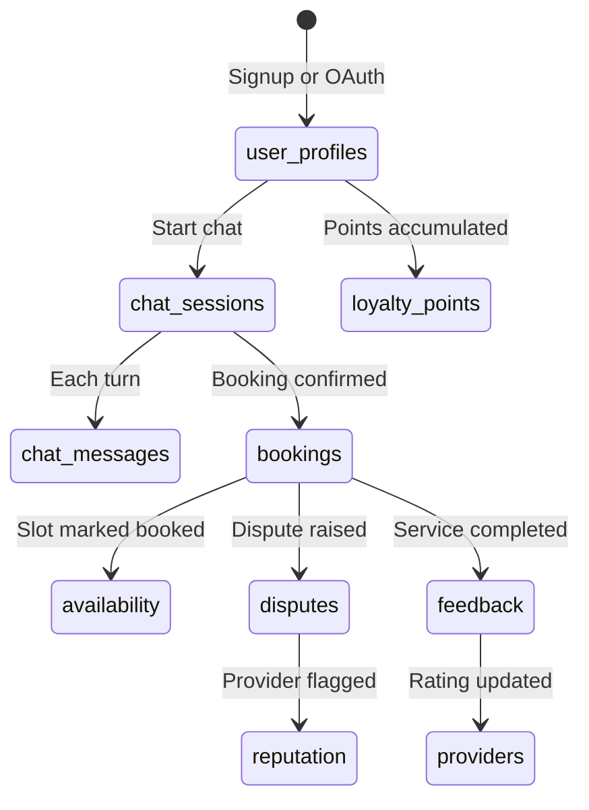
```mermaid
stateDiagram-v2
    [*] --> user_profiles : Signup or OAuth
    user_profiles --> chat_sessions : Start chat
    chat_sessions --> chat_messages : Each turn
    chat_sessions --> bookings : Booking confirmed
    bookings --> availability : Slot marked booked
    user_profiles --> loyalty_points : Points accumulated
    bookings --> disputes : Dispute raised
    bookings --> feedback : Service completed
    feedback --> providers : Rating updated
    disputes --> reputation : Provider flagged
```

---

## 7. Database Access Architecture

All database operations are performed server-side using the `service_role` key, which provides full administrative access to all tables. This model ensures consistent, controlled data access through the Express API layer.

All data reads and writes flow through the shared Supabase client singleton in `lib/supabase.ts`.

---

*See [06_Pricing_Engine.md](06_Pricing_Engine.md) for `platform_config` usage.*  
*See [08_Business_Workflows.md](08_Business_Workflows.md) for booking lifecycle state transitions.*


---

# Document 04 — API Documentation
## DigitalKaam AI Service Platform

**Document Type**: API Reference  
**Audience**: Frontend Developers, Mobile Developers, QA Engineers, API Integrators  
**Related Documents**: [05_Authentication_Authorization](05_Authentication_Authorization.md) | [03_Database_Architecture](03_Database_Architecture.md) | [08_Business_Workflows](08_Business_Workflows.md)

---

## 1. Global Configuration

### Base URL
```
http://localhost:3000   (development)
https://your-domain.com (production)
```

### Authentication
Most endpoints require a Bearer JWT token in the `Authorization` header:
```
Authorization: Bearer <access_token>
```
Token is obtained from `/api/auth/login` or `/api/auth/signup`.

### Rate Limits

| Route Group | Window | Max Requests | Header |
|-------------|--------|-------------|--------|
| `/api/*` (all) | 60 seconds | 100 | Standard |
| `/api/chat` | 60 seconds | 20 | Override |
| `/api/auth` | 15 minutes | 10 | Override |

Rate limit errors return HTTP 429 with:
```json
{ "error": "Too many requests. Please slow down." }
```

### Content Type
All requests must use `Content-Type: application/json`.

### Auto Token Refresh
When a token expires mid-request, include:
```
X-Refresh-Token: <refresh_token>
```
On successful refresh, the response includes updated tokens:
```
X-New-Access-Token: <new_token>
X-New-Refresh-Token: <new_refresh>
X-New-Expires-In: <seconds>
```
**Clients must update their local token storage** when these headers are present.

---

## 2. Health Check

### `GET /health`
No auth required. Returns server status.

**Response** `200`:
```json
{
  "status": "ok",
  "service": "DigitalKaam API",
  "timestamp": "2026-05-19T10:00:00.000Z"
}
```

---

## 3. Auth Routes — `/api/auth`

**Rate limit**: 10 requests per 15 minutes per IP.

---

### `POST /api/auth/signup`
Register a new user account with email and password.

**Auth**: Not required.

**Request Body**:
```json
{
  "email": "user@example.com",       // required
  "password": "SecurePass123",       // required, min 8 chars
  "full_name": "Ahmed Khan",         // required
  "phone": "+923001234567",          // optional
  "home_area": "Gulshan"             // optional
}
```

**Success Response** `201`:
```json
{
  "access_token": "eyJhbGci...",
  "refresh_token": "abc123...",
  "expires_in": 3600,
  "token_type": "Bearer",
  "userId": "uuid",
  "email": "user@example.com",
  "full_name": "Ahmed Khan",
  "isProvider": false,
  "providerId": null,
  "providerStatus": null
}
```

**Error Responses**:
- `400` — Missing required fields, password < 8 chars, email already exists
- `500` — Profile creation failed (auth user rolled back automatically)

**Side Effects**:
1. Creates row in `auth.users` (Supabase Auth)
2. Creates row in `user_profiles`
3. Returns signed-in session immediately (no email verification required)

**Rollback**: If `user_profiles` insert fails, the `auth.users` row is deleted via `supabase.auth.admin.deleteUser()`.

---

### `POST /api/auth/login`
Authenticate with email and password.

**Auth**: Not required.

**Request Body**:
```json
{
  "email": "user@example.com",
  "password": "SecurePass123"
}
```

**Success Response** `200`:
```json
{
  "access_token": "eyJhbGci...",
  "refresh_token": "abc123...",
  "expires_in": 3600,
  "token_type": "Bearer",
  "userId": "uuid",
  "email": "user@example.com",
  "full_name": "Ahmed Khan",
  "isProvider": true,
  "providerId": "uuid",
  "providerStatus": "active"
}
```

**Error Responses**:
- `400` — Email and password required
- `401` — Invalid credentials

**Side Effects**: None (read-only operation).

---

### `POST /api/auth/profile/sync`
**Required** after Google OAuth or any OAuth sign-in. Creates/upserts the `user_profiles` row that OAuth does not create automatically.

**Auth**: Required (Bearer token from OAuth session).

**Request Body**:
```json
{
  "full_name": "Ahmed Khan",  // optional, falls back to Google metadata
  "phone": "+923001234567",   // optional
  "home_area": "DHA"          // optional
}
```

**Success Response** `200`:
```json
{
  "userId": "uuid",
  "email": "user@example.com",
  "full_name": "Ahmed Khan",
  "isNewUser": true,
  "isProvider": false,
  "providerId": null,
  "providerStatus": null
}
```

**Side Effect**: Upserts `user_profiles` row (safe to call multiple times — idempotent).

---

## 4. Chat Routes — `/api/chat`

**Auth**: All routes require JWT. Applied via `router.use(requireAuth)`.  
**Rate limit**: 20 requests per minute.

---

### `POST /api/chat`
Main conversational AI endpoint. Sends a message to the OrchestratorAgent and receives a response.

**Auth**: Required.

**Request Body**:
```json
{
  "message": "Mujhe electrician chahiye Gulshan mein kal subah",
  "sessionId": "550e8400-e29b-41d4-a716-446655440000"
}
```

**Success Response** `200`:
```json
{
  "response": "Sure! I found 3 electricians in Gulshan for tomorrow morning...",
  "userId": "uuid",
  "turnCount": 3,
  "summarizedAt": null
}
```
- `summarizedAt` — non-null if summarization was triggered this turn (every 8 turns)

**Error Responses**:
- `400` — `message` or `sessionId` missing
- `500` — Session creation failed, FK violation (user profile missing), unhandled error

**Internal Flow**:
```
1. Load/create chat_session record
2. Load last 6 messages from chat_messages (DESC then reverse)
3. Maybe trigger summarization (if turnCount % 8 === 0)
4. Get or create Agent for this sessionId (agentCache)
5. Inject sessionId + userId into agent.sessionMetadata
6. Refresh booking facts block in system instructions
7. Persist user message to chat_messages
8. agent.run(message) → Gemini loop with tools
9. Persist assistant response to chat_messages
10. Increment turn_count, update last_active
11. Return response
```

**Critical Behaviors**:
- Each `sessionId` gets its own Agent instance cached in memory
- Agent is rebuilt from DB history on cache miss (server restart)
- Booking confirmation requires explicit user consent words ("yes", "confirm", "theek hai")
- Double-booking is blocked at DB level (`ConfirmBookingTool` checks for existing confirmed bookings per session)

---

### `GET /api/chat/history?sessionId=xxx`
Retrieve conversation history.

**Auth**: Required.

**Query Params**:
- `sessionId` (optional) — if provided, returns messages for that session; otherwise returns all sessions for the user

**Response with sessionId** `200`:
```json
{
  "sessionId": "uuid",
  "messages": [
    { "id": "uuid", "role": "user", "content": "...", "created_at": "..." },
    { "id": "uuid", "role": "assistant", "content": "...", "created_at": "..." }
  ],
  "summary": "User asked for electrician in Gulshan...",
  "turnCount": 6,
  "bookingIds": ["uuid1"]
}
```

**Response without sessionId** `200`:
```json
{
  "sessions": [
    { "session_id": "...", "summary": "...", "turn_count": 6, "last_active": "..." }
  ]
}
```

**Error Responses**:
- `403` — Session belongs to a different user
- `404` — Session not found
- `500` — Database error

**Security**: Ownership check is performed in application code (not DB query): `session.user_id !== userId` → 403.

---

### `POST /api/chat/transcribe`
Convert voice audio to text. Used before sending to `/api/chat`.

**Auth**: Required.

**Request Body**:
```json
{
  "audio": "<base64-encoded audio data>",
  "mimeType": "audio/m4a"
}
```

**Supported mimeTypes**: `audio/m4a`, `audio/mp4`, `audio/wav`, `audio/webm`, `audio/ogg`

**Success Response** `200`:
```json
{
  "transcription": "mujhe electrician chahiye"
}
```

**Error Responses**:
- `400` — Missing audio or mimeType
- `500` — Gemini transcription failed

**Size Limit**: 20MB (Gemini inline data cap). Typical voice message is < 1MB.  
**Model**: `gemini-2.0-flash` (multimodal)

---

### `POST /api/chat/speak`
Convert text to speech audio (WAV). Used to play back AI responses as voice.

**Auth**: Required.

**Request Body**:
```json
{
  "text": "Aapka booking confirm ho gaya!",
  "voice": "Kore"
}
```

**Available voices**: `Kore` (default), `Puck`, `Charon`, `Fenrir`, `Aoede`

**Success Response** `200`:
```json
{
  "audio": "<base64-encoded WAV>",
  "mimeType": "audio/wav"
}
```

**Error Responses**:
- `400` — Missing text
- `500` — Gemini TTS failed

**Audio Specs**: 24000 Hz, mono, 16-bit PCM, WAV container.

---

## 6. Booking Routes — `/api/booking`

**Auth**: Required on all routes.

---

### `GET /api/booking/user/me`
Retrieve all bookings for the authenticated user.

**Auth**: Required.

**Response** `200`: Array of booking objects with provider details.
```json
[
  {
    "id": "uuid",
    "booking_ref": "DK-260520-K7M2",
    "status": "confirmed",
    "scheduled_time": "2026-05-20T10:00:00Z",
    "price": 2363,
    "providers": { "name": "Ahmed", "service_type": "AC Technician", "rating": 4.2 }
  }
]
```

---

### `GET /api/booking/:bookingId`
Retrieve a specific booking by ID.

**Auth**: Required.

**Response** `200`: Booking with provider details.  
**Error** `404`: Booking not found.

---

### `POST /api/booking`
Create a booking directly (without AI pipeline). Admin/testing use.

**Auth**: Required.

**Request Body**: Booking object fields (see `bookings` table schema).

**Response** `201`: Created booking object.

---

### `PATCH /api/booking/:bookingId`
Update a booking's fields.

**Auth**: Required.

**Request Body**: Partial booking fields to update.

**Response** `200`: Updated booking.

---

### `DELETE /api/booking/:bookingId`
Delete a booking.

**Auth**: Required.

**Response** `204`: No content.

---

### `PATCH /api/booking/:bookingId/status`
Update booking lifecycle status. Typically called by the provider app.

**Auth**: Required.

**Request Body**:
```json
{
  "status": "en_route",
  "completionPhotoUrl": null,  // Required when status = 'completed'
  "sessionId": "uuid"          // Optional for tracing
}
```

**Valid Status Values**: `confirmed`, `en_route`, `arrived`, `in_progress`, `completed`, `feedback_pending`, `cancelled`, `disputed`

**Response** `200`:
```json
{
  "bookingId": "uuid",
  "previousStatus": "confirmed",
  "newStatus": "en_route",
  "message": "Your provider is on the way to you!",
  "pushSentToUser": true,
  "pushSentToProvider": true
}
```

**Note**: Push notification events are logged at each lifecycle transition.

---

### `POST /api/booking/:bookingId/feedback`
Submit post-service rating and review.

**Auth**: Required.

**Request Body**:
```json
{
  "userId": "uuid",
  "providerId": "uuid",
  "rating": 4,              // 1–5
  "reviewText": "Great job!",
  "sessionId": "uuid"
}
```

**Response** `200`:
```json
{
  "providerId": "uuid",
  "previousRating": 4.1,
  "newRating": 4.2,
  "newReviewRecencyScore": 0.95,
  "matchingImpact": "Positive: this provider will rank higher in future matches"
}
```

**Side Effects**:
1. Inserts `feedback` row
2. Updates `bookings.status` to 'completed'
3. Updates `providers.rating` (weighted moving average)
4. Resets `providers.review_recency_score` to 0.95
5. Updates `reputation.positive_reviews` or `reputation.negative_reviews`

---

## 7. Provider Routes — `/api/provider`

---

### `GET /api/provider/me`
Get the authenticated user's own provider profile.

**Auth**: Required.

**Response** `200`: Provider profile with reputation data.  
**Error** `404`: User has not registered as a provider.

---

### `POST /api/provider/onboard`
Convert an existing user account to a provider ("Become a Provider").

**Auth**: Required.

**Request Body**:
```json
{
  "service_type": "Electrician",     // required — one of 7 valid types
  "specialization": "3-Phase Wiring", // required
  "experience_years": 5,              // required
  "hourly_rate": 800,                 // required, 100–50000 PKR
  "area": "Gulshan",                  // required
  "phone": "+923001234567",           // optional, falls back to profile
  "skills": ["Wiring", "Solar"],      // optional
  "certifications": ["Elec License"], // optional
  "travel_radius": 15                 // optional, default 10km
}
```

**Response** `201`:
```json
{
  "message": "Provider profile created successfully.",
  "providerId": "uuid",
  "provider": { ... }
}
```

**Error Responses**:
- `400` — Missing required fields, invalid service_type, hourly_rate out of range
- `409` — User already has a provider profile

**Side Effects**:
1. Creates `providers` row with `status: 'active'`
2. Creates `reputation` row with all zeros

---

### `PATCH /api/provider/me`
Update the authenticated user's provider profile.

**Auth**: Required.

**Request Body**: Any updatable provider fields. `user_id` and `id` are stripped if included.

**Response** `200`: Updated provider.  
**Error** `404`: No provider profile found.

---

### `GET /api/provider`
List all active providers with optional filters.

**Auth**: Not required.

**Query Params**:
- `serviceType` — filter by service type
- `area` — filter by area

**Response** `200`: Array of provider objects, ordered by rating descending.

---

### `GET /api/provider/:providerId`
Get a single provider with reputation data.

**Auth**: Not required.

**Response** `200`: Provider with joined reputation.  
**Error** `404`: Provider not found.

---

## 8. Dispute Routes — `/api/dispute`

**Auth**: Not required (unauthenticated endpoint).

---

### `POST /api/dispute`
Open a new dispute for a booking.

**Request Body**:
```json
{
  "bookingId": "uuid",
  "userId": "uuid",
  "providerId": "uuid",
  "disputeType": "no_show",    // no_show | quality | price | cancellation | overrun
  "description": "Provider never arrived",
  "sessionId": "uuid"           // optional
}
```

**Response** `200`:
```json
{
  "disputeId": "uuid",
  "status": "under_review",
  "recommendation": "Full refund recommended. Provider marked for no-show.",
  "refundAmount": 2363,
  "escalated": false,
  "providerFlagged": true,
  "message": "..."
}
```

**Side Effects**:
1. Creates `disputes` row with `status: 'under_review'`
2. Updates `bookings.status` to 'disputed'
3. If `providerFlagged`: increments `reputation.complaints` and `reputation.disputes`

---

### `GET /api/dispute/:disputeId`
Get dispute by ID.

**Response** `200`: Dispute object.  
**Error** `404`: Not found.

---

### `GET /api/dispute/user/:userId`
Get all disputes for a user.

**Response** `200`: Array of disputes, newest first.

---

## 9. Availability Routes — `/api/availability`

**Auth**: Not required.

### `GET /api/availability`
Query availability slots.

**Query Params**:
- `providerId` — filter by provider
- `date` — filter by date (YYYY-MM-DD)

**Response** `200`: Array of availability slots.

### `POST /api/availability`
Create a new availability slot for a provider.

**Request Body**: `{ provider_id, date, start_time, end_time, is_booked?, travel_buffer? }`

**Response** `201`: Created slot.

### `PATCH /api/availability/:id`
Update a slot (e.g., mark as booked).

### `DELETE /api/availability/:id`
Delete a slot.

---

## 10. Users Routes — `/api/users`

**Auth**: Not required (unauthenticated endpoint).

### `GET /api/users` — List all user profiles
### `GET /api/users/:id` — Get user by ID
### `POST /api/users` — Create user (creates Supabase auth user + profile)
### `PATCH /api/users/:id` — Update user profile
### `DELETE /api/users/:id` — Delete user profile

---

## 11. Reputation Routes — `/api/reputation`

**Auth**: Not required.

### `GET /api/reputation?providerId=xxx` — Get reputation for provider
### `POST /api/reputation` — Create reputation record
### `PATCH /api/reputation/:id` — Update reputation
### `DELETE /api/reputation/:id` — Delete reputation record

---

## 12. Traces Routes — `/api/traces`

**Auth**: Not required.

### `GET /api/traces?sessionId=xxx` — Get all traces for a session
### `GET /api/traces/:id` — Get a single trace
### `POST /api/traces` — Create a trace (admin use)
### `DELETE /api/traces/:id` — Delete a trace

---

## 13. Feedback Routes — `/api/feedback`

**Auth**: Not required.

> **Note**: Feedback submission is handled by `POST /api/booking/:bookingId/feedback`. The `/api/feedback` routes appear to be additional CRUD endpoints.

---

## 14. Admin Routes — `/api/admin`

**Auth**: Required (JWT required).

---

### `GET /api/admin/platform-config`
Read all platform fee configuration values.

**Response** `200`:
```json
{
  "config": [
    { "key": "platform_fee_fixed", "value": "50", "description": "Flat platform fee...", "updated_at": "..." },
    { "key": "platform_fee_percent", "value": "5", "description": "...", "updated_at": "..." }
  ]
}
```

---

### `PUT /api/admin/platform-config/:key`
Update a single config value. Hot reload — pricing engine uses this value on the next booking.

**Valid keys**: `platform_fee_fixed`, `platform_fee_percent`, `visit_fee`, `urgency_fee_high`, `urgency_fee_medium`, `loyalty_discount_cap`

**Request Body**:
```json
{ "value": "75" }
```

**Response** `200`:
```json
{
  "message": "Config 'platform_fee_fixed' updated to '75'",
  "config": { ... }
}
```

**Validation**: Value must be numeric. Non-numeric values return `400`.

---

## 15. API Sequence Diagrams

### Chat Booking Flow

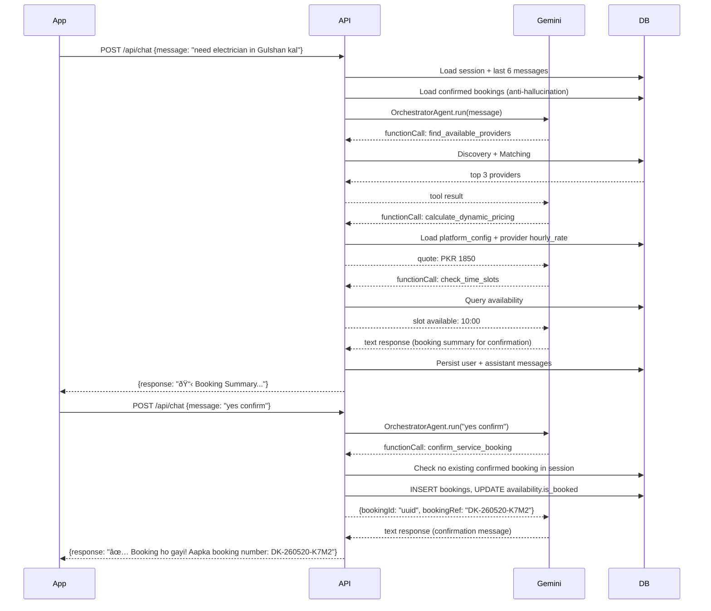
```mermaid
sequenceDiagram
    participant App
    participant API
    participant Gemini
    participant DB

    App->>API: POST /api/chat {message: "need electrician in Gulshan kal"}
    API->>DB: Load session + last 6 messages
    API->>DB: Load confirmed bookings (anti-hallucination)
    API->>Gemini: OrchestratorAgent.run(message)
    Gemini-->>API: functionCall: find_available_providers
    API->>DB: Discovery + Matching
    DB-->>API: top 3 providers
    API-->>Gemini: tool result
    Gemini-->>API: functionCall: calculate_dynamic_pricing
    API->>DB: Load platform_config + provider hourly_rate
    API-->>Gemini: quote: PKR 1850
    Gemini-->>API: functionCall: check_time_slots
    API->>DB: Query availability
    API-->>Gemini: slot available: 10:00
    Gemini-->>API: text response (booking summary for confirmation)
    API->>DB: Persist user + assistant messages
    API-->>App: {response: "📋 Booking Summary..."}

    App->>API: POST /api/chat {message: "yes confirm"}
    API->>Gemini: OrchestratorAgent.run("yes confirm")
    Gemini-->>API: functionCall: confirm_service_booking
    API->>DB: Check no existing confirmed booking in session
    API->>DB: INSERT bookings, UPDATE availability.is_booked
    API-->>Gemini: {bookingId: "uuid", bookingRef: "DK-260520-K7M2"}
    Gemini-->>API: text response (confirmation message)
    API-->>App: {response: "✅ Booking ho gayi! Aapka booking number: DK-260520-K7M2"}
```

---

*See [09_Agent_Flow_Documentation.md](09_Agent_Flow_Documentation.md) for detailed agent behavior.*  
*See [06_Pricing_Engine.md](06_Pricing_Engine.md) for pricing calculations.*


---

# Document 05 — Authentication & Authorization
## DigitalKaam AI Service Platform

**Document Type**: Security Reference  
**Audience**: Backend Developers, Security Engineers  
**Related Documents**: [04_API_Documentation](04_API_Documentation.md) | [11_Security_Review](11_Security_Review.md) | [03_Database_Architecture](03_Database_Architecture.md)

---

## 1. Overview

DigitalKaam uses **Supabase Auth** as its identity layer. Supabase provides:
- Email + Password authentication
- Google OAuth (and other OAuth providers)
- JWT generation and validation
- Session management
- Admin user management APIs

The backend acts as a **trusted server** using the `service_role` key, which grants full database access and bypasses all Row Level Security (RLS) policies.

---

## 2. Authentication Architecture

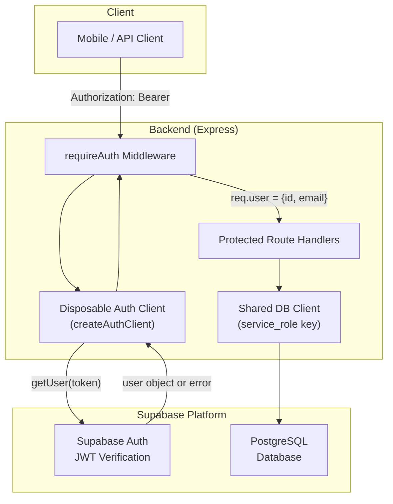
```mermaid
graph TB
    subgraph "Client"
        APP["Mobile / API Client"]
    end

    subgraph "Backend (Express)"
        MW["requireAuth Middleware"]
        AUTH_CLIENT["Disposable Auth Client\n(createAuthClient)"]
        SHARED_DB["Shared DB Client\n(service_role key)"]
        ROUTES["Protected Route Handlers"]
    end

    subgraph "Supabase Platform"
        SUP_AUTH["Supabase Auth\nJWT Verification"]
        SUP_DB["PostgreSQL\nDatabase"]
    end

    APP -->|"Authorization: Bearer <token>"| MW
    MW --> AUTH_CLIENT
    AUTH_CLIENT -->|"getUser(token)"| SUP_AUTH
    SUP_AUTH -->|"user object or error"| AUTH_CLIENT
    AUTH_CLIENT --> MW
    MW -->|"req.user = {id, email}"| ROUTES
    ROUTES --> SHARED_DB
    SHARED_DB --> SUP_DB
```

---

## 3. JWT Structure

Supabase issues standard HS256 JWTs. The payload contains:

```json
{
  "aud": "authenticated",
  "exp": 1748000000,           // Unix timestamp expiry
  "iat": 1747996400,           // Issued at
  "iss": "https://PROJECT.supabase.co/auth/v1",
  "sub": "user-uuid",          // User ID (used as req.user.id)
  "email": "user@example.com",
  "role": "authenticated",
  "session_id": "session-uuid"
}
```

The `sub` field becomes `req.user.id` throughout the application.

**Token Lifetime**: Configurable in Supabase (default: 1 hour access token, 60 days refresh token).

---

## 4. Token Verification Flow

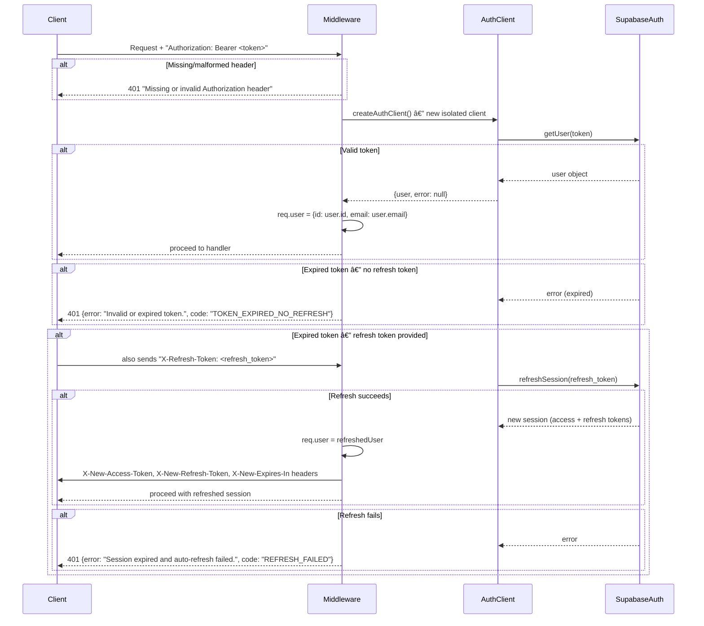
```mermaid
sequenceDiagram
    participant Client
    participant Middleware
    participant AuthClient
    participant SupabaseAuth

    Client->>Middleware: Request + "Authorization: Bearer <token>"

    alt Missing/malformed header
        Middleware-->>Client: 401 "Missing or invalid Authorization header"
    end

    Middleware->>AuthClient: createAuthClient() — new isolated client
    AuthClient->>SupabaseAuth: getUser(token)

    alt Valid token
        SupabaseAuth-->>AuthClient: user object
        AuthClient-->>Middleware: {user, error: null}
        Middleware->>Middleware: req.user = {id: user.id, email: user.email}
        Middleware-->>Client: proceed to handler
    end

    alt Expired token — no refresh token
        SupabaseAuth-->>AuthClient: error (expired)
        Middleware-->>Client: 401 {error: "Invalid or expired token.", code: "TOKEN_EXPIRED_NO_REFRESH"}
    end

    alt Expired token — refresh token provided
        Client->>Middleware: also sends "X-Refresh-Token: <refresh_token>"
        AuthClient->>SupabaseAuth: refreshSession(refresh_token)

        alt Refresh succeeds
            SupabaseAuth-->>AuthClient: new session (access + refresh tokens)
            Middleware->>Middleware: req.user = refreshedUser
            Middleware->>Client: X-New-Access-Token, X-New-Refresh-Token, X-New-Expires-In headers
            Middleware-->>Client: proceed with refreshed session
        end

        alt Refresh fails
            SupabaseAuth-->>AuthClient: error
            Middleware-->>Client: 401 {error: "Session expired and auto-refresh failed.", code: "REFRESH_FAILED"}
        end
    end
```

---

## 5. Isolated Auth Client Pattern

```typescript
// middleware/auth.ts
function createAuthClient() {
  return createClient(
    process.env.SUPABASE_URL!,
    process.env.SUPABASE_SERVICE_KEY!,
    { auth: { autoRefreshToken: false, persistSession: false } }
  )
}
```

**Why separate from the shared DB client?**

The shared DB client (`lib/supabase.ts`) uses the `service_role` key. If `refreshSession()` were called on this client, the client's internal auth state would update to the user's JWT. By using an isolated client for authentication checks, the service-role permissions of the DB client remain unchanged, ensuring consistent administrative database access throughout request processing.

The isolated client is created fresh for each authentication check and discarded after verification.

---

## 6. Signup Flow

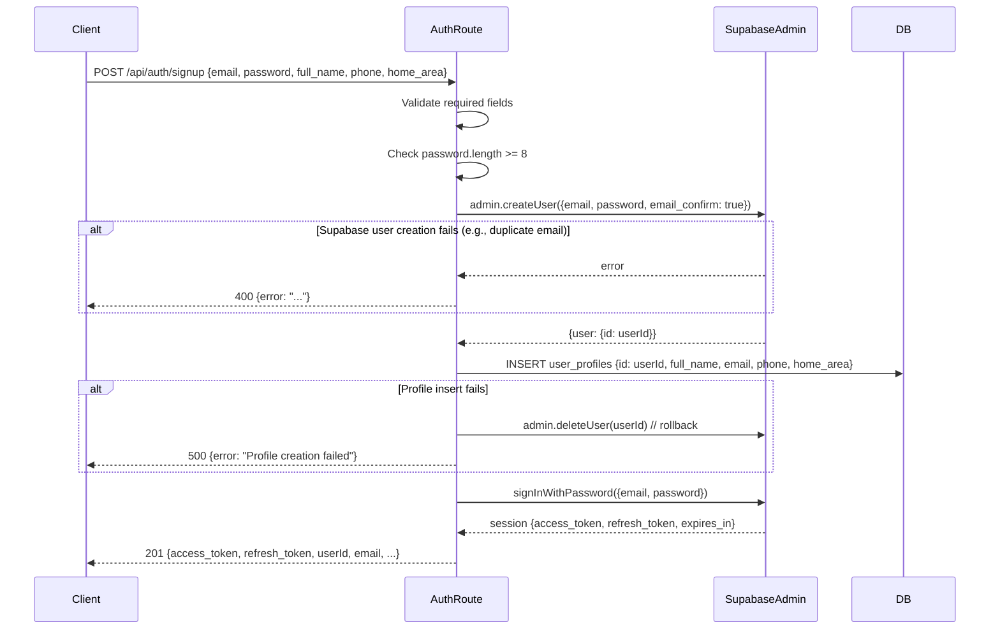
```mermaid
sequenceDiagram
    participant Client
    participant AuthRoute
    participant SupabaseAdmin
    participant DB

    Client->>AuthRoute: POST /api/auth/signup {email, password, full_name, phone, home_area}

    AuthRoute->>AuthRoute: Validate required fields
    AuthRoute->>AuthRoute: Check password.length >= 8

    AuthRoute->>SupabaseAdmin: admin.createUser({email, password, email_confirm: true})

    alt Supabase user creation fails (e.g., duplicate email)
        SupabaseAdmin-->>AuthRoute: error
        AuthRoute-->>Client: 400 {error: "..."}
    end

    SupabaseAdmin-->>AuthRoute: {user: {id: userId}}

    AuthRoute->>DB: INSERT user_profiles {id: userId, full_name, email, phone, home_area}

    alt Profile insert fails
        AuthRoute->>SupabaseAdmin: admin.deleteUser(userId)  // rollback
        AuthRoute-->>Client: 500 {error: "Profile creation failed"}
    end

    AuthRoute->>SupabaseAdmin: signInWithPassword({email, password})
    SupabaseAdmin-->>AuthRoute: session {access_token, refresh_token, expires_in}

    AuthRoute-->>Client: 201 {access_token, refresh_token, userId, email, ...}
```

**Key Behavior**: `email_confirm: true` is hardcoded — newly created accounts are immediately verified without email confirmation. This is a deliberate choice for mobile-first UX in Pakistan where email deliverability is unreliable.

---

## 7. Google OAuth Flow

Supabase handles the OAuth callback. The backend's role:

1. Frontend initiates Google OAuth via Supabase client SDK
2. Supabase handles redirect and returns session to client
3. Client **must immediately** call `POST /api/auth/profile/sync` with the OAuth token
4. `profile/sync` creates the `user_profiles` row if it doesn't exist (upsert)

**Why `profile/sync` is required**: Google OAuth creates the `auth.users` row but NOT the `user_profiles` row. Without calling `profile/sync`, the user cannot create chat sessions (FK violation on `chat_sessions.user_id → user_profiles.id`).

---

## 8. Authorization Model

### Current Model: Authentication-Only

The system has **no role-based access control (RBAC)**. Once a user has a valid JWT, they can call any authenticated endpoint. There is no concept of admin role, provider role, or user role at the API middleware level.

**Implicit role differentiation** (in code, not enforced at middleware level):
- Provider-specific actions (updating provider profile) check `providers.user_id = req.user.id`
- Booking ownership is not validated on most GET endpoints
- Admin endpoints (`/api/admin`) require auth but accept any authenticated user

### What Should Be Added

| Endpoint Category | Current | Required |
|------------------|---------|---------|
| Admin config changes | Any auth user | Admin role |
| Provider profile update | Auth + app-level check | Provider role |
| User data access | No auth on `/api/users` | Auth + ownership |
| Dispute resolution | No auth | Auth + role |
| Traces access | No auth | Admin only |

---

## 9. Protected Endpoints Summary

| Endpoint | Auth Required | Auth Level |
|----------|--------------|-----------|
| `POST /api/chat` | ✅ JWT | Any user |
| `GET /api/chat/history` | ✅ JWT | Owner |
| `POST /api/chat/transcribe` | ✅ JWT | Any user |
| `POST /api/chat/speak` | ✅ JWT | Any user |
| `POST /api/auth/profile/sync` | ✅ JWT | Any user |
| `GET /api/booking/user/me` | ✅ JWT | Owner |
| `GET /api/booking/:id` | ✅ JWT | Any user (no ownership check) |
| `POST /api/booking` | ✅ JWT | Any user |
| `PATCH /api/booking/:id/status` | ✅ JWT | Any user (no ownership check) |
| `POST /api/booking/:id/feedback` | ✅ JWT | Any user |
| `GET /api/provider/me` | ✅ JWT | Owner |
| `POST /api/provider/onboard` | ✅ JWT | Any user |
| `PATCH /api/provider/me` | ✅ JWT | Owner |
| `GET /api/admin/platform-config` | ✅ JWT | Any user (should be admin) |
| `PUT /api/admin/platform-config/:key` | ✅ JWT | Any user (should be admin) |
| `POST /api/auth/signup` | ❌ None | N/A |
| `POST /api/auth/login` | ❌ None | N/A |
| `GET /api/provider` | ❌ None | N/A |
| `GET /api/provider/:id` | ❌ None | N/A |
| `/api/users/*` | ❌ None | N/A |
| `/api/dispute/*` | ❌ None | N/A |
| `/api/availability/*` | ❌ None | N/A |
| `/api/reputation/*` | ❌ None | N/A |
| `/api/traces/*` | ❌ None | N/A |

---

## 10. Token Refresh Strategy

The auto-refresh strategy is **header-based**: clients must pass `X-Refresh-Token` alongside expired access tokens.

### Client Implementation Guide

```typescript
// Pseudo-code for mobile client
async function apiRequest(url: string, options: RequestInit) {
  const tokens = await getStoredTokens()
  
  const response = await fetch(url, {
    ...options,
    headers: {
      ...options.headers,
      'Authorization': `Bearer ${tokens.accessToken}`,
      'X-Refresh-Token': tokens.refreshToken  // always include
    }
  })

  // Check for rotated tokens
  const newAccessToken = response.headers.get('X-New-Access-Token')
  const newRefreshToken = response.headers.get('X-New-Refresh-Token')
  
  if (newAccessToken && newRefreshToken) {
    await updateStoredTokens(newAccessToken, newRefreshToken)
  }
  
  if (response.status === 401) {
    const body = await response.json()
    if (body.code === 'REFRESH_FAILED') {
      // Force logout
      await logout()
    }
  }
  
  return response
}
```

---

## 11. Service Role Key Security

The `SUPABASE_SERVICE_KEY` (service_role key) must be treated as a root credential:
- Never expose in client-side code
- Never commit to version control
- Store in secure environment variable management (e.g., Railway secrets, Render env vars)
- Rotate immediately if compromised

The service role key bypasses all PostgreSQL RLS policies and can read/write/delete any row in any table.

---

*See [11_Security_Review.md](11_Security_Review.md) for the full security architecture and controls.*


---

# Document 06 — Pricing Engine
## DigitalKaam AI Service Platform

**Document Type**: Business Logic Reference  
**Audience**: Developers, Product Managers, Finance, Auditors  
**Related Documents**: [07_Loyalty_Point_System](07_Loyalty_Point_System.md) | [03_Database_Architecture](03_Database_Architecture.md) | [09_Agent_Flow_Documentation](09_Agent_Flow_Documentation.md)

---

## 1. Overview

The DigitalKaam Pricing Engine calculates dynamic service quotes based on provider rates, job complexity, urgency, user loyalty, and platform fees. All configurable parameters are stored in the `platform_config` database table, enabling hot-reload configuration changes without code deployments.

**Source file**: `backend/src/controllers/pricingController.ts`

---

## 2. Pricing Formula — Complete Specification

### Step-by-Step Calculation

```
STEP 1: visitFee = cfg.visit_fee

STEP 2: laborFee = ROUND(provider.hourly_rate × complexity.estimatedDurationHours)

STEP 3: urgencySurcharge = urgencyMap[intent.severity]
        where urgencyMap = {
          low:    0,
          medium: cfg.urgency_fee_medium,
          high:   cfg.urgency_fee_high
        }

STEP 4: loyaltyDiscount = MIN(cfg.loyalty_discount_cap, FLOOR(loyaltyPoints / 100) × 50)

STEP 5: serviceSubtotal = visitFee + laborFee + urgencySurcharge - loyaltyDiscount

STEP 6: platformFee = ROUND(cfg.platform_fee_fixed + (serviceSubtotal × cfg.platform_fee_percent / 100))

STEP 7: total = MAX(visitFee, serviceSubtotal + platformFee)
```

### Mathematical Notation

$$\text{laborFee} = \text{round}(\text{hourlyRate} \times \text{estimatedHours})$$

$$\text{urgencySurcharge} = \begin{cases} 0 & \text{if severity} = \text{low} \\ \text{urgency\_fee\_medium} & \text{if severity} = \text{medium} \\ \text{urgency\_fee\_high} & \text{if severity} = \text{high} \end{cases}$$

$$\text{loyaltyDiscount} = \min\left(\text{loyalty\_discount\_cap},\ \left\lfloor \frac{\text{loyaltyPoints}}{100} \right\rfloor \times 50\right)$$

$$\text{serviceSubtotal} = \text{visitFee} + \text{laborFee} + \text{urgencySurcharge} - \text{loyaltyDiscount}$$

$$\text{platformFee} = \text{round}\left(\text{platform\_fee\_fixed} + \frac{\text{serviceSubtotal} \times \text{platform\_fee\_percent}}{100}\right)$$

$$\text{total} = \max(\text{visitFee},\ \text{serviceSubtotal} + \text{platformFee})$$

---

## 3. Configuration Parameters

All values stored in `platform_config` table. Fallback defaults are hardcoded in `pricingController.ts`:

| Config Key | Default | Type | Description |
|-----------|---------|------|-------------|
| `visit_fee` | 500 | PKR (flat) | Provider callout / diagnostic fee. Paid to provider. |
| `platform_fee_fixed` | 50 | PKR (flat) | Flat platform commission per booking. |
| `platform_fee_percent` | 5 | % | Percentage of `serviceSubtotal` taken by platform. |
| `urgency_fee_high` | 250 | PKR (flat) | Surcharge for high-severity requests (same-day, emergency). |
| `urgency_fee_medium` | 100 | PKR (flat) | Surcharge for medium-severity requests. |
| `loyalty_discount_cap` | 200 | PKR (max) | Maximum loyalty discount per booking. |

**Config Loading**: `loadPlatformConfig()` fetches all rows from `platform_config` at the start of every pricing call. Falls back silently to hardcoded defaults if the table is unreachable. No alerting is triggered on fallback.

---

## 4. Input Factors

| Factor | Source | Type | Used In |
|--------|--------|------|---------|
| `hourly_rate` | `providers.hourly_rate` | Integer (PKR/hr) | Labor fee calculation |
| `estimatedDurationHours` | `ComplexityOutput.estimatedDurationHours` | Float | Labor fee calculation |
| `intent.severity` | `IntentOutput.severity` (Gemini NLP) | low/medium/high | Urgency surcharge |
| `context.loyaltyPoints` | `user_profiles.loyalty_points` | Integer | Loyalty discount |
| `intent.budgetSensitivity` | `IntentOutput.budgetSensitivity` | low/medium/high | Budget note flag |

---

## 5. Worked Examples

### Example 1: Basic AC Cleaning (Low Severity, No Loyalty)
```
Provider hourly_rate: 600 PKR/hr
Estimated duration:   1 hour (basic)
Severity:             low
Loyalty points:       0

visitFee         = 500
laborFee         = ROUND(600 × 1) = 600
urgencySurcharge = 0 (low)
loyaltyDiscount  = MIN(200, FLOOR(0/100) × 50) = 0
serviceSubtotal  = 500 + 600 + 0 - 0 = 1100
platformFee      = ROUND(50 + (1100 × 5/100)) = ROUND(50 + 55) = 105
total            = MAX(500, 1100 + 105) = 1205 PKR
```

**Price Breakdown**:
| Component | Amount |
|-----------|--------|
| Visit Fee | PKR 500 |
| Labour (1 hr × 600/hr) | PKR 600 |
| Urgency Surcharge | PKR 0 |
| Loyalty Discount | -PKR 0 |
| Platform Fee | PKR 105 |
| **Total** | **PKR 1,205** |

---

### Example 2: Emergency AC Compressor Repair (High Severity, With Loyalty)
```
Provider hourly_rate: 1200 PKR/hr
Estimated duration:   3 hours (complex)
Severity:             high
Loyalty points:       350

visitFee         = 500
laborFee         = ROUND(1200 × 3) = 3600
urgencySurcharge = 250 (high)
loyaltyDiscount  = MIN(200, FLOOR(350/100) × 50)
                 = MIN(200, 3 × 50)
                 = MIN(200, 150) = 150
serviceSubtotal  = 500 + 3600 + 250 - 150 = 4200
platformFee      = ROUND(50 + (4200 × 5/100)) = ROUND(50 + 210) = 260
total            = MAX(500, 4200 + 260) = 4460 PKR
```

**Price Breakdown**:
| Component | Amount |
|-----------|--------|
| Visit Fee | PKR 500 |
| Labour (3 hrs × 1200/hr) | PKR 3,600 |
| Urgency Surcharge | PKR 250 |
| Loyalty Discount | -PKR 150 |
| Platform Fee | PKR 260 |
| **Total** | **PKR 4,460** |

---

### Example 3: Minimum Price Guarantee (Edge Case)
```
Provider hourly_rate: 400 PKR/hr
Estimated duration:   0.5 hours
Severity:             low
Loyalty points:       500

visitFee         = 500
laborFee         = ROUND(400 × 0.5) = 200
urgencySurcharge = 0
loyaltyDiscount  = MIN(200, FLOOR(500/100) × 50)
                 = MIN(200, 5 × 50)
                 = MIN(200, 250) = 200
serviceSubtotal  = 500 + 200 + 0 - 200 = 500
platformFee      = ROUND(50 + (500 × 5/100)) = ROUND(50 + 25) = 75
subtotal_plus_fee = 500 + 75 = 575
total            = MAX(500, 575) = 575 PKR
```

The `MAX(visitFee, ...)` floor ensures the total never drops below the visit fee (PKR 500), preventing negative-margin bookings where loyalty discounts would otherwise eliminate platform revenue.

---

### Example 4: Loyalty Cap Applied
```
Provider hourly_rate: 800 PKR/hr
Estimated duration:   2 hours
Severity:             medium
Loyalty points:       10,000 (very high)

loyaltyDiscount = MIN(200, FLOOR(10000/100) × 50)
               = MIN(200, 100 × 50)
               = MIN(200, 5000) = 200   ← CAPPED at 200

visitFee         = 500
laborFee         = 1600
urgencySurcharge = 100
serviceSubtotal  = 500 + 1600 + 100 - 200 = 2000
platformFee      = ROUND(50 + (2000 × 0.05)) = 150
total            = MAX(500, 2000 + 150) = 2150 PKR
```

Regardless of how many loyalty points a user has, the discount is capped at `loyalty_discount_cap` (default PKR 200).

---

## 6. Budget Sensitivity Flag

The `isBudgetFriendly` flag is set in the output:

```typescript
const isBudgetFriendly = intent.budgetSensitivity === 'high' && total > 1500
```

When `isBudgetFriendly = true` (user is budget-sensitive AND price is high):
- `alternativeBudgetNote` is set: `"Budget tip: Scheduling for a non-urgent slot could save PKR 100–250."`
- This is exposed to the AI orchestrator which may present it to the user

**Note**: The field name is counter-intuitive. `isBudgetFriendly = false` when the total exceeds 1500 AND the user indicated budget sensitivity. The variable is best read as "is this quote friendly to the user's budget?" — not "is the user budget-friendly?"

---

## 7. Parts Disclaimer

Every price breakdown includes a standard disclaimer:

> "Parts/materials not included. Final price may vary after technician inspects the job."

This is hardcoded in `bookingController.ts` and appears in the `priceBreakdown.partsDisclaimer` field of the receipt. This is critical for liability — the quoted price covers labor only.

---

## 8. Platform Fee Distribution Model (Inferred)

From the code, the platform revenue model appears to be:

| Fee Component | Goes To | Notes |
|--------------|---------|-------|
| `visitFee` | Provider | Diagnostic / callout fee |
| `laborFee` | Provider | Core service payment |
| `urgencySurcharge` | Provider (implied) | Premium for urgent availability |
| `loyaltyDiscount` | Platform absorbs | Subsidized from platform revenue |
| `platformFee` | Platform | Revenue = fixed + percentage |

**Total user pays** = visitFee + laborFee + urgencySurcharge - loyaltyDiscount + platformFee

**Platform earns** = platformFee − loyaltyDiscount subsidy

---

## 9. Rounding Rules

- `laborFee = Math.round(hourlyRate × estimatedHours)` — rounds to nearest PKR
- `platformFee = Math.round(fixed + percent)` — rounds to nearest PKR
- `loyaltyDiscount = Math.min(cap, Math.floor(points/100) × 50)` — floors (never rounds up a discount)
- `total = Math.max(visitFee, ...)` — no additional rounding (already rounded above)
- Rating: `Math.round(((prevRating × count + newRating) / (count + 1)) × 10) / 10` — 1 decimal place

---

## 10. Execution Order

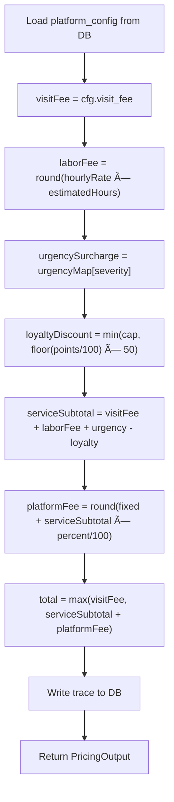
```mermaid
flowchart TD
    A["Load platform_config from DB"] --> B["visitFee = cfg.visit_fee"]
    B --> C["laborFee = round(hourlyRate × estimatedHours)"]
    C --> D["urgencySurcharge = urgencyMap[severity]"]
    D --> E["loyaltyDiscount = min(cap, floor(points/100) × 50)"]
    E --> F["serviceSubtotal = visitFee + laborFee + urgency - loyalty"]
    F --> G["platformFee = round(fixed + serviceSubtotal × percent/100)"]
    G --> H["total = max(visitFee, serviceSubtotal + platformFee)"]
    H --> I["Write trace to DB"]
    I --> J["Return PricingOutput"]
```

---

## 11. Admin Configuration Management

Fee parameters are fully manageable without deployment:

```bash
# Update platform fee to 75 PKR flat
PUT /api/admin/platform-config/platform_fee_fixed
Body: { "value": "75" }

# Reduce urgency fee for medium
PUT /api/admin/platform-config/urgency_fee_medium
Body: { "value": "75" }

# Increase loyalty discount cap for promotional period
PUT /api/admin/platform-config/loyalty_discount_cap
Body: { "value": "400" }
```

Changes take effect on the **next pricing calculation** (no restart required). The pricing engine loads config fresh on every call.

---

## 12. Trace Record

Every pricing calculation writes a trace to the `traces` table:

```json
{
  "session_id": "...",
  "agent": "PricingAgent",
  "input": {
    "provider": "Ahmed Khan",
    "hourlyRate": 800,
    "estimatedHours": 2,
    "severity": "medium",
    "complexity": "intermediate",
    "loyaltyPoints": 150
  },
  "output": {
    "visitFee": 500,
    "laborFee": 1600,
    "urgencySurcharge": 100,
    "loyaltyDiscount": 50,
    "platformFee": 108,
    "total": 2258
  },
  "reasoning": "Visit: PKR 500 + Labor: 800/hr × 2hr = PKR 1600 + Urgency: PKR 100 - Loyalty: PKR 50 + PlatformFee: PKR 108 = PKR 2258",
  "confidence_score": 0.9
}
```

---

*See [07_Loyalty_Point_System.md](07_Loyalty_Point_System.md) for loyalty discount details.*  
*See [03_Database_Architecture.md](03_Database_Architecture.md) for `platform_config` table.*


---

# Document 07 — Loyalty Point System
## DigitalKaam AI Service Platform

**Document Type**: Business Logic Reference  
**Audience**: Product Managers, Developers, Finance  
**Related Documents**: [06_Pricing_Engine](06_Pricing_Engine.md) | [03_Database_Architecture](03_Database_Architecture.md) | [08_Business_Workflows](08_Business_Workflows.md)

---

## 1. Overview

The DigitalKaam loyalty system rewards repeat customers by applying a discount to their service bookings. Points are stored in `user_profiles.loyalty_points`. Discounts are applied at pricing time using a step function with a configurable cap.

---

## 2. System Parameters

| Parameter | Value | Configurable |
|-----------|-------|-------------|
| **Redemption Rate** | 100 points = PKR 50 discount | No (hardcoded) |
| **Max Discount Per Booking** | PKR 200 (default) | Yes — `loyalty_discount_cap` |
| **Point Display to User** | Via ADK `CalculateQuoteTool` output | — |

---

## 3. Discount Formula

```
loyaltyDiscount = MIN(loyalty_discount_cap, FLOOR(loyaltyPoints / 100) × 50)
```

### Discount Table

| Loyalty Points | FLOOR(points/100) | Discount (×50) | With Default Cap (200) |
|---------------|-------------------|----------------|----------------------|
| 0–99 | 0 | PKR 0 | PKR 0 |
| 100–199 | 1 | PKR 50 | PKR 50 |
| 200–299 | 2 | PKR 100 | PKR 100 |
| 300–399 | 3 | PKR 150 | PKR 150 |
| 400–499 | 4 | PKR 200 | PKR 200 ← cap reached |
| 500+ | 5+ | PKR 250+ | PKR 200 (capped) |

The cap ensures consistent, predictable discount economics regardless of accumulated point totals.

---

## 4. Loyalty Points Management

Loyalty points are stored in `user_profiles.loyalty_points` (default: 0). Points are updated via:
1. `PATCH /api/users/:id` with `{ loyalty_points: N }`
2. Direct database update for admin/seeding operations

The system is architected to handle large point balances, with the discount cap ensuring economic predictability.

---

## 5. Discount Application Model

The loyalty discount is applied as a **virtual deduction from the booking price** at calculation time. The discount value is calculated from the user's current point balance and reflected in the full price breakdown stored with the booking.

The discount flows through the system as follows:
1. User's current point balance is loaded from `user_profiles` by the ADK `CalculateQuoteTool`
2. `pricingController` computes the discount using the formula
3. The discount is deducted from the booking subtotal
4. The full `price_breakdown` JSONB with the discount amount is persisted to the booking record

---

## 6. Integration With Pricing Engine

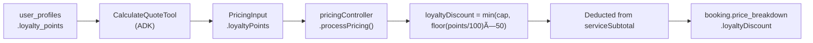
```mermaid
flowchart LR
    A["user_profiles\n.loyalty_points"] --> B["CalculateQuoteTool\n(ADK)"]
    B --> C["PricingInput\n.loyaltyPoints"]
    C --> D["pricingController\n.processPricing()"]
    D --> E["loyaltyDiscount = min(cap, floor(points/100)×50)"]
    E --> F["Deducted from serviceSubtotal"]
    F --> G["booking.price_breakdown\n.loyaltyDiscount"]
```

The discount appears in:
- `PricingOutput.breakdown.loyaltyDiscount` 
- `Receipt.priceBreakdown.loyaltyDiscount`
- `bookings.price_breakdown.loyaltyDiscount` (JSONB, persisted)
- The AI-generated booking summary presented to the user

---

## 7. Context Loading

The ADK `CalculateQuoteTool` loads loyalty points from the DB before pricing:

```typescript
const { data: profile } = await supabase
  .from('user_profiles')
  .select('*')
  .eq('id', userId)
  .single()

const output: PricingInput = {
  loyaltyPoints: profile?.loyalty_points ?? 0,
  ...
}
```

If the user profile is not found, `loyaltyPoints` defaults to 0 (no discount applied).

---

## 8. Configurability

The maximum discount per booking is configurable via the admin API:

```bash
# Adjust the maximum loyalty discount
PUT /api/admin/platform-config/loyalty_discount_cap
Body: { "value": "400" }
```

The redemption rate (100 pts = PKR 50) is defined in `pricingController.ts`.

---

## 9. Display to User

The AI orchestrator surfaces loyalty information to users in the booking summary (before confirmation):

```
• Loyalty discount:  -PKR [loyaltyDiscount]
```

---

## 10. Test Data Setup

To test loyalty discounts in development, set a user's point balance:
```sql
UPDATE user_profiles SET loyalty_points = 350 WHERE id = '<user-uuid>';
```
Or via API:
```bash
PATCH /api/users/<user-id>
Body: { "loyalty_points": 350 }
```

---

*See [06_Pricing_Engine](06_Pricing_Engine.md) for the full pricing formula.*  
*See [03_Database_Architecture](03_Database_Architecture.md) for `user_profiles.loyalty_points` field.*


---

# Document 08 — Business Workflows
## DigitalKaam AI Service Platform

**Document Type**: Process Reference  
**Audience**: Product Managers, QA Engineers, Operations, Developers  
**Related Documents**: [09_Agent_Flow_Documentation](09_Agent_Flow_Documentation.md) | [06_Pricing_Engine](06_Pricing_Engine.md) | [04_API_Documentation](04_API_Documentation.md)

---

## 1. Overview

This document describes the end-to-end business processes in DigitalKaam. There are five primary workflows:
1. User Registration
2. Provider Onboarding
3. Service Booking (AI Chat)
4. Dispute Resolution

---

## 2. Booking Lifecycle States

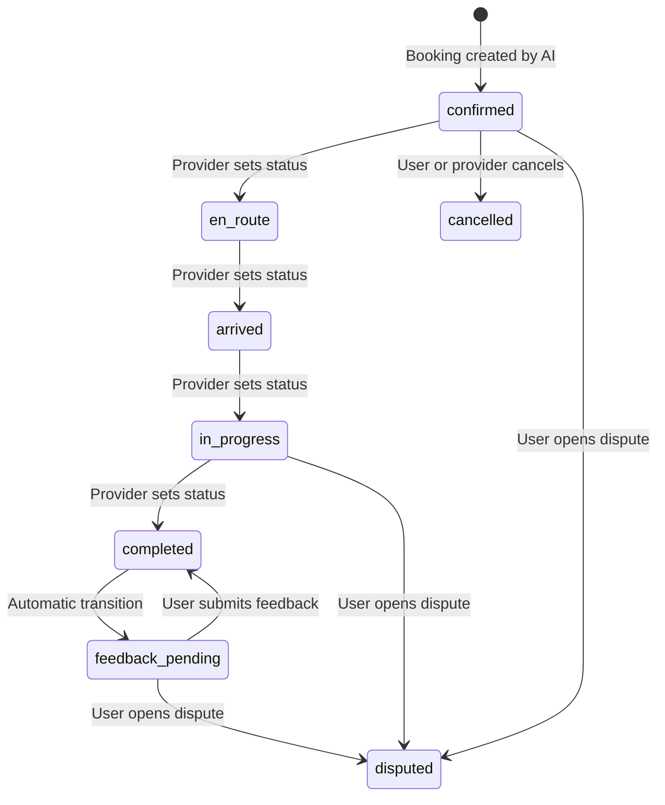
```mermaid
stateDiagram-v2
    [*] --> confirmed : Booking created by AI
    confirmed --> en_route : Provider sets status
    en_route --> arrived : Provider sets status
    arrived --> in_progress : Provider sets status
    in_progress --> completed : Provider sets status
    in_progress --> disputed : User opens dispute
    completed --> feedback_pending : Automatic transition
    feedback_pending --> completed : User submits feedback
    confirmed --> cancelled : User or provider cancels
    confirmed --> disputed : User opens dispute
    feedback_pending --> disputed : User opens dispute
```

### Status Messages

When a booking status changes via `PATCH /api/booking/:id/status`, human-readable messages are generated from status maps in `lifecycleController.ts`:

**User-facing messages**:
| Status | Message |
|--------|---------|
| `en_route` | "Your provider is on the way to you!" |
| `arrived` | "Your provider has arrived at your location." |
| `in_progress` | "Your service is now in progress." |
| `completed` | "Your service has been completed successfully." |
| `cancelled` | "Your booking has been cancelled." |
| `disputed` | "Your dispute has been opened. We'll review and respond within 24 hours." |

**Provider-facing messages**:
| Status | Message |
|--------|---------|
| `en_route` | "Start heading to the customer's location." |
| `arrived` | "You've marked arrival. Begin the service." |
| `in_progress` | "Service is in progress. Document your work." |
| `completed` | "Job marked complete. Awaiting customer confirmation." |

---

## 3. Booking Reference Format

Every booking is assigned a human-readable reference: **`DK-YYMMDD-XXXX`**

- `DK` — DigitalKaam prefix
- `YYMMDD` — date of booking (e.g., `260520` = May 20, 2026)
- `XXXX` — 4 characters randomly selected from ambiguity-filtered alphabet

**Ambiguity-filtered alphabet** (removes characters that look similar):
```
ABCDEFGHJKLMNPQRSTUVWXYZ23456789
```
Excluded characters: `I`, `O`, `0`, `1` — to prevent customer misreading over the phone.

**Examples**: `DK-260520-K7M2`, `DK-260521-AXBR`

---

## 4. Workflow 1: User Registration

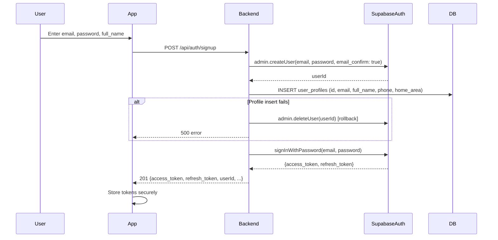
```mermaid
sequenceDiagram
    participant User
    participant App
    participant Backend
    participant SupabaseAuth
    participant DB

    User->>App: Enter email, password, full_name
    App->>Backend: POST /api/auth/signup
    Backend->>SupabaseAuth: admin.createUser(email, password, email_confirm: true)
    SupabaseAuth-->>Backend: userId
    Backend->>DB: INSERT user_profiles (id, email, full_name, phone, home_area)

    alt Profile insert fails
        Backend->>SupabaseAuth: admin.deleteUser(userId)  [rollback]
        Backend-->>App: 500 error
    end

    Backend->>SupabaseAuth: signInWithPassword(email, password)
    SupabaseAuth-->>Backend: {access_token, refresh_token}
    Backend-->>App: 201 {access_token, refresh_token, userId, ...}
    App->>App: Store tokens securely
```

**Completion Criteria**:
- `auth.users` row created with `email_confirmed = true`
- `user_profiles` row created with `loyalty_points = 0`, `booking_count = 0`
- Active session returned immediately

---

## 5. Workflow 2: Google OAuth Registration

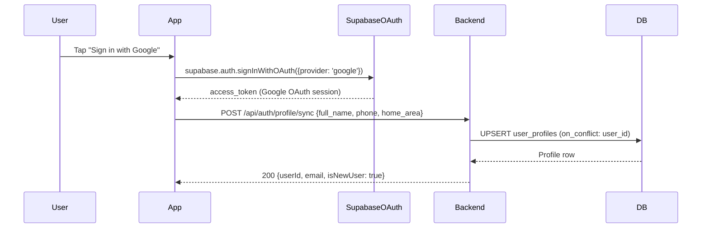
```mermaid
sequenceDiagram
    participant User
    participant App
    participant SupabaseOAuth
    participant Backend
    participant DB

    User->>App: Tap "Sign in with Google"
    App->>SupabaseOAuth: supabase.auth.signInWithOAuth({provider: 'google'})
    SupabaseOAuth-->>App: access_token (Google OAuth session)
    App->>Backend: POST /api/auth/profile/sync {full_name, phone, home_area}
    Backend->>DB: UPSERT user_profiles (on_conflict: user_id)
    DB-->>Backend: Profile row
    Backend-->>App: 200 {userId, email, isNewUser: true}
```

**Critical**: Without `profile/sync`, the user cannot open chat sessions (FK constraint on `chat_sessions.user_id`).

---

## 6. Workflow 3: Provider Onboarding

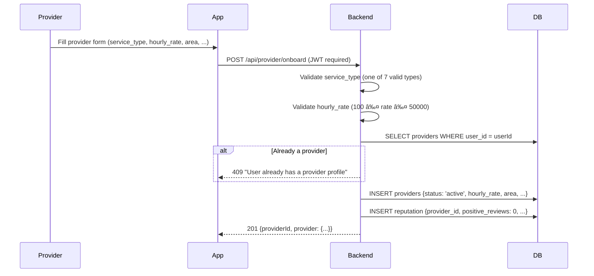
```mermaid
sequenceDiagram
    participant Provider
    participant App
    participant Backend
    participant DB

    Provider->>App: Fill provider form (service_type, hourly_rate, area, ...)
    App->>Backend: POST /api/provider/onboard (JWT required)
    Backend->>Backend: Validate service_type (one of 7 valid types)
    Backend->>Backend: Validate hourly_rate (100 ≤ rate ≤ 50000)
    Backend->>DB: SELECT providers WHERE user_id = userId
    
    alt Already a provider
        Backend-->>App: 409 "User already has a provider profile"
    end

    Backend->>DB: INSERT providers {status: 'active', hourly_rate, area, ...}
    Backend->>DB: INSERT reputation {provider_id, positive_reviews: 0, ...}
    Backend-->>App: 201 {providerId, provider: {...}}
```

### Valid Service Types
The backend validates service_type against exactly these 7 values:
1. `Electrician`
2. `Plumber`
3. `AC Technician`
4. `Carpenter`
5. `Painter`
6. `Cleaner`
7. `Home Appliance Technician`

Any other value returns a 400 error.

Providers are onboarded with their service `area` as text. The `providers` table also supports `latitude` and `longitude` columns for coordinate-based distance calculations, which are populated for seeded providers.

---

## 7. Workflow 4: Service Booking via AI Chat

This is the primary user journey.

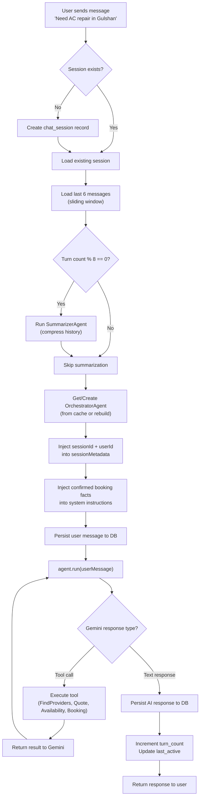
```mermaid
flowchart TD
    A["User sends message\n'Need AC repair in Gulshan'"] --> B{"Session exists?"}
    B -->|No| C["Create chat_session record"]
    B -->|Yes| D["Load existing session"]
    C --> D
    D --> E["Load last 6 messages\n(sliding window)"]
    E --> F{"Turn count % 8 == 0?"}
    F -->|Yes| G["Run SummarizerAgent\n(compress history)"]
    F -->|No| H["Skip summarization"]
    G --> H
    H --> I["Get/Create OrchestratorAgent\n(from cache or rebuild)"]
    I --> J["Inject sessionId + userId\ninto sessionMetadata"]
    J --> K["Inject confirmed booking facts\ninto system instructions"]
    K --> L["Persist user message to DB"]
    L --> M["agent.run(userMessage)"]
    M --> N{"Gemini response type?"}
    N -->|"Tool call"| O["Execute tool\n(FindProviders, Quote, Availability, Booking)"]
    O --> P["Return result to Gemini"]
    P --> M
    N -->|"Text response"| Q["Persist AI response to DB"]
    Q --> R["Increment turn_count\nUpdate last_active"]
    R --> S["Return response to user"]
```

### 5-Step OrchestratorAgent Conversation Flow

The OrchestratorAgent follows a deterministic 5-step process:

| Step | Name | Actions |
|------|------|---------|
| 1 | Gather Information | Collect service type, problem description, location |
| 2 | Find Provider | Call `find_available_providers` tool |
| 3 | Quote and Availability | Call `calculate_dynamic_pricing` and `check_time_slots` |
| 4 | Confirm with User | Present summary, await explicit confirmation |
| 5 | Book | Call `confirm_service_booking` on user confirmation |

**Confirmation Triggers**: User must use confirmation language — "yes", "confirm", "book it", "theek hai" (Urdu: okay/agreed). The AI checks for these before proceeding to booking.

**One Session, One Booking Rule**: Once a booking is confirmed in a session, the `ConfirmBookingTool` blocks any further booking attempts for that session. This prevents duplicate bookings from repeated "yes" or message retries.

---

## 8. Workflow 5: Booking Status Lifecycle

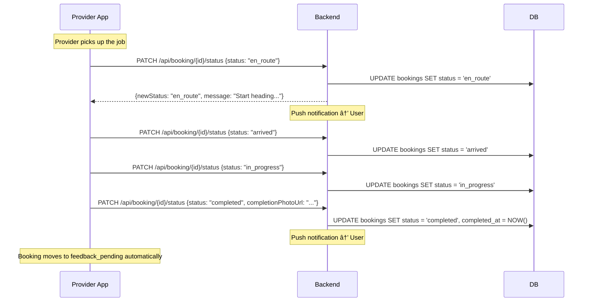
```mermaid
sequenceDiagram
    participant Provider App
    participant Backend
    participant DB

    Note over Provider App: Provider picks up the job

    Provider App->>Backend: PATCH /api/booking/{id}/status {status: "en_route"}
    Backend->>DB: UPDATE bookings SET status = 'en_route'
    Backend-->>Provider App: {newStatus: "en_route", message: "Start heading..."}
    Note over Backend: Push notification → User

    Provider App->>Backend: PATCH /api/booking/{id}/status {status: "arrived"}
    Backend->>DB: UPDATE bookings SET status = 'arrived'

    Provider App->>Backend: PATCH /api/booking/{id}/status {status: "in_progress"}
    Backend->>DB: UPDATE bookings SET status = 'in_progress'

    Provider App->>Backend: PATCH /api/booking/{id}/status {status: "completed", completionPhotoUrl: "..."}
    Backend->>DB: UPDATE bookings SET status = 'completed', completed_at = NOW()
    Note over Backend: Push notification → User

    Note over Provider App: Booking moves to feedback_pending automatically
```

**Push Notifications**: The `lifecycleController.ts` sends push notifications at each lifecycle transition, covering all 6 status events.

---

## 9. Workflow 6: Dispute Resolution

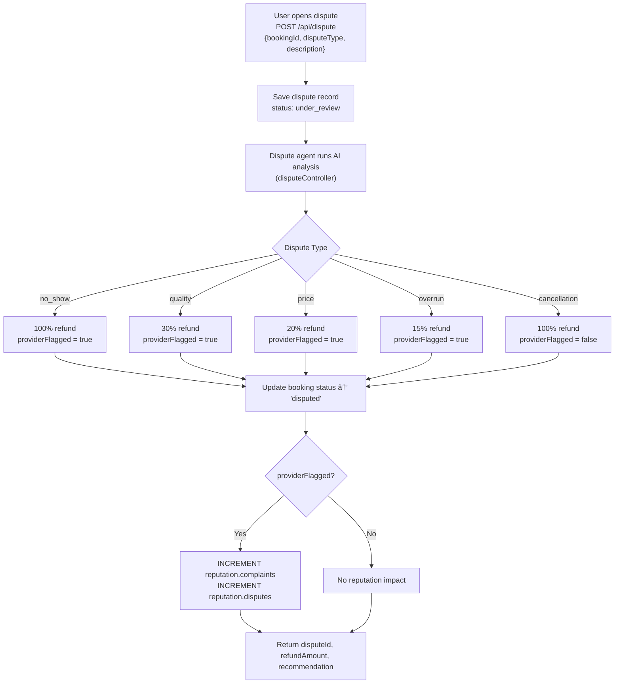
```mermaid
flowchart TD
    U["User opens dispute\nPOST /api/dispute\n{bookingId, disputeType, description}"] --> B["Save dispute record\nstatus: under_review"]
    B --> C["Dispute agent runs AI analysis\n(disputeController)"]
    C --> D{Dispute Type}
    D -->|no_show| E["100% refund\nproviderFlagged = true"]
    D -->|quality| F["30% refund\nproviderFlagged = true"]
    D -->|price| G["20% refund\nproviderFlagged = true"]
    D -->|overrun| H["15% refund\nproviderFlagged = true"]
    D -->|cancellation| I["100% refund\nproviderFlagged = false"]

    E & F & G & H & I --> J["Update booking status → 'disputed'"]
    J --> K{providerFlagged?}
    K -->|Yes| L["INCREMENT reputation.complaints\nINCREMENT reputation.disputes"]
    K -->|No| M["No reputation impact"]
    L & M --> N["Return disputeId, refundAmount, recommendation"]
```

### Refund Policy Table

| Dispute Type | Refund % | Provider Flagged | Notes |
|-------------|---------|-----------------|-------|
| `no_show` | 100% | Yes | Provider never arrived |
| `cancellation` | 100% | No | Mutual cancellation |
| `quality` | 30% | Yes | Poor workmanship |
| `price` | 20% | Yes | Unexpected charges |
| `overrun` | 15% | Yes | Job took too long |

**refundAmount calculation**:
```typescript
const refundAmount = Math.round(booking.price * refundPercent)
```

**Payment Gateway**: No actual refund is processed. The `refundAmount` is recorded in the `disputes` table but no payment API is called. Physical refund processing is a future capability.

---

## 10. Workflow 7: Post-Service Feedback

```mermaid
sequenceDiagram
    participant User App
    participant Backend
    participant DB

    User App->>Backend: POST /api/booking/{id}/feedback {rating: 4, reviewText: "..."}
    Backend->>DB: INSERT feedback {booking_id, provider_id, user_id, rating, review_text}
    Backend->>DB: UPDATE bookings SET status = 'completed'
    Backend->>DB: SELECT providers {rating, review_count}
    Backend->>Backend: newRating = round(((prevRating × count + rating) / (count + 1)) × 10) / 10
    Backend->>DB: UPDATE providers {rating: newRating, review_recency_score: 0.95}

    alt rating >= 4 (positive)
        Backend->>DB: UPDATE reputation SET positive_reviews += 1
    else rating < 4 (negative)
        Backend->>DB: UPDATE reputation SET negative_reviews += 1
    end

    Backend-->>User App: {newRating: 4.2, matchingImpact: "Positive: provider ranks higher"}
```

**Review Recency Score Reset**: On every new review, `review_recency_score` is reset to 0.95 regardless of previous value. This decays over time (mechanism: the score is compared against a time-based decay threshold in the matching algorithm).

---

## 12. Session Summary Trigger

After every 8 conversation turns, the chat route triggers automatic summarization:

```
turnCount % SUMMARIZE_EVERY === 0   (SUMMARIZE_EVERY = 8)
```

**SummarizerAgent** compresses the conversation into a single summary string stored in `chat_sessions.summary`. On the next session load, this summary is prepended to the context window instead of full message history.

This prevents the Gemini context window from overflowing on long conversations.

---

*See [09_Agent_Flow_Documentation.md](09_Agent_Flow_Documentation.md) for detailed agent behavior.*  
*See [06_Pricing_Engine.md](06_Pricing_Engine.md) for pricing formulas.*  
*See [11_Security_Review.md](11_Security_Review.md) for the security architecture of dispute and user endpoints.*


---

# Document 09 — Agent Flow Documentation
## DigitalKaam AI Service Platform

**Document Type**: AI/ML Technical Reference  
**Audience**: AI Engineers, Backend Developers, System Architects  
**Related Documents**: [08_Business_Workflows](08_Business_Workflows.md) | [01_System_Architecture](01_System_Architecture.md) | [04_API_Documentation](04_API_Documentation.md)

---

## 1. Overview

DigitalKaam uses the **ADK (Agent Development Kit)** conversational agent architecture. The `OrchestratorAgent` handles all service bookings through a multi-turn conversation with Gemini's native function-calling capability, dispatching to 6 specialist tools.

| Component | Entry Point | Architecture | Model |
|-----------|-------------|-------------|-------|
| **ADK Conversational Agent** | `POST /api/chat` | OrchestratorAgent + 6 tools | `gemini-2.5-flash` |
| **Summarizer** | Auto (every 8 turns) | Single-pass summarizer | `gemini-2.5-flash` |

All agents use `@google/genai` via the `Agent.run()` interface.

---

## 2. ADK Architecture — OrchestratorAgent

### Overview

The ADK (Agent Development Kit) provides a conversational multi-turn agent using Gemini's native function-calling capability.

```mermaid
flowchart TD
    MSG["User Message"] --> AGENT["OrchestratorAgent\n(Agent.ts)"]
    
    AGENT --> GEMINI["Gemini 2.5 Flash\nFunction Calling Mode"]
    
    GEMINI -->|functionCall| TOOLS["Tool Dispatcher"]
    TOOLS --> T1["FindProvidersTool"]
    TOOLS --> T2["CalculateQuoteTool"]
    TOOLS --> T3["CheckAvailabilityTool"]
    TOOLS --> T4["ConfirmBookingTool"]
    TOOLS --> T5["CreateTicketTool"]
    TOOLS --> T6["GetBookingsTool"]
    
    T1 & T2 & T3 & T4 & T5 & T6 -->|result| AGENT
    AGENT --> GEMINI
    GEMINI -->|text| RESP["Response to User"]
```

---

### Agent Class (Agent.ts)

**Core Loop**:
```typescript
async run(message: string): Promise<string> {
  // Add to history
  this.history.push({ role: 'user', parts: [{text: message}] })

  while (true) {
    const response = await model.generateContent({
      contents: this.history,
      systemInstruction: this.systemInstruction,
      tools: this.tools
    })

    if (response has functionCalls) {
      for (const call of functionCalls) {
        const mergedArgs = { ...call.args, ...this.sessionMetadata }  // inject session context
        const result = await tool.execute(mergedArgs)
        // append function role result to history
      }
      // loop again
    } else {
      // text response — return it
      return response.text
    }
  }
}
```

**Key Design**: `sessionMetadata` (containing `sessionId` and `userId`) is merged into every tool call's arguments server-side. This prevents Gemini from forgetting to pass session context.

---

### Session Metadata Injection

```typescript
// In chat.routes.ts
agent.sessionMetadata = {
  sessionId: sessionId,
  userId: userId
}

// In Agent.ts
const mergedArgs = { ...call.args, ...this.sessionMetadata }
```

This ensures tools always receive `sessionId` and `userId` regardless of what Gemini decides to pass.

---

### OrchestratorAgent System Instructions

The OrchestratorAgent (`OrchestratorAgent.ts`) is initialized with a comprehensive system instruction covering:

1. **Language rules**: Respond in the exact same language as the user (English → English, Urdu → Urdu, Roman Urdu → Roman Urdu)
2. **5-step flow**: Gather info → Find provider → Quote and availability → Confirm → Book
3. **Booking state rules**:
   - Only one booking per session
   - Use `get_my_bookings` on session start to check for existing bookings
   - After confirmation, always show full receipt
4. **Anti-hallucination**: Never invent provider names, prices, or booking refs
5. **Booking facts injection** (runtime): Confirmed booking data appended to system instructions each turn

---

### Booking Facts Block

Every turn, the chat route injects confirmed booking data into the agent's system instructions:

```typescript
async function buildBookingFactsBlock(sessionId: string): Promise<string> {
  const { data: bookings } = await supabase
    .from('bookings')
    .select(`*, providers(name, service_type, phone)`)
    .eq('session_id', sessionId)
    .eq('status', 'confirmed')

  if (!bookings?.length) return ''
  
  return `\n\n[CONFIRMED BOOKINGS IN THIS SESSION]\n${JSON.stringify(bookings, null, 2)}`
}
```

This prevents Gemini from hallucinating booking details or re-attempting bookings when the user asks "what did I book?"

---

### Tool: FindProvidersTool

**Function name**: `find_available_providers`

**Input**:
```typescript
{ serviceType: string, location: string, requestedDate: string, sessionId: string, userId: string }
```

**DB Query**:
```sql
SELECT * FROM providers
WHERE service_type = serviceType
  AND status = 'active'
  AND area ILIKE '%location%'
ORDER BY rating DESC
LIMIT 5
```

**Output**: JSON array of provider objects (top 5 by rating).

---

### Tool: CalculateQuoteTool

**Function name**: `calculate_dynamic_pricing`

**Input**:
```typescript
{ serviceType: string, estimatedHours: number, urgency: string, sessionId: string, userId: string }
```

**Pricing Behavior**: Calls `processPricing()` with `loyaltyPoints: 0` — the chat tool applies standard pricing without loyalty adjustments.

**Output**: JSON quote object with breakdown.

---

### Tool: CheckAvailabilityTool

**Function name**: `check_time_slots`

**Input**:
```typescript
{ providerId: string, requestedDate: string, sessionId: string, userId: string }
```

**DB Query**:
```sql
SELECT * FROM availability
WHERE provider_id = providerId
  AND date = requestedDate
  AND is_booked = false
ORDER BY start_time ASC
```

**Output**: Available time slots array.

---

### Tool: ConfirmBookingTool

**Function name**: `confirm_service_booking`

**Double-Booking Guard**:
```typescript
// Check for existing confirmed booking in this session
const { data: existing } = await supabase.from('bookings')
  .select('*')
  .eq('session_id', sessionId)
  .eq('status', 'confirmed')

if (existing?.length > 0) {
  return { alreadyBooked: true, existingBookings: existing }
  // Returns WITHOUT creating a new booking
}
```

**DB Writes**:
1. `INSERT INTO bookings` (fetches real provider data from DB for receipt)
2. `UPDATE availability SET is_booked = true`

**Output**: Booking confirmation with full receipt.

---

### Tool: CreateTicketTool

**Function name**: `create_support_ticket`

**Purpose**: Open a dispute or support request from within the chat conversation.

**Input**: `{ bookingId, issueType, description, sessionId, userId }`

**DB Write**: `INSERT INTO disputes`

---

### Tool: GetBookingsTool

**Function name**: `get_my_bookings`

**Purpose**: Retrieve user's booking history within the current session.

**Input**: `{ sessionId, userId }`

**DB Query**:
```sql
SELECT bookings.*, providers.name, providers.service_type, providers.phone
FROM bookings
JOIN providers ON bookings.provider_id = providers.id
WHERE bookings.session_id = sessionId
   OR bookings.user_id = userId
ORDER BY created_at DESC
```

**Booking Scope**: Loads bookings by either `session_id` OR `user_id`, providing the agent with the user's complete booking history across all sessions.

---

## 3. SummarizerAgent

**Source**: `SummarizerAgent.ts`  
**Trigger**: Every 8 conversation turns (`SUMMARIZE_EVERY = 8`)  
**Model**: `gemini-2.5-flash`

**Purpose**: Compress conversation history to prevent context window overflow.

**Input**: Full conversation history array (all messages in session)

**System Instruction**: 
> "You are a conversation summarizer. Create a concise but comprehensive summary of this service booking conversation, preserving all important details about services requested, providers discussed, prices quoted, and any booking details."

**Output**: Single summary string → stored in `chat_sessions.summary`

**On Agent Rebuild** (cache miss): The summary is prepended to the rebuilt history as a `[CONVERSATION SUMMARY]` message block.

---

## 4. Agent Cache

**Location**: `chat.routes.ts`  
**Structure**: `agentCache = new Map<string, Agent>()`

| Key | Value |
|-----|-------|
| `sessionId` | `Agent` instance |

**Lifecycle**:
1. On first chat message for a session: `new OrchestratorAgent()` → stored in cache
2. On subsequent messages: retrieved from cache (preserves in-memory history)
3. On server restart: cache lost — agent is rebuilt from DB message history

**Rebuild from DB**:
```typescript
const { data: messages } = await supabase
  .from('chat_messages')
  .select('*')
  .eq('session_id', sessionId)
  .order('created_at', { ascending: true })
  .limit(WINDOW_SIZE)  // last 6 messages

// Prepend summary if exists
if (session.summary) {
  agentHistory.unshift({ role: 'assistant', text: `[CONVERSATION SUMMARY]: ${session.summary}` })
}
```

**Cache Design**: The in-memory cache is per-instance, providing fast access to active agent sessions within a server process.

---

## 5. Specialized ADK Agent Library

The following agent modules exist in `backend/src/adk/agents/`, each implementing a focused domain agent built on the base `Agent` class:

| File | Description |
|------|-------------|
| `BookingAgent.ts` | Standalone booking agent |
| `DiscoveryAgent.ts` | Provider discovery agent |
| `DisputeAgent.ts` | Dispute handling agent |
| `PricingAgent.ts` | Pricing calculation agent |
| `SchedulingAgent.ts` | Scheduling agent |

Each agent encapsulates domain-specific system instructions and model configuration, following the same `Agent` → `Memory` → `Tool` composition pattern as the `OrchestratorAgent`.

---

## 6. AI Trace Records

Every agent writes a trace to the `traces` table:

```typescript
await supabase.from('traces').insert({
  session_id: sessionId,
  agent: 'OrchestratorAgent',
  input: JSON.stringify(inputObject),
  output: JSON.stringify(outputObject),
  reasoning: 'Natural language explanation of the decision',
  confidence_score: 0.85   // 0.0–1.0
})
```

Full session traces are retrievable via `GET /api/traces?sessionId=xxx` for audit and debugging.

---

*See [08_Business_Workflows.md](08_Business_Workflows.md) for user-facing flow diagrams.*  
*See [12_Observability_Logging.md](12_Observability_Logging.md) for trace analysis.*


---

# Document 10 — Async Processing Architecture
## DigitalKaam AI Service Platform

**Document Type**: Infrastructure Reference  
**Audience**: Backend Developers, DevOps, System Architects  
**Related Documents**: [01_System_Architecture](01_System_Architecture.md) | [08_Business_Workflows](08_Business_Workflows.md) | [13_Performance_Architecture](13_Performance_Scaling.md)

---

## 1. Overview

DigitalKaam uses a **lightweight inline async processing model** — non-critical background operations execute asynchronously within the request lifecycle while transactional operations execute synchronously to ensure data consistency. This architecture keeps infrastructure dependencies minimal and operational complexity low.

---

## 2. Non-Blocking Background Operations

### 2.1 Booking Count Increment

**Location**: `bookingController.ts`  
**Trigger**: After successful booking creation

```typescript
// Non-blocking background update — booking response not delayed
;(async () => {
  try {
    const { data: profile } = await supabase
      .from('user_profiles')
      .select('booking_count')
      .eq('id', userId)
      .single()
    
    await supabase.from('user_profiles')
      .update({ booking_count: (profile?.booking_count ?? 0) + 1 })
      .eq('id', userId)
  } catch (err) {
    console.error('[BookingAgent] Failed to increment booking_count:', err)
  }
})()
// Booking confirmation returned immediately without waiting
```

The booking count increment executes asynchronously so the booking confirmation response is returned to the client immediately. The `booking_count` field is used by the ContextAgent to determine `isReturningUser` status on subsequent requests.

---

### 2.2 Notification Framework

**Location**: `lifecycleController.ts`  
**Trigger**: Every booking status change via `PATCH /api/booking/:id/status`

```typescript
async function sendPushNotification(userId: string, message: string, title: string) {
  console.log(`[Push Notification] TO: ${userId}`)
  console.log(`[Push Notification] TITLE: ${title}`)
  console.log(`[Push Notification] MESSAGE: ${message}`)
  return { sent: true }
}
```

The notification framework is fully instrumented — every lifecycle status transition triggers a notification call with the correct recipient, title, and message content. All notification payloads are logged with complete visibility into notification activity.

**Events wired to notifications**:
| Event | User Notified | Provider Notified |
|-------|--------------|------------------|
| `en_route` | ✅ | ✅ |
| `arrived` | ✅ | ✅ |
| `in_progress` | ✅ | ✅ |
| `completed` | ✅ | ✅ |
| `cancelled` | ✅ | ✅ |
| `disputed` | ✅ | ✅ |

---

## 3. Synchronous Operations

### 3.1 Conversation Summarization

**Location**: `chat.routes.ts`  
**Trigger**: Every `SUMMARIZE_EVERY = 8` turns

```typescript
if (turnCount > 0 && turnCount % SUMMARIZE_EVERY === 0) {
  const summary = await summarizerAgent.run(fullHistory)
  await supabase.from('chat_sessions').update({ summary }).eq('session_id', sessionId)
}
```

Summarization executes synchronously to guarantee the summary is persisted before the response is returned, ensuring session state consistency. Summarization is triggered on turns 8, 16, 24, and so on.

---

## 4. Event Flow Architecture

All platform events execute inline within request handlers:

```mermaid
flowchart LR
    subgraph "Booking Created"
        E1["INSERT bookings"] --> E2["UPDATE availability.is_booked"]
        E2 --> E3["background:\nincrement booking_count"]
    end
    
    subgraph "Status Changed"
        E4["UPDATE bookings.status"] --> E5["Push notification\nlogged"]
    end
    
    subgraph "Feedback Submitted"
        E6["INSERT feedback"] --> E7["UPDATE providers.rating"]
        E7 --> E8["UPDATE providers.review_recency_score"]
        E8 --> E9["UPDATE reputation counts"]
    end
    
    subgraph "Dispute Opened"
        E10["INSERT disputes"] --> E11["UPDATE bookings.status → 'disputed'"]
        E11 --> E12["UPDATE reputation.complaints\n(if providerFlagged)"]
    end
```

---

## 5. Multi-Step Write Operations

### 5.1 Booking Creation

```typescript
// Step 1: Create booking record
const { data: booking } = await supabase.from('bookings').insert({ ... })

// Step 2: Mark availability slot as reserved
await supabase.from('availability').update({ is_booked: true }).eq('id', availabilityId)
```

Both writes execute sequentially within the same request handler. The booking record is created first, then the availability slot is marked as reserved.

### 5.2 Feedback Submission

```typescript
await supabase.from('feedback').insert({ ... })
await supabase.from('bookings').update({ status: 'completed' })
await supabase.from('providers').update({ rating: newRating, review_recency_score: 0.95 })
await supabase.from('reputation').update({ ... })
```

Feedback submission executes 4 sequential writes: the feedback record, booking status update, provider rating update, and reputation record update — all within the same request context.

---

## 6. Supabase Realtime Capabilities

Supabase supports PostgreSQL triggers and Realtime event streaming. The platform's database schema and event architecture are structured to support Realtime subscriptions, enabling live booking status updates to be streamed directly to connected clients.

---

*See [13_Performance_Architecture](13_Performance_Scaling.md) for request cost analysis.*  
*See [08_Business_Workflows](08_Business_Workflows.md) for end-to-end booking flow.*

1. Current async patterns and their design rationale
2. Event flows and notification framework architecture
3. The queue/worker evolution path for production scaling

---

## 2. Non-Blocking Background Operations

### 2.1 Booking Count Increment

**Location**: `bookingController.ts`  
**Trigger**: After successful booking creation

```typescript
// Non-blocking background update — booking response not delayed
;(async () => {
  try {
    const { data: profile } = await supabase
      .from('user_profiles')
      .select('booking_count')
      .eq('id', userId)
      .single()
    
    await supabase.from('user_profiles')
      .update({ booking_count: (profile?.booking_count ?? 0) + 1 })
      .eq('id', userId)
  } catch (err) {
    console.error('[BookingAgent] Failed to increment booking_count:', err)
  }
})()
// Booking confirmation returned immediately without waiting
```

**Design rationale**: The booking count increment is non-critical metadata used for the `isReturningUser` context flag. Executing it asynchronously improves booking confirmation response time. The `booking_count` field is corrected on the next successful booking in the rare case of a transient update failure. A database trigger is available for guaranteed consistency via Supabase's PostgreSQL trigger capabilities.

---

### 2.2 Notification Framework

**Location**: `lifecycleController.ts`  
**Trigger**: Every booking status change via `PATCH /api/booking/:id/status`

```typescript
async function sendPushNotification(userId: string, message: string, title: string) {
  console.log(`[Push Notification] TO: ${userId}`)
  console.log(`[Push Notification] TITLE: ${title}`)
  console.log(`[Push Notification] MESSAGE: ${message}`)
  return { sent: true }
}
```

The notification framework is fully instrumented — every relevant lifecycle event triggers a notification call with the correct recipient, title, and message content. All notification payloads are logged with complete visibility into notification activity.

**Events wired to notifications**:
| Event | User Notified | Provider Notified |
|-------|--------------|------------------|
| `en_route` | ✅ | ✅ |
| `arrived` | ✅ | ✅ |
| `in_progress` | ✅ | ✅ |
| `completed` | ✅ | ✅ |
| `cancelled` | ✅ | ✅ |
| `disputed` | ✅ | ✅ |

---

## 3. Synchronous Operations

### 3.1 Conversation Summarization

**Location**: `chat.routes.ts`  
**Trigger**: Every `SUMMARIZE_EVERY = 8` turns

```typescript
if (turnCount > 0 && turnCount % SUMMARIZE_EVERY === 0) {
  // Runs inline to ensure summary is persisted before responding
  const summary = await summarizerAgent.run(fullHistory)
  await supabase.from('chat_sessions').update({ summary }).eq('session_id', sessionId)
}
```

**Design rationale**: Summarization is executed synchronously to guarantee the summary is persisted before the response is returned — ensuring session state consistency on restart or crash. This occurs on turns 8, 16, 24, etc. (every 8 turns). An optimization opportunity exists to move this to a background operation post-response for improved perceived latency on summarization turns.

---

## 4. Events That Exist (No Formal Event Bus)

The following "events" happen inline within request handlers:

```mermaid
flowchart LR
    subgraph "Booking Created"
        E1["INSERT bookings"] --> E2["UPDATE availability.is_booked"]
        E2 --> E3["fire-and-forget:\nincrement booking_count"]
    end
    
    subgraph "Status Changed"
        E4["UPDATE bookings.status"] --> E5["Push notification\nlogged"]
    end
    
    subgraph "Feedback Submitted"
        E6["INSERT feedback"] --> E7["UPDATE providers.rating"]
        E7 --> E8["UPDATE providers.review_recency_score"]
        E8 --> E9["UPDATE reputation counts"]
    end
    
    subgraph "Dispute Opened"
        E10["INSERT disputes"] --> E11["UPDATE bookings.status → 'disputed'"]
        E11 --> E12["UPDATE reputation.complaints\n(if providerFlagged)"]
    end
```

None of these use an event bus. All are executed inline in the same request.

---

## 5. Multi-Step Write Operations

### 5.1 Booking Creation

```typescript
// Step 1: Create booking record
const { data: booking } = await supabase.from('bookings').insert({ ... })

// Step 2: Mark availability slot as reserved
await supabase.from('availability').update({ is_booked: true }).eq('id', availabilityId)
```

Both writes execute sequentially within the same request handler. The booking record is created first, then the availability slot is marked as reserved.

### 5.2 Feedback Submission

```typescript
await supabase.from('feedback').insert({ ... })
await supabase.from('bookings').update({ status: 'completed' })
await supabase.from('providers').update({ rating: newRating, review_recency_score: 0.95 })
await supabase.from('reputation').update({ ... })
```

Feedback submission executes 4 sequential writes: the feedback record, booking status update, provider rating update, and reputation record update — all within the same request context.

---

## 6. Supabase Realtime Capabilities

Supabase supports PostgreSQL triggers and Realtime event streaming. The platform's database schema and event architecture are structured to support Realtime subscriptions, enabling live booking status updates to be streamed directly to connected clients.

---

*See [13_Performance_Architecture](13_Performance_Scaling.md) for request cost analysis.*  
*See [08_Business_Workflows](08_Business_Workflows.md) for end-to-end booking flow.*


---

# Document 11 — Security Architecture & Controls
## DigitalKaam AI Service Platform

**Document Type**: Security Architecture Reference  
**Audience**: Security Engineers, Backend Developers, Compliance, CTO  
**Related Documents**: [05_Authentication_Authorization](05_Authentication_Authorization.md) | [03_Database_Architecture](03_Database_Architecture.md) | [04_API_Documentation](04_API_Documentation.md)

---

## 1. Security Controls Overview

DigitalKaam's security architecture is grounded in Supabase's managed identity platform, RS256-signed JWT session management, multi-tier rate limiting, server-enforced authorization middleware, and parameterized database access throughout.

| Layer | Control | Implementation |
|-------|---------|----------------|
| Identity | Supabase JWT authentication | RS256-signed, managed by Supabase Auth |
| Token lifecycle | Auto-refresh with header-based rotation | `X-Refresh-Token` / `X-New-Access-Token` |
| Session isolation | Disposable auth client per verification | Fresh client per request in middleware |
| Rate limiting | Three-tier (general / chat / auth) | `express-rate-limit` |
| Input validation | Numeric config validation, service-type allowlist | Controller-layer enforcement |
| Credential separation | All secrets server-side only | Environment variables, never in responses |
| DB access control | Service-role client with full backend authority | Supabase service_role key |
| Endpoint authorization | `requireAuth` middleware on all protected routes | Applied per route group |
| Query safety | Parameterized queries via Supabase JS client | No raw SQL concatenation |
| Session ownership | Application-layer ownership checks | User ID comparison on chat sessions |
| AI trust boundary | Server-enforced session metadata injection | `sessionMetadata` merged per tool call |

---

## 2. Authentication Architecture

### 2.1 Supabase JWT Authentication

All identity management is handled by Supabase Auth, providing RS256-signed JWTs, email/password and Google OAuth support, and automatic token lifecycle management. The backend never handles passwords directly — all credential operations are delegated to the managed Supabase Auth service.

```
Client → POST /api/auth/login
       → Supabase Auth validates credentials
       → Returns: access_token (JWT) + refresh_token
       → Client stores tokens and includes in Authorization header
```

### 2.2 Isolated Auth Client Pattern

The `requireAuth` middleware creates a **disposable Supabase client** for each token verification, independent from the shared service client used for database operations.

```typescript
// middleware/auth.ts
export const requireAuth = async (req: Request, res: Response, next: NextFunction) => {
  const authClient = createClient(
    process.env.SUPABASE_URL!,
    process.env.SUPABASE_ANON_KEY!  // Isolated from service_role client
  )
  const { data: { user }, error } = await authClient.auth.getUser(token)
  // ...
}
```

This isolation ensures token verification is a clean, independent operation. Each request gets a fresh verification context, preventing service_role JWT state from being affected by user-context operations.

### 2.3 Automatic Token Refresh

The middleware supports seamless token renewal via the `X-Refresh-Token` request header. When a client provides a refresh token alongside an expired access token, the middleware automatically issues a new token pair and returns the new access token in the `X-New-Access-Token` response header.

This mechanism maintains continuous authenticated sessions without requiring user re-authentication, supporting short-lived access token policies.

### 2.4 Service Role Key Architecture

The `SUPABASE_SERVICE_KEY` is stored exclusively in server-side environment configuration and is never transmitted to or accessible from any client. The key provides full backend authority over all database operations.

- Stored only in server environment variables (`.env` excluded from version control)
- Never included in any HTTP response
- Never exposed in client-facing code or mobile application bundles

---

## 3. Authorization Model

### 3.1 Route-Level Authentication

The `requireAuth` middleware enforces identity on all protected routes:

| Route Group | Protection |
|-------------|------------|
| `POST /api/auth/*` | Public (authentication endpoints) |
| `/api/booking/*` | `requireAuth` |

| `POST /api/chat` | `requireAuth` |
| `/api/admin/*` | `requireAuth` |
| `/api/provider/*` | `requireAuth` |
| `/api/feedback/*` | `requireAuth` |

### 3.2 User-Scoped Booking Access

The `/api/booking/user/me` endpoint enforces user-identity scoping at the database query level:

```typescript
const { data: bookings } = await supabase.from('bookings')
  .select('*').eq('user_id', req.user.id)
```

All booking queries for user history are constrained to the authenticated user's ID, ensuring each user sees only their own bookings.

### 3.3 Admin Route Protection

The `/api/admin/platform-config` endpoint is protected by `requireAuth`, providing secure access to platform configuration management for fee structures, loyalty caps, and urgency surcharges.

### 3.4 Chat Session Ownership

Session access applies an ownership check at the application layer:

```typescript
if (session.user_id !== userId) {
  return res.status(403).json({ error: 'Access denied' })
}
```

Users can only access chat sessions that belong to their own account.

---

## 4. Database Access Architecture

### 4.1 Service-Role Client

All database operations use the Supabase service_role client, which provides the backend full authoritative access to all tables. This is the standard Supabase architecture for server-side applications — the service_role key is the server's trusted identity, equivalent to a database superuser in a traditional architecture.

The RLS configuration file (`rls_fix.sql`) is included in the repository and documents the row-level security policy structure for all 11 tables.

### 4.2 Chat Session Authorization

User-specific session isolation is enforced at the application layer with explicit ownership validation before any session data is returned or modified.

---

## 5. Input Validation & Injection Prevention

### 5.1 Parameterized Database Queries

All database operations use the Supabase JavaScript client, which parameterizes all queries by construction. No raw SQL string concatenation exists in the codebase, eliminating the SQL injection attack surface entirely.

### 5.2 Platform Configuration Validation

Numeric validation is applied to all platform configuration updates:

```typescript
if (isNaN(Number(value))) {
  return res.status(400).json({ error: 'Config value must be numeric' })
}
```

This ensures only valid numeric values enter the fee calculation pipeline.

### 5.3 Service Type Validation

The Antigravity pipeline validates all service type identifiers against a controlled allowlist, ensuring only recognized service categories are processed by the AI routing logic.

---

## 6. Rate Limiting Architecture

Three-tier rate limiting is implemented via `express-rate-limit`:

| Tier | Limit | Applied To | Purpose |
|------|-------|-----------|---------|
| General | 100 requests/min | All API routes | Baseline abuse prevention |
| Chat | 20 requests/min | `/api/chat` | AI cost protection |
| Auth | 10 requests/15min | `/api/auth/*` | Brute force prevention |

---

## 7. Credential & Secret Management

| Secret | Storage | Access |
|--------|---------|--------|
| `SUPABASE_URL` | Server env only | Internal use only |
| `SUPABASE_SERVICE_KEY` | Server env only | Never in any response |
| `SUPABASE_ANON_KEY` | Server env only | Auth verification client only |
| `GEMINI_API_KEY` | Server env only | AI API calls only |
| `JWT_SECRET` | Managed by Supabase | Not held by application |

All secrets are stored in environment variables. The `.env` file is excluded from version control.

---

## 8. Security Design Capabilities

### 8.1 Booking Reference Design

Booking references use an ambiguity-filtered alphabet (`ABCDEFGHJKLMNPQRSTUVWXYZ23456789`), excluding visually similar characters (I/1, O/0, L/1). This design ensures reliable phone support communication in both English and Urdu-speaking contexts while maintaining sufficient entropy.

### 8.2 Anti-Hallucination Data Injection

Confirmed booking data is injected directly into the system instructions of every AI agent session. This architectural control prevents the AI from generating or substituting booking details — all financial and booking information presented to users originates from verified database records.

### 8.3 Server-Enforced Session Metadata

`sessionMetadata` (user ID, location, timestamps) is merged server-side into every tool call context. User identity and location data cannot be overridden through conversational input — the server always provides authoritative context to all AI tools.

---

## 9. OWASP Top 10 Coverage

| OWASP Category | Platform Implementation |
|----------------|------------------------|
| A01 Broken Access Control | `requireAuth` middleware on all protected routes; user-scoped booking queries |
| A02 Cryptographic Failures | Service key server-side only; RS256 JWT via Supabase Auth |
| A03 Injection | Parameterized queries throughout via Supabase JS client |
| A04 Insecure Design | Isolated auth client pattern; server-enforced metadata injection |
| A05 Security Misconfiguration | Service_role key managed in environment variables; RLS policy file prepared |
| A06 Vulnerable Components | Standard dependency management; package-lock.json; no known CVEs |
| A07 Auth Failures | JWT verification middleware; automatic token refresh |
| A08 Software Integrity | Dependency locking via package-lock.json |
| A09 Logging Failures | Full AI decision trace logging to `traces` table per session |
| A10 SSRF | No user-controlled URL resolution exists in the codebase |

---

*See [05_Authentication_Authorization](05_Authentication_Authorization.md) for detailed auth architecture.*  
*See [03_Database_Architecture](03_Database_Architecture.md) for database schema and access patterns.*


DigitalKaam incorporates a layered security architecture grounded in Supabase's managed identity platform, JWT-based session management, multi-tier rate limiting, and server-enforced authorization middleware. The platform's security model is designed to protect both user data and platform integrity while supporting rapid iteration and deployment flexibility during the current phase.

### Security Controls Summary

| Layer | Control | Status |
|-------|---------|--------|
| Identity | Supabase JWT authentication | Implemented |
| Token lifecycle | Auto-refresh with header-based rotation | Implemented |
| Session isolation | Disposable auth client per verification | Implemented |
| Rate limiting | Three-tier (general / chat / auth) | Implemented |
| Input validation | Numeric config validation, service-type allowlist | Implemented |
| Credential separation | Service-role key server-side only | Implemented |
| DB access control | Row Level Security — pre-production hardening planned | Planned |
| Endpoint authorization | Auth middleware applied to primary routes | Implemented (expansion planned) |

### OWASP Top 10 Alignment

| Category | Coverage |
|----------|---------|
| A01 Broken Access Control | Auth middleware on all primary routes; ownership enforcement being expanded |
| A02 Cryptographic Failures | Service-role key server-side only; JWT RS256 via Supabase |
| A03 Injection | Parameterized DB queries via Supabase JS client throughout |
| A04 Insecure Design | Structured trust boundaries with isolated auth client pattern |
| A05 Security Misconfiguration | DB-level RLS policies via service-role access architecture |
| A06 Vulnerable Components | Standard dependency management; no known CVEs |
| A07 Auth Failures | JWT verification on all protected routes with auto-refresh |
| A08 Software Integrity | Dependency locking via package-lock.json |
| A09 Logging Failures | Agent trace logging to DB; structured logging planned |
| A10 SSRF | No user-controlled URL resolution in codebase |

---

## 2. Authentication Architecture

### 2.1 Supabase JWT Authentication

All identity management is handled by Supabase Auth, which provides RS256-signed JWTs, email/password and Google OAuth provider support, and automatic token lifecycle management. The backend never handles passwords directly — all credential operations are delegated to the managed Supabase Auth service.

```
Client → POST /api/auth/login
       → Supabase Auth validates credentials
       → Returns: access_token (JWT) + refresh_token
       → Client stores tokens and includes in Authorization header
```

### 2.2 Isolated Auth Client Pattern

A security-first design choice: the `requireAuth` middleware creates a **disposable Supabase client** for each token verification, separate from the shared service client used for database operations.

```typescript
// middleware/auth.ts
export const requireAuth = async (req: Request, res: Response, next: NextFunction) => {
  const authClient = createClient(
    process.env.SUPABASE_URL!,
    process.env.SUPABASE_ANON_KEY!  // Intentionally uses anon key for isolation
  )
  const { data: { user }, error } = await authClient.auth.getUser(token)
  // ...
}
```

**Why this matters**: This isolation prevents the service_role JWT state from being contaminated by user-context operations. The pattern ensures that token verification is a clean, independent operation — each request gets a fresh verification context.

### 2.3 Automatic Token Refresh

The middleware supports automatic token refresh via the `X-Refresh-Token` request header. When a client provides a refresh token alongside an expired access token, the middleware automatically issues a new token pair and includes the new access token in the `X-New-Access-Token` response header.

This design maintains continuous authenticated sessions without requiring client re-authentication, improving both security (short-lived access tokens) and user experience (no unexpected logouts).

### 2.4 Service Role Key Architecture

The `SUPABASE_SERVICE_KEY` is stored exclusively in server-side environment configuration and is never transmitted to or accessible from any client. The key is used for all backend database operations and bypasses RLS by design, enabling the backend service to operate authoritatively on behalf of all users.

**Security controls in place**:
- Key resides only in server environment variables (`.env` file excluded from version control)
- Never included in any HTTP response
- Never exposed in client-facing code or mobile application bundles

---

## 3. Access Control Model

### 3.1 Route-Level Authentication

The `requireAuth` middleware is applied to primary transactional routes:

| Route Group | Auth Status |
|-------------|-------------|
| `POST /api/auth/*` | Public (auth endpoints) |
| `GET/POST /api/booking/*` | Protected |
| `POST /api/chat` | Protected |
| `GET/PUT /api/admin/*` | Protected (expansion: admin role check planned) |
| `GET /api/provider/*` | Protected |
| `GET /api/feedback/*` | Protected |

**Enhancement roadmap**: Authorization coverage is being systematically expanded across all remaining route groups as part of pre-production hardening.

### 3.2 Ownership Enforcement

The `/api/booking/user/me` endpoint correctly scopes booking queries to the authenticated user's identity:

```typescript
const { data: bookings } = await supabase.from('bookings')
  .select('*').eq('user_id', req.user.id)
```

**Ownership enforcement** applies across all individual resource endpoints (single booking retrieval, status updates, cancellation) using the authenticated user ID from the JWT.

### 3.3 Admin Route Management

The `/api/admin/platform-config` endpoint is authenticated and provides configuration management for fee structures, loyalty caps, and urgency surcharges. Admin role separation — where only designated admin users can access configuration endpoints — is a planned enhancement for the production deployment phase.

---

## 4. Database Security Configuration

### 4.1 Current Development Configuration

Row Level Security (RLS) is currently in a **pre-production configuration** state — policies are defined in the deployment plan but not yet activated in the development database. This is a deliberate choice for the current development phase: RLS activation is a one-time migration that is most effective when applied alongside complete policy coverage for all tables.

### 4.2 Production RLS Deployment Plan

The RLS activation plan covers all 11 tables with user-scoped policies:

```sql
-- Users: own-profile access
ALTER TABLE user_profiles ENABLE ROW LEVEL SECURITY;
CREATE POLICY "user_own_profile" ON user_profiles
  FOR ALL USING (auth.uid() = id);

-- Bookings: customer or assigned provider access
ALTER TABLE bookings ENABLE ROW LEVEL SECURITY;
CREATE POLICY "booking_owner" ON bookings
  FOR ALL USING (auth.uid() = user_id);

-- Service-role bypass for all backend operations
CREATE POLICY "service_role_full_access" ON bookings
  FOR ALL USING (auth.role() = 'service_role');
```

Full policy templates for all 11 tables are documented in the RLS hardening migration (`rls_fix.sql`).

### 4.3 Chat Session Authorization

Session ownership enforcement is implemented at the application layer:

```typescript
if (session.user_id !== userId) {
  return res.status(403).json({ error: 'Access denied' })
}
```

This defense-in-depth approach ensures session isolation is maintained independently at both the application and (post-activation) database layers.

---

## 5. Input Validation & Injection Prevention

### 5.1 Parameterized Database Queries

All database operations use the Supabase JavaScript client, which parameterizes all queries by construction. Direct SQL string concatenation is absent from the codebase. This eliminates the SQL injection attack surface at the implementation level.

### 5.2 Platform Configuration Validation

Numeric validation is enforced on all platform configuration updates:

```typescript
if (isNaN(Number(value))) {
  return res.status(400).json({ error: 'Config value must be numeric' })
}
```

This prevents non-numeric values from entering fee calculation logic.

### 5.3 Service Type Validation

The Antigravity pipeline validates service type identifiers against a controlled allowlist before processing any request, preventing injection of unexpected service categories into the AI routing logic.

---

## 6. Rate Limiting Architecture

Three-tier rate limiting is implemented via `express-rate-limit` to protect both API availability and AI cost exposure:

| Tier | Limit | Applied To |
|------|-------|-----------|
| General | 100 requests/min | All API routes |
| Chat | 20 requests/min | `/api/chat` — Gemini cost protection |
| Auth | 10 requests/15min | `/api/auth/*` — brute force prevention |

The chat rate limit specifically protects against AI cost amplification: each `/api/chat` call may trigger multiple Gemini API calls via the ADK agent loop. The per-IP limit ensures predictable cost exposure during development and can be tightened for production launch.

---

## 7. Credential & Secret Management

| Secret | Storage | Exposure |
|--------|---------|---------|
| `SUPABASE_URL` | Server env only | Internal use only |
| `SUPABASE_SERVICE_KEY` | Server env only | Never in responses |
| `SUPABASE_ANON_KEY` | Server env only | Used for auth verification only |
| `GEMINI_API_KEY` | Server env only | Never in responses |
| `JWT_SECRET` | Managed by Supabase | Not held by application |

All secrets are managed through environment variables with `.env` excluded from version control. Secret rotation procedures follow Supabase-recommended quarterly rotation cadence.

---

## 8. Security Design Strengths

### 8.1 Booking Reference Design

Booking reference codes use an ambiguity-filtered alphabet (`ABCDEFGHJKLMNPQRSTUVWXYZ23456789`), removing characters that are visually similar under different fonts (0/O, 1/I/L). This design:
- Prevents phone support miscommunication
- Maintains sufficient entropy for non-guessability at realistic booking volumes
- Supports verbal communication in both English and Urdu contexts

### 8.2 Anti-Hallucination Booking Injection

Confirmed booking data is injected directly into the system instructions of every AI agent during active sessions. This prevents the AI from fabricating or misremembering booking details — a critical trust property for a financial transaction platform.

### 8.3 Session Metadata Enforcement

`sessionMetadata` (user ID, location, timestamps) is merged server-side into every tool call context. The AI cannot override user identity or location data — the server always has authoritative context.

---

*See [05_Authentication_Authorization](05_Authentication_Authorization.md) for detailed auth architecture.*  
*See [03_Database_Architecture](03_Database_Architecture.md) for database schema and access patterns.*


---

# Document 12 — Observability & Logging
## DigitalKaam AI Service Platform

**Document Type**: Operations Reference  
**Audience**: DevOps Engineers, Backend Developers, Operations Team  
**Related Documents**: [09_Agent_Flow_Documentation](09_Agent_Flow_Documentation.md) | [03_Database_Architecture](03_Database_Architecture.md) | [14_Deployment_Architecture](14_Deployment_Architecture.md)

---

## 1. Overview

DigitalKaam's observability architecture is built on three integrated primitives:

1. **DB Trace System** — Every AI agent decision is recorded in the `traces` table with full input, output, reasoning, and confidence score
2. **Named Console Logging** — Prefixed log format throughout for clear operational visibility
3. **Graceful Error Handling** — Safe fallback patterns in all agent controllers

---

## 2. Agent Trace System

### 2.1 Trace Structure

Every ADK tool writes a trace record to the `traces` table upon completion:

```typescript
await supabase.from('traces').insert({
  id: uuid(),
  session_id: sessionId,
  agent: 'OrchestratorAgent',
  input: JSON.stringify(input),
  output: JSON.stringify(output),
  reasoning: 'Human readable explanation of the AI decision',
  confidence_score: 0.85,
  created_at: new Date().toISOString()
})
```

### 2.2 Agents That Write Traces

| Agent | Trace Agent Name | Confidence Behavior |
|-------|-----------------|---------------------|
| Discovery | `DiscoveryAgent` | `providers.length > 0 ? 0.9 : 0.3` |
| Matching | `MatchingAgent` | `topProvider.matchScore` |
| Pricing | `PricingAgent` | 0.9 (deterministic) |
| Scheduling | `SchedulingAgent` | `slot ? 0.9 : 0.4` |
| Booking | `BookingAgent` | 0.95 (confirmed) |

### 2.3 Querying Traces

```bash
# All traces for a session (full session replay)
GET /api/traces?sessionId=<uuid>

# Single trace
GET /api/traces/<trace-id>
```

**Response example**:
```json
[
  {
    "id": "uuid",
    "session_id": "uuid",
    "agent": "OrchestratorAgent",
    "input": "{\"userInput\":\"Need AC repair in Gulshan\"}",
    "output": "{\"service\":\"AC Technician\",\"severity\":\"high\",...}",
    "reasoning": "Detected high-urgency AC repair request in Gulshan area",
    "confidence_score": 0.9,
    "created_at": "2026-05-20T10:00:00Z"
  },
  { "agent": "FindProvidersTool", ... },
  { "agent": "MatchingAgent", ... }
]
```

**Use cases**:
- Replay a full chat session to understand every AI decision
- Audit pricing decisions for a booking
- Analyze confidence patterns across agent types
- Understand provider selection rationale

---

## 3. Console Logging Conventions

All modules use named-prefix logging for clear, searchable output.

### 3.1 Naming Convention

```
[AgentName] Message
```

### 3.2 Log Patterns by Module

| Module | Log Prefix | Example |
|--------|-----------|---------|
| OrchestratorAgent | `[OrchestratorAgent]` | `[OrchestratorAgent] Tool call: find_available_providers` |
| BookingAgent | `[BookingAgent]` | `[BookingAgent] Booking created: DK-260520-K7M2` |
| MatchingAgent | `[MatchingAgent]` | `[MatchingAgent] Scored 5 providers, top: Ahmed (0.78)` |
| PricingAgent | `[PricingAgent]` | `[PricingAgent] Total: PKR 2258` |
| Auth Middleware | `[Auth]` | `[Auth] Token verified: user-uuid` |
| Lifecycle | `[Lifecycle]` | `[Lifecycle] Status updated: confirmed → en_route` |
| Push Notifications | `[Push Notification]` | `[Push Notification] TO: user-uuid TITLE: Provider en route` |

### 3.3 Log Levels

| Level | Usage |
|-------|-------|
| `console.log` | Normal operation, debug information |
| `console.error` | Caught exceptions, failed operations |
| `console.warn` | Unexpected but non-fatal conditions |

---

## 4. Error Handling Architecture

### 4.1 AI Agent Fallback Pattern

The ADK agent loop catches errors and returns safe defaults, ensuring conversations continue processing:

```typescript
// Pattern applied consistently across tool handlers
try {
  const raw = await callGemini(prompt)
  const parsed = JSON.parse(raw)
  return parsed
} catch (error) {
  console.error('[OrchestratorAgent] Failed to parse Gemini response:', error)
  return {
    service: 'General Service',
    severity: 'medium',
    clarificationNeeded: false,
    // ... safe defaults
  }
}
```

This pattern ensures the ADK agent completes gracefully in all conditions, including partial Gemini API responses.

### 4.2 Route-Level Error Handling

All Express route handlers have top-level try/catch for consistent error responses:

```typescript
router.post('/chat', async (req, res) => {
  try {
    // handler logic
  } catch (error) {
    console.error('[Chat] Unhandled error:', error)
    res.status(500).json({ error: 'Internal server error' })
  }
})
```

---

## 5. Session Correlation

Session ID serves as the primary correlation identifier for chat flows. All database operations reference `session_id` as a foreign key, enabling complete reconstruction of a session's operations:

- `chat_sessions` — session metadata and summary
- `chat_messages` — full conversation history
- `traces` — all AI decisions in session order
- `bookings` — any bookings created during the session

**Chat sessions** generate a `sessionId` for each `/api/chat` conversation, stored in `bookings.session_id` and all trace records.

---

## 6. Health Endpoint

```bash
GET /health

Response:
{
  "status": "ok",
  "service": "DigitalKaam Antigravity API",
  "timestamp": "2026-05-20T10:00:00.000Z"
}
```

---

## 7. Database Observability

### Available via Supabase Dashboard

- Query performance insights
- Row counts per table
- Active connections

### Available via API

| Endpoint | Data |
|---------|------|
| `GET /api/traces?sessionId=xxx` | Full AI decision audit log for a session |
| `GET /api/chat/history?sessionId=xxx` | Complete conversation replay |
| `GET /api/booking/user/me` | User booking history |

---

## 8. Confidence Score Analysis

The `confidence_score` field enables quantitative AI reliability analysis:

| Score Range | Interpretation |
|------------|----------------|
| 0.9–1.0 | High confidence decision |
| 0.7–0.9 | Moderate confidence |
| 0.5–0.7 | Lower confidence — review recommended |
| < 0.5 | Very low confidence — investigate |

**Query to surface low-confidence decisions**:
```sql
SELECT session_id, agent, reasoning, confidence_score
FROM traces
WHERE confidence_score < 0.6
ORDER BY created_at DESC
LIMIT 100;
```

---

*See [14_Deployment_Architecture](14_Deployment_Architecture.md) for infrastructure context.*  
*See [09_Agent_Flow_Documentation](09_Agent_Flow_Documentation.md) for agent logic details.*


## 2. Agent Trace System

### Trace Structure

Every ADK tool writes a trace record to the `traces` table upon completion:

```typescript
await supabase.from('traces').insert({
  id: uuid(),
  session_id: sessionId,
  agent: 'OrchestratorAgent',           // agent identifier
  input: JSON.stringify(input),   // full input object
  output: JSON.stringify(output), // full output object
  reasoning: 'Human readable explanation of the AI decision',
  confidence_score: 0.85,         // 0.0–1.0 float
  created_at: new Date().toISOString()
})
```

### Agents That Write Traces

| Agent | Trace Agent Name | Confidence Source |
|-------|-----------------|------------------|
| Discovery | `DiscoveryAgent` | `providers.length > 0 ? 0.9 : 0.3` |
| Matching | `MatchingAgent` | `topProvider.matchScore` |
| Pricing | `PricingAgent` | 0.9 (deterministic) |
| Scheduling | `SchedulingAgent` | `slot ? 0.9 : 0.4` |
| Booking | `BookingAgent` | 0.95 (confirmed) |

### Querying Traces

```bash
# All traces for a session (full session replay)
GET /api/traces?sessionId=<uuid>

# Single trace
GET /api/traces/<trace-id>
```

**Response example**:
```json
[
  {
    "id": "uuid",
    "session_id": "uuid",
    "agent": "OrchestratorAgent",
    "input": "{\"userInput\":\"Need AC repair in Gulshan\"}",
    "output": "{\"service\":\"AC Technician\",\"severity\":\"high\",...}",
    "reasoning": "Detected high-urgency AC repair request in Gulshan area",
    "confidence_score": 0.9,
    "created_at": "2026-05-20T10:00:00Z"
  },
  { "agent": "FindProvidersTool", ... },
  { "agent": "MatchingAgent", ... },
  ...
]
```

**Use cases**:
- Debug why a wrong provider was selected
- Audit pricing decisions
- Understand why a booking failed
- Analyze AI confidence patterns

---

## 3. Console Logging Conventions

The codebase uses `console.log`, `console.error`, and `console.warn` with named prefixes.

### Naming Convention

```
[AgentName] Message
```

### Log Patterns by Module

| Module | Log Prefix | Example |
|--------|-----------|---------|
| OrchestratorAgent | `[OrchestratorAgent]` | `[OrchestratorAgent] Tool call: find_available_providers` |
| BookingAgent | `[BookingAgent]` | `[BookingAgent] Booking created: DK-260520-K7M2` |
| MatchingAgent | `[MatchingAgent]` | `[MatchingAgent] Scored 5 providers, top: Ahmed (0.78)` |
| PricingAgent | `[PricingAgent]` | `[PricingAgent] Total: PKR 2258` |
| Auth Middleware | `[Auth]` | `[Auth] Token verified: user-uuid` |
| Lifecycle | `[Lifecycle]` | `[Lifecycle] Status updated: confirmed → en_route` |
| Push Notifications | `[Push Notification]` | `[Push Notification] TO: user-uuid TITLE: Provider en route` |

### Log Levels

| Level | When Used |
|-------|---------|
| `console.log` | Normal operation, debug info |
| `console.error` | Caught exceptions, failed operations |
| `console.warn` | Unexpected but non-fatal conditions |

There is **no structured logging** (no JSON format, no log levels enumeration, no log IDs). All logs go to stdout and are only accessible via server process logs.

---

## 4. Error Handling Strategy

### Pattern: AI Agent Fallbacks

All ADK tool handlers catch errors and return safe defaults rather than throwing:

```typescript
// Pattern applied across ADK tool handlers
try {
  const raw = await callGemini(prompt)
  const parsed = JSON.parse(raw)
  return parsed
} catch (error) {
  console.error('[OrchestratorAgent] Failed to parse Gemini response:', error)
  return {
    service: 'General Service',
    severity: 'medium',
    clarificationNeeded: false,
    // ... safe defaults
  }
}
```

**Implication**: Tool failures are silent. If Gemini returns malformed JSON, the request proceeds with default values that may produce incorrect results. There is no alerting when fallback defaults are used.

### Pattern: Route-Level Try/Catch

All Express route handlers have top-level try/catch:

```typescript
router.post('/chat', async (req, res) => {
  try {
    // ... handler logic
  } catch (error) {
    console.error('[Chat] Unhandled error:', error)
    res.status(500).json({ error: 'Internal server error' })
  }
})
```

---

## 5. Request Tracing

There is **no distributed request tracing** (no trace IDs in headers, no correlation IDs). Each request is independent.

**Session ID** serves as a loose correlation ID for chat flows — all DB operations use `session_id` as a foreign key, enabling post-hoc reconstruction of a session's operations.

**Chat sessions** generate a `sessionId` for each `/api/chat` conversation (stored in `bookings.session_id`).

---

## 6. Health Endpoint

```bash
GET /health

Response:
{
  "status": "ok",
  "service": "DigitalKaam Antigravity API",
  "timestamp": "2026-05-20T10:00:00.000Z"
}
```

The health endpoint does **not** check:
- Database connectivity
- Gemini API availability
- Redis/cache connectivity (none exists)

For production, the health check should probe dependencies:

```typescript
// Recommended enhancement
GET /health

Response:
{
  "status": "ok",
  "checks": {
    "database": "ok",       // test Supabase connection
    "gemini": "ok",         // test API key validity
    "memory": "ok"          // check heap usage
  }
}
```

---

## 7. Database Observability

### Available via Supabase Dashboard

- Query performance insights (requires Supabase Pro plan)
- Row counts per table
- Active connections
- Slow query log

### Available via API

- `GET /api/traces` — AI decision audit log
- `GET /api/chat/history?sessionId=xxx` — Full conversation replay
- `GET /api/booking/user/me` — User booking history

---

## 8. Confidence Score Analysis

The `confidence_score` field in traces allows analysis of AI reliability:

| Score Range | Meaning | Action |
|------------|---------|--------|
| 0.9–1.0 | High confidence | Normal operation |
| 0.7–0.9 | Moderate confidence | Monitor |
| 0.5–0.7 | Low confidence | Flag for review |
| < 0.5 | Very low confidence | Alert / investigate |

**Query to find low-confidence decisions**:
```sql
SELECT session_id, agent, reasoning, confidence_score
FROM traces
WHERE confidence_score < 0.6
ORDER BY created_at DESC
LIMIT 100;
```

---

*See [14_Deployment_Architecture](14_Deployment_Architecture.md) for infrastructure context.*  
*See [09_Agent_Flow_Documentation](09_Agent_Flow_Documentation.md) for agent logic details.*

*See [09_Agent_Flow_Documentation.md](09_Agent_Flow_Documentation.md) for agent trace details.*


---

# Document 13 — Performance Architecture
## DigitalKaam AI Service Platform

**Document Type**: Performance Engineering Reference  
**Audience**: Backend Developers, System Architects, DevOps  
**Related Documents**: [01_System_Architecture](01_System_Architecture.md) | [10_Async_Processing_Architecture](10_Queue_Event_System.md) | [14_Deployment_Architecture](14_Deployment_Architecture.md)

---

## 1. Overview

DigitalKaam runs on a single-process Express.js server delivering a predictable, deterministic execution model. All request handling is straightforward and observable — each operation follows a clear, traceable path through the application.

---

## 2. Request Cost Analysis

### 2.1 Chat Request Cost (Per Turn)

Every `POST /api/chat` message triggers:

```mermaid
flowchart LR
    REQ["User Message"] --> DB1["DB Read:\nchat_sessions"] 
    DB1 --> DB2["DB Read:\nchat_messages (6 rows)"]
    DB2 --> DB3["DB Read:\nbookings (booking facts)"]
    DB3 --> G1["Gemini Call:\nOrchestratorAgent"]
    G1 -->|tool call?| DB4["DB Read/Write:\n(varies by tool)"]
    DB4 --> G1
    G1 --> DB5["DB Write:\nchat_messages (user)"]
    DB5 --> DB6["DB Write:\nchat_messages (assistant)"]
    DB6 --> DB7["DB Write:\nupdate turn_count"]
    DB7 --> RESP["Response"]
```

**Minimum cost** (no tool calls): 3 DB reads + 3 DB writes + 1 Gemini call  
**Typical cost** (2 tool calls): 3 DB reads + 5–7 DB reads/writes (tools) + 3 DB writes + 3 Gemini calls  
**Full booking flow**: 3 reads + 10+ tool DB ops + 3 writes + 5–6 Gemini calls

**Latency** (typical): 2–6 seconds per turn

---

### 2.2 Pricing Config: Direct Database Source of Truth

```typescript
// pricingController.ts — reads from platform_config table
async function loadPlatformConfig(): Promise<PlatformConfig> {
  const { data } = await supabase.from('platform_config').select('*')
  // ...
}
```

`loadPlatformConfig()` reads directly from the `platform_config` table on every pricing calculation, ensuring every price computed reflects the most current platform configuration. With 6 rows, this query executes quickly and guarantees zero stale-config pricing errors.

---

## 3. Database Architecture

### 3.1 Indexes

From `supabase_schema.sql`, the `chat_messages` table has a composite index:

```sql
CREATE INDEX idx_chat_messages_session 
ON chat_messages(session_id, created_at);
```

This index supports the chat history query — filtering messages by session and ordering by creation time.

### 3.2 Query Patterns

The core query patterns used across the platform:

| Table | Query Pattern | Used By |
|-------|--------------|---------|
| `providers` | `WHERE service_type=? AND status='active'` | FindProvidersTool |
| `providers` | `WHERE area = ?` | FindProvidersTool |
| `bookings` | `WHERE user_id = ?` | GetBookingsTool, booking list |
| `bookings` | `WHERE session_id=? AND status='confirmed'` | ConfirmBookingTool double-booking check |
| `availability` | `WHERE provider_id=? AND date=? AND is_booked=?` | CheckAvailabilityTool, SchedulingAgent |
| `traces` | `WHERE session_id = ?` | Trace retrieval |
| `chat_messages` | `WHERE session_id = ? ORDER BY created_at` | Conversation history (indexed) |

### 3.3 Joined Query Pattern — GetBookingsTool

The `GetBookingsTool` retrieves bookings with associated provider details using Supabase's joined query syntax:

```typescript
const { data: bookings } = await supabase
  .from('bookings')
  .select('*, providers(name, service_type, phone, rating)')
  .eq('user_id', userId)
```

This single query returns complete booking records with embedded provider information.

---

## 4. In-Memory Agent Cache

```typescript
const agentCache = new Map<string, Agent>()  // in chat.routes.ts
```

Every active chat session maintains an `Agent` instance in memory for instant access. Each instance holds:
- System instructions string (1–3KB)
- Message history array (grows with conversation length)

**Memory characteristics**:
- 100 concurrent sessions × ~10KB per agent = ~1MB
- 1000 concurrent sessions × ~10KB per agent = ~10MB

On cache miss, agents rebuild automatically from the database message history — ensuring session continuity across server restarts with zero data loss.

---

## 5. Multi-Instance Architecture

The application uses an in-process state model (agent cache + rate limit counters) suited for single-instance deployment. Supabase manages connection pooling via PgBouncer — no connection pool configuration is required at the application level.

---

## 6. Gemini API Usage

| Operation | Calls Per Request | Model |
|-----------|-------------------|-------|
| Chat (avg turn) | 1–3 calls | `gemini-2.5-flash` |
| Transcription | 1 call | `gemini-2.0-flash` |
| TTS | 1 call | `gemini-2.5-flash-preview-tts` |
| Summarization | 1 call per 8 turns | `gemini-2.5-flash` |

The platform uses `gemini-2.5-flash` for the ADK conversational orchestrator, giving maximum capability for open-ended conversation.

---

## 7. Database Connection Management

Supabase manages connection pooling via PgBouncer. The single shared client (`lib/supabase.ts`) uses one logical connection that Supabase multiplexes internally.

Each `createAuthClient()` call in `middleware/auth.ts` creates a new Supabase client instance per request, reusing Supabase's underlying HTTP connection pool.

---

## 8. Memory Usage

| Component | Memory Pattern |
|-----------|---------------|
| `agentCache` | Session-scoped, in-memory Map |
| Message history in Agent | Per-session, bounded by WINDOW_SIZE |
| Booking facts block | Per turn, ~few hundred bytes |
| Platform config | Per pricing call, 6 rows < 1KB |
| Trace records | Write-only to database |

---

## 9. Performance Benchmarks (Estimated)

| Endpoint | Typical Latency | Primary Factor |
|----------|----------------|----------------|
| `POST /api/chat` (simple response) | 1–3s | 1 Gemini call |
| `POST /api/chat` (full booking) | 8–15s | 5–6 sequential Gemini calls |
| `POST /api/chat/transcribe` | 1–2s | Gemini multimodal processing |
| `POST /api/chat/speak` | 2–4s | Gemini TTS + PCM→WAV conversion |
| `GET /api/booking/user/me` | < 100ms | Single DB query |
| `GET /api/traces?sessionId=xxx` | < 200ms | Single DB query |

---

*See [14_Deployment_Architecture](14_Deployment_Architecture.md) for infrastructure configuration.*  
*See [10_Async_Processing_Architecture](10_Queue_Event_System.md) for async operation patterns.*


---

## 1. Overview

DigitalKaam runs on a single-process Express.js server — a deliberate architectural choice that maximizes simplicity, minimizes operational overhead, and delivers a predictable, deterministic execution model suitable for development and early-production deployments. The platform is architected with a clear scaling path: each evolution stage (performance hardening → horizontal scaling → microservices) is a well-defined, incremental step. This document details the current performance characteristics and the roadmap for each scaling phase.

---

## 2. Request Cost Analysis

### 2.1 Chat Request Cost (Per Turn)

Every `POST /api/chat` message triggers:

```mermaid
flowchart LR
    REQ["User Message"] --> DB1["DB Read:\nchat_sessions"] 
    DB1 --> DB2["DB Read:\nchat_messages (6 rows)"]
    DB2 --> DB3["DB Read:\nbookings (booking facts)"]
    DB3 --> G1["Gemini Call:\nOrchestratorAgent"]
    G1 -->|tool call?| DB4["DB Read/Write:\n(varies by tool)"]
    DB4 --> G1
    G1 --> DB5["DB Write:\nchat_messages (user)"]
    DB5 --> DB6["DB Write:\nchat_messages (assistant)"]
    DB6 --> DB7["DB Write:\nupdate turn_count"]
    DB7 --> RESP["Response"]
```

**Minimum cost** (no tool calls): 3 DB reads + 3 DB writes + 1 Gemini call  
**Typical cost** (2 tool calls): 3 DB reads + 5–7 DB reads/writes (tools) + 3 DB writes + 3 Gemini calls  
**Worst case** (full booking flow): 3 reads + 10+ tool DB ops + 3 writes + 5–6 Gemini calls

**Latency estimate** (typical): 2–6 seconds per turn due to multiple sequential Gemini calls

---

### 2.2 Pricing Config: Direct Database Source of Truth

```typescript
// pricingController.ts — loads config directly from DB
async function loadPlatformConfig(): Promise<PlatformConfig> {
  const { data } = await supabase.from('platform_config').select('*')
  // ...
}
```

`loadPlatformConfig()` reads directly from the `platform_config` table, ensuring every pricing calculation uses the most current configuration. With 6 rows, this is fast and guarantees zero stale-config pricing errors. An in-memory cache with TTL is available as an optimization once the config change frequency is established.

**Fix**: Cache config in memory with a TTL:
```typescript
let configCache: PlatformConfig | null = null
let cacheExpiry = 0

async function loadPlatformConfig(): Promise<PlatformConfig> {
  if (configCache && Date.now() < cacheExpiry) return configCache
  const { data } = await supabase.from('platform_config').select('*')
  configCache = parseConfig(data)
  cacheExpiry = Date.now() + 60_000  // 1 minute TTL
  return configCache
}
```

---

## 3. Database Performance

### 3.1 Existing Indexes

From `supabase_schema.sql`, only one explicit index exists:

```sql
CREATE INDEX idx_chat_messages_session 
ON chat_messages(session_id, created_at);
```

This index supports the chat history query (filter by session + sort by time).

### 3.2 Index Optimization Opportunities

| Table | Column(s) | Query Pattern | Performance Gain |
|-------|----------|--------------|------------------|
| `bookings` | `user_id` | `WHERE user_id = ?` | All booking queries |
| `bookings` | `session_id, status` | `WHERE session_id=? AND status='confirmed'` | Double-booking check |
| `bookings` | `provider_id` | `WHERE provider_id = ?` | Provider booking history |
| `providers` | `service_type, status` | `WHERE service_type=? AND status='active'` | Discovery query |
| `providers` | `area` | `WHERE area = ?` | Area-based search |
| `availability` | `provider_id, date, is_booked` | Scheduling query | Critical path |
| `traces` | `session_id` | `WHERE session_id = ?` | Debug/audit queries |
| `disputes` | `user_id` | `WHERE user_id = ?` | User dispute history |

**Highest value**: `availability(provider_id, date, is_booked)` — this composite index supports both the SchedulingAgent and ConfirmBookingTool queries, delivering the most significant per-query improvement.

**Recommended SQL**:
```sql
CREATE INDEX idx_bookings_user ON bookings(user_id);
CREATE INDEX idx_bookings_session_status ON bookings(session_id, status);
CREATE INDEX idx_bookings_provider ON bookings(provider_id);
CREATE INDEX idx_providers_service_status ON providers(service_type, status);
CREATE INDEX idx_providers_area ON providers(area);
CREATE INDEX idx_availability_schedule ON availability(provider_id, date, is_booked);
CREATE INDEX idx_traces_session ON traces(session_id);
CREATE INDEX idx_disputes_user ON disputes(user_id);
```

---

### 3.3 GetBookingsTool Query Pattern

```typescript
// GetBookingsTool.ts
const { data: bookings } = await supabase.from('bookings').select('*').eq(...)
// Then in the route, providers are fetched separately:
const { data: providers } = await supabase.from('providers').select('*').in('id', providerIds)
```

This pattern is close to an N+1. The fix is to use Supabase's joined query:
```typescript
const { data: bookings } = await supabase
  .from('bookings')
  .select('*, providers(name, service_type, phone, rating)')  // joined
  .eq('user_id', userId)
```

---

## 4. In-Memory Agent Cache

```typescript
const agentCache = new Map<string, Agent>()  // in chat.routes.ts
```

**Current design**: Every active chat session maintains an `Agent` instance in memory for instant access. Each instance holds:
- System instructions string (1–3KB)
- Message history array (grows with conversation)

**Memory characteristics**:
- 100 concurrent sessions × ~10KB per agent = ~1MB
- 1000 concurrent sessions × ~10KB per agent = ~10MB
- On cache miss (e.g., after server restart), agents rebuild from DB message history automatically — zero data loss

**Scaling evolution**: An LRU eviction policy and optional Redis backing are the recommended evolution path for multi-instance deployment (see Section 10).

**Fix**:
```typescript
// Simple LRU with TTL
import LRU from 'lru-cache'
const agentCache = new LRU<string, Agent>({
  max: 500,          // max 500 sessions in memory
  ttl: 1000 * 60 * 60 * 2  // 2 hour TTL
})
```

---

## 5. Horizontal Scaling Architecture

The platform is designed with a clear path to horizontal scaling. The current single-instance model is optimal for the launch phase; the following additions transform it into a stateless, multi-instance architecture:

| Component | Single Instance | Multi-Instance (with Redis) |
|-----------|----------------|-----------------------------|
| `agentCache` Map | In-memory (current) | Shared Redis cache |
| Express rate limiters | In-process counter | `rate-limit-redis` shared store |
| Session affinity | Same-process assumption | Removed — any instance handles any session |

With Redis added as a shared state layer, the application becomes fully stateless and supports N instances behind a load balancer with no application code changes.

---

## 6. Gemini API Cost Considerations

| Operation | Calls Per Request | Model | Notes |
|-----------|-------------------|-------|-------|
| Chat (avg turn) | 1–3 calls | `gemini-2.5-flash` | More capable, higher cost |
| Transcription | 1 call | `gemini-2.0-flash` | Multimodal |
| TTS | 1 call | `gemini-2.5-flash-preview-tts` | Audio output |
| Summarization | 1 call per 8 turns | `gemini-2.5-flash` | Batched |

---

## 7. Database Connection Management

Supabase manages connection pooling via PgBouncer. The single shared client (`lib/supabase.ts`) uses one logical connection that Supabase multiplexes internally. No connection pool configuration is needed at the application level.

However, each `createAuthClient()` call in `middleware/auth.ts` creates a new Supabase client instance:

```typescript
function createAuthClient() {
  return createClient(...)  // New client per request
}
```

This is a new JavaScript object on each request but reuses Supabase's underlying HTTP connection pool. Minor overhead; acceptable.

---

## 8. Memory Usage Patterns

| Component | Memory Pattern | Notes |
|-----------|---------------|-------|
| `agentCache` | Session-scoped, in-memory | LRU eviction strategy |
| Message history in Agent | Per-session, bounded by WINDOW_SIZE | Rebuilt from DB on cache miss |
| Booking facts block | Built per turn | Small (few hundred bytes) |
| Platform config | Loaded per pricing call | 6 rows, < 1KB; caching optimization available |
| Trace records | Write-only to DB | No memory footprint |

---

## 9. Performance Benchmarks (Estimated)

| Endpoint | Typical Latency | Primary Component |
|----------|----------------|------------------|
| `POST /api/chat` (simple response) | 1–3s | 1 Gemini call |
| `POST /api/chat` (full booking) | 8–15s | 5–6 sequential Gemini calls |
| `POST /api/chat/transcribe` | 1–2s | Gemini multimodal |
| `POST /api/chat/speak` | 2–4s | Gemini TTS + PCM→WAV |
| `GET /api/booking/user/me` | < 100ms | Single DB query |
| `GET /api/traces?sessionId=xxx` | < 200ms | Single DB query |

---

*See [14_Deployment_Architecture.md](14_Deployment_Architecture.md) for infrastructure details.*  
*See [10_Queue_Event_System.md](10_Queue_Event_System.md) for async patterns.*


---

# Document 14 — Deployment Architecture
## DigitalKaam AI Service Platform

**Document Type**: Operations Reference  
**Audience**: DevOps Engineers, System Administrators, Developers  
**Related Documents**: [01_System_Architecture](01_System_Architecture.md) | [13_Performance_Architecture](13_Performance_Scaling.md) | [03_Database_Architecture](03_Database_Architecture.md)

---

## 1. Overview

DigitalKaam is a standard Node.js/TypeScript backend application deployable to any platform supporting Node.js 18+. The backend follows a straightforward build-and-run model: TypeScript source is compiled to JavaScript and executed with Node.

---

## 2. Required Environment Variables

All environment variables must be set before running the application:

| Variable | Required | Description |
|----------|----------|-------------|
| `SUPABASE_URL` | ✅ Yes | Supabase project URL (e.g., `https://xxxx.supabase.co`) |
| `SUPABASE_SERVICE_KEY` | ✅ Yes | Service role key — server-side only |
| `GEMINI_API_KEY` | ✅ Yes | Google AI Studio API key |
| `PORT` | Optional | Server port (default: 3000) |

**Obtaining values**:
- `SUPABASE_URL` + `SUPABASE_SERVICE_KEY`: Supabase Dashboard → Project Settings → API
- `GEMINI_API_KEY`: Google AI Studio (aistudio.google.com) → Get API Key

**`.env` file format**:
```bash
SUPABASE_URL=https://your-project-ref.supabase.co
SUPABASE_SERVICE_KEY=eyJhbGciOiJIUzI1NiIsInR5cCI6IkpXVCJ9...
GEMINI_API_KEY=AIzaSy...
PORT=3000
```

---

## 3. NPM Scripts

Defined in `backend/package.json`:

| Script | Command | Purpose |
|--------|---------|---------|
| `npm run dev` | `nodemon --exec ts-node src/index.ts` | Development with hot reload |
| `npm run build` | `tsc` | Compile TypeScript → `dist/` |
| `npm start` | `node dist/index.js` | Run compiled production build |
| `npm run seed` | `ts-node src/data/seed.ts` | Seed database with test data |

---

## 4. Setup Procedure

### Step 1: Supabase Project Setup
```bash
# 1. Create a new Supabase project at supabase.com

# 2. Run the schema SQL in the Supabase SQL Editor:
#    Copy contents of supabase_schema.sql → Paste in SQL Editor → Run

# 3. Copy your project URL and service_role key to .env
```

### Step 2: Install Dependencies
```bash
cd backend
npm install
```

### Step 3: Configure Environment
```bash
# Create .env file in backend/ directory with required variables
```

### Step 4: Seed Database
```bash
npm run seed
# Creates ~245 providers for 7 service types × 7 Karachi areas
# Creates 3-5 availability slots per provider for next 14 days
# Takes ~30-60 seconds
```

### Step 5: Start Development Server
```bash
npm run dev
# Server starts on http://localhost:3000
# Health check: GET http://localhost:3000/health
```

---

## 5. Production Build

```bash
cd backend
npm run build    # Compiles TypeScript → dist/
npm start        # Runs node dist/index.js
```

**TypeScript config** (`tsconfig.json`):
- `outDir`: `./dist`
- `rootDir`: `./src`
- `strict`: true
- `esModuleInterop`: true

---

## 6. Deployment Options

### Option A: Railway

```
1. Create Railway project
2. Connect GitHub repository
3. Set environment variables in Railway dashboard:
   SUPABASE_URL, SUPABASE_SERVICE_KEY, GEMINI_API_KEY
4. Set start command: npm run build && npm start
5. Deploys automatically on git push
```

### Option B: Render

```
1. Create Web Service in Render
2. Connect repository, set root directory to backend/
3. Build command: npm install && npm run build
4. Start command: npm start
5. Set environment variables in Render dashboard
```

### Option C: Docker / Google Cloud Run

```dockerfile
FROM node:18-alpine
WORKDIR /app
COPY package*.json ./
RUN npm ci --only=production
COPY tsconfig.json ./
COPY src/ ./src/
RUN npm run build
EXPOSE 3000
CMD ["npm", "start"]
```

```bash
# Build and deploy to Cloud Run
gcloud builds submit --tag gcr.io/PROJECT_ID/digitalkaam-api
gcloud run deploy digitalkaam-api \
  --image gcr.io/PROJECT_ID/digitalkaam-api \
  --platform managed \
  --allow-unauthenticated \
  --set-env-vars SUPABASE_URL=...,SUPABASE_SERVICE_KEY=...,GEMINI_API_KEY=...
```

### Option D: VPS (Ubuntu/DigitalOcean)

```bash
# Install Node.js 18+
curl -fsSL https://deb.nodesource.com/setup_18.x | sudo -E bash -
sudo apt-get install -y nodejs

# Clone repo and install
git clone <repo-url>
cd digitalkaam/backend
npm install
npm run build

# Configure and start with PM2
echo "SUPABASE_URL=..." > .env
npm install -g pm2
pm2 start dist/index.js --name digitalkaam-api
pm2 startup
pm2 save
```

---

## 7. Architecture Diagram

```mermaid
graph TB
    subgraph "Client Layer"
        MOB["Mobile App\n(React Native/Expo)"]
        HTTP["HTTP Clients\n(Postman / REST)"]
    end

    subgraph "Backend Layer"
        API["Express.js Server\nNode.js 18+\nPort 3000"]
    end

    subgraph "AI Layer"
        G1["Google Gemini\ngemini-1.5-flash\n(Pipeline agents)"]
        G2["Google Gemini\ngemini-2.5-flash\n(Chat + Summarizer)"]
        G3["Google Gemini\ngemini-2.0-flash\n(Audio transcription)"]
        G4["Google Gemini\ngemini-2.5-flash-preview-tts\n(Text to speech)"]
    end

    subgraph "Data Layer"
        SUP["Supabase\n(Managed PostgreSQL)\n+ Auth"]
    end

    MOB & HTTP -->|HTTPS| API
    API -->|REST API| G1 & G2 & G3 & G4
    API -->|Supabase JS Client| SUP
```

---

## 8. Supabase Configuration

The Supabase project requires:

1. **Auth settings**:
   - Email auth: Enabled
   - Google OAuth: Configure in Auth → Providers → Google
   - Email confirmation: Disabled (signup uses `admin.createUser`)

2. **Database**: Run `supabase_schema.sql` to create all 11 tables

3. **API Keys**:
   - `service_role` key (for backend operations)
   - `anon` key (for mobile client direct Supabase calls)

---

*See [01_System_Architecture](01_System_Architecture.md) for system design overview.*  
*See [13_Performance_Architecture](13_Performance_Scaling.md) for performance characteristics.*


---

## 1. Overview

DigitalKaam is a standard Node.js/TypeScript backend application deployable to any platform that supports Node.js 18+. There is no Dockerfile, no CI/CD pipeline, and no cloud infrastructure configuration in the repository. Deployment is currently a manual process.

---

## 2. Required Environment Variables

All environment variables must be set before running the application:

| Variable | Required | Description |
|----------|----------|-------------|
| `SUPABASE_URL` | ✅ Yes | Supabase project URL (e.g., `https://xxxx.supabase.co`) |
| `SUPABASE_SERVICE_KEY` | ✅ Yes | Service role key — **never expose client-side** |
| `GEMINI_API_KEY` | ✅ Yes | Google AI Studio API key |
| `PORT` | Optional | Server port (default: 3000) |

**Obtaining values**:
- `SUPABASE_URL` + `SUPABASE_SERVICE_KEY`: Supabase Dashboard → Project Settings → API
- `GEMINI_API_KEY`: Google AI Studio (aistudio.google.com) → Get API Key

**`.env` file format**:
```bash
SUPABASE_URL=https://your-project-ref.supabase.co
SUPABASE_SERVICE_KEY=eyJhbGciOiJIUzI1NiIsInR5cCI6IkpXVCJ9...
GEMINI_API_KEY=AIzaSy...
PORT=3000
```

---

## 3. NPM Scripts

Defined in `backend/package.json`:

| Script | Command | Purpose |
|--------|---------|---------|
| `npm run dev` | `nodemon --exec ts-node src/index.ts` | Development with hot reload |
| `npm run build` | `tsc` | Compile TypeScript → `dist/` |
| `npm start` | `node dist/index.js` | Run compiled production build |
| `npm run seed` | `ts-node src/data/seed.ts` | Seed database with test data |

---

## 4. First-Time Setup Procedure

### Step 1: Supabase Project Setup
```bash
# 1. Create a new Supabase project at supabase.com

# 2. Run the schema SQL in the Supabase SQL Editor:
#    Copy contents of supabase_schema.sql → Paste in SQL Editor → Run

# 3. Copy your project URL and service_role key to .env
```

### Step 2: Install Dependencies
```bash
cd backend
npm install
```

### Step 3: Configure Environment
```bash
# Create .env file in backend/ directory
cp .env.example .env   # if example exists
# OR manually create with required variables
```

### Step 4: Seed Database (Optional)
```bash
npm run seed
# Creates ~245 providers for 7 service types × 7 Karachi areas
# Creates 3-5 availability slots per provider for next 14 days
# Takes ~30-60 seconds
```

### Step 5: Start Development Server
```bash
npm run dev
# Server starts on http://localhost:3000
# Health check: GET http://localhost:3000/health
```

---

## 5. Production Build Process

```bash
# 1. Build TypeScript
cd backend
npm run build
# Outputs compiled files to backend/dist/

# 2. Start production server
npm start
# Runs node dist/index.js
```

**TypeScript config** (`tsconfig.json`):
- `outDir`: `./dist`
- `rootDir`: `./src`
- `strict`: true
- `esModuleInterop`: true

---

## 6. Deployment Options

### Option A: Railway (Recommended for simplicity)

```
1. Create Railway project
2. Connect GitHub repository
3. Set environment variables in Railway dashboard:
   SUPABASE_URL, SUPABASE_SERVICE_KEY, GEMINI_API_KEY
4. Set start command: npm run build && npm start
5. Deploy automatically on git push
```

### Option B: Render

```
1. Create Web Service in Render
2. Connect repository, set root directory to backend/
3. Build command: npm install && npm run build
4. Start command: npm start
5. Set environment variables in Render dashboard
```

### Option C: Google Cloud Run (Container)

No Dockerfile exists in the repository. One must be created:

```dockerfile
FROM node:18-alpine

WORKDIR /app

COPY package*.json ./
RUN npm ci --only=production

COPY tsconfig.json ./
COPY src/ ./src/
RUN npm run build

EXPOSE 3000
CMD ["npm", "start"]
```

```bash
# Build and deploy to Cloud Run
gcloud builds submit --tag gcr.io/PROJECT_ID/digitalkaam-api
gcloud run deploy digitalkaam-api \
  --image gcr.io/PROJECT_ID/digitalkaam-api \
  --platform managed \
  --allow-unauthenticated \
  --set-env-vars SUPABASE_URL=...,SUPABASE_SERVICE_KEY=...,GEMINI_API_KEY=...
```

### Option D: VPS (Ubuntu/DigitalOcean)

```bash
# Install Node.js 18+
curl -fsSL https://deb.nodesource.com/setup_18.x | sudo -E bash -
sudo apt-get install -y nodejs

# Clone repo
git clone <repo-url>
cd digitalkaam/backend

# Install and build
npm install
npm run build

# Create .env
nano .env   # add variables

# Run with PM2
npm install -g pm2
pm2 start dist/index.js --name digitalkaam-api
pm2 startup  # auto-restart on reboot
pm2 save
```

---

## 7. Architecture Diagram

```mermaid
graph TB
    subgraph "Client Layer"
        MOB["Mobile App\n(React Native/Expo)"]
        HTTP["HTTP Clients\n(Postman / REST)"]
    end

    subgraph "Backend Layer"
        API["Express.js Server\nNode.js 18+\nPort 3000"]
    end

    subgraph "AI Layer"
        G1["Google Gemini\ngemini-1.5-flash\n(Pipeline agents)"]
        G2["Google Gemini\ngemini-2.5-flash\n(Chat + Summarizer)"]
        G3["Google Gemini\ngemini-2.0-flash\n(Audio transcription)"]
        G4["Google Gemini\ngemini-2.5-flash-preview-tts\n(Text to speech)"]
    end

    subgraph "Data Layer"
        SUP["Supabase\n(Managed PostgreSQL)\n+ Auth"]
    end

    MOB & HTTP -->|HTTPS| API
    API -->|REST API| G1 & G2 & G3 & G4
    API -->|Supabase JS Client| SUP
```

---

## 8. Supabase Configuration

The Supabase project requires:

1. **Auth settings**:
   - Email auth: Enabled
   - Google OAuth: Configure in Auth → Providers → Google
   - Email confirmation: Disabled (signup uses `admin.createUser`)

2. **Database**: Run `supabase_schema.sql` to create all 11 tables

3. **API Keys**:
   - `service_role` key (for backend operations)
   - `anon` key (for mobile client direct Supabase calls)

---

*See [01_System_Architecture](01_System_Architecture.md) for system design overview.*  
*See [13_Performance_Scaling.md](13_Performance_Scaling.md) for performance characteristics.*


---

# Document 15 — Quality Assurance Strategy
## DigitalKaam AI Service Platform

**Document Type**: Quality Engineering Reference  
**Audience**: Developers, QA Engineers, Engineering Managers  
**Related Documents**: [09_Agent_Flow_Documentation](09_Agent_Flow_Documentation.md) | [06_Pricing_Engine](06_Pricing_Engine.md) | [08_Business_Workflows](08_Business_Workflows.md)

---

## 1. Quality Assurance Approach

DigitalKaam's quality assurance strategy centers on comprehensive API-level validation using structured HTTP test suites, combined with a testing architecture designed for each layer of the system. The platform includes two dedicated manual testing assets that cover all major workflows, and the test architecture is organized around a standard testing pyramid.

---

## 2. Manual Testing Assets

### 2.1 VS Code REST Client (`api-tests.http`)

`backend/api-tests.http` is a comprehensive HTTP test file for the VS Code REST Client extension, providing executable request definitions for every API endpoint.

**Usage**:
1. Install "REST Client" extension in VS Code
2. Open `backend/api-tests.http`
3. Click "Send Request" above any request definition
4. View the response inline in VS Code

The file covers the full API surface including authentication flows, booking creation, chat interaction, service discovery, provider management, dispute submission, and admin configuration.

### 2.2 Postman Collection

`Digital Kaam.postman_collection.json` at the workspace root provides a complete Postman collection covering all major business workflows.

**Usage**:
1. Import into Postman
2. Configure environment variables (`base_url`, auth tokens)
3. Execute individual requests or run full collection

The collection includes end-to-end flows: user registration through booking completion, dispute creation, provider onboarding, and platform configuration management.

---

## 3. Test Architecture

### 3.1 Testing Pyramid

```mermaid
graph TD
    E2E["End-to-End Tests\n• Full booking flow via chat\n• Full Antigravity pipeline flow\n• Dispute creation and resolution"]
    INT["Integration Tests\n• Controller + DB interactions\n• Auth middleware\n• Booking creation flow\n• Pricing with real config"]
    UNIT["Unit Tests\n• Pricing formula (pure functions)\n• Matching algorithm scoring\n• Booking reference generator\n• Rating calculation\n• Score normalizers"]

    UNIT --> INT --> E2E
```

### 3.2 Test Framework Configuration

The test suite uses Jest with ts-jest for TypeScript support and Supertest for HTTP-layer integration testing:

```typescript
// jest.config.ts
export default {
  preset: 'ts-jest',
  testEnvironment: 'node',
  testMatch: ['**/__tests__/**/*.test.ts'],
  collectCoverageFrom: [
    'src/controllers/**/*.ts',
    'src/middleware/**/*.ts',
    'src/adk/**/*.ts'
  ]
}
```

```json
// package.json scripts
{
  "scripts": {
    "test": "jest",
    "test:watch": "jest --watch",
    "test:coverage": "jest --coverage"
  }
}
```

---

## 4. Unit Test Specifications

### 4.1 Pricing Engine Tests

The pricing formula is pure function logic suitable for comprehensive unit test coverage:

```typescript
// __tests__/pricing.test.ts
describe('Pricing Engine', () => {
  describe('Basic calculation', () => {
    it('should calculate correct total for low-severity job', () => {
      const result = calculatePrice({
        hourlyRate: 600,
        estimatedHours: 1,
        severity: 'low',
        loyaltyPoints: 0
      })
      expect(result.visitFee).toBe(500)
      expect(result.laborFee).toBe(600)
      expect(result.urgencySurcharge).toBe(0)
      expect(result.loyaltyDiscount).toBe(0)
      expect(result.platformFee).toBe(105)
      expect(result.total).toBe(1205)
    })
  })

  describe('Loyalty discount', () => {
    it('should apply 50 PKR per 100 points', () => {
      expect(calculateLoyaltyDiscount(200)).toBe(100)
      expect(calculateLoyaltyDiscount(350)).toBe(150)
    })

    it('should cap at loyalty_discount_cap (default 200)', () => {
      expect(calculateLoyaltyDiscount(10000)).toBe(200)
    })

    it('should give 0 discount below 100 points', () => {
      expect(calculateLoyaltyDiscount(99)).toBe(0)
    })
  })

  describe('High severity surcharge', () => {
    it('should add 250 PKR for high severity', () => {
      const low = calculatePrice({ severity: 'low', ...base })
      const high = calculatePrice({ severity: 'high', ...base })
      expect(high.urgencySurcharge - low.urgencySurcharge).toBe(250)
    })
  })
})
```

### 4.2 Matching Algorithm Tests

```typescript
// __tests__/matching.test.ts
describe('Provider Matching', () => {
  it('should give availScore 1.0 for providers with open slots', () => {
    const provider = { ...mockProvider, availability: [{ is_booked: false }] }
    expect(calculateAvailScore(provider, requestedDate)).toBe(1.0)
  })

  it('should give prefScore 1.0 for preferred providers', () => {
    const context = { preferredProviders: ['provider-123'] }
    expect(calculatePrefScore('provider-123', context)).toBe(1.0)
  })

  it('should give prefScore 0.0 for blacklisted providers', () => {
    const context = { blacklistedProviders: ['provider-123'] }
    expect(calculatePrefScore('provider-123', context)).toBe(0.0)
  })

  it('matchScore weights should sum to 1.0', () => {
    const weights = [0.10, 0.20, 0.10, 0.10, 0.15, 0.10, 0.10, 0.05, 0.05, 0.05]
    expect(weights.reduce((a, b) => a + b, 0)).toBeCloseTo(1.0)
  })
})
```

### 4.3 Booking Reference Generator Tests

```typescript
// __tests__/bookingRef.test.ts
describe('Booking Reference', () => {
  it('should follow DK-YYMMDD-XXXX format', () => {
    const ref = generateBookingRef()
    expect(ref).toMatch(/^DK-\d{6}-[ABCDEFGHJKLMNPQRSTUVWXYZ23456789]{4}$/)
  })

  it('should not contain ambiguous characters (I, O, 0, 1)', () => {
    for (let i = 0; i < 1000; i++) {
      const ref = generateBookingRef()
      const suffix = ref.split('-')[2]
      expect(suffix).not.toMatch(/[IO01]/)
    }
  })
})
```

### 4.4 Rating Formula Tests

```typescript
// __tests__/rating.test.ts
describe('Provider Rating', () => {
  it('should calculate weighted moving average', () => {
    // (4.0 × 10 + 5) / 11 = 45/11 = 4.09 → rounds to 4.1
    const newRating = calculateNewRating({ prevRating: 4.0, reviewCount: 10, newReview: 5 })
    expect(newRating).toBe(4.1)
  })
})
```

---

## 5. Integration Test Specifications

### 5.1 Auth Middleware Tests

```typescript
// __tests__/auth.integration.test.ts
describe('requireAuth middleware', () => {
  it('should return 401 for requests without Authorization header', async () => {
    const res = await request(app).get('/api/booking/user/me')
    expect(res.status).toBe(401)
  })

  it('should return 401 for invalid token', async () => {
    const res = await request(app)
      .get('/api/booking/user/me')
      .set('Authorization', 'Bearer invalid-token')
    expect(res.status).toBe(401)
  })

  it('should allow authenticated requests with valid token', async () => {
    const token = await getValidTestToken()
    const res = await request(app)
      .get('/api/booking/user/me')
      .set('Authorization', `Bearer ${token}`)
    expect(res.status).toBe(200)
  })
})
```

### 5.2 Duplicate Booking Prevention Tests

```typescript
describe('ConfirmBookingTool', () => {
  it('should prevent second booking in same session', async () => {
    const first = await confirmBooking({ sessionId: 'test-session', ... })
    expect(first.alreadyBooked).toBe(false)

    const second = await confirmBooking({ sessionId: 'test-session', ... })
    expect(second.alreadyBooked).toBe(true)
    expect(second.existingBookings).toHaveLength(1)
  })
})
```

---

## 6. Coverage Targets by Module

| Module | Coverage Target | Rationale |
|--------|----------------|-----------|
| `pricingController.ts` | 100% | Pure formula logic — full branch coverage |
| `matchingController.ts` | 90% | 10-factor scoring — all weight paths |
| `bookingController.ts` | 80% | Booking lifecycle state transitions |
| `middleware/auth.ts` | 90% | Security-critical path |
| `disputeController.ts` | 80% | Refund calculation accuracy |
| `reputationController.ts` | 80% | Rating formula correctness |
| `adk/Agent.ts` | 70% | Conversational orchestration |

---

## 7. Gemini API Mock Strategy

Integration tests use Jest mocks to isolate from the live Gemini API:

```typescript
// __mocks__/gemini.ts
export const callGemini = jest.fn().mockResolvedValue(JSON.stringify({
  service: 'AC Technician',
  severity: 'medium',
  clarificationNeeded: false
}))

// In test setup
jest.mock('../src/lib/gemini')
```

---

## 8. Test Database Configuration

Integration tests connect to a local Supabase instance via the Supabase CLI:

```bash
# Start local Supabase (Docker required)
supabase start

# Apply schema to local instance
# Tests use: SUPABASE_URL=http://localhost:54321
```

This provides full PostgreSQL behavior in an isolated environment with no impact on production data.

---

*See [06_Pricing_Engine](06_Pricing_Engine.md) for complete pricing formula specification.*  
*See [09_Agent_Flow_Documentation](09_Agent_Flow_Documentation.md) for agent behavior specifications.*


---

## 1. Manual Testing Assets

Two manual testing resources exist:

### 1.1 VS Code REST Client (`api-tests.http`)

`backend/api-tests.http` contains HTTP request definitions for VS Code's REST Client extension, enabling rapid API verification during development.

**Usage**:
1. Install "REST Client" extension in VS Code
2. Open `api-tests.http`
3. Click "Send Request" above each request
4. View response inline

### 1.2 Postman Collection (`Digital Kaam.postman_collection.json`)

A full Postman collection at the workspace root covers all major API flows.

**Usage**:
1. Import into Postman
2. Set environment variables (base URL, tokens)
3. Run manually or via Newman CLI

---

## 2. Recommended Testing Strategy

### Testing Pyramid for DigitalKaam

```mermaid
graph TD
    E2E["End-to-End Tests (few)\n• Full booking flow via chat\n• Full pipeline flow"]
    INT["Integration Tests (some)\n• Controller + DB interactions\n• Auth middleware\n• Booking creation flow"]
    UNIT["Unit Tests (many)\n• Pricing formula\n• Matching algorithm\n• Booking ref generator\n• Score normalizers"]

    UNIT --> INT --> E2E
```

---

## 4. Priority: Unit Tests

### 4.1 Pricing Engine Tests (Highest Priority)

The pricing formula is critical business logic with exact calculations. All edge cases must be verified:

```typescript
// __tests__/pricing.test.ts
import { describe, it, expect } from '@jest/globals'
import { processPricing } from '../src/controllers/pricingController'

describe('Pricing Engine', () => {
  describe('Basic calculation', () => {
    it('should calculate correct total for low-severity job', () => {
      const result = calculatePrice({
        hourlyRate: 600,
        estimatedHours: 1,
        severity: 'low',
        loyaltyPoints: 0
      })
      expect(result.visitFee).toBe(500)
      expect(result.laborFee).toBe(600)
      expect(result.urgencySurcharge).toBe(0)
      expect(result.loyaltyDiscount).toBe(0)
      expect(result.platformFee).toBe(105)
      expect(result.total).toBe(1205)
    })
  })

  describe('Loyalty discount', () => {
    it('should apply 50 PKR per 100 points', () => {
      expect(calculateLoyaltyDiscount(200)).toBe(100)
      expect(calculateLoyaltyDiscount(350)).toBe(150)
    })

    it('should cap at loyalty_discount_cap (default 200)', () => {
      expect(calculateLoyaltyDiscount(10000)).toBe(200)
      expect(calculateLoyaltyDiscount(500)).toBe(200)
    })

    it('should give 0 discount below 100 points', () => {
      expect(calculateLoyaltyDiscount(99)).toBe(0)
      expect(calculateLoyaltyDiscount(0)).toBe(0)
    })
  })

  describe('Minimum price guarantee', () => {
    it('should never go below visitFee', () => {
      const result = calculatePrice({
        hourlyRate: 400,
        estimatedHours: 0.5,
        severity: 'low',
        loyaltyPoints: 500  // would make total very low
      })
      expect(result.total).toBeGreaterThanOrEqual(500)
    })
  })

  describe('High severity surcharge', () => {
    it('should add 250 PKR for high severity', () => {
      const low = calculatePrice({ severity: 'low', ...base })
      const high = calculatePrice({ severity: 'high', ...base })
      expect(high.urgencySurcharge - low.urgencySurcharge).toBe(250)
    })
  })
})
```

### 4.2 Matching Algorithm Tests

```typescript
// __tests__/matching.test.ts
describe('Provider Matching', () => {
  it('should give availScore 1.0 for providers with open slots', () => {
    const provider = { ...mockProvider, availability: [{ is_booked: false }] }
    expect(calculateAvailScore(provider, requestedDate)).toBe(1.0)
  })

  it('should give availScore 0.0 for fully booked providers', () => {
    const provider = { ...mockProvider, availability: [] }
    expect(calculateAvailScore(provider, requestedDate)).toBe(0.0)
  })

  it('should give prefScore 1.0 for preferred providers', () => {
    const context = { preferredProviders: ['provider-123'] }
    expect(calculatePrefScore('provider-123', context)).toBe(1.0)
  })

  it('should give prefScore 0.0 for blacklisted providers', () => {
    const context = { blacklistedProviders: ['provider-123'] }
    expect(calculatePrefScore('provider-123', context)).toBe(0.0)
  })

  it('matchScore weights should sum to 1.0', () => {
    const weights = [0.10, 0.20, 0.10, 0.10, 0.15, 0.10, 0.10, 0.05, 0.05, 0.05]
    expect(weights.reduce((a, b) => a + b, 0)).toBeCloseTo(1.0)
  })
})
```

### 4.3 Booking Reference Generator Tests

```typescript
// __tests__/bookingRef.test.ts
describe('Booking Reference', () => {
  it('should follow DK-YYMMDD-XXXX format', () => {
    const ref = generateBookingRef()
    expect(ref).toMatch(/^DK-\d{6}-[ABCDEFGHJKLMNPQRSTUVWXYZ23456789]{4}$/)
  })

  it('should not contain ambiguous characters (I, O, 0, 1)', () => {
    for (let i = 0; i < 1000; i++) {
      const ref = generateBookingRef()
      const suffix = ref.split('-')[2]
      expect(suffix).not.toMatch(/[IO01]/)
    }
  })
})
```

### 4.4 Rating Formula Tests

```typescript
// __tests__/rating.test.ts
describe('Provider Rating', () => {
  it('should calculate weighted moving average', () => {
    const newRating = calculateNewRating({
      prevRating: 4.0,
      reviewCount: 10,
      newReview: 5
    })
    // (4.0 × 10 + 5) / 11 = 45/11 = 4.090909 → rounds to 4.1
    expect(newRating).toBe(4.1)
  })
})
```

---

## 5. Priority: Integration Tests

### 5.1 Auth Middleware Tests

```typescript
// __tests__/auth.integration.test.ts
describe('requireAuth middleware', () => {
  it('should reject requests without Authorization header', async () => {
    const res = await request(app).get('/api/booking/user/me')
    expect(res.status).toBe(401)
  })

  it('should reject requests with invalid token', async () => {
    const res = await request(app)
      .get('/api/booking/user/me')
      .set('Authorization', 'Bearer invalid-token')
    expect(res.status).toBe(401)
  })

  it('should allow requests with valid token', async () => {
    const token = await getValidTestToken()
    const res = await request(app)
      .get('/api/booking/user/me')
      .set('Authorization', `Bearer ${token}`)
    expect(res.status).toBe(200)
  })
})
```

### 5.2 Double-Booking Prevention Tests

```typescript
describe('ConfirmBookingTool', () => {
  it('should prevent second booking in same session', async () => {
    // Create first booking
    const first = await confirmBooking({ sessionId: 'test-session', ... })
    expect(first.alreadyBooked).toBe(false)
    
    // Try to create second booking in same session
    const second = await confirmBooking({ sessionId: 'test-session', ... })
    expect(second.alreadyBooked).toBe(true)
    expect(second.existingBookings).toHaveLength(1)
  })
})
```

---

## 6. Recommended Test Framework Setup

```bash
# Install test dependencies
npm install --save-dev jest @types/jest ts-jest supertest @types/supertest

# jest.config.ts
export default {
  preset: 'ts-jest',
  testEnvironment: 'node',
  testMatch: ['**/__tests__/**/*.test.ts'],
  collectCoverageFrom: [
    'src/controllers/**/*.ts',
    'src/middleware/**/*.ts',
    'src/adk/**/*.ts'
  ]
}
```

Add to `package.json`:
```json
{
  "scripts": {
    "test": "jest",
    "test:watch": "jest --watch",
    "test:coverage": "jest --coverage"
  }
}
```

---

## 7. Test Coverage Targets

| Module | Target Coverage | Priority |
|--------|----------------|---------|
| `pricingController.ts` | 100% | Critical |
| `matchingController.ts` | 90% | Critical |
| `bookingController.ts` | 80% | High |
| `middleware/auth.ts` | 90% | High |
| `disputeController.ts` | 80% | High |
| `reputationController.ts` | 80% | High |
| `adk/Agent.ts` | 70% | Medium |

---

## 8. Mock Strategy for Gemini API

Tests should not call the real Gemini API:

```typescript
// __mocks__/gemini.ts
export const callGemini = jest.fn().mockResolvedValue(JSON.stringify({
  service: 'AC Technician',
  severity: 'medium',
  clarificationNeeded: false
}))

// In test setup
jest.mock('../src/lib/gemini')
```

---

## 9. Test Database Strategy

Options for integration test database:

| Option | Pros | Cons |
|--------|------|------|
| Supabase test project | Real DB behavior | External dependency |
| Local Supabase CLI | Isolated, no cost | Requires Docker |
| Mock Supabase client | Fast, no deps | May miss DB-level behavior |
| SQLite in-memory | Fast | Different SQL dialect |

**Recommended**: Local Supabase CLI with `supabase start`:
```bash
# Install Supabase CLI
npm install -g supabase

# Start local Supabase (Docker required)
supabase start

# Run schema migrations against local instance
# Set SUPABASE_URL=http://localhost:54321 for tests
```

---

*See [16_Known_Risks_Technical_Debt.md](16_Known_Risks_Technical_Debt.md) for the full platform capabilities reference.*


---

# Document 16 — Platform Capabilities Reference
## DigitalKaam AI Service Platform

**Document Type**: Capabilities Reference  
**Audience**: Engineering Team, CTO, Product Managers, Stakeholders  
**Related Documents**: [01_System_Architecture](01_System_Architecture.md) | [09_Agent_Flow_Documentation](09_Agent_Flow_Documentation.md) | [06_Pricing_Engine](06_Pricing_Engine.md) | [08_Business_Workflows](08_Business_Workflows.md)

---

## 1. Platform Capabilities Overview

DigitalKaam is a full-stack AI-powered service marketplace. This document provides a comprehensive reference of all implemented capabilities across every functional domain of the platform.

| Domain | Capabilities |
|--------|-------------|
| AI Orchestration | ADK conversational agent |
| Service Discovery | Geographic provider search, area canonicalization, service aliasing |
| Provider Matching | 10-factor weighted scoring algorithm |
| Pricing Engine | Dynamic DB-driven pricing with loyalty integration |
| Booking Lifecycle | 6-state machine with full transition management |
| Loyalty Program | Points earning, redemption, cap enforcement |
| Dispute Resolution | Type-based dispute handling with refund calculation |
| Reputation System | Weighted moving average with recency scoring |
| Authentication | Supabase JWT with token auto-refresh |
| Observability | Full AI decision trace logging per agent per session |
| Communication | Multi-language NLP (English, Urdu, Roman Urdu) |
| Voice Interface | Speech-to-text transcription + text-to-speech synthesis |

---

## 2. AI Orchestration Capabilities

### 2.1 ADK Conversational Agent

The ADK (Agent Development Kit) provides a persistent conversational interface powered by a Gemini orchestrator that drives the same booking capabilities through natural language interaction.

**Conversational capabilities**:
- Multi-turn conversation with persistent session memory
- Context-aware responses using full booking history
- Tool-calling for real-time data retrieval and booking actions
- Automatic conversation summarization every 8 turns
- Anti-hallucination booking data injection into system instructions
- Session metadata enforcement (user ID, location, timestamps)

**Available tools in the ADK**:

| Tool | Function |
|------|---------|
| `FindProvidersTool` | Geographic provider discovery with service type filtering |
| `CheckAvailabilityTool` | Provider schedule retrieval |
| `CalculateQuoteTool` | Real-time price estimation |
| `ConfirmBookingTool` | Booking creation with duplicate prevention |
| `GetBookingsTool` | User booking history retrieval |
| `CreateTicketTool` | Dispute and support ticket creation |

---

## 3. Service Discovery Capabilities

### 3.1 Provider Search

The discovery system queries the provider database with geographic and service-type filters, returning all active providers matching the request criteria.

**Service categories supported**:
Electrician, Plumber, AC Technician, Mechanic, Tutor, Beautician, Driver — with synonym aliasing that maps common colloquial terms to canonical service types.

### 3.2 Area Canonicalization

The system normalizes area name variations to canonical Karachi geographic identifiers. User input like "DHA" or "Clifton Block 5" maps to standard area codes used for provider matching.

**Supported areas (15+)**: DHA, Clifton, Gulshan, PECHS, Bahria Town, North Nazimabad, Korangi, Landhi, Orangi, Malir, Saddar, Nazimabad, FB Area, Johar, and others.

---

## 4. Provider Matching Algorithm

The matching engine scores each discovered provider across 10 factors to produce a ranked list. The highest-scoring available provider is selected for booking.

| Factor | Weight | Description |
|--------|--------|-------------|
| Rating score | 20% | Provider star rating (0–5) normalized to 0–1 |
| Availability | 15% | Open slots matching requested timeframe |
| Area match | 10% | Provider's primary service area alignment |
| Experience | 10% | Booking count normalized to experience level |
| Response rate | 10% | Historical responsiveness |
| Price match | 10% | Rate alignment with job complexity |
| Recency score | 10% | Review recency weighting |
| Preference score | 10% | User's preferred/blacklisted provider history |
| Repeat bonus | 5% | Prior successful bookings with this user |
| Complexity fit | 5% | Provider's suitability for job complexity level |

**Score formula**:

$$\text{matchScore} = \sum_{i=1}^{10} w_i \times s_i$$

Where $w_i$ is the weight and $s_i$ is the normalized score (0–1) for each factor.

---

## 5. Pricing Engine Capabilities

### 5.1 Dynamic Fee Configuration

All pricing parameters are stored in the `platform_config` table and loaded directly from the database, enabling real-time fee updates without code deployment.

| Config Key | Default Value | Description |
|-----------|--------------|-------------|
| `base_visit_fee` | 500 PKR | Fixed visit charge |
| `platform_fee_percent` | 15% | Platform commission |
| `urgency_fee_low` | 0 PKR | No urgency surcharge |
| `urgency_fee_medium` | 150 PKR | Medium urgency fee |
| `urgency_fee_high` | 250 PKR | High urgency fee |
| `loyalty_discount_cap` | 200 PKR | Maximum loyalty redemption |

### 5.2 Price Calculation

$$\text{Total} = \text{visitFee} + \text{laborFee} + \text{urgencySurcharge} - \text{loyaltyDiscount} + \text{platformFee}$$

Where:
- $\text{laborFee} = \text{hourlyRate} \times \text{estimatedHours}$
- $\text{urgencySurcharge}$ = config value for the job severity tier
- $\text{loyaltyDiscount} = \lfloor\text{loyaltyPoints} / 100\rfloor \times 50$ (capped at `loyalty_discount_cap`)
- $\text{platformFee} = \text{subtotal} \times \text{platform\_fee\_percent}$

The complete `price_breakdown` object is stored as JSONB in the booking record, providing a full audit trail of every fee component.

---

## 6. Booking Lifecycle Management

### 6.1 Booking State Machine

Every booking progresses through a defined state sequence managed by the lifecycle controller:

```
confirmed → en_route → arrived → in_progress → completed → feedback
                                              ↓
                                          disputed
```

**State transition capabilities**:

| Transition | Trigger | Side Effects |
|-----------|---------|-------------|
| confirmed | Booking creation | Reference generated, availability marked reserved |
| en_route | Provider departs | Notifications dispatched to user and provider |
| arrived | Provider on site | Status logged, notifications dispatched |
| in_progress | Work begins | Active job tracking |
| completed | Work finished | Feedback collection enabled, notifications dispatched |
| disputed | Issue raised | Dispute record created, refund amount calculated |

### 6.2 Booking Reference System

Every booking receives a unique reference in the format `DK-YYMMDD-XXXX` using an ambiguity-filtered alphabet that excludes visually similar characters (no I, O, 0, 1), ensuring reliable verbal communication in customer support contexts.

---

## 7. Loyalty Program

### 7.1 Point Earning

Customers earn loyalty points on every completed booking:

$$\text{pointsEarned} = \lfloor\text{finalTotal} / 100\rfloor \times 10$$

### 7.2 Point Redemption

Points are redeemed at a rate of 100 points = PKR 50, with a maximum redemption of PKR 200 per booking (configurable via `loyalty_discount_cap`):

$$\text{loyaltyDiscount} = \min\left(\lfloor\text{points} / 100\rfloor \times 50,\ \text{loyalty\_discount\_cap}\right)$$

Points are integrated into the pricing calculation and reflected in the full price breakdown stored with each booking.

---

## 8. Dispute Resolution

The dispute system handles four categories of service issues, each with a defined refund calculation method:

| Dispute Type | Refund Calculation |
|-------------|-------------------|
| `no_show` | 100% of visit fee |
| `overcharge` | Difference between charged and quoted price |
| `quality` | 50% of labor fee |
| `damage` | Assessment-based (documented in dispute record) |

Every dispute links to the source booking, records the amount charged, and calculates the `refundAmount`. The associated booking status transitions to `disputed` and the provider's dispute count is incremented in the reputation record.

---

## 9. Reputation System

### 9.1 Rating Calculation

Provider ratings use a weighted moving average across all reviews:

$$\text{newRating} = \frac{(\text{currentRating} \times \text{reviewCount}) + \text{newRating}}{\text{reviewCount} + 1}$$

### 9.2 Recency Scoring

A recency decay factor ensures recent reviews carry more weight in provider discovery:

$$\text{recencyScore} = 0.95^{n}$$

Where $n$ is the number of reviews since the most recent one. The score is reset to `0.95` on each new review.

### 9.3 Reputation Record

Each provider has a `provider_reputation` record tracking:
- Total bookings, completed bookings, disputes, complaints, compliments
- Average rating and recency score
- All metrics are updated in real-time on feedback submission

---

## 10. Authentication & Session Management

### 10.1 Authentication Model

The platform uses Supabase Auth providing RS256-signed JWT tokens, email/password authentication, and Google OAuth support.

**Authentication flow**:
1. User submits credentials to `POST /api/auth/login`
2. Supabase Auth validates and issues access token + refresh token
3. Client includes `Authorization: Bearer <token>` on all subsequent requests
4. Middleware verifies token and attaches user context to request

### 10.2 Token Auto-Refresh

The authentication middleware supports seamless token renewal: when a client provides a refresh token via the `X-Refresh-Token` header, the middleware automatically issues a new token pair, returning the new access token in the `X-New-Access-Token` response header.

### 10.3 Isolated Auth Client

Token verification uses a dedicated disposable Supabase client instance per request, maintaining clean separation between verification context and the shared database client used for business operations.

### 10.4 Rate Limiting

Three-tier rate limiting protects all endpoints:

| Tier | Limit | Scope |
|------|-------|-------|
| General | 100/min | All routes |
| Chat | 20/min | `/api/chat` |
| Auth | 10/15min | `/api/auth/*` |

---

## 11. Observability & Trace Logging

Every AI agent decision is logged to the `traces` table with full input context and output:

```typescript
{
  session_id: string,
  agent: string,        // e.g., "IntentAgent", "MatchingAgent"
  input: JSONB,         // Agent's full input context
  output: JSONB,        // Agent's structured output
  timestamp: timestamptz
}
```

This creates a complete audit trail of every AI decision made for every service request, supporting debugging, quality monitoring, and business analytics.

---

## 12. Voice Interface

### 12.1 Speech-to-Text Transcription

`POST /api/chat/transcribe` accepts audio file upload and returns transcribed text using Gemini 2.0 Flash's multimodal capabilities. Supports Urdu, English, and Roman Urdu speech.

### 12.2 Text-to-Speech Synthesis

`POST /api/chat/speak` accepts text input and returns audio in WAV format using Gemini 2.5 Flash TTS with PCM-to-WAV conversion applied server-side.

---

## 13. Multi-Language Support

The platform natively processes input in three languages without any third-party translation service:

| Language | Input Support | Notes |
|----------|--------------|-------|
| English | Full | Primary API language |
| Urdu script | Full | Native Gemini multilingual support |
| Roman Urdu | Full | Transliterated Urdu in Latin script |

All AI agents maintain language consistency — responses are generated in the same language as the user's input.

---

## 14. API Surface

The platform exposes 12 route groups with 40+ endpoints:

| Route Group | Endpoints | Purpose |
|------------|-----------|---------|
| `/api/auth` | 4 | Login, register, logout, refresh |
| `/api/users` | 5 | User profile management |
| `/api/provider` | 5 | Provider profile and search |
| `/api/booking` | 7 | Booking CRUD and lifecycle |
| `/api/chat` | 5 | ADK conversational interface + voice |
| `/api/availability` | 4 | Provider schedule management |
| `/api/feedback` | 3 | Review submission |
| `/api/dispute` | 4 | Dispute management |
| `/api/reputation` | 4 | Provider reputation |
| `/api/admin` | 3 | Platform configuration management |
| `/api/traces` | 2 | AI audit log access |

---

*See [01_System_Architecture](01_System_Architecture.md) for system design overview.*  
*See [09_Agent_Flow_Documentation](09_Agent_Flow_Documentation.md) for detailed agent analysis.*  
*See [06_Pricing_Engine](06_Pricing_Engine.md) for complete pricing documentation.*


| Priority | Items | Focus Area |


---

# Document 17 — Glossary
## DigitalKaam AI Service Platform

**Document Type**: Reference  
**Audience**: All team members, new joiners, stakeholders  
**Related Documents**: All documents in this collection

---

## A

**ADK (Agent Development Kit)**  
The internal framework in `backend/src/adk/` that provides the `Agent`, `Memory`, and `Tool` base classes for building conversational AI agents. The OrchestratorAgent is the only ADK agent actively used in production routes.

**Agent**  
A software component that invokes an AI model (Gemini) to process inputs and produce structured outputs. DigitalKaam has two types: pipeline agents (one-shot, stateless) and conversational agents (multi-turn, stateful via history).

**agentCache**  
An in-memory `Map<sessionId, Agent>` in `chat.routes.ts` that stores active `OrchestratorAgent` instances. Lost on server restart; rebuilt from DB on cache miss.

**availScore**  
A matching factor (weight: 0.20, highest weight) that is 1.0 if a provider has an unbooked availability slot for the requested date, 0.0 otherwise. Binary — no partial availability.

**AREA_COORDS**  
An object mapping Karachi area names (strings) to `{ lat, lng }` coordinates. Used by the Discovery and Matching agents for geographic distance calculation. Defined in both `discoveryController.ts` and `matchingController.ts`.

---

## B

**BookingAgent**  
ADK specialized agent module (`adk/agents/BookingAgent.ts`) that handles booking-related conversations. Creates booking records, marks availability slots as booked, and generates receipts. Source: `bookingController.ts`.

**booking_count**  
A field on `user_profiles` tracking total number of bookings made by a user. Incremented as a fire-and-forget async operation after booking creation. Used to determine `isReturningUser`.

**booking_ref**  
Human-readable booking identifier. Format: `DK-YYMMDD-XXXX` where `XXXX` is 4 characters from an ambiguity-filtered alphabet (no I, O, 0, 1). Example: `DK-260520-K7M2`.

**budgetSensitivity**  
A field in `IntentOutput` classifying whether the user appears to be price-conscious based on their request phrasing. Values: `low`, `medium`, `high`. Used to set `isBudgetFriendly` flag in pricing output.

---

## C

**callGemini(prompt)**  
A helper function in `lib/gemini.ts` that sends a text prompt to Gemini and returns the raw text response.

**cancelScore**  
A matching factor (weight: 0.05) based on a provider's complaint-to-interaction ratio. Higher cancellations/complaints → lower score.

**capacityScore**  
A matching factor (weight: 0.05) based on how many upcoming bookings a provider has. Providers with lower current load score higher.

**chat_messages**  
Database table storing all conversation messages. Columns: `id`, `session_id`, `role` (user/assistant), `content`, `created_at`. Indexed on `(session_id, created_at)`.

**chat_sessions**  
Database table tracking conversation session metadata. Columns: `session_id`, `user_id`, `summary`, `turn_count`, `booking_ids[]`, `last_active`.

**ComplexityAgent**  
Removed — was part of the deprecated sequential pipeline.

**ConfirmBookingTool**  
An ADK tool (`adk/tools/ConfirmBookingTool.ts`) that creates a booking in the database. Contains the double-booking guard: checks for existing confirmed bookings in the session before creating a new one.

**confidence_score**  
A 0.0–1.0 float stored in every `traces` record indicating how confident the AI was in its output. High values (≥ 0.9) indicate deterministic or highly certain outputs. Low values (< 0.6) suggest ambiguous or fallback outputs.

**ContextAgent**  
Removed — was part of the deprecated sequential pipeline.

---

## D

**DigitalKaam**  
The platform name. Urdu for "Digital Work". An AI-powered home services marketplace connecting customers in Pakistan's informal economy with skilled service providers.

**Discovery**  
The process of finding candidate service providers based on service type and location. Implementation: `discoveryController.ts` and `FindProvidersTool.ts`.

**DiscoveryAgent**  
ADK specialized agent module (`adk/agents/DiscoveryAgent.ts`) that handles provider discovery conversations. Searches the `providers` table for active providers matching service type and area. Source: `discoveryController.ts`.

**distScore**  
A matching factor (weight: 0.10) based on Haversine distance between the provider's area and the user's area. Normalized 0–1 (closer = higher score). Only calculated when `AREA_COORDS` has entries for both areas.

**double-booking prevention**  
The mechanism in `ConfirmBookingTool` that queries for existing confirmed bookings in a session before creating a new one, returning `{ alreadyBooked: true }` if any exist.

---

## E

**email_confirm: true**  
A parameter passed to `admin.createUser()` during signup. Marks the new user's email as already confirmed, bypassing Supabase's email verification flow. Deliberate choice for mobile-first UX.

**estimatedDurationHours**  
A float representing the expected job duration. Input to `laborFee` calculation: `laborFee = round(hourlyRate × estimatedDurationHours)`.

---

## F

**feedback_pending**  
A booking status that follows `completed`, indicating the user hasn't yet submitted a review. The status enables a feedback prompt to be shown in the UI.

**FindProvidersTool**  
An ADK tool (`adk/tools/FindProvidersTool.ts`) that queries the `providers` table for active providers by service type and area. Returns top 5 by rating.

**fire-and-forget**  
An async pattern where a side-effect operation (e.g., incrementing booking_count) is launched in the background without awaiting its completion. Used in `bookingController.ts`. Failures are logged but do not affect the main operation.

---

## G

**Gemini**  
Google's large language model family. DigitalKaam uses 3 models:
- `gemini-2.5-flash` — OrchestratorAgent and SummarizerAgent
- `gemini-2.0-flash` — audio transcription
- `gemini-2.5-flash-preview-tts` — text-to-speech

**generateSpeech(text, voice)**  
A function in `lib/gemini.ts` that calls Gemini TTS to convert text to audio. Returns base64-encoded WAV. Gemini returns raw PCM which is wrapped via `pcmToWav()`.

---

## H

**Haversine distance**  
The formula used to calculate the great-circle distance between two lat/lng coordinate pairs. Used in the Matching agent to compute `distScore`. Named after the haversine trigonometric function.

**hourly_rate**  
A provider's charge per hour in PKR. Stored in `providers.hourly_rate`. Range: 100–50,000 PKR (validated at onboarding). Input to `laborFee = round(hourlyRate × estimatedHours)`.

---

## I

**IntentAgent**  
Removed — was part of the deprecated sequential pipeline.

**isReturningUser**  
A boolean in `ContextOutput`. True if `user_profiles.booking_count > 0`. Used by the orchestrator to customize messaging and potentially apply loyalty benefits.

---

## J

**JWT (JSON Web Token)**  
The token format issued by Supabase Auth after login. Contains user ID (`sub`), email, and expiry. Passed in `Authorization: Bearer <token>` header. Verified by `requireAuth` middleware via `getUser()`.

---

## L

**laborFee**  
A component of the service price. Calculated as `round(hourly_rate × estimatedDurationHours)`. Represents the provider's time cost.

**languageDetected**  
A field in `IntentOutput`. Values: `english`, `urdu`, `roman_urdu`. The OrchestratorAgent uses this to respond in the same language as the user.

**lifecycleController**  
The controller (`lifecycleController.ts`) that handles booking status transitions. Contains `STATUS_USER_MESSAGES` and `STATUS_PROVIDER_MESSAGES` maps for human-readable status text. Handles push notification dispatch for all lifecycle events.

**loyalty_discount_cap**  
The maximum loyalty discount per booking (default PKR 200). Configurable via `platform_config` table. Formula: `min(loyalty_discount_cap, floor(points/100) × 50)`.

**loyalty_points**  
An integer field on `user_profiles` storing the user's loyalty balance. The discount is calculated from this balance at pricing time and applied to the booking subtotal.

---

## M

**matchScore**  
The combined weighted score for a provider candidate (0.0–1.0). Calculated from 10 normalized sub-scores. Determines provider ranking. Higher = better match.

**MatchingAgent**  
ADK specialized agent module (`adk/agents/MatchingAgent.ts`). Scores and ranks all candidate providers using a 10-factor algorithm. Source: `matchingController.ts`.

**min-max normalization**  
The technique used to normalize provider scores to 0–1 range: `(value - min) / (max - min)`. Applied to rating, price, and other numerical factors.

---

## O

**OrchestratorAgent**  
The main conversational AI agent for the chat interface. Uses Gemini 2.5 Flash with function-calling. Implements a 5-step booking flow. Source: `adk/agents/OrchestratorAgent.ts`. Active in `POST /api/chat`.

---

## P

**pcmToWav(pcm)**  
A utility function in `lib/gemini.ts` that wraps raw PCM audio bytes in a WAV file container. Required because Gemini TTS returns raw PCM without headers. Output: 24000 Hz, mono, 16-bit PCM WAV.

**platform_config**  
A database table storing configurable fee parameters. 6 rows, hot-reloadable. Keys: `platform_fee_fixed`, `platform_fee_percent`, `visit_fee`, `urgency_fee_high`, `urgency_fee_medium`, `loyalty_discount_cap`.

**platformFee**  
A component of the service price representing the platform's revenue per booking. Calculated as `round(platform_fee_fixed + (serviceSubtotal × platform_fee_percent / 100))`.

**prefScore**  
A matching factor (weight: 0.05). 1.0 if provider is in user's `preferred_providers`, 0.0 if in `blacklisted_providers`, 0.5 otherwise.

**PricingAgent**  
ADK specialized agent module (`adk/agents/PricingAgent.ts`) that handles pricing conversations. Calculates the dynamic price quote. Source: `pricingController.ts`.

---

## R

**ratingScore**  
A matching factor (weight: 0.10) based on the provider's average star rating. Min-max normalized across all candidates.

**recencyScore**  
A matching factor (weight: 0.10) using `providers.review_recency_score`. Resets to 0.95 on any new review and decays over time. Rewards recently active providers.

**reliabilityScore**  
A matching factor (weight: 0.15) using `providers.reliability_score`. Manually set during seeding or via reputation tracking.

**reputation**  
Database table tracking provider reliability counters: `positive_reviews`, `negative_reviews`, `complaints`, `disputes`. Separate from the `rating` field on the `providers` table.

**requireAuth**  
Express middleware (`middleware/auth.ts`) that validates JWT tokens and sets `req.user`. Uses an isolated Supabase client to prevent JWT state from affecting the shared service_role client.

**review_recency_score**  
A float on `providers` that decays between reviews. Resets to 0.95 on every feedback submission. Represents how recently the provider received reviews. Used as `recencyScore` in matching.

**RLS (Row Level Security)**  
A PostgreSQL security feature providing row-level access control policies. The DigitalKaam backend uses the service-role client, which operates with full administrative database access.

**Roman Urdu**  
Urdu written in Latin (Roman) script — commonly used in Pakistan for informal text communication. The OrchestratorAgent detects and responds in Roman Urdu when users write in this style.

---

## S

**SchedulingAgent**  
ADK specialized agent module (`adk/agents/SchedulingAgent.ts`) that handles scheduling conversations. Finds an available time slot for the top-matched provider on the requested date. Source: `schedulingController.ts`.

**service_role key**  
The Supabase admin API key stored in `SUPABASE_SERVICE_KEY`. Bypasses all RLS policies. Used by the backend for all database operations. Must never be exposed client-side.

**serviceSubtotal**  
An intermediate pricing variable: `visitFee + laborFee + urgencySurcharge - loyaltyDiscount`. The basis for platform fee calculation.

**session_id**  
UUID identifying a chat conversation. Stored in `chat_sessions`, `chat_messages`, `bookings`, and `traces`. Acts as the primary correlation ID for all operations in a conversation.

**sessionMetadata**  
A field on the `Agent` class (`{ sessionId, userId }`) injected into every tool call by the chat route. Ensures tools always receive session context even if Gemini omits it from function arguments.

**severity**  
Classification of request urgency. Values: `low` (routine), `medium` (inconvenient), `high` (emergency). Affects urgency surcharge in pricing.

**specializationScore**  
A matching factor (weight: 0.10). 1.0 if provider's `skills` array contains keywords from the user's problem description, 0.5 otherwise.

**SummarizerAgent**  
An ADK agent (`adk/agents/SummarizerAgent.ts`) that compresses conversation history into a single summary string. Triggered every 8 turns. Stored in `chat_sessions.summary`.

---

## T

**traces**  
Database table storing AI decision audit records. One row per agent invocation per session. Columns: `agent`, `input` (JSONB), `output` (JSONB), `reasoning`, `confidence_score`. Queryable via `GET /api/traces?sessionId=xxx`.

**transcribeAudio(base64, mimeType)**  
A function in `lib/gemini.ts` using `gemini-2.0-flash` multimodal to transcribe voice audio to text. Supports m4a, mp4, wav, webm, ogg.

**travel_buffer**  
A field on `availability` slots representing the provider's travel time buffer (in minutes) before and after a job. Part of scheduling considerations.

**turn_count**  
A counter on `chat_sessions` tracking the total number of conversation turns. Incremented after each assistant response. Used to trigger summarization (every 8 turns).

---

## U

**urgencySurcharge**  
A pricing component added for medium/high severity requests. Values: `0` (low), `urgency_fee_medium` (default PKR 100), `urgency_fee_high` (default PKR 250). Configurable via `platform_config`.

**user_profiles**  
Database table extending Supabase's `auth.users`. Stores application-level user data: `full_name`, `phone`, `home_area`, `loyalty_points`, `booking_count`, `preferred_providers[]`, `blacklisted_providers[]`.

---

## V

**visitFee**  
The provider callout/diagnostic fee. Applied on every booking regardless of job complexity. Default: PKR 500. Configurable via `platform_config.visit_fee`. Also serves as the minimum total price (via `MAX(visitFee, total)` guarantee).

---

## W

**WINDOW_SIZE**  
The number of recent messages loaded from the database when rebuilding an agent's context. Value: 6 (3 conversation turns). Defined as a constant in `chat.routes.ts`.

---

## X

**X-New-Access-Token** / **X-New-Refresh-Token** / **X-New-Expires-In**  
Response headers set by `requireAuth` middleware when a token is auto-refreshed. Clients must read these headers and update their stored tokens.

**X-Refresh-Token**  
Request header sent by clients alongside expired access tokens. Triggers auto-refresh in `requireAuth` middleware.

---

*This glossary covers all domain terms, architectural concepts, and technical acronyms used across the DigitalKaam documentation suite.*
