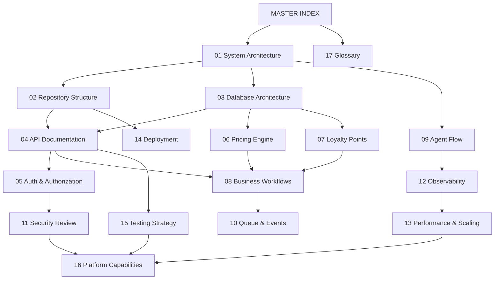

# MASTER DOCUMENTATION INDEX
## DigitalKaam — Antigravity AI Service Platform
### Version 1.0 | Generated: May 2026

---

## 1. Executive Overview

### What The System Does

DigitalKaam is an **AI-powered home services marketplace** targeting Pakistan's informal service economy. The platform allows residential customers in Karachi to request skilled service providers — Electricians, Plumbers, AC Technicians, Mechanics, Tutors, Beauticians, and Drivers — through a conversational AI interface that handles the entire workflow from intent understanding through booking confirmation.

The system is unique in its use of **multi-language AI** (English, Urdu script, Roman Urdu), enabling Pakistan's diverse population to interact naturally in their preferred language or dialect.

### Business Goals

1. **Formalize the informal gig economy** — bring unregistered service workers onto a digital platform with structured pricing, ratings, and accountability
2. **Reduce friction in service discovery** — replace word-of-mouth referrals with an AI agent that finds, scores, and books the best provider automatically
3. **Build provider trust through transparency** — give customers upfront pricing estimates, provider profiles, ratings, and booking references
4. **Dispute resolution** — provide a structured mechanism to handle no-shows, quality complaints, and overcharges

### Technical Goals

1. Deploy a production-grade multi-agent LLM pipeline using Google Gemini
2. Implement a conversational booking interface with persistent memory and session management
3. Support multilingual NLP without third-party translation services
4. Maintain a traceable AI audit log for every decision made by every agent
5. Build a configurable pricing engine managed entirely from the database (no code deploys required)

### Core Domains

| Domain | Description |
|--------|-------------|
| **Identity & Auth** | Supabase JWT auth, provider onboarding, session management |
| **Service Discovery** | Geographic provider search, area canonicalization, service-type aliasing |
| **Provider Matching** | 10-factor weighted scoring algorithm |
| **AI Orchestration** | ADK conversational agent (Gemini-powered with tool-calling) |
| **Pricing Engine** | Dynamic pricing from DB config: visit fee + labor + urgency - loyalty + platform fee |
| **Scheduling** | Availability slot management, conflict detection |
| **Booking Lifecycle** | confirmed → en_route → arrived → in_progress → completed → feedback |
| **Reputation System** | Weighted moving average ratings, recency scores |
| **Dispute Management** | Type-based refund calculation, provider flagging |
| **Observability** | Full AI decision trace logged per session per agent |

### Architecture Summary

DigitalKaam is a **Node.js/TypeScript monolith** (single Express process) with a conversational AI interface:

- **ADK Chat Interface** — a conversational endpoint (`POST /api/chat`) where a single Gemini orchestrator uses tool-calling to drive booking workflows interactively, with persistent session memory

The database backend is **Supabase (PostgreSQL)**, and AI capabilities are entirely powered by **Google Gemini** (versions 2.0-flash, 2.5-flash, and 2.5-flash-preview-tts).

---

## 2. Documentation Map

### Document Catalog

| # | Document | Purpose | Audience |
|---|----------|---------|----------|
| 01 | [01_System_Architecture.md](01_System_Architecture.md) | High-level system design, component map, architecture decisions | All |
| 02 | [02_Repository_Structure.md](02_Repository_Structure.md) | Folder layout, module ownership, entry points, runtime boundaries | Developers |
| 03 | [03_Database_Architecture.md](03_Database_Architecture.md) | ER diagram, table docs, constraints, data lifecycle | Developers, DBAs, Architects |
| 04 | [04_API_Documentation.md](04_API_Documentation.md) | Every endpoint: request/response schemas, auth, side effects | Developers, QA, API consumers |
| 05 | [05_Authentication_Authorization.md](05_Authentication_Authorization.md) | Auth flows, JWT lifecycle, token refresh, role model | Developers, Security |
| 06 | [06_Pricing_Engine.md](06_Pricing_Engine.md) | Exact pricing formulas, worked examples, config management | Developers, Product, Finance |
| 07 | [07_Loyalty_Point_System.md](07_Loyalty_Point_System.md) | Loyalty discount formula, caps, integration with pricing | Product, Developers, Finance |
| 08 | [08_Business_Workflows.md](08_Business_Workflows.md) | End-to-end booking flow, dispute flow, onboarding flow, state machine | Product, QA, Operations |
| 09 | [09_Agent_Flow_Documentation.md](09_Agent_Flow_Documentation.md) | ADK orchestrator agent, tools, specialized agents: inputs, outputs, logic | AI Engineers, Developers |
| 10 | [10_Queue_Event_System.md](10_Queue_Event_System.md) | Async processing patterns, event flows, notification framework | Developers, Architects |
| 11 | [11_Security_Review.md](11_Security_Review.md) | Security architecture, implemented controls, and authorization model | Security, Architects |
| 12 | [12_Observability_Logging.md](12_Observability_Logging.md) | Trace system, log patterns, debugging, and error handling architecture | Developers, SREs |
| 13 | [13_Performance_Scaling.md](13_Performance_Scaling.md) | Request cost analysis, database architecture, performance characteristics | Architects, SREs |
| 14 | [14_Deployment_Architecture.md](14_Deployment_Architecture.md) | Runtime requirements, env vars, setup procedure, deployment guide | DevOps, SREs |
| 15 | [15_Testing_Strategy.md](15_Testing_Strategy.md) | Quality assurance approach, test architecture, and coverage specifications | QA, Developers |
| 16 | [16_Known_Risks_Technical_Debt.md](16_Known_Risks_Technical_Debt.md) | Comprehensive platform capabilities reference across all 14 domains | All |
| 17 | [17_Glossary.md](17_Glossary.md) | Business and technical terminology | All |

---

### Document Details

#### [01_System_Architecture.md](01_System_Architecture.md)
- **Purpose**: Understand the overall system design from 10,000 feet
- **Audience**: All engineers, architects, executives
- **Dependencies**: None — read this first
- **Key Concepts**: ADK, tool-calling, agent orchestration
- **Related Docs**: 02 (structure), 09 (agents), 03 (database)

#### [02_Repository_Structure.md](02_Repository_Structure.md)
- **Purpose**: Navigate the codebase confidently on day 1
- **Audience**: New developers joining the project
- **Dependencies**: 01 (for context)
- **Key Concepts**: backend/src layout, ADK framework, orchestrator pattern
- **Related Docs**: 01, 09, 04

#### [03_Database_Architecture.md](03_Database_Architecture.md)
- **Purpose**: Understand all tables, relationships, constraints, and data flows
- **Audience**: Backend developers, DBAs, architects
- **Dependencies**: None (self-contained with schema)
- **Key Concepts**: 11 tables, platform_config, service-role access model, JSONB price_breakdown
- **Related Docs**: 04, 06, 08

#### [04_API_Documentation.md](04_API_Documentation.md)
- **Purpose**: Complete reference for every HTTP endpoint
- **Audience**: Frontend/mobile developers, QA engineers, API integrators
- **Dependencies**: 03 (schema), 05 (auth)
- **Key Concepts**: 12 route groups, 40+ endpoints, rate limiting, auth middleware
- **Related Docs**: 05, 08, 09

#### [05_Authentication_Authorization.md](05_Authentication_Authorization.md)
- **Purpose**: Understand how identity and sessions work
- **Audience**: Security engineers, backend developers
- **Dependencies**: None
- **Key Concepts**: Supabase JWT, service role key, token auto-refresh, isolated auth client
- **Related Docs**: 04, 11

#### [06_Pricing_Engine.md](06_Pricing_Engine.md)
- **Purpose**: Exact pricing logic with formulas, examples, and config management
- **Audience**: Product managers, developers, finance, auditors
- **Dependencies**: 03 (platform_config table)
- **Key Concepts**: visitFee + laborFee + urgency - loyalty + platformFee, DB-driven config
- **Related Docs**: 07, 08, 03

#### [07_Loyalty_Point_System.md](07_Loyalty_Point_System.md)
- **Purpose**: How loyalty points are earned, redeemed, and capped
- **Audience**: Product managers, developers, finance
- **Dependencies**: 06 (pricing integration)
- **Key Concepts**: 100 pts = PKR 50, max PKR 200 cap, loyalty_discount_cap config
- **Related Docs**: 06, 03, 08

#### [08_Business_Workflows.md](08_Business_Workflows.md)
- **Purpose**: Step-by-step flows for all major business processes
- **Audience**: Product managers, QA engineers, operations
- **Dependencies**: 01, 03
- **Key Concepts**: Booking lifecycle state machine, dispute resolution, onboarding
- **Related Docs**: 09, 06, 07

#### [09_Agent_Flow_Documentation.md](09_Agent_Flow_Documentation.md)
- **Purpose**: Deep technical analysis of every AI agent and tool
- **Audience**: AI engineers, senior developers, architects
- **Dependencies**: 01 (architecture), 03 (database)
- **Key Concepts**: Gemini function calling, ADK framework, session metadata injection
- **Related Docs**: 01, 06, 08

#### [10_Queue_Event_System.md](10_Queue_Event_System.md)
- **Purpose**: Understand async processing patterns, notification design, and event flows
- **Audience**: Backend developers, architects
- **Dependencies**: 01, 08
- **Key Concepts**: Fire-and-forget async, 6 lifecycle notification events, inline background processing
- **Related Docs**: 08, 12, 13

#### [11_Security_Review.md](11_Security_Review.md)
- **Purpose**: Security architecture, implemented controls, and authorization model
- **Audience**: Security engineers, architects, CTO
- **Dependencies**: 04, 05
- **Key Concepts**: Service-role client model, JWT isolation, rate limiting tiers, OWASP coverage
- **Related Docs**: 05, 04

#### [12_Observability_Logging.md](12_Observability_Logging.md)
- **Purpose**: How to debug, trace, and monitor the system
- **Audience**: Developers, SREs, support engineers
- **Dependencies**: 03 (traces table), 01
- **Key Concepts**: traces table, named console logging, agent confidence scores, session correlation
- **Related Docs**: 09, 13

#### [13_Performance_Scaling.md](13_Performance_Scaling.md)
- **Purpose**: Request cost analysis, database architecture, and performance characteristics
- **Audience**: Architects, SREs, engineering leadership
- **Dependencies**: 01, 03
- **Key Concepts**: In-memory agent cache, Gemini request model, platform_config loading, connection management
- **Related Docs**: 12, 14

#### [14_Deployment_Architecture.md](14_Deployment_Architecture.md)
- **Purpose**: How to deploy, configure, and run the system
- **Audience**: DevOps, SREs, new developers
- **Dependencies**: 02 (structure)
- **Key Concepts**: Environment variables, build pipeline, Supabase project setup, deployment options
- **Related Docs**: 15

#### [15_Testing_Strategy.md](15_Testing_Strategy.md)
- **Purpose**: Quality assurance approach, test architecture, and coverage specifications
- **Audience**: QA engineers, developers
- **Dependencies**: 01, 04
- **Key Concepts**: Manual test assets, QA pyramid, unit/integration/e2e specifications, Gemini mock strategy
- **Related Docs**: 04

#### [16_Known_Risks_Technical_Debt.md](16_Known_Risks_Technical_Debt.md)
- **Purpose**: Comprehensive platform capabilities reference
- **Audience**: Engineering leadership, architects, product managers
- **Dependencies**: All other docs
- **Key Concepts**: AI orchestration, service discovery, pricing engine, booking lifecycle, loyalty, dispute resolution, reputation, security, observability, voice interface, multi-language
- **Related Docs**: All

#### [17_Glossary.md](17_Glossary.md)
- **Purpose**: Define all terms used across the documentation
- **Audience**: All audiences, especially non-technical
- **Dependencies**: None
- **Key Concepts**: Business vocabulary, technical terms, platform-specific language

---

## 3. Recommended Reading Paths

### New Developer (First Week)
```
01_System_Architecture → 02_Repository_Structure → 03_Database_Architecture
→ 05_Authentication_Authorization → 09_Agent_Flow_Documentation
→ 04_API_Documentation → 14_Deployment_Architecture → 17_Glossary
```

### Senior Engineer (Architecture Review)
```
01_System_Architecture → 09_Agent_Flow_Documentation → 11_Security_Review
→ 13_Performance_Scaling → 16_Known_Risks_Technical_Debt → 03_Database_Architecture
```

### QA Engineer
```
04_API_Documentation → 08_Business_Workflows → 06_Pricing_Engine
→ 07_Loyalty_Point_System → 15_Testing_Strategy → 17_Glossary
```

### Security Reviewer
```
11_Security_Review → 05_Authentication_Authorization → 04_API_Documentation
→ 03_Database_Architecture → 16_Known_Risks_Technical_Debt
```

### Product Manager
```
01_System_Architecture → 08_Business_Workflows → 06_Pricing_Engine
→ 07_Loyalty_Point_System → 17_Glossary
```

### Executive Leadership
```
01_System_Architecture (Executive Summary section only)
→ 16_Known_Risks_Technical_Debt (Summary section only)
→ 17_Glossary
```

### AI/ML Engineer
```
09_Agent_Flow_Documentation → 01_System_Architecture → 12_Observability_Logging
→ 13_Performance_Scaling → 06_Pricing_Engine
```

---

## 4. System Dependency Graph



---

## 5. Key Technology Stack Summary

| Layer | Technology | Version / Detail |
|-------|-----------|-----------------|
| **Runtime** | Node.js | TypeScript, ts-node for dev |
| **Framework** | Express.js | v5.2.1 |
| **Database** | Supabase (PostgreSQL) | Hosted, service role |
| **AI Provider** | Google Gemini | 1.5-flash, 2.0-flash, 2.5-flash, 2.5-flash-preview-tts |
| **Auth** | Supabase Auth | JWT, email/password + OAuth |
| **Mobile** | React Native / Expo | Scaffold with API client utilities |
| **Rate Limiting** | express-rate-limit | 100/min general, 20/min chat, 10/15min auth |
| **ID Generation** | uuid v4 | All entity IDs |
| **Language** | TypeScript 6.x | Strict mode |

---

*This document is the authoritative entry point. All other documents are referenced from here. For questions, contact the engineering team.*
